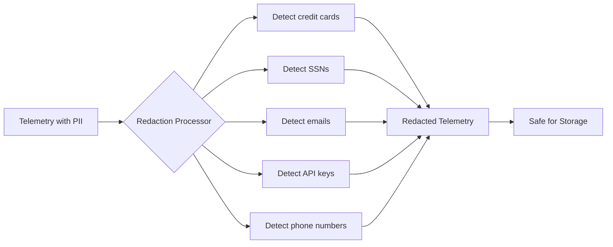

# How to Configure the Redaction Processor in the OpenTelemetry Collector

Author: [nawazdhandala](https://www.github.com/nawazdhandala)

Tags: OpenTelemetry, Collector, Processors, Redaction, Security, PII, Privacy, GDPR, Compliance

Description: Learn how to configure the redaction processor in OpenTelemetry Collector to automatically detect and remove sensitive data like credit cards, SSNs, API keys, and PII from telemetry before export, ensuring compliance with privacy regulations and security policies.

---

Telemetry data often contains sensitive information that should never reach your observability backend. Credit card numbers in HTTP request logs. Social security numbers in database queries. API keys in error messages. Passwords in debugging output. Email addresses and phone numbers throughout your logs and traces.

The redaction processor in the OpenTelemetry Collector automatically detects and removes sensitive data patterns from telemetry before export. Unlike manual redaction that requires updating every service, this processor centralizes privacy controls at the collector level, providing a single enforcement point for compliance with GDPR, PCI-DSS, HIPAA, and other privacy regulations.

## Understanding Automated Sensitive Data Detection

The redaction processor uses pattern matching to identify sensitive data across all telemetry signals (logs, traces, metrics). It searches attribute values, span names, log messages, and metric labels for common patterns like credit card numbers, social security numbers, and API keys.



The processor scans every field in your telemetry, identifies sensitive patterns, and replaces them with configurable placeholder text. This happens before data leaves your infrastructure, ensuring sensitive information never reaches external systems.

## Why You Need This Processor

The redaction processor solves critical compliance and security challenges:

**Regulatory Compliance**: GDPR, CCPA, PCI-DSS, and HIPAA require strict controls over personal and sensitive data. Automated redaction at the collector level provides auditable proof that sensitive data is removed before storage.

**Security Risk Mitigation**: Leaked API keys, tokens, or credentials in logs can lead to security breaches. The processor detects and removes these automatically, reducing attack surface.

**Developer Protection**: Developers shouldn't need to remember to redact sensitive data in every log statement. Centralized redaction removes this burden and prevents human error.

**Multi-Team Consistency**: In large organizations with many teams, enforcing consistent redaction policies is challenging. The processor provides a single enforcement point that all telemetry flows through.

**Third-Party Vendor Safety**: When using third-party observability vendors, you want assurance that no sensitive data reaches their systems. The processor provides that guarantee.

## Basic Configuration

The processor comes with built-in detection patterns for common sensitive data types. You can enable it with minimal configuration.

Here is a basic configuration with default patterns:

```yaml
# RECEIVERS: Accept telemetry via OTLP
receivers:
  otlp:
    protocols:
      grpc:
        endpoint: 0.0.0.0:4317

# PROCESSORS: Redact sensitive data
processors:
  # Redact common sensitive patterns
  redaction:
    # Allow list: attributes that will never be redacted (even if patterns match)
    # Use this for known safe fields that might match patterns
    allow_all_keys: false

    # Block list: attributes that are always completely removed
    blocked_values:
      - "password"
      - "passwd"
      - "pwd"
      - "secret"
      - "api_key"
      - "apikey"
      - "token"
      - "auth"
      - "authorization"
      - "credit_card"
      - "ssn"

    # Summary: How to indicate redacted data
    summary: "redacted"    # Could also be "SHA256" for hashing instead

  # Batch for efficiency
  batch:
    send_batch_max_size: 1024
    timeout: 10s

# EXPORTERS: Send to backend
exporters:
  otlphttp:
    endpoint: https://oneuptime.com/otlp/v1/traces
    headers:
      x-oneuptime-token: ${ONEUPTIME_TOKEN}

# SERVICE: Define the traces pipeline
service:
  pipelines:
    traces:
      receivers: [otlp]
      processors: [redaction, batch]
      exporters: [otlphttp]
```

This configuration redacts any attribute whose key matches the blocked values list. If a span has an attribute named "password" or "api_key", the entire attribute is removed. The processor works across all telemetry types - just add it to logs and metrics pipelines the same way.

## Built-in Pattern Detection

The redaction processor includes built-in regex patterns for detecting common sensitive data types. These patterns are enabled by default.

Here is a configuration showing built-in pattern detection:

```yaml
processors:
  # Redact with built-in patterns
  redaction:
    # Automatically detect and redact these patterns
    # (These are enabled by default - shown here for documentation)

    # Credit card numbers (all major card types)
    # Matches: 4111-1111-1111-1111, 4111111111111111, 4111 1111 1111 1111

    # Social Security Numbers
    # Matches: 123-45-6789, 123456789

    # Email addresses
    # Matches: user@example.com, john.doe@company.co.uk

    # Phone numbers (various formats)
    # Matches: (555) 123-4567, 555-123-4567, 5551234567, +1-555-123-4567

    # IP addresses (IPv4 and IPv6)
    # Matches: 192.168.1.1, 2001:0db8:85a3:0000:0000:8a2e:0370:7334

    # AWS Access Keys
    # Matches: AKIA followed by 16 alphanumeric characters

    # JWT tokens
    # Matches: eyJ pattern followed by base64 encoded data

    # Generic API keys (common patterns)
    # Matches: Bearer tokens, API keys with prefixes

    # Replace detected patterns with this text
    summary: "***REDACTED***"

  batch:
    send_batch_max_size: 1024
    timeout: 10s

exporters:
  otlphttp:
    endpoint: https://oneuptime.com/otlp/v1/logs
    headers:
      x-oneuptime-token: ${ONEUPTIME_TOKEN}

service:
  pipelines:
    logs:
      receivers: [otlp]
      processors: [redaction, batch]
      exporters: [otlphttp]
```

The processor scans attribute values and replaces any detected pattern with the summary text. For example, a log message "Payment processed for card 4111-1111-1111-1111" becomes "Payment processed for card ***REDACTED***".

## Custom Pattern Configuration

You often need to redact organization-specific sensitive data. The processor allows custom regex patterns.

Here is a configuration with custom patterns:

```yaml
processors:
  # Redact with custom patterns
  redaction:
    # Block any attribute with these keys
    blocked_values:
      - "password"
      - "secret"
      - "token"

    # Custom regex patterns to detect in attribute values
    # Each pattern is applied to all attribute values
    patterns:
      # Internal employee IDs (format: EMP-12345)
      - "EMP-\\d{5}"

      # Customer account numbers (format: ACCT-ABC-123456)
      - "ACCT-[A-Z]{3}-\\d{6}"

      # Internal IP address ranges
      - "10\\.\\d{1,3}\\.\\d{1,3}\\.\\d{1,3}"
      - "172\\.(1[6-9]|2[0-9]|3[0-1])\\.\\d{1,3}\\.\\d{1,3}"
      - "192\\.168\\.\\d{1,3}\\.\\d{1,3}"

      # Database connection strings
      - "postgresql://[^\\s]+"
      - "mongodb://[^\\s]+"
      - "mysql://[^\\s]+"

      # OAuth tokens (format: oauth_token_xyz123...)
      - "oauth_token_[a-zA-Z0-9_-]+"

      # Session IDs (format: sess_xyz123...)
      - "sess_[a-zA-Z0-9_-]{32,}"

    # Replacement text
    summary: "[REDACTED]"

  batch:
    send_batch_max_size: 1024
    timeout: 10s

exporters:
  otlphttp:
    endpoint: https://oneuptime.com/otlp/v1/logs
    headers:
      x-oneuptime-token: ${ONEUPTIME_TOKEN}

service:
  pipelines:
    logs:
      receivers: [otlp]
      processors: [redaction, batch]
      exporters: [otlphttp]
```

Custom patterns let you redact organization-specific identifiers, internal IP addresses, connection strings, and any other sensitive data unique to your environment.

## Allow Lists for Known Safe Data

Some attribute values might match sensitive patterns but are actually safe. Use allow lists to prevent false positives.

Here is a configuration with allow lists:

```yaml
processors:
  # Redact with allow list exceptions
  redaction:
    # These attribute keys are never redacted (even if values match patterns)
    allowed_keys:
      - "service.name"        # Service names might look like emails but aren't sensitive
      - "http.route"          # Route patterns might contain numbers that look like SSNs
      - "db.table"            # Table names are not sensitive
      - "log.file.name"       # File paths should not be redacted
      - "process.command"     # Command names are not sensitive

    # These specific values are never redacted (even if they match patterns)
    allowed_values:
      - "test@example.com"    # Test email addresses used in examples
      - "000-00-0000"         # Placeholder SSN
      - "1234-5678-9012-3456" # Test credit card number

    # Block sensitive keys
    blocked_values:
      - "password"
      - "api_key"
      - "token"

    # Detect patterns in other attributes
    patterns:
      - "\\b[A-Za-z0-9._%+-]+@[A-Za-z0-9.-]+\\.[A-Z|a-z]{2,}\\b"  # Email addresses
      - "\\b\\d{3}-\\d{2}-\\d{4}\\b"                              # SSNs

    summary: "***REDACTED***"

  batch:
    send_batch_max_size: 1024
    timeout: 10s

exporters:
  otlphttp:
    endpoint: https://oneuptime.com/otlp/v1/logs
    headers:
      x-oneuptime-token: ${ONEUPTIME_TOKEN}

service:
  pipelines:
    logs:
      receivers: [otlp]
      processors: [redaction, batch]
      exporters: [otlphttp]
```

The processor checks allow lists before redacting. If an attribute key is in `allowed_keys` or a value is in `allowed_values`, it skips redaction even if patterns match.

## Hashing Instead of Redacting

Sometimes you need to remove sensitive data but maintain referential integrity for debugging. Hashing provides a consistent obfuscated value.

Here is a configuration using hashing:

```yaml
processors:
  # Hash instead of redact for referential integrity
  redaction:
    blocked_values:
      - "user_id"
      - "customer_id"
      - "session_id"

    patterns:
      - "\\b[A-Za-z0-9._%+-]+@[A-Za-z0-9.-]+\\.[A-Z|a-z]{2,}\\b"  # Emails

    # Use SHA256 hashing instead of simple redaction
    summary: "SHA256"

  batch:
    send_batch_max_size: 1024
    timeout: 10s

exporters:
  otlphttp:
    endpoint: https://oneuptime.com/otlp/v1/logs
    headers:
      x-oneuptime-token: ${ONEUPTIME_TOKEN}

service:
  pipelines:
    logs:
      receivers: [otlp]
      processors: [redaction, batch]
      exporters: [otlphttp]
```

With `summary: "SHA256"`, the processor replaces sensitive values with their SHA256 hash. The email "user@example.com" becomes something like "SHA256:a1b2c3d4e5f6...". This preserves the ability to correlate logs from the same user (same email = same hash) while removing the actual sensitive data.

## Redacting Across All Telemetry Types

The redaction processor works uniformly across logs, traces, and metrics. Use the same configuration in multiple pipelines.

Here is a comprehensive configuration for all telemetry types:

```yaml
receivers:
  otlp:
    protocols:
      grpc:
        endpoint: 0.0.0.0:4317

processors:
  # Single redaction configuration used by all pipelines
  redaction:
    blocked_values:
      - "password"
      - "api_key"
      - "token"
      - "secret"
      - "authorization"
      - "credit_card"

    patterns:
      # Credit cards
      - "\\b\\d{4}[\\s-]?\\d{4}[\\s-]?\\d{4}[\\s-]?\\d{4}\\b"
      # SSNs
      - "\\b\\d{3}-\\d{2}-\\d{4}\\b"
      # Emails
      - "\\b[A-Za-z0-9._%+-]+@[A-Za-z0-9.-]+\\.[A-Z|a-z]{2,}\\b"
      # Phone numbers
      - "\\b\\d{3}[-.\\s]?\\d{3}[-.\\s]?\\d{4}\\b"

    summary: "***REDACTED***"

  batch:
    send_batch_max_size: 1024
    timeout: 10s

exporters:
  otlphttp/logs:
    endpoint: https://oneuptime.com/otlp/v1/logs
    headers:
      x-oneuptime-token: ${ONEUPTIME_TOKEN}

  otlphttp/traces:
    endpoint: https://oneuptime.com/otlp/v1/traces
    headers:
      x-oneuptime-token: ${ONEUPTIME_TOKEN}

  otlphttp/metrics:
    endpoint: https://oneuptime.com/otlp/v1/metrics
    headers:
      x-oneuptime-token: ${ONEUPTIME_TOKEN}

service:
  pipelines:
    # Apply same redaction to all telemetry types
    logs:
      receivers: [otlp]
      processors: [redaction, batch]
      exporters: [otlphttp/logs]

    traces:
      receivers: [otlp]
      processors: [redaction, batch]
      exporters: [otlphttp/traces]

    metrics:
      receivers: [otlp]
      processors: [redaction, batch]
      exporters: [otlphttp/metrics]
```

A single redaction processor configuration applies to all pipelines, ensuring consistent privacy controls across logs, traces, and metrics.

## Redacting Specific Attributes Only

You might want to redact only specific attributes and leave others untouched, even if they contain sensitive-looking patterns.

Here is a configuration for targeted attribute redaction:

```yaml
processors:
  # Redact only specific attributes
  redaction:
    # ONLY redact these attributes (ignore all others)
    blocked_values:
      - "http.request.header.authorization"
      - "http.request.header.cookie"
      - "http.request.body"
      - "db.statement"         # SQL queries might contain sensitive data
      - "error.stack_trace"    # Stack traces might leak internal paths

    # No pattern matching - only block explicit attributes
    # This is faster and more predictable than pattern matching

    summary: "[REDACTED]"

  batch:
    send_batch_max_size: 1024
    timeout: 10s

exporters:
  otlphttp:
    endpoint: https://oneuptime.com/otlp/v1/traces
    headers:
      x-oneuptime-token: ${ONEUPTIME_TOKEN}

service:
  pipelines:
    traces:
      receivers: [otlp]
      processors: [redaction, batch]
      exporters: [otlphttp]
```

This configuration only redacts specific known-sensitive attributes like authorization headers and request bodies. It doesn't scan all attribute values for patterns, making it faster and more predictable.

## Multi-Level Redaction Strategy

Different telemetry might need different levels of redaction. Production data needs aggressive redaction, while development data might need less.

Here is a configuration with environment-based redaction:

```yaml
receivers:
  otlp:
    protocols:
      grpc:
        endpoint: 0.0.0.0:4317

processors:
  # Aggressive redaction for production
  redaction/production:
    blocked_values:
      - "password"
      - "api_key"
      - "token"
      - "user_id"
      - "customer_id"
      - "email"
      - "phone"

    patterns:
      - "\\b[A-Za-z0-9._%+-]+@[A-Za-z0-9.-]+\\.[A-Z|a-z]{2,}\\b"
      - "\\b\\d{3}[-.\\s]?\\d{3}[-.\\s]?\\d{4}\\b"
      - "\\b\\d{4}[\\s-]?\\d{4}[\\s-]?\\d{4}[\\s-]?\\d{4}\\b"

    summary: "***REDACTED***"

  # Minimal redaction for development
  redaction/development:
    blocked_values:
      - "password"
      - "api_key"
      - "token"

    # No pattern matching in development for easier debugging

    summary: "[REDACTED]"

  # Route based on environment
  filter/production:
    traces:
      resource:
        - key: deployment.environment
          value: "production"

  filter/development:
    traces:
      resource:
        - key: deployment.environment
          value: "development"

  batch:
    send_batch_max_size: 1024
    timeout: 10s

exporters:
  otlphttp:
    endpoint: https://oneuptime.com/otlp/v1/traces
    headers:
      x-oneuptime-token: ${ONEUPTIME_TOKEN}

service:
  pipelines:
    # Production pipeline with aggressive redaction
    traces/production:
      receivers: [otlp]
      processors: [filter/production, redaction/production, batch]
      exporters: [otlphttp]

    # Development pipeline with minimal redaction
    traces/development:
      receivers: [otlp]
      processors: [filter/development, redaction/development, batch]
      exporters: [otlphttp]
```

This configuration routes telemetry to different pipelines based on environment, applying more aggressive redaction to production data while allowing more detailed data in development.

## Performance Optimization

Pattern matching with regex can be CPU-intensive. Optimize redaction for high-throughput environments.

Here is a performance-optimized configuration:

```yaml
processors:
  # Protect collector from CPU exhaustion
  memory_limiter:
    limit_mib: 1024
    spike_limit_mib: 256

  # Optimize redaction performance
  redaction:
    # Use explicit blocked values (fast) instead of patterns (slow) when possible
    blocked_values:
      - "password"
      - "api_key"
      - "token"
      - "authorization"
      - "credit_card"
      - "ssn"

    # Minimize regex patterns - only essential ones
    patterns:
      # Credit cards (most critical)
      - "\\b\\d{4}[\\s-]?\\d{4}[\\s-]?\\d{4}[\\s-]?\\d{4}\\b"
      # SSNs (most critical)
      - "\\b\\d{3}-\\d{2}-\\d{4}\\b"

    # Skip pattern matching for known safe attributes (performance optimization)
    allowed_keys:
      - "service.name"
      - "http.method"
      - "http.status_code"
      - "db.system"

    summary: "***REDACTED***"

  batch:
    send_batch_max_size: 2048   # Larger batches reduce processing overhead
    timeout: 5s

service:
  pipelines:
    traces:
      receivers: [otlp]
      processors:
        - memory_limiter
        - redaction
        - batch
      exporters: [otlphttp]
```

Minimize regex patterns, use explicit blocked values when possible, and skip pattern matching for known safe attributes using allowed_keys.

## Compliance Auditing and Verification

For compliance purposes, you need to verify that redaction is working correctly and audit what gets redacted.

Here is a configuration with audit logging:

```yaml
processors:
  redaction:
    blocked_values:
      - "password"
      - "api_key"
      - "token"

    patterns:
      - "\\b[A-Za-z0-9._%+-]+@[A-Za-z0-9.-]+\\.[A-Z|a-z]{2,}\\b"
      - "\\b\\d{4}[\\s-]?\\d{4}[\\s-]?\\d{4}[\\s-]?\\d{4}\\b"

    summary: "***REDACTED***"

  batch:
    send_batch_max_size: 1024
    timeout: 10s

exporters:
  otlphttp:
    endpoint: https://oneuptime.com/otlp/v1/logs
    headers:
      x-oneuptime-token: ${ONEUPTIME_TOKEN}

  # Add logging exporter to audit redaction
  logging:
    loglevel: debug
    sampling_initial: 100    # Log first 100 items for verification
    sampling_thereafter: 0

service:
  telemetry:
    logs:
      level: debug           # Enable detailed collector logging

  pipelines:
    logs:
      receivers: [otlp]
      processors: [redaction, batch]
      exporters: [otlphttp, logging]  # Export to both backend and local logs
```

The logging exporter prints redacted logs to stdout, allowing you to verify that sensitive data is properly removed. Review these logs during compliance audits to prove redaction is working.

## Combining with Transform Processor

For complex redaction needs, combine the redaction processor with the transform processor for maximum flexibility.

Here is a configuration combining both:

```yaml
processors:
  # First: Use transform processor for custom complex redaction
  transform:
    log_statements:
      - context: log
        statements:
          # Custom pattern for internal IDs not handled by redaction processor
          - replace_pattern(body, "INTERNAL-ID-\\d{10}", "INTERNAL-ID-REDACTED")
          # Redact specific parts of URLs while keeping structure
          - replace_pattern(attributes["http.url"], "apikey=[^&]+", "apikey=REDACTED")

  # Second: Use redaction processor for standard patterns
  redaction:
    blocked_values:
      - "password"
      - "api_key"
      - "token"

    patterns:
      - "\\b\\d{4}[\\s-]?\\d{4}[\\s-]?\\d{4}[\\s-]?\\d{4}\\b"

    summary: "***REDACTED***"

  batch:
    send_batch_max_size: 1024
    timeout: 10s

exporters:
  otlphttp:
    endpoint: https://oneuptime.com/otlp/v1/logs
    headers:
      x-oneuptime-token: ${ONEUPTIME_TOKEN}

service:
  pipelines:
    logs:
      receivers: [otlp]
      processors:
        - transform      # Custom redaction first
        - redaction      # Standard redaction second
        - batch
      exporters: [otlphttp]
```

The transform processor handles custom complex redaction patterns, while the redaction processor handles standard sensitive data patterns. Together they provide comprehensive protection.

## Common Pitfalls and Solutions

**Problem**: Some sensitive data is still getting through.

**Solution**: Review your patterns and blocked values. Sensitive data might not match your patterns. Use the logging exporter to see what's being sent and identify patterns you missed. Consider using broader patterns or additional blocked values.

**Problem**: Redaction is too aggressive, removing non-sensitive data.

**Solution**: Use `allowed_keys` and `allowed_values` to prevent false positives. Add known safe attribute keys and test values to the allow list.

**Problem**: Collector CPU usage is very high after adding redaction.

**Solution**: Regex pattern matching is CPU-intensive. Minimize the number of patterns, use simpler patterns when possible, and use explicit `blocked_values` instead of patterns when you know the exact attribute keys.

**Problem**: Hashing doesn't provide enough protection for compliance.

**Solution**: Use plain redaction (`summary: "***REDACTED***"`) instead of hashing. Hashing maintains referential integrity but hashed values could theoretically be reverse-engineered. For maximum security, use redaction placeholders.

## Integration with OneUptime

OneUptime never stores data that doesn't reach it. By redacting at the collector level, you ensure sensitive data never enters OneUptime's storage.

Here is a complete production configuration for OneUptime:

```yaml
receivers:
  otlp:
    protocols:
      grpc:
        endpoint: 0.0.0.0:4317
      http:
        endpoint: 0.0.0.0:4318

processors:
  memory_limiter:
    limit_mib: 1024
    spike_limit_mib: 256

  # Comprehensive redaction for compliance
  redaction:
    blocked_values:
      - "password"
      - "passwd"
      - "pwd"
      - "api_key"
      - "apikey"
      - "token"
      - "secret"
      - "authorization"
      - "auth"
      - "credit_card"
      - "ssn"
      - "social_security"

    patterns:
      # Credit cards
      - "\\b\\d{4}[\\s-]?\\d{4}[\\s-]?\\d{4}[\\s-]?\\d{4}\\b"
      # SSNs
      - "\\b\\d{3}-\\d{2}-\\d{4}\\b"
      # Emails
      - "\\b[A-Za-z0-9._%+-]+@[A-Za-z0-9.-]+\\.[A-Z|a-z]{2,}\\b"
      # Phone numbers
      - "\\b\\d{3}[-.\\s]?\\d{3}[-.\\s]?\\d{4}\\b"
      # AWS keys
      - "AKIA[0-9A-Z]{16}"
      # JWT tokens
      - "eyJ[A-Za-z0-9_-]+\\.[A-Za-z0-9_-]+\\.[A-Za-z0-9_-]+"

    allowed_keys:
      - "service.name"
      - "service.version"
      - "http.method"
      - "http.status_code"

    summary: "***REDACTED***"

  batch:
    send_batch_max_size: 1024
    timeout: 10s

exporters:
  otlphttp/logs:
    endpoint: https://oneuptime.com/otlp/v1/logs
    headers:
      x-oneuptime-token: ${ONEUPTIME_TOKEN}
    retry_on_failure:
      enabled: true

  otlphttp/traces:
    endpoint: https://oneuptime.com/otlp/v1/traces
    headers:
      x-oneuptime-token: ${ONEUPTIME_TOKEN}
    retry_on_failure:
      enabled: true

  otlphttp/metrics:
    endpoint: https://oneuptime.com/otlp/v1/metrics
    headers:
      x-oneuptime-token: ${ONEUPTIME_TOKEN}
    retry_on_failure:
      enabled: true

service:
  pipelines:
    logs:
      receivers: [otlp]
      processors: [memory_limiter, redaction, batch]
      exporters: [otlphttp/logs]

    traces:
      receivers: [otlp]
      processors: [memory_limiter, redaction, batch]
      exporters: [otlphttp/traces]

    metrics:
      receivers: [otlp]
      processors: [memory_limiter, redaction, batch]
      exporters: [otlphttp/metrics]
```

This configuration provides comprehensive redaction across all telemetry types before data reaches OneUptime, ensuring compliance with privacy regulations and protecting sensitive customer data.

## Related Resources

For more information on privacy and security in OpenTelemetry:

- [OpenTelemetry Collector: What It Is, When You Need It, and When You Don't](https://oneuptime.com/blog/post/what-is-opentelemetry-collector-and-why-use-one/view)
- [Keep PII Out of Observability Telemetry](https://oneuptime.com/blog/post/2025-11-13-keep-pii-out-of-observability-telemetry/view)
- [How to Structure Logs Properly in OpenTelemetry](https://oneuptime.com/blog/post/2025-08-28-how-to-structure-logs-properly-in-opentelemetry/view)
- [How to Reduce Noise in OpenTelemetry](https://oneuptime.com/blog/post/2025-08-25-how-to-reduce-noise-in-opentelemetry/view)

## Conclusion

The redaction processor is essential for maintaining privacy and security in modern observability. By automatically detecting and removing sensitive data patterns at the collector level, it provides a centralized enforcement point for compliance with privacy regulations without requiring changes to application code.

Configure it with appropriate blocked values and patterns for your environment, use allow lists to prevent false positives, and consider hashing when you need referential integrity. Combine it with the transform processor for complex custom redaction needs. With OneUptime as your backend, you get the assurance that only redacted, privacy-compliant telemetry reaches your observability platform.
