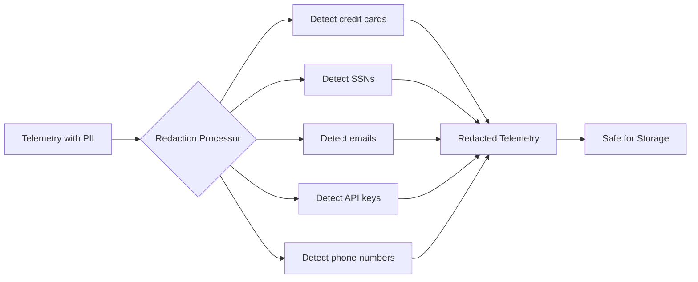

# How to Configure the Redaction Processor in the OpenTelemetry Collector

Author: [nawazdhandala](https://www.github.com/nawazdhandala)

Tags: OpenTelemetry, Collector, Processor, Redaction, Security, PII, Privacy, GDPR, Compliance

Description: Learn how to configure the redaction processor in OpenTelemetry Collector to automatically detect and remove sensitive data like credit cards, SSNs, API keys, and PII from telemetry before export.

---

Telemetry data often contains sensitive information that should never reach your observability backend. Credit card numbers in HTTP request logs. Social security numbers in database queries. API keys in error messages. Passwords in debugging output. Email addresses and phone numbers throughout your logs and traces.

The redaction processor in the OpenTelemetry Collector removes attributes that are not explicitly allowed and masks attribute or log body values that match configured regular expressions before export. Unlike manual redaction that requires updating every service, this processor centralizes privacy controls at the collector level, providing a single enforcement point for compliance with GDPR, PCI-DSS, HIPAA, and other privacy regulations.

## Understanding Automated Sensitive Data Detection

The redaction processor uses allow lists and pattern matching to control sensitive data across telemetry signals (logs, traces, metrics). It removes attributes that are not in `allowed_keys` unless `allow_all_keys` is set, and it masks values that match configured regexes such as credit card numbers, social security numbers, and API keys.


```mermaid
graph LR
    A[Telemetry with PII] --> B{Redaction Processor}
    B --> C[Detect credit cards]
    B --> D[Detect SSNs]
    B --> E[Detect emails]
    B --> F[Detect API keys]
    B --> G[Detect phone numbers]
    C & D & E & F & G --> H[Redacted Telemetry]
    H --> I[Safe for Storage]
```

The processor checks span, log, and metric datapoint attributes, and it can also process log bodies and configured URL or database fields. This happens before data leaves your infrastructure, reducing the chance that sensitive information reaches external systems.

## Why You Need This Processor

The redaction processor solves critical compliance and security challenges:

**Regulatory Compliance**: GDPR, CCPA, PCI-DSS, and HIPAA require strict controls over personal and sensitive data. Automated redaction at the collector level provides auditable proof that sensitive data is removed before storage.

**Security Risk Mitigation**: Leaked API keys, tokens, or credentials in logs can lead to security breaches. The processor detects and removes these automatically, reducing attack surface.

**Developer Protection**: Developers shouldn't need to remember to redact sensitive data in every log statement. Centralized redaction removes this burden and prevents human error.

**Multi-Team Consistency**: In large organizations with many teams, enforcing consistent redaction policies is challenging. The processor provides a single enforcement point that all telemetry flows through.

**Third-Party Vendor Safety**: When using third-party observability vendors, you want assurance that no sensitive data reaches their systems. The processor provides that guarantee.

## Basic Configuration

The processor does not ship with a broad set of built-in PII regexes enabled by default. You configure the keys to keep or ignore, key patterns to mask, and value regexes to mask.

Here is a basic configuration that keeps all attributes but masks common sensitive keys and values:

```yaml
# RECEIVERS: Accept telemetry via OTLP

receivers:
  otlp:
    protocols:
      grpc:
        endpoint: 0.0.0.0:4317

# PROCESSORS: Redact sensitive data
processors:
  # Redact common sensitive patterns
  redaction:
    # Keep all attributes, then apply key and value masking rules.
    allow_all_keys: true

    # Key patterns whose values should be masked.
    blocked_key_patterns:
      - "(?i).*password.*"
      - "(?i).*passwd.*"
      - "(?i).*pwd.*"
      - "(?i).*secret.*"
      - "(?i).*api[_-]?key.*"
      - "(?i).*token.*"
      - "(?i).*auth.*"
      - "(?i).*authorization.*"
      - "(?i).*credit[_-]?card.*"
      - "(?i).*ssn.*"

    # Value regexes that should be masked.
    blocked_values:
      - "\\b\\d{4}[\\s-]?\\d{4}[\\s-]?\\d{4}[\\s-]?\\d{4}\\b"
      - "\\b\\d{3}-\\d{2}-\\d{4}\\b"
      - "\\b[A-Za-z0-9._%+-]+@[A-Za-z0-9.-]+\\.[A-Za-z]{2,}\\b"

    # Summary controls redaction audit attributes: debug, info, or silent.
    summary: silent

  # Batch for efficiency
  batch:
    send_batch_max_size: 1024
    timeout: 10s

# EXPORTERS: Send to backend
exporters:
  otlphttp:
    endpoint: https://oneuptime.com/otlp/v1/traces
    headers:
      x-oneuptime-token: ${ONEUPTIME_TOKEN}

# SERVICE: Define the traces pipeline
service:
  pipelines:
    traces:
      receivers: [otlp]
      processors: [redaction, batch]
      exporters: [otlphttp]
```

This configuration masks any attribute whose key matches `blocked_key_patterns`, and masks matching parts of values using `blocked_values`. The processor works across traces, logs, and metrics - just add it to the pipelines where you need it.

## Built-in Pattern Detection

The redaction processor uses the regex patterns you provide in `blocked_values`. You can define common sensitive data patterns yourself.

Here is a configuration showing common pattern detection:

```yaml
processors:
  # Redact with common patterns
  redaction:
    allow_all_keys: true
    blocked_values:
      # Credit card numbers
      - "\\b\\d{4}[\\s-]?\\d{4}[\\s-]?\\d{4}[\\s-]?\\d{4}\\b"
      # Social Security Numbers
      - "\\b\\d{3}-\\d{2}-\\d{4}\\b"
      # Email addresses
      - "\\b[A-Za-z0-9._%+-]+@[A-Za-z0-9.-]+\\.[A-Za-z]{2,}\\b"
      # Phone numbers
      - "\\b(?:\\+1[-.\\s]?)?\\(?\\d{3}\\)?[-.\\s]?\\d{3}[-.\\s]?\\d{4}\\b"
      # IPv4 addresses
      - "\\b(?:\\d{1,3}\\.){3}\\d{1,3}\\b"
      # AWS Access Keys
      - "AKIA[0-9A-Z]{16}"
      # JWT tokens
      - "eyJ[A-Za-z0-9_-]+\\.[A-Za-z0-9_-]+\\.[A-Za-z0-9_-]+"

    summary: silent

  batch:
    send_batch_max_size: 1024
    timeout: 10s

exporters:
  otlphttp:
    endpoint: https://oneuptime.com/otlp/v1/logs
    headers:
      x-oneuptime-token: ${ONEUPTIME_TOKEN}

service:
  pipelines:
    logs:
      receivers: [otlp]
      processors: [redaction, batch]
      exporters: [otlphttp]
```

The processor scans attribute values and log bodies and masks any detected pattern. For example, a log message body "Payment processed for card 4111-1111-1111-1111" becomes "Payment processed for card ****".

## Custom Pattern Configuration

You often need to redact organization-specific sensitive data. The processor allows custom regex patterns.

Here is a configuration with custom patterns:

```yaml
processors:
  # Redact with custom patterns
  redaction:
    allow_all_keys: true
    # Mask values for attributes whose keys match these patterns
    blocked_key_patterns:
      - "(?i).*password.*"
      - "(?i).*secret.*"
      - "(?i).*token.*"

    # Custom regex patterns to detect in attribute values
    # Each pattern is applied to all attribute values
    blocked_values:
      # Internal employee IDs (format: EMP-12345)
      - "EMP-\\d{5}"

      # Customer account numbers (format: ACCT-ABC-123456)
      - "ACCT-[A-Z]{3}-\\d{6}"

      # Internal IP address ranges
      - "10\\.\\d{1,3}\\.\\d{1,3}\\.\\d{1,3}"
      - "172\\.(1[6-9]|2[0-9]|3[0-1])\\.\\d{1,3}\\.\\d{1,3}"
      - "192\\.168\\.\\d{1,3}\\.\\d{1,3}"

      # Database connection strings
      - "postgresql://[^\\s]+"
      - "mongodb://[^\\s]+"
      - "mysql://[^\\s]+"

      # OAuth tokens (format: oauth_token_xyz123...)
      - "oauth_token_[a-zA-Z0-9_-]+"

      # Session IDs (format: sess_xyz123...)
      - "sess_[a-zA-Z0-9_-]{32,}"

    summary: silent

  batch:
    send_batch_max_size: 1024
    timeout: 10s

exporters:
  otlphttp:
    endpoint: https://oneuptime.com/otlp/v1/logs
    headers:
      x-oneuptime-token: ${ONEUPTIME_TOKEN}

service:
  pipelines:
    logs:
      receivers: [otlp]
      processors: [redaction, batch]
      exporters: [otlphttp]
```

Custom patterns let you redact organization-specific identifiers, internal IP addresses, connection strings, and any other sensitive data unique to your environment.

## Allow Lists for Known Safe Data

Some attribute values might match sensitive patterns but are actually safe. Use allow lists to prevent false positives.

Here is a configuration with allow lists:

```yaml
processors:
  # Redact with allow list exceptions
  redaction:
    # Keep only these attribute keys, then apply value masking to them.
    allowed_keys:
      - "service.name"        # Service names might look like emails but aren't sensitive
      - "http.route"          # Route patterns might contain numbers that look like SSNs
      - "db.table"            # Table names are not sensitive
      - "log.file.name"       # File paths should not be redacted
      - "process.command"     # Command names are not sensitive

    # These specific value patterns are never masked (even if they match blocked values)
    allowed_values:
      - "test@example.com"    # Test email addresses used in examples
      - "000-00-0000"         # Placeholder SSN
      - "1234-5678-9012-3456" # Test credit card number

    # Detect patterns in other attributes
    blocked_values:
      - "\\b[A-Za-z0-9._%+-]+@[A-Za-z0-9.-]+\\.[A-Za-z]{2,}\\b"  # Email addresses
      - "\\b\\d{3}-\\d{2}-\\d{4}\\b"                              # SSNs

    summary: debug

  batch:
    send_batch_max_size: 1024
    timeout: 10s

exporters:
  otlphttp:
    endpoint: https://oneuptime.com/otlp/v1/logs
    headers:
      x-oneuptime-token: ${ONEUPTIME_TOKEN}

service:
  pipelines:
    logs:
      receivers: [otlp]
      processors: [redaction, batch]
      exporters: [otlphttp]
```

The processor removes attributes that are not in `allowed_keys`, unless `allow_all_keys: true` is set. `allowed_values` takes precedence over `blocked_values`, so matching values are not masked even if they also match a blocked regex. If you want specific safe keys to bypass redaction entirely, use `ignored_keys` or `ignored_key_patterns`.

## Hashing Instead of Redacting

Sometimes you need to remove sensitive data but maintain referential integrity for debugging. Hashing provides a consistent obfuscated value.

Here is a configuration using hashing:

```yaml
processors:
  # Hash instead of redact for referential integrity
  redaction:
    allow_all_keys: true

    blocked_key_patterns:
      - "(?i).*user_id.*"
      - "(?i).*customer_id.*"
      - "(?i).*session_id.*"

    blocked_values:
      - "\\b[A-Za-z0-9._%+-]+@[A-Za-z0-9.-]+\\.[A-Za-z]{2,}\\b"  # Emails

    # Use SHA3 (SHA-256) hashing instead of simple masking
    hash_function: sha3
    summary: silent

  batch:
    send_batch_max_size: 1024
    timeout: 10s

exporters:
  otlphttp:
    endpoint: https://oneuptime.com/otlp/v1/logs
    headers:
      x-oneuptime-token: ${ONEUPTIME_TOKEN}

service:
  pipelines:
    logs:
      receivers: [otlp]
      processors: [redaction, batch]
      exporters: [otlphttp]
```

With `hash_function: sha3`, the processor hashes matching values instead of masking them with a fixed string. This preserves the ability to correlate logs from the same user (same email = same hash) while removing the actual sensitive data. For low-entropy values like IP addresses, prefer `hmac-sha256` or `hmac-sha512` with a strong `hmac_key`.

## Redacting Across All Telemetry Types

The redaction processor works uniformly across logs, traces, and metrics. Use the same configuration in multiple pipelines.

Here is a comprehensive configuration for all telemetry types:

```yaml
receivers:
  otlp:
    protocols:
      grpc:
        endpoint: 0.0.0.0:4317

processors:
  # Single redaction configuration used by all pipelines
  redaction:
    allow_all_keys: true
    blocked_key_patterns:
      - "(?i).*password.*"
      - "(?i).*api[_-]?key.*"
      - "(?i).*token.*"
      - "(?i).*secret.*"
      - "(?i).*authorization.*"
      - "(?i).*credit[_-]?card.*"

    blocked_values:
      # Credit cards
      - "\\b\\d{4}[\\s-]?\\d{4}[\\s-]?\\d{4}[\\s-]?\\d{4}\\b"
      # SSNs
      - "\\b\\d{3}-\\d{2}-\\d{4}\\b"
      # Emails
      - "\\b[A-Za-z0-9._%+-]+@[A-Za-z0-9.-]+\\.[A-Za-z]{2,}\\b"
      # Phone numbers
      - "\\b\\d{3}[-.\\s]?\\d{3}[-.\\s]?\\d{4}\\b"

    summary: silent

  batch:
    send_batch_max_size: 1024
    timeout: 10s

exporters:
  otlphttp/logs:
    endpoint: https://oneuptime.com/otlp/v1/logs
    headers:
      x-oneuptime-token: ${ONEUPTIME_TOKEN}

  otlphttp/traces:
    endpoint: https://oneuptime.com/otlp/v1/traces
    headers:
      x-oneuptime-token: ${ONEUPTIME_TOKEN}

  otlphttp/metrics:
    endpoint: https://oneuptime.com/otlp/v1/metrics
    headers:
      x-oneuptime-token: ${ONEUPTIME_TOKEN}

service:
  pipelines:
    # Apply same redaction to all telemetry types
    logs:
      receivers: [otlp]
      processors: [redaction, batch]
      exporters: [otlphttp/logs]

    traces:
      receivers: [otlp]
      processors: [redaction, batch]
      exporters: [otlphttp/traces]

    metrics:
      receivers: [otlp]
      processors: [redaction, batch]
      exporters: [otlphttp/metrics]
```

A single redaction processor configuration applies to all pipelines, ensuring consistent privacy controls across logs, traces, and metrics.

## Redacting Specific Attributes Only

You might want to redact only specific attributes and leave others untouched, even if they contain sensitive-looking patterns.

Here is a configuration for targeted attribute redaction:

```yaml
processors:
  # Redact only specific attributes
  redaction:
    allow_all_keys: true
    # ONLY mask values for attributes whose keys match these patterns
    blocked_key_patterns:
      - "^http\\.request\\.header\\.authorization$"
      - "^http\\.request\\.header\\.cookie$"
      - "^http\\.request\\.body$"
      - "^db\\.statement$"         # SQL queries might contain sensitive data
      - "^error\\.stack_trace$"    # Stack traces might leak internal paths

    # No value pattern matching - only match explicit attribute keys
    # This is faster and more predictable than pattern matching

    summary: silent

  batch:
    send_batch_max_size: 1024
    timeout: 10s

exporters:
  otlphttp:
    endpoint: https://oneuptime.com/otlp/v1/traces
    headers:
      x-oneuptime-token: ${ONEUPTIME_TOKEN}

service:
  pipelines:
    traces:
      receivers: [otlp]
      processors: [redaction, batch]
      exporters: [otlphttp]
```

This configuration only masks specific known-sensitive attributes like authorization headers and request bodies. It doesn't scan all attribute values for patterns, making it faster and more predictable.

## Multi-Level Redaction Strategy

Different telemetry might need different levels of redaction. Production data needs aggressive redaction, while development data might need less.

Here is a configuration with environment-based redaction:

```yaml
receivers:
  otlp:
    protocols:
      grpc:
        endpoint: 0.0.0.0:4317

processors:
  # Aggressive redaction for production
  redaction/production:
    allow_all_keys: true
    blocked_key_patterns:
      - "(?i).*password.*"
      - "(?i).*api[_-]?key.*"
      - "(?i).*token.*"
      - "(?i).*user_id.*"
      - "(?i).*customer_id.*"
      - "(?i).*email.*"
      - "(?i).*phone.*"

    blocked_values:
      - "\\b[A-Za-z0-9._%+-]+@[A-Za-z0-9.-]+\\.[A-Za-z]{2,}\\b"
      - "\\b\\d{3}[-.\\s]?\\d{3}[-.\\s]?\\d{4}\\b"
      - "\\b\\d{4}[\\s-]?\\d{4}[\\s-]?\\d{4}[\\s-]?\\d{4}\\b"

    summary: silent

  # Minimal redaction for development
  redaction/development:
    allow_all_keys: true
    blocked_key_patterns:
      - "(?i).*password.*"
      - "(?i).*api[_-]?key.*"
      - "(?i).*token.*"

    # No pattern matching in development for easier debugging

    summary: silent

  # Keep only production telemetry in this pipeline.
  filter/production:
    error_mode: ignore
    trace_conditions:
      - resource.attributes["deployment.environment"] != "production"

  # Keep only development telemetry in this pipeline.
  filter/development:
    error_mode: ignore
    trace_conditions:
      - resource.attributes["deployment.environment"] != "development"

  batch:
    send_batch_max_size: 1024
    timeout: 10s

exporters:
  otlphttp:
    endpoint: https://oneuptime.com/otlp/v1/traces
    headers:
      x-oneuptime-token: ${ONEUPTIME_TOKEN}

service:
  pipelines:
    # Production pipeline with aggressive redaction
    traces/production:
      receivers: [otlp]
      processors: [filter/production, redaction/production, batch]
      exporters: [otlphttp]

    # Development pipeline with minimal redaction
    traces/development:
      receivers: [otlp]
      processors: [filter/development, redaction/development, batch]
      exporters: [otlphttp]
```

This configuration uses filter processors to keep only one environment in each pipeline, applying more aggressive redaction to production data while allowing more detailed data in development.

## Performance Optimization

Pattern matching with regex can be CPU-intensive. Optimize redaction for high-throughput environments.

Here is a performance-optimized configuration:

```yaml
processors:
  # Protect collector from CPU exhaustion
  memory_limiter:
    limit_mib: 1024
    spike_limit_mib: 256

  # Optimize redaction performance
  redaction:
    allow_all_keys: true
    # Use explicit key patterns when possible
    blocked_key_patterns:
      - "(?i).*password.*"
      - "(?i).*api[_-]?key.*"
      - "(?i).*token.*"
      - "(?i).*authorization.*"
      - "(?i).*credit[_-]?card.*"
      - "(?i).*ssn.*"

    # Minimize regex patterns - only essential ones
    blocked_values:
      # Credit cards (most critical)
      - "\\b\\d{4}[\\s-]?\\d{4}[\\s-]?\\d{4}[\\s-]?\\d{4}\\b"
      # SSNs (most critical)
      - "\\b\\d{3}-\\d{2}-\\d{4}\\b"

    # Skip redaction entirely for known safe attributes (performance optimization)
    ignored_keys:
      - "service.name"
      - "http.method"
      - "http.status_code"
      - "db.system"

    summary: silent

  batch:
    send_batch_max_size: 2048   # Larger batches reduce processing overhead
    timeout: 5s

service:
  pipelines:
    traces:
      receivers: [otlp]
      processors:
        - memory_limiter
        - redaction
        - batch
      exporters: [otlphttp]
```

Minimize regex patterns, use explicit key patterns when possible, and skip redaction for known safe attributes using `ignored_keys`.

## Compliance Auditing and Verification

For compliance purposes, you need to verify that redaction is working correctly and audit what gets redacted.

Here is a configuration with audit logging:

```yaml
processors:
  redaction:
    allow_all_keys: true
    blocked_values:
      - "\\b[A-Za-z0-9._%+-]+@[A-Za-z0-9.-]+\\.[A-Za-z]{2,}\\b"
      - "\\b\\d{4}[\\s-]?\\d{4}[\\s-]?\\d{4}[\\s-]?\\d{4}\\b"

    blocked_key_patterns:
      - "(?i).*password.*"
      - "(?i).*api[_-]?key.*"
      - "(?i).*token.*"

    summary: debug

  batch:
    send_batch_max_size: 1024
    timeout: 10s

exporters:
  otlphttp:
    endpoint: https://oneuptime.com/otlp/v1/logs
    headers:
      x-oneuptime-token: ${ONEUPTIME_TOKEN}

  # Add debug exporter to audit redaction
  debug:
    verbosity: detailed
    sampling_initial: 100    # Log first 100 items for verification
    sampling_thereafter: 0

service:
  telemetry:
    logs:
      level: debug           # Enable detailed collector logging

  pipelines:
    logs:
      receivers: [otlp]
      processors: [redaction, batch]
      exporters: [otlphttp, debug]  # Export to both backend and local logs
```

The debug exporter prints redacted logs to stdout, allowing you to verify that sensitive data is properly removed. With `summary: debug`, the processor also adds diagnostic attributes showing what it redacted or masked. Review these logs during compliance audits to prove redaction is working.

## Combining with Transform Processor

For complex redaction needs, combine the redaction processor with the transform processor for maximum flexibility.

Here is a configuration combining both:

```yaml
processors:
  # First: Use transform processor for custom complex redaction
  transform:
    log_statements:
      - context: log
        statements:
          # Custom pattern for internal IDs not handled by redaction processor
          - replace_pattern(log.body, "INTERNAL-ID-\\d{10}", "INTERNAL-ID-REDACTED")
          # Redact specific parts of URLs while keeping structure
          - replace_pattern(log.attributes["http.url"], "apikey=[^&]+", "apikey=REDACTED")

  # Second: Use redaction processor for standard patterns
  redaction:
    allow_all_keys: true
    blocked_key_patterns:
      - "(?i).*password.*"
      - "(?i).*api[_-]?key.*"
      - "(?i).*token.*"

    blocked_values:
      - "\\b\\d{4}[\\s-]?\\d{4}[\\s-]?\\d{4}[\\s-]?\\d{4}\\b"

    summary: silent

  batch:
    send_batch_max_size: 1024
    timeout: 10s

exporters:
  otlphttp:
    endpoint: https://oneuptime.com/otlp/v1/logs
    headers:
      x-oneuptime-token: ${ONEUPTIME_TOKEN}

service:
  pipelines:
    logs:
      receivers: [otlp]
      processors:
        - transform      # Custom redaction first
        - redaction      # Standard redaction second
        - batch
      exporters: [otlphttp]
```

The transform processor handles custom complex redaction patterns, while the redaction processor handles standard sensitive data patterns. Together they provide comprehensive protection.

## Common Pitfalls and Solutions

**Problem**: Some sensitive data is still getting through.

**Solution**: Review your blocked key patterns and blocked values. Sensitive data might not match your regexes. Use the debug exporter to see what's being sent and identify patterns you missed. Consider using broader patterns or additional blocked values.

**Problem**: Redaction is too aggressive, removing non-sensitive data.

**Solution**: Use `ignored_keys`, `ignored_key_patterns`, and `allowed_values` to prevent false positives. Use `allowed_keys` only when you intentionally want a fail-closed list of attributes to retain.

**Problem**: Collector CPU usage is very high after adding redaction.

**Solution**: Regex pattern matching is CPU-intensive. Minimize the number of patterns, use simpler patterns when possible, and use `blocked_key_patterns` when you know the exact attribute keys.

**Problem**: Hashing doesn't provide enough protection for compliance.

**Solution**: Use plain masking instead of setting `hash_function`. Hashing maintains referential integrity but hashed low-entropy values could theoretically be reverse-engineered. For maximum security, use masking or HMAC hashing with a strong secret key.

## Integration with OneUptime

OneUptime never stores data that doesn't reach it. By redacting at the collector level, you ensure sensitive data never enters OneUptime's storage.

Here is a complete production configuration for OneUptime:

```yaml
receivers:
  otlp:
    protocols:
      grpc:
        endpoint: 0.0.0.0:4317
      http:
        endpoint: 0.0.0.0:4318

processors:
  memory_limiter:
    limit_mib: 1024
    spike_limit_mib: 256

  # Comprehensive redaction for compliance
  redaction:
    allow_all_keys: true
    blocked_key_patterns:
      - "(?i).*password.*"
      - "(?i).*passwd.*"
      - "(?i).*pwd.*"
      - "(?i).*api[_-]?key.*"
      - "(?i).*token.*"
      - "(?i).*secret.*"
      - "(?i).*authorization.*"
      - "(?i).*auth.*"
      - "(?i).*credit[_-]?card.*"
      - "(?i).*ssn.*"
      - "(?i).*social[_-]?security.*"

    blocked_values:
      # Credit cards
      - "\\b\\d{4}[\\s-]?\\d{4}[\\s-]?\\d{4}[\\s-]?\\d{4}\\b"
      # SSNs
      - "\\b\\d{3}-\\d{2}-\\d{4}\\b"
      # Emails
      - "\\b[A-Za-z0-9._%+-]+@[A-Za-z0-9.-]+\\.[A-Za-z]{2,}\\b"
      # Phone numbers
      - "\\b\\d{3}[-.\\s]?\\d{3}[-.\\s]?\\d{4}\\b"
      # AWS keys
      - "AKIA[0-9A-Z]{16}"
      # JWT tokens
      - "eyJ[A-Za-z0-9_-]+\\.[A-Za-z0-9_-]+\\.[A-Za-z0-9_-]+"

    ignored_keys:
      - "service.name"
      - "service.version"
      - "http.method"
      - "http.status_code"

    summary: silent

  batch:
    send_batch_max_size: 1024
    timeout: 10s

exporters:
  otlphttp/logs:
    endpoint: https://oneuptime.com/otlp/v1/logs
    headers:
      x-oneuptime-token: ${ONEUPTIME_TOKEN}
    retry_on_failure:
      enabled: true

  otlphttp/traces:
    endpoint: https://oneuptime.com/otlp/v1/traces
    headers:
      x-oneuptime-token: ${ONEUPTIME_TOKEN}
    retry_on_failure:
      enabled: true

  otlphttp/metrics:
    endpoint: https://oneuptime.com/otlp/v1/metrics
    headers:
      x-oneuptime-token: ${ONEUPTIME_TOKEN}
    retry_on_failure:
      enabled: true

service:
  pipelines:
    logs:
      receivers: [otlp]
      processors: [memory_limiter, redaction, batch]
      exporters: [otlphttp/logs]

    traces:
      receivers: [otlp]
      processors: [memory_limiter, redaction, batch]
      exporters: [otlphttp/traces]

    metrics:
      receivers: [otlp]
      processors: [memory_limiter, redaction, batch]
      exporters: [otlphttp/metrics]
```

This configuration provides comprehensive redaction across all telemetry types before data reaches OneUptime, ensuring compliance with privacy regulations and protecting sensitive customer data.

## Related Resources

For more information on privacy and security in OpenTelemetry:

- [OpenTelemetry Collector: What It Is, When You Need It, and When You Don't](https://oneuptime.com/blog/post/2025-09-18-what-is-opentelemetry-collector-and-why-use-one/view)
- [Keep PII Out of Observability Telemetry](https://oneuptime.com/blog/post/2025-11-13-keep-pii-out-of-observability-telemetry/view)
- [How to Structure Logs Properly in OpenTelemetry](https://oneuptime.com/blog/post/2025-08-28-how-to-structure-logs-properly-in-opentelemetry/view)
- [How to Reduce Noise in OpenTelemetry](https://oneuptime.com/blog/post/2025-08-25-how-to-reduce-noise-in-opentelemetry/view)

## Conclusion

The redaction processor is essential for maintaining privacy and security in modern observability. By automatically detecting and removing sensitive data patterns at the collector level, it provides a centralized enforcement point for compliance with privacy regulations without requiring changes to application code.

Configure it with appropriate blocked values and key patterns for your environment, use ignored keys and allowed values to prevent false positives, and consider hashing when you need referential integrity. Combine it with the transform processor for complex custom redaction needs. With OneUptime as your backend, you get the assurance that only redacted, privacy-compliant telemetry reaches your observability platform.
