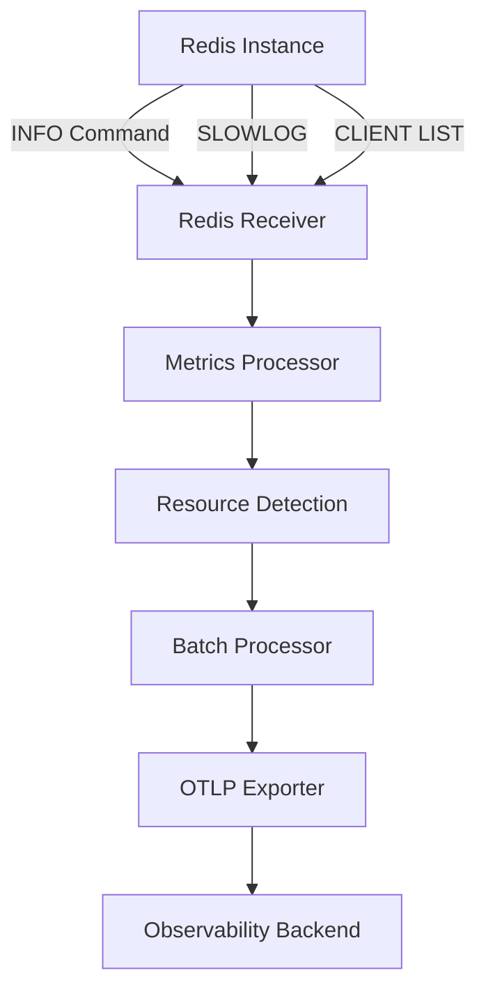

# How to Configure the Redis Receiver in the OpenTelemetry Collector

Author: [nawazdhandala](https://www.github.com/nawazdhandala)

Tags: OpenTelemetry, Collector, Redis, Cache Monitoring, Metrics, Performance, In-Memory Database

Description: Complete guide to configuring the Redis receiver in OpenTelemetry Collector for cache and in-memory database monitoring with practical examples and performance tuning strategies.

The Redis receiver enables the OpenTelemetry Collector to collect performance metrics directly from Redis instances. This receiver provides critical insights into cache hit rates, memory usage, command execution patterns, and replication health, making it essential for maintaining high-performance Redis deployments.

## Understanding Redis Monitoring

Redis monitoring is crucial for ensuring optimal cache performance and preventing memory exhaustion. As an in-memory data store, Redis performance directly impacts application response times and user experience. Key metrics include cache hit ratios, memory fragmentation, command latency, eviction rates, and replication lag.

The Redis receiver collects metrics by connecting to Redis instances and executing INFO commands. This approach provides real-time operational metrics with minimal overhead, capturing both instance-level and keyspace-level statistics.



## Basic Configuration

The minimal configuration requires connection details:

```yaml
receivers:
  # Redis receiver with basic connection
  redis:
    # Redis endpoint
    endpoint: localhost:6379

    # Collection interval (default: 10s)
    collection_interval: 10s

    # Authentication password (if required)
    password: ${env:REDIS_PASSWORD}

    # TLS configuration
    tls:
      insecure: false
      insecure_skip_verify: false

processors:
  # Batch metrics for efficiency
  batch:
    timeout: 10s
    send_batch_size: 100

exporters:
  # Export to stdout for testing
  logging:
    loglevel: info

service:
  pipelines:
    metrics:
      receivers: [redis]
      processors: [batch]
      exporters: [logging]
```

This basic configuration connects to a local Redis instance and collects metrics every 10 seconds. The password is securely read from an environment variable.

## Key Redis Metrics

The receiver collects comprehensive metrics organized by category:

### Memory Metrics

- `redis.memory.used`: Memory used by Redis
- `redis.memory.peak`: Peak memory used since startup
- `redis.memory.rss`: Resident set size (physical memory)
- `redis.memory.fragmentation`: Memory fragmentation ratio
- `redis.memory.lua`: Memory used by Lua engine

### Performance Metrics

- `redis.commands.processed`: Total commands processed
- `redis.commands.duration`: Command execution time
- `redis.keyspace.hits`: Successful key lookups
- `redis.keyspace.misses`: Failed key lookups
- `redis.net.input`: Bytes read from network
- `redis.net.output`: Bytes written to network

### Connection Metrics

- `redis.clients.connected`: Number of connected clients
- `redis.clients.blocked`: Clients blocked on operations
- `redis.clients.max_input_buffer`: Largest input buffer
- `redis.clients.max_output_buffer`: Largest output buffer

### Keyspace Metrics

- `redis.db.keys`: Number of keys per database
- `redis.db.expires`: Keys with expiration set
- `redis.db.avg_ttl`: Average TTL of keys with expiration

### Replication Metrics

- `redis.replication.connected_slaves`: Number of connected replicas
- `redis.replication.offset`: Replication offset
- `redis.replication.backlog_size`: Replication backlog size
- `redis.replication.lag`: Replication lag in seconds

### Persistence Metrics

- `redis.rdb.changes_since_last_save`: Changes since last RDB save
- `redis.rdb.last_save_time`: Unix timestamp of last save
- `redis.aof.size`: AOF file size

### Eviction Metrics

- `redis.keys.evicted`: Keys evicted due to maxmemory limit
- `redis.keys.expired`: Keys expired

## Advanced Configuration

For production environments, configure comprehensive monitoring with security:

```yaml
receivers:
  redis:
    # Redis endpoint
    endpoint: redis.prod.example.com:6379

    # Authentication
    password: ${env:REDIS_PASSWORD}

    # Collection interval
    collection_interval: 30s

    # Timeout for Redis commands
    timeout: 10s

    # TLS configuration
    tls:
      insecure: false
      insecure_skip_verify: false
      ca_file: /etc/otel/certs/redis-ca.pem
      cert_file: /etc/otel/certs/client-cert.pem
      key_file: /etc/otel/certs/client-key.pem
      min_version: "1.2"

    # Metric configuration
    metrics:
      # Memory metrics
      redis.memory.used:
        enabled: true
      redis.memory.peak:
        enabled: true
      redis.memory.rss:
        enabled: true
      redis.memory.fragmentation:
        enabled: true

      # Performance metrics
      redis.commands.processed:
        enabled: true
      redis.commands.duration:
        enabled: true
      redis.keyspace.hits:
        enabled: true
      redis.keyspace.misses:
        enabled: true
      redis.net.input:
        enabled: true
      redis.net.output:
        enabled: true

      # Connection metrics
      redis.clients.connected:
        enabled: true
      redis.clients.blocked:
        enabled: true

      # Keyspace metrics
      redis.db.keys:
        enabled: true
      redis.db.expires:
        enabled: true
      redis.db.avg_ttl:
        enabled: true

      # Replication metrics
      redis.replication.connected_slaves:
        enabled: true
      redis.replication.offset:
        enabled: true

      # Eviction metrics
      redis.keys.evicted:
        enabled: true
      redis.keys.expired:
        enabled: true
```

## Monitoring Redis Clusters

For Redis Cluster deployments, monitor all cluster nodes:

```yaml
receivers:
  # Master node 1
  redis/master1:
    endpoint: redis-master1.example.com:6379
    password: ${env:REDIS_PASSWORD}
    collection_interval: 30s

    resource_attributes:
      redis.role:
        enabled: true
        value: master
      redis.cluster.node:
        enabled: true
        value: node1

  # Master node 2
  redis/master2:
    endpoint: redis-master2.example.com:6379
    password: ${env:REDIS_PASSWORD}
    collection_interval: 30s

    resource_attributes:
      redis.role:
        enabled: true
        value: master
      redis.cluster.node:
        enabled: true
        value: node2

  # Master node 3
  redis/master3:
    endpoint: redis-master3.example.com:6379
    password: ${env:REDIS_PASSWORD}
    collection_interval: 30s

    resource_attributes:
      redis.role:
        enabled: true
        value: master
      redis.cluster.node:
        enabled: true
        value: node3

  # Replica monitoring
  redis/replica1:
    endpoint: redis-replica1.example.com:6379
    password: ${env:REDIS_PASSWORD}
    collection_interval: 30s

    resource_attributes:
      redis.role:
        enabled: true
        value: replica
      redis.cluster.node:
        enabled: true
        value: replica1

processors:
  # Add cluster information
  resource:
    attributes:
      - key: redis.cluster.name
        value: production-cluster
        action: insert
      - key: deployment.environment
        value: production
        action: insert

  batch:
    timeout: 30s

exporters:
  otlp:
    endpoint: https://observability.example.com:4317

service:
  pipelines:
    metrics:
      receivers: [redis/master1, redis/master2, redis/master3, redis/replica1]
      processors: [resource, batch]
      exporters: [otlp]
```

## Monitoring Redis Sentinel

For Redis Sentinel high-availability setups:

```yaml
receivers:
  # Monitor primary Redis instance
  redis/primary:
    endpoint: redis-primary.example.com:6379
    password: ${env:REDIS_PASSWORD}
    collection_interval: 30s

    metrics:
      redis.memory.used:
        enabled: true
      redis.commands.processed:
        enabled: true
      redis.keyspace.hits:
        enabled: true
      redis.keyspace.misses:
        enabled: true
      redis.replication.connected_slaves:
        enabled: true

    resource_attributes:
      redis.role:
        enabled: true
        value: primary

  # Monitor replica instances
  redis/replica1:
    endpoint: redis-replica1.example.com:6379
    password: ${env:REDIS_PASSWORD}
    collection_interval: 30s

    metrics:
      redis.replication.offset:
        enabled: true
      redis.replication.lag:
        enabled: true

    resource_attributes:
      redis.role:
        enabled: true
        value: replica

  redis/replica2:
    endpoint: redis-replica2.example.com:6379
    password: ${env:REDIS_PASSWORD}
    collection_interval: 30s

    metrics:
      redis.replication.offset:
        enabled: true
      redis.replication.lag:
        enabled: true

    resource_attributes:
      redis.role:
        enabled: true
        value: replica

  # Monitor Sentinel instances
  redis/sentinel1:
    endpoint: redis-sentinel1.example.com:26379
    collection_interval: 60s

    resource_attributes:
      redis.role:
        enabled: true
        value: sentinel

processors:
  resource:
    attributes:
      - key: redis.sentinel.cluster
        value: prod-sentinel
        action: insert

service:
  pipelines:
    metrics:
      receivers: [redis/primary, redis/replica1, redis/replica2, redis/sentinel1]
      processors: [resource, batch]
      exporters: [otlp]
```

## Production Configuration

Here's a complete production-ready configuration:

```yaml
receivers:
  redis:
    # Production endpoint
    endpoint: redis.prod.example.com:6379

    # Authentication
    password: ${env:REDIS_PRODUCTION_PASSWORD}

    # Collection interval
    collection_interval: 30s

    # Command timeout
    timeout: 10s

    # TLS configuration
    tls:
      insecure: false
      insecure_skip_verify: false
      ca_file: /etc/otel/certs/redis-ca.crt
      cert_file: /etc/otel/certs/client.crt
      key_file: /etc/otel/certs/client.key
      min_version: "1.2"

    # Enable comprehensive metrics
    metrics:
      redis.memory.used:
        enabled: true
      redis.memory.peak:
        enabled: true
      redis.memory.rss:
        enabled: true
      redis.memory.fragmentation:
        enabled: true
      redis.memory.lua:
        enabled: true
      redis.commands.processed:
        enabled: true
      redis.commands.duration:
        enabled: true
      redis.keyspace.hits:
        enabled: true
      redis.keyspace.misses:
        enabled: true
      redis.net.input:
        enabled: true
      redis.net.output:
        enabled: true
      redis.clients.connected:
        enabled: true
      redis.clients.blocked:
        enabled: true
      redis.db.keys:
        enabled: true
      redis.db.expires:
        enabled: true
      redis.db.avg_ttl:
        enabled: true
      redis.replication.connected_slaves:
        enabled: true
      redis.replication.offset:
        enabled: true
      redis.keys.evicted:
        enabled: true
      redis.keys.expired:
        enabled: true
      redis.rdb.changes_since_last_save:
        enabled: true

processors:
  # Memory limiter
  memory_limiter:
    check_interval: 1s
    limit_mib: 512
    spike_limit_mib: 128

  # Resource detection
  resourcedetection:
    detectors: [env, system]
    timeout: 5s

  # Add custom attributes
  resource:
    attributes:
      - key: deployment.environment
        value: production
        action: insert
      - key: redis.cluster.name
        value: prod-redis-cluster
        action: insert
      - key: redis.cluster.region
        value: us-east-1
        action: insert

  # Calculate cache hit ratio
  metricstransform:
    transforms:
      - include: redis.keyspace.hits
        action: insert
        new_name: redis.cache.hit_ratio
        operations:
          - action: experimental_scale_value
            value_as_function: "redis.keyspace.hits / (redis.keyspace.hits + redis.keyspace.misses)"

  # Batch processing
  batch:
    timeout: 30s
    send_batch_size: 500

exporters:
  # Primary export
  otlp:
    endpoint: https://observability.example.com:4317
    headers:
      api-key: ${env:OBSERVABILITY_API_KEY}
    compression: gzip
    sending_queue:
      enabled: true
      num_consumers: 10
      queue_size: 1000
    retry_on_failure:
      enabled: true
      initial_interval: 5s
      max_interval: 30s

  # Prometheus endpoint
  prometheus:
    endpoint: "0.0.0.0:8889"
    namespace: redis
    const_labels:
      cluster: production
      region: us-east-1

service:
  pipelines:
    metrics:
      receivers: [redis]
      processors:
        - memory_limiter
        - resourcedetection
        - resource
        - metricstransform
        - batch
      exporters: [otlp, prometheus]

  # Collector telemetry
  telemetry:
    logs:
      level: info
    metrics:
      address: :8888
```

## Monitoring Multiple Redis Databases

Redis supports multiple databases (0-15 by default). Monitor each database separately:

```yaml
receivers:
  # Database 0 (default)
  redis/db0:
    endpoint: localhost:6379
    password: ${env:REDIS_PASSWORD}
    collection_interval: 30s

    resource_attributes:
      redis.database:
        enabled: true
        value: "0"

  # Database 1
  redis/db1:
    endpoint: localhost:6379
    password: ${env:REDIS_PASSWORD}
    collection_interval: 30s

    resource_attributes:
      redis.database:
        enabled: true
        value: "1"

processors:
  # Filter metrics by database
  filter/db0:
    metrics:
      include:
        match_type: regexp
        resource_attributes:
          - key: redis.database
            value: "0"

  filter/db1:
    metrics:
      include:
        match_type: regexp
        resource_attributes:
          - key: redis.database
            value: "1"

service:
  pipelines:
    metrics/db0:
      receivers: [redis/db0]
      processors: [filter/db0, batch]
      exporters: [otlp]

    metrics/db1:
      receivers: [redis/db1]
      processors: [filter/db1, batch]
      exporters: [otlp]
```

## Alerting Strategies

Configure alerts for common Redis issues:

### Low Cache Hit Ratio

Alert when cache effectiveness degrades:

```yaml
# Prometheus alert rule
- alert: RedisLowCacheHitRatio
  expr: |
    redis.keyspace.hits /
    (redis.keyspace.hits + redis.keyspace.misses) < 0.8
  for: 10m
  labels:
    severity: warning
  annotations:
    summary: "Redis cache hit ratio low on {{ $labels.instance }}"
    description: "Cache hit ratio: {{ $value | humanizePercentage }}"
```

### High Memory Usage

Alert on excessive memory consumption:

```yaml
- alert: RedisHighMemoryUsage
  expr: redis.memory.used > 8589934592  # 8GB
  for: 5m
  labels:
    severity: warning
  annotations:
    summary: "Redis memory usage high"
    description: "Memory used: {{ $value | humanize1024 }}B"
```

### Memory Fragmentation

Alert on poor memory fragmentation:

```yaml
- alert: RedisHighMemoryFragmentation
  expr: redis.memory.fragmentation > 1.5
  for: 15m
  labels:
    severity: warning
  annotations:
    summary: "Redis memory fragmentation high"
    description: "Fragmentation ratio: {{ $value }}"
```

### Replication Lag

Alert on replication delay:

```yaml
- alert: RedisReplicationLag
  expr: redis.replication.lag > 10
  for: 5m
  labels:
    severity: critical
  annotations:
    summary: "Redis replication lag on {{ $labels.instance }}"
    description: "Replication lag: {{ $value }} seconds"
```

### High Eviction Rate

Alert when keys are frequently evicted:

```yaml
- alert: RedisHighEvictionRate
  expr: rate(redis.keys.evicted[5m]) > 100
  for: 10m
  labels:
    severity: warning
  annotations:
    summary: "High Redis eviction rate"
    description: "Evictions: {{ $value }} per second"
```

### Blocked Clients

Alert on clients blocked on operations:

```yaml
- alert: RedisBlockedClients
  expr: redis.clients.blocked > 10
  for: 5m
  labels:
    severity: warning
  annotations:
    summary: "Redis has blocked clients"
    description: "Blocked clients: {{ $value }}"
```

## Monitoring in Kubernetes

Deploy the collector to monitor Redis in Kubernetes:

```yaml
apiVersion: v1
kind: ConfigMap
metadata:
  name: otel-redis-config
  namespace: cache
data:
  config.yaml: |
    receivers:
      redis:
        endpoint: redis-service:6379
        password: ${env:REDIS_PASSWORD}
        collection_interval: 30s

    processors:
      resource:
        attributes:
          - key: k8s.cluster.name
            value: prod-k8s
            action: insert
          - key: k8s.namespace.name
            value: cache
            action: insert

      batch:
        timeout: 30s

    exporters:
      otlp:
        endpoint: otel-gateway.monitoring.svc.cluster.local:4317

    service:
      pipelines:
        metrics:
          receivers: [redis]
          processors: [resource, batch]
          exporters: [otlp]

---
apiVersion: apps/v1
kind: Deployment
metadata:
  name: otel-redis-collector
  namespace: cache
spec:
  replicas: 1
  selector:
    matchLabels:
      app: otel-redis-collector
  template:
    metadata:
      labels:
        app: otel-redis-collector
    spec:
      containers:
        - name: otel-collector
          image: otel/opentelemetry-collector-contrib:latest
          command: ["--config=/conf/config.yaml"]
          env:
            - name: REDIS_PASSWORD
              valueFrom:
                secretKeyRef:
                  name: redis-secret
                  key: password
          volumeMounts:
            - name: config
              mountPath: /conf
          resources:
            requests:
              memory: "128Mi"
              cpu: "100m"
            limits:
              memory: "512Mi"
              cpu: "500m"

      volumes:
        - name: config
          configMap:
            name: otel-redis-config
```

## Troubleshooting

### Connection Failures

If the receiver cannot connect to Redis:

1. Verify Redis is listening on the configured endpoint
2. Check firewall rules allow traffic from collector
3. Validate password if authentication is enabled
4. Test connection manually: `redis-cli -h host -p port -a password ping`

### Authentication Errors

If authentication fails:

1. Verify password is correct
2. Check Redis requirepass configuration
3. Ensure password environment variable is set
4. Review Redis logs for authentication attempts

### Missing Metrics

If expected metrics are missing:

1. Verify Redis version supports the metrics
2. Check metric enable/disable configuration
3. Ensure INFO command returns expected data
4. Review collector logs for errors

### High Redis Load

If monitoring impacts performance:

1. Increase collection_interval to reduce frequency
2. Disable expensive metrics
3. Use a dedicated read replica for monitoring
4. Reduce timeout value

## Integration with OneUptime

Configure the collector to send Redis metrics to OneUptime:

```yaml
exporters:
  otlp:
    endpoint: https://opentelemetry-collector.oneuptime.com:4317
    headers:
      x-oneuptime-token: ${env:ONEUPTIME_API_KEY}
    compression: gzip

service:
  pipelines:
    metrics:
      receivers: [redis]
      processors: [batch]
      exporters: [otlp]
```

OneUptime provides Redis-specific dashboards with cache performance analytics, memory usage visualization, and intelligent alerting for cache hit rates and eviction patterns. For monitoring databases alongside Redis, see our guides on [PostgreSQL receiver](https://oneuptime.com/blog/post/2026-02-06-postgresql-receiver-opentelemetry-collector/view), [MySQL receiver](https://oneuptime.com/blog/post/2026-02-06-mysql-receiver-opentelemetry-collector/view), and [MongoDB receiver](https://oneuptime.com/blog/post/2026-02-06-mongodb-receiver-opentelemetry-collector/view).

## Conclusion

The Redis receiver provides comprehensive monitoring for Redis deployments through the OpenTelemetry Collector. By collecting metrics on cache performance, memory usage, replication health, and command execution, you gain complete visibility into Redis operations and performance.

Start with basic configuration for standalone instances, then expand to monitor Redis Cluster or Sentinel setups as your architecture grows. Use the collected metrics to optimize cache hit rates, tune memory allocation, and maintain high-performance Redis operations.

For monitoring Redis in containerized environments, combine this receiver with the [Docker Stats receiver](https://oneuptime.com/blog/post/2026-02-06-docker-stats-receiver-opentelemetry-collector/view) for full-stack observability. To collect application logs alongside Redis metrics, explore our guide on the [Fluent Forward receiver](https://oneuptime.com/blog/post/2026-02-06-fluent-forward-receiver-opentelemetry-collector/view).
