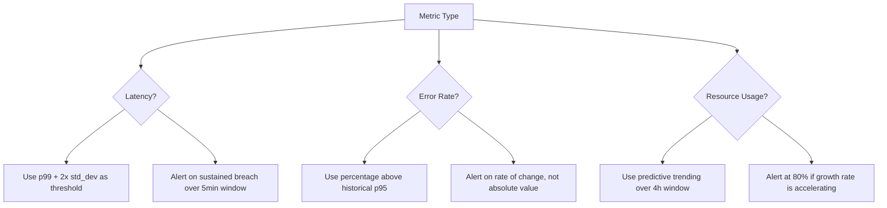

# How to Reduce Alert Fatigue by Tuning Alert Thresholds with OpenTelemetry Historical Data

Author: [nawazdhandala](https://www.github.com/nawazdhandala)

Tags: OpenTelemetry, Alert Fatigue, Threshold Tuning, Monitoring

Description: Analyze OpenTelemetry historical metric data to identify noisy alerts and set statistically sound thresholds that reduce false positives.

Alert fatigue is one of the most damaging problems in operations. When engineers get paged too often for non-issues, they start ignoring alerts, and real incidents slip through. The root cause is usually poorly calibrated thresholds - static values set during initial setup that never get revisited. OpenTelemetry historical metric data gives you the information needed to set thresholds based on actual system behavior rather than guesswork.

## Measuring Your Current Alert Noise

Before tuning anything, you need to quantify the problem. Instrument your alerting pipeline to record alert outcomes - did the alert lead to an actual incident, or was it a false positive?

```python
# Track alert outcomes to measure signal-to-noise ratio
from opentelemetry import metrics

meter = metrics.get_meter("alert.analysis")

alert_outcomes = meter.create_counter(
    "alert.outcomes.total",
    description="Alert outcomes categorized by result",
    unit="1"
)

def record_alert_outcome(alert, outcome):
    """
    Call this when an alert is resolved.
    outcome should be one of: 'true_positive', 'false_positive', 'acknowledged_no_action'
    """
    alert_outcomes.add(1, attributes={
        "alert.name": alert.name,
        "alert.rule": alert.rule_id,
        "service.name": alert.service,
        "outcome": outcome,
    })
```

After two weeks of data, query the false positive rate per alert rule:

```promql
# False positive rate per alert rule
sum by (alert_rule) (alert_outcomes_total{outcome="false_positive"})
/
sum by (alert_rule) (alert_outcomes_total)
```

Any alert rule with a false positive rate above 50% is a candidate for threshold tuning or removal.

## Extracting Baseline Behavior from Historical Metrics

The key to good thresholds is understanding what "normal" looks like for each metric. OpenTelemetry metrics stored in your backend contain this history. Pull the metric data and compute statistical baselines.

```python
# Compute statistical baselines from OTel metric history
import numpy as np
import requests

def compute_metric_baseline(prometheus_url, metric_name, service, lookback="14d", step="5m"):
    """
    Query historical metric data and compute percentile-based baselines.
    Returns p50, p95, p99, and standard deviation.
    """
    query = f'{metric_name}{{service_name="{service}"}}'
    response = requests.get(
        f"{prometheus_url}/api/v1/query_range",
        params={
            "query": query,
            "start": f"now-{lookback}",
            "end": "now",
            "step": step
        }
    )

    values = []
    for result in response.json()["data"]["result"]:
        for timestamp, value in result["values"]:
            values.append(float(value))

    values = np.array(values)

    return {
        "p50": np.percentile(values, 50),
        "p95": np.percentile(values, 95),
        "p99": np.percentile(values, 99),
        "mean": np.mean(values),
        "std_dev": np.std(values),
        "sample_count": len(values),
    }

# Example: compute baseline for request latency
baseline = compute_metric_baseline(
    "http://prometheus:9090",
    "http_server_duration_milliseconds",
    "checkout-service"
)
# Output: {'p50': 45.2, 'p95': 230.5, 'p99': 890.1, 'mean': 78.3, 'std_dev': 112.4, ...}
```

## Choosing Threshold Strategies

Different metrics need different threshold approaches. Here is a decision framework.



## Implementing Dynamic Thresholds in the Collector

The OpenTelemetry Collector can evaluate threshold conditions before sending alerts. Use the `filter` processor to suppress metrics that fall within normal ranges, and only forward anomalous data points to your alerting backend.

```yaml
# otel-collector-threshold-tuning.yaml
receivers:
  otlp:
    protocols:
      grpc:
        endpoint: 0.0.0.0:4317

processors:
  # Filter out metric values within normal range
  # Only forward data points that exceed tuned thresholds
  filter/latency:
    metrics:
      datapoint:
        - 'metric.name == "http.server.duration" and value_double < 500'

  # Transform metrics to add threshold context
  transform:
    metric_statements:
      - context: datapoint
        statements:
          # Tag data points that exceed the p99 baseline
          - set(attributes["threshold.exceeded"], "true")
            where metric.name == "http.server.duration" and value_double > 890.0

  batch:
    send_batch_size: 512
    timeout: 5s

exporters:
  otlp/alerting:
    endpoint: "alertmanager:4317"
  otlp/storage:
    endpoint: "metrics-backend:4317"

service:
  pipelines:
    # All metrics go to storage
    metrics/storage:
      receivers: [otlp]
      processors: [batch]
      exporters: [otlp/storage]
    # Only anomalous metrics go to alerting
    metrics/alerting:
      receivers: [otlp]
      processors: [filter/latency, transform, batch]
      exporters: [otlp/alerting]
```

## Time-Aware Thresholds

System behavior varies by time of day. A request rate that is alarming at 3 AM might be perfectly normal during business hours. Build time-aware baselines by segmenting your historical data.

```python
# Build time-of-day aware thresholds
from datetime import datetime

def compute_hourly_baselines(prometheus_url, metric_name, service, lookback="30d"):
    """
    Compute separate baselines for each hour of the day.
    Returns a dict mapping hour (0-23) to threshold values.
    """
    hourly_thresholds = {}

    for hour in range(24):
        # Query only data points from this hour across all days
        query = (
            f'{metric_name}{{service_name="{service}"}} '
            f'and on() hour(timestamp) == {hour}'
        )
        # In practice, you would filter in your query language
        # This pseudocode illustrates the concept

        baseline = compute_metric_baseline(
            prometheus_url, metric_name, service, lookback
        )

        # Set threshold at mean + 3 standard deviations for this hour
        hourly_thresholds[hour] = {
            "warning": baseline["mean"] + 2 * baseline["std_dev"],
            "critical": baseline["mean"] + 3 * baseline["std_dev"],
        }

    return hourly_thresholds

# Example output:
# {0: {'warning': 120.5, 'critical': 180.2},   # Low thresholds at night
#  9: {'warning': 450.0, 'critical': 680.3},    # Higher thresholds during peak
#  ...}
```

## Continuous Threshold Recalibration

Thresholds should not be static. Set up a weekly job that recomputes baselines from the most recent data and updates your alerting rules automatically.

```python
# Weekly threshold recalibration job
def recalibrate_thresholds(services, metrics_to_tune):
    updated_rules = []

    for service in services:
        for metric in metrics_to_tune:
            baseline = compute_metric_baseline(
                PROMETHEUS_URL, metric, service, lookback="14d"
            )

            # Only update if we have enough data points
            if baseline["sample_count"] < 1000:
                continue

            new_threshold = baseline["p99"] * 1.5  # 50% above p99

            updated_rules.append({
                "service": service,
                "metric": metric,
                "old_threshold": get_current_threshold(service, metric),
                "new_threshold": round(new_threshold, 2),
                "based_on_samples": baseline["sample_count"]
            })

    # Apply updates and log changes for audit
    apply_threshold_updates(updated_rules)
    return updated_rules
```

## Results You Can Expect

Teams that adopt data-driven threshold tuning typically see a 40-60% reduction in alert volume within the first month. The alerts that remain are more meaningful, which restores engineer trust in the alerting system. The critical factor is treating threshold tuning as a continuous process rather than a one-time exercise. OpenTelemetry metrics provide the historical data foundation that makes this possible.
