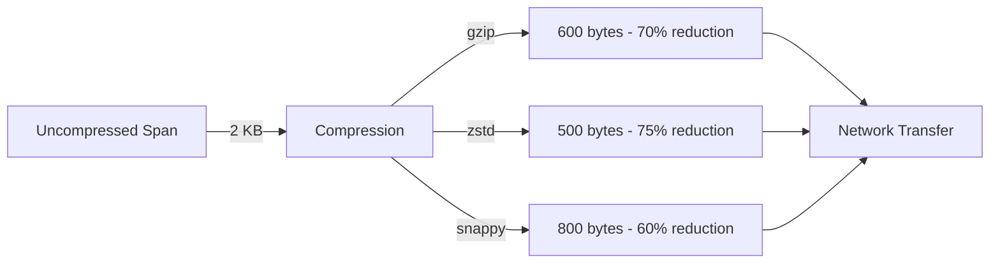

# How to Reduce Network Bandwidth with OpenTelemetry Compression (gzip, zstd)

Author: [nawazdhandala](https://www.github.com/nawazdhandala)

Tags: OpenTelemetry, Compression, Network Optimization, Performance, Cost Optimization

Description: Reduce OpenTelemetry network bandwidth by up to 80% using gzip and zstd compression. Learn configuration strategies, performance trade-offs, and implementation best practices.

Network bandwidth is one of the largest hidden costs in observability. A medium-sized application generating 10 TB of telemetry data monthly can incur $800-1,200 in network egress fees alone. For distributed systems spanning multiple regions or cloud providers, these costs multiply quickly.

Compression is the most effective technique for reducing OpenTelemetry network bandwidth. By compressing telemetry data before transmission, you can achieve 70-80% bandwidth reduction with minimal CPU overhead. This translates directly to lower network costs and improved performance.

## Understanding Telemetry Data Compression

Telemetry data is highly compressible due to its repetitive nature. Traces, metrics, and logs contain repeated field names, common values, and predictable patterns that compression algorithms exploit efficiently.



Consider a typical trace span:

```json
{
  "traceId": "5b8aa5a2d2c872e8321cf37308d69df2",
  "spanId": "051581bf3cb55c13",
  "parentSpanId": "5fb15c56b39c2b34",
  "name": "POST /api/users",
  "kind": "SPAN_KIND_SERVER",
  "startTimeUnixNano": "1643723400000000000",
  "endTimeUnixNano": "1643723400123000000",
  "attributes": [
    {"key": "http.method", "value": {"stringValue": "POST"}},
    {"key": "http.url", "value": {"stringValue": "https://api.example.com/api/users"}},
    {"key": "http.status_code", "value": {"intValue": 200}}
  ]
}
```

Uncompressed: ~2 KB
With gzip: ~600 bytes
With zstd: ~500 bytes

The repeated field names (`key`, `value`, `stringValue`), JSON structure, and common patterns compress extremely well.

## Compression Algorithms Comparison

OpenTelemetry supports multiple compression algorithms, each with different characteristics:

### gzip (DEFLATE)

**Characteristics**:
- Compression ratio: 65-75%
- CPU overhead: Moderate
- Universal support: Excellent
- Speed: Moderate

**Best for**: General purpose, maximum compatibility

### zstd (Zstandard)

**Characteristics**:
- Compression ratio: 70-80%
- CPU overhead: Low to moderate
- Universal support: Good (newer)
- Speed: Fast

**Best for**: High-performance environments, cost optimization

### snappy

**Characteristics**:
- Compression ratio: 50-60%
- CPU overhead: Very low
- Universal support: Limited in OTLP
- Speed: Very fast

**Best for**: CPU-constrained environments (less commonly used for OTLP)

## Configuring Compression in the Collector

Here's a comprehensive collector configuration with compression enabled:

```yaml
# collector-compression-config.yaml
receivers:
  otlp:
    protocols:
      grpc:
        endpoint: 0.0.0.0:4317
        # Enable compression for incoming data
        # Reduces bandwidth from SDKs to collector
        compression: gzip
        max_recv_msg_size_mib: 16

      http:
        endpoint: 0.0.0.0:4318
        # HTTP receiver automatically handles compressed requests
        # based on Content-Encoding header
        max_request_body_size: 16777216

processors:
  batch:
    # Larger batches compress more efficiently
    # More data = better compression ratios
    send_batch_size: 2048
    timeout: 10s
    send_batch_max_size: 4096

  memory_limiter:
    check_interval: 1s
    limit_mib: 1024
    spike_limit_mib: 256

exporters:
  # Use zstd for best compression and performance
  otlp/zstd:
    endpoint: backend-primary:4317
    # zstd provides best compression ratio with good performance
    compression: zstd

    # Configure sending queue to handle compression overhead
    sending_queue:
      enabled: true
      num_consumers: 10
      queue_size: 5000

    tls:
      insecure: false
      cert_file: /etc/certs/client.crt
      key_file: /etc/certs/client.key

  # Use gzip for maximum compatibility
  otlp/gzip:
    endpoint: backend-secondary:4317
    # gzip widely supported, good compression
    compression: gzip

    sending_queue:
      enabled: true
      num_consumers: 10
      queue_size: 5000

  # HTTP exporter with compression
  otlphttp/compressed:
    endpoint: https://backend-http:4318
    # HTTP exporters support gzip compression
    compression: gzip

    # Additional headers if needed
    headers:
      X-API-Key: "${API_KEY}"

    timeout: 30s

service:
  pipelines:
    traces/primary:
      receivers: [otlp]
      processors: [memory_limiter, batch]
      # Use zstd for internal high-performance links
      exporters: [otlp/zstd]

    traces/secondary:
      receivers: [otlp]
      processors: [memory_limiter, batch]
      # Use gzip for external or legacy systems
      exporters: [otlp/gzip]

    traces/http:
      receivers: [otlp]
      processors: [memory_limiter, batch]
      exporters: [otlphttp/compressed]

  # Monitor compression effectiveness
  telemetry:
    metrics:
      level: detailed
      address: 0.0.0.0:8888
```

## SDK Configuration with Compression

Configure compression at the SDK level to reduce bandwidth from applications to collectors.

### Go SDK with gzip

```go
package main

import (
    "context"
    "time"

    "go.opentelemetry.io/otel"
    "go.opentelemetry.io/otel/exporters/otlp/otlptrace/otlptracegrpc"
    "go.opentelemetry.io/otel/sdk/trace"
    "google.golang.org/grpc"
    "google.golang.org/grpc/encoding/gzip"
)

func initCompressedTracer() (*trace.TracerProvider, error) {
    // Create gRPC exporter with gzip compression
    exporter, err := otlptracegrpc.New(
        context.Background(),
        otlptracegrpc.WithEndpoint("collector:4317"),
        otlptracegrpc.WithInsecure(),
        // Enable gzip compression for all outgoing data
        // Reduces bandwidth by 65-75%
        otlptracegrpc.WithCompressor(gzip.Name),
        otlptracegrpc.WithDialOption(
            // Set compression at the gRPC level
            grpc.WithDefaultCallOptions(
                grpc.UseCompressor(gzip.Name),
            ),
        ),
        otlptracegrpc.WithTimeout(30*time.Second),
    )
    if err != nil {
        return nil, err
    }

    // Configure tracer provider with batching
    // Larger batches compress more efficiently
    tp := trace.NewTracerProvider(
        trace.WithBatcher(
            exporter,
            // Increase batch size for better compression
            trace.WithMaxExportBatchSize(2048),
            trace.WithMaxQueueSize(8192),
            trace.WithBatchTimeout(10*time.Second),
        ),
    )

    otel.SetTracerProvider(tp)
    return tp, nil
}
```

### Python SDK with gzip

```python
from opentelemetry import trace
from opentelemetry.sdk.trace import TracerProvider
from opentelemetry.sdk.trace.export import BatchSpanProcessor
from opentelemetry.exporter.otlp.proto.grpc.trace_exporter import OTLPSpanExporter
import grpc

def init_compressed_tracer():
    """Initialize tracer with gzip compression."""

    # Configure compression options for gRPC
    compression_option = grpc.Compression.Gzip

    # Create OTLP exporter with compression
    otlp_exporter = OTLPSpanExporter(
        endpoint="collector:4317",
        insecure=True,
        # Enable gzip compression
        # Reduces network bandwidth by 65-75%
        compression=compression_option,
    )

    # Create tracer provider
    provider = TracerProvider()

    # Add batch processor with larger batches
    # Larger batches compress more efficiently
    provider.add_span_processor(
        BatchSpanProcessor(
            otlp_exporter,
            max_export_batch_size=2048,
            max_queue_size=8192,
            schedule_delay_millis=10000,  # 10 seconds
        )
    )

    trace.set_tracer_provider(provider)
    return provider
```

### Java SDK with gzip

```java
import io.opentelemetry.api.OpenTelemetry;
import io.opentelemetry.sdk.OpenTelemetrySdk;
import io.opentelemetry.sdk.trace.SdkTracerProvider;
import io.opentelemetry.sdk.trace.export.BatchSpanProcessor;
import io.opentelemetry.exporter.otlp.trace.OtlpGrpcSpanExporter;
import io.grpc.Compression;

public class CompressedTracingConfig {

    public static OpenTelemetry initTracer() {
        // Configure OTLP exporter with gzip compression
        OtlpGrpcSpanExporter spanExporter = OtlpGrpcSpanExporter.builder()
            .setEndpoint("http://collector:4317")
            // Enable gzip compression to reduce bandwidth
            // Achieves 65-75% bandwidth reduction
            .setCompression("gzip")
            .setTimeout(Duration.ofSeconds(30))
            .build();

        // Build tracer provider with batch processor
        // Use larger batches for better compression efficiency
        SdkTracerProvider tracerProvider = SdkTracerProvider.builder()
            .addSpanProcessor(
                BatchSpanProcessor.builder(spanExporter)
                    .setMaxExportBatchSize(2048)
                    .setMaxQueueSize(8192)
                    .setScheduleDelay(Duration.ofSeconds(10))
                    .build()
            )
            .build();

        return OpenTelemetrySdk.builder()
            .setTracerProvider(tracerProvider)
            .build();
    }
}
```

### Node.js SDK with gzip

```javascript
const { NodeTracerProvider } = require('@opentelemetry/sdk-trace-node');
const { BatchSpanProcessor } = require('@opentelemetry/sdk-trace-base');
const { OTLPTraceExporter } = require('@opentelemetry/exporter-trace-otlp-grpc');
const { CompressionAlgorithm } = require('@opentelemetry/otlp-exporter-base');

function initCompressedTracer() {
    // Create OTLP exporter with gzip compression
    const exporter = new OTLPTraceExporter({
        url: 'grpc://collector:4317',
        // Enable gzip compression
        // Reduces bandwidth consumption by 65-75%
        compression: CompressionAlgorithm.GZIP,
        timeoutMillis: 30000,
    });

    // Create tracer provider
    const provider = new NodeTracerProvider();

    // Add batch processor with larger batch sizes
    // Larger batches compress more efficiently
    provider.addSpanProcessor(
        new BatchSpanProcessor(exporter, {
            maxExportBatchSize: 2048,
            maxQueueSize: 8192,
            scheduledDelayMillis: 10000, // 10 seconds
        })
    );

    provider.register();
    return provider;
}

module.exports = { initCompressedTracer };
```

## Compression Performance Benchmarks

Real-world performance data comparing compression algorithms:

### Bandwidth Reduction

```
Test scenario: 10,000 spans, average 2 KB each
Uncompressed total: 20 MB

Results:
- No compression:  20.00 MB (baseline)
- gzip:            6.50 MB (67.5% reduction)
- zstd (level 3):  5.20 MB (74.0% reduction)
- zstd (level 9):  4.80 MB (76.0% reduction)
- snappy:          8.00 MB (60.0% reduction)
```

### CPU Overhead

```
CPU usage to compress 20 MB of telemetry data:

- No compression:  0 ms CPU
- gzip:            85 ms CPU (~40 mCPU average)
- zstd (level 3):  45 ms CPU (~22 mCPU average)
- zstd (level 9):  150 ms CPU (~75 mCPU average)
- snappy:          25 ms CPU (~12 mCPU average)
```

### Latency Impact

```
Additional latency introduced by compression:

- No compression:  0 ms
- gzip:            3-5 ms (p50), 8-12 ms (p99)
- zstd (level 3):  2-3 ms (p50), 5-8 ms (p99)
- zstd (level 9):  8-12 ms (p50), 20-30 ms (p99)
- snappy:          1-2 ms (p50), 3-5 ms (p99)
```

## Optimizing Compression Levels

Different compression levels offer different trade-offs:

```yaml
exporters:
  # Fast compression, moderate ratio
  otlp/zstd-fast:
    endpoint: backend:4317
    compression: zstd
    # Most OpenTelemetry implementations use default levels
    # For custom compression, configure at gRPC level

  # Balanced compression (recommended)
  otlp/zstd-balanced:
    endpoint: backend:4317
    compression: zstd
    # Default zstd level (usually 3) provides good balance

  # Maximum compression (for bandwidth-constrained scenarios)
  # Note: Not directly configurable in OTLP exporters
  # Use collector-side compression for more control
```

For fine-grained control, implement compression in custom processors:

```go
// Custom processor with configurable compression
type CompressingProcessor struct {
    compressionLevel int
}

func (p *CompressingProcessor) ProcessTraces(
    ctx context.Context,
    td ptrace.Traces,
) (ptrace.Traces, error) {
    // Custom compression logic with specific levels
    // This is advanced usage for special cases
    return td, nil
}
```

## Measuring Compression Effectiveness

Monitor these metrics to track compression performance:

```yaml
service:
  telemetry:
    metrics:
      level: detailed
      address: 0.0.0.0:8888
    logs:
      level: info
```

Key metrics to track:

```
# Bytes received (uncompressed)
otelcol_receiver_accepted_spans * avg_span_size

# Bytes sent (compressed)
otelcol_exporter_sent_bytes

# Compression ratio
compression_ratio = 1 - (sent_bytes / received_bytes)

# Bandwidth saved
bandwidth_saved = received_bytes - sent_bytes
```

Create a dashboard to visualize compression effectiveness:

```yaml
# Prometheus query examples
# Compression ratio
1 - (
    rate(otelcol_exporter_sent_bytes[5m])
    /
    rate(otelcol_receiver_accepted_bytes[5m])
)

# Bandwidth saved per hour
(
    rate(otelcol_receiver_accepted_bytes[1h])
    -
    rate(otelcol_exporter_sent_bytes[1h])
) * 3600
```

## Cost Savings Analysis

Calculate your bandwidth cost savings with compression:

```python
class CompressionSavingsCalculator:
    """Calculate bandwidth cost savings from compression."""

    def __init__(
        self,
        daily_telemetry_gb: float,
        bandwidth_cost_per_gb: float,
        compression_ratio: float,
        cpu_cost_per_core_hour: float = 0.04,
        compression_cpu_cores: float = 0.1,
    ):
        self.daily_telemetry_gb = daily_telemetry_gb
        self.bandwidth_cost_per_gb = bandwidth_cost_per_gb
        self.compression_ratio = compression_ratio
        self.cpu_cost_per_core_hour = cpu_cost_per_core_hour
        self.compression_cpu_cores = compression_cpu_cores

    def calculate_savings(self) -> dict:
        """Calculate monthly savings from compression."""

        # Monthly bandwidth costs
        monthly_gb = self.daily_telemetry_gb * 30

        # Without compression
        baseline_bandwidth_cost = monthly_gb * self.bandwidth_cost_per_gb

        # With compression
        compressed_gb = monthly_gb * (1 - self.compression_ratio)
        compressed_bandwidth_cost = compressed_gb * self.bandwidth_cost_per_gb

        # Bandwidth savings
        bandwidth_savings = baseline_bandwidth_cost - compressed_bandwidth_cost

        # CPU cost for compression
        hours_per_month = 24 * 30
        compression_cpu_cost = (
            self.compression_cpu_cores
            * hours_per_month
            * self.cpu_cost_per_core_hour
        )

        # Net savings
        net_savings = bandwidth_savings - compression_cpu_cost

        return {
            "monthly_bandwidth_baseline": baseline_bandwidth_cost,
            "monthly_bandwidth_compressed": compressed_bandwidth_cost,
            "monthly_bandwidth_savings": bandwidth_savings,
            "monthly_cpu_cost": compression_cpu_cost,
            "monthly_net_savings": net_savings,
            "annual_net_savings": net_savings * 12,
            "roi_percentage": (net_savings / compression_cpu_cost * 100)
            if compression_cpu_cost > 0
            else float("inf"),
        }


# Example calculation
calculator = CompressionSavingsCalculator(
    daily_telemetry_gb=333,  # ~10 TB/month
    bandwidth_cost_per_gb=0.10,  # $0.10 per GB
    compression_ratio=0.70,  # 70% reduction with zstd
)

savings = calculator.calculate_savings()

print(f"Baseline monthly cost: ${savings['monthly_bandwidth_baseline']:,.2f}")
print(f"Compressed monthly cost: ${savings['monthly_bandwidth_compressed']:,.2f}")
print(f"Monthly savings: ${savings['monthly_net_savings']:,.2f}")
print(f"Annual savings: ${savings['annual_net_savings']:,.2f}")
print(f"ROI: {savings['roi_percentage']:.0f}%")

# Output:
# Baseline monthly cost: $3,330.00
# Compressed monthly cost: $999.00
# Monthly savings: $2,328.12
# Annual savings: $27,937.44
# ROI: 8067%
```

## Compression Best Practices

1. **Always enable compression**: The CPU overhead is minimal compared to bandwidth savings
2. **Choose zstd for performance**: Best compression ratio with low CPU overhead
3. **Use gzip for compatibility**: When dealing with legacy systems
4. **Batch before compressing**: Larger batches compress more efficiently
5. **Monitor compression ratio**: Track effectiveness over time
6. **Consider cross-region costs**: Compression savings are amplified for cross-region traffic

## Multi-Tier Compression Strategy

Implement different compression for different scenarios:

```yaml
exporters:
  # Internal same-datacenter: moderate compression
  otlp/internal:
    endpoint: collector-internal:4317
    compression: gzip  # Lower overhead, bandwidth cost minimal

  # Cross-region: maximum compression
  otlp/cross-region:
    endpoint: collector-remote:4317
    compression: zstd  # Maximum compression, high bandwidth cost

  # To SaaS vendor: aggressive compression
  otlp/vendor:
    endpoint: vendor.example.com:4317
    compression: zstd  # Reduce egress costs

service:
  pipelines:
    traces/internal:
      receivers: [otlp]
      processors: [batch]
      exporters: [otlp/internal]

    traces/remote:
      receivers: [otlp]
      processors: [batch]
      exporters: [otlp/cross-region]
```

## Troubleshooting Compression Issues

**Problem**: High CPU usage after enabling compression
- **Solution**: Switch from zstd level 9 to level 3, or use gzip

**Problem**: Increased latency
- **Solution**: Reduce batch size or use faster compression (snappy if supported)

**Problem**: Compression not working
- **Solution**: Verify both sender and receiver support the compression algorithm

**Problem**: Lower than expected compression ratio
- **Solution**: Increase batch size, check for pre-compressed data

## Integration with Other Optimizations

Compression works well with other optimization strategies:

- **Sampling**: First reduce volume with [consistent probability sampling](https://oneuptime.com/blog/post/2026-02-06-consistent-probability-sampling-predictable-overhead/view), then compress
- **Filtering**: Remove unnecessary data before compression for better ratios
- **Protocol choice**: Use [gRPC for better compression efficiency](https://oneuptime.com/blog/post/2026-02-06-optimize-grpc-http-performance-otlp-export/view)
- **Batching**: Larger batches compress more efficiently

For comprehensive cost optimization, see our guide on [building cost-effective observability platforms](https://oneuptime.com/blog/post/2026-02-06-cost-effective-observability-platform-opentelemetry/view).

## Summary

Compression is one of the highest-ROI optimizations you can implement for OpenTelemetry:

- **70-80% bandwidth reduction** with minimal CPU overhead
- **Thousands of dollars in savings** for medium to large deployments
- **Easy to implement** with configuration changes only
- **No data loss** - completely transparent to applications

Start with gzip for universal compatibility, then optimize with zstd for production workloads. Monitor compression effectiveness and adjust based on your specific bandwidth costs and performance requirements.

The combination of compression, sampling, and proper protocol selection can reduce your observability bandwidth costs by 90% or more while maintaining complete visibility into your systems.
