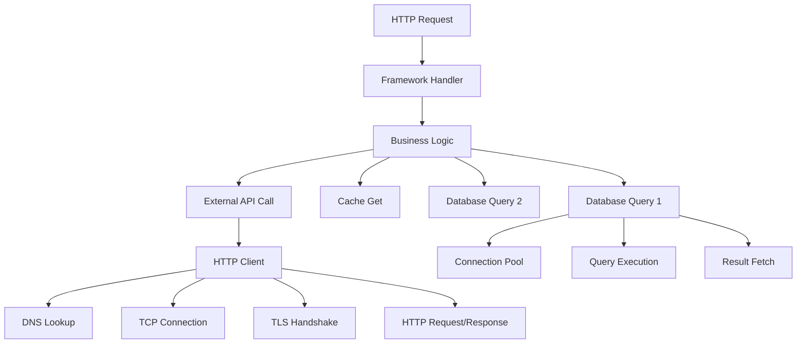

# How to Reduce Telemetry Data Volume with Span Suppression Strategies

Author: [nawazdhandala](https://www.github.com/nawazdhandala)

Tags: OpenTelemetry, Tracing, Performance, Cost Optimization, Span Suppression

Description: Master span suppression techniques in OpenTelemetry to reduce trace volume by 50-70%. Learn how to eliminate noisy spans while preserving critical debugging information.

Distributed traces can quickly become overwhelming. A single user request might generate hundreds of spans as it traverses microservices, databases, caches, and external APIs. Many of these spans provide minimal value while consuming significant storage and processing resources.

Span suppression is the practice of intelligently preventing certain spans from being created or exported. Unlike sampling, which drops entire traces, span suppression removes individual spans within a trace, keeping the critical path visible while eliminating noise.

This guide demonstrates practical span suppression strategies that can reduce telemetry volume by 50-70% without losing debugging capability.

## Understanding Span Proliferation

A typical microservice request generates spans at multiple levels:



This single request created 15 spans, but only 5-6 are useful for debugging. The rest add noise and cost.

## Strategy 1: Suppress Infrastructure Spans

Low-level infrastructure spans (DNS lookups, connection pooling, TLS handshakes) rarely help with debugging. Suppress them at the SDK level:

```python
# Python SDK configuration to suppress infrastructure spans
from opentelemetry import trace
from opentelemetry.sdk.trace import TracerProvider, SpanProcessor
from opentelemetry.sdk.trace.export import BatchSpanProcessor
from opentelemetry.exporter.otlp.proto.grpc.trace_exporter import OTLPSpanExporter

class InfrastructureSpanSuppressor(SpanProcessor):
    """
    Custom span processor that suppresses low-value infrastructure spans.
    """

    # Define span names to suppress
    SUPPRESSED_SPAN_PATTERNS = [
        'dns',
        'connection.pool',
        'tls.handshake',
        'socket.connect',
        'tcp.connect',
        'ssl.handshake',
        'thread.pool',
    ]

    def on_start(self, span, parent_context=None):
        """
        Called when span is started. Check if it should be suppressed.
        """
        span_name = span.name.lower()

        # Check if span matches suppression patterns
        for pattern in self.SUPPRESSED_SPAN_PATTERNS:
            if pattern in span_name:
                # Mark span as not recording
                span.set_attribute('span.suppressed', True)
                # Optionally set sampling decision to not record
                # This prevents the span from being exported
                break

    def on_end(self, span):
        """Called when span ends."""
        pass

    def shutdown(self):
        """Called on shutdown."""
        pass

    def force_flush(self, timeout_millis=30000):
        """Called on force flush."""
        pass

# Initialize tracer provider with suppressor
provider = TracerProvider()

# Add suppressor first (before exporter processor)
provider.add_span_processor(InfrastructureSpanSuppressor())

# Add exporter processor
provider.add_span_processor(
    BatchSpanProcessor(OTLPSpanExporter())
)

trace.set_tracer_provider(provider)
```

This processor intercepts spans as they're created and marks infrastructure spans to be dropped.

## Strategy 2: Suppress by Span Duration

Very short spans (under 1ms) often represent trivial operations. Suppress them to reduce noise:

```go
// Go SDK span suppressor based on duration
package main

import (
    "context"
    "time"

    "go.opentelemetry.io/otel/sdk/trace"
    sdktrace "go.opentelemetry.io/otel/sdk/trace"
)

// DurationBasedSuppressor drops spans shorter than threshold
type DurationBasedSuppressor struct {
    minDuration time.Duration
    next        sdktrace.SpanProcessor
}

func NewDurationBasedSuppressor(minDuration time.Duration, next sdktrace.SpanProcessor) *DurationBasedSuppressor {
    return &DurationBasedSuppressor{
        minDuration: minDuration,
        next:        next,
    }
}

func (d *DurationBasedSuppressor) OnStart(ctx context.Context, span sdktrace.ReadWriteSpan) {
    // Pass through to next processor
    d.next.OnStart(ctx, span)
}

func (d *DurationBasedSuppressor) OnEnd(span sdktrace.ReadOnlySpan) {
    // Calculate span duration
    duration := span.EndTime().Sub(span.StartTime())

    // Only process spans longer than threshold
    if duration >= d.minDuration {
        d.next.OnEnd(span)
    }
    // Spans shorter than threshold are silently dropped
}

func (d *DurationBasedSuppressor) Shutdown(ctx context.Context) error {
    return d.next.Shutdown(ctx)
}

func (d *DurationBasedSuppressor) ForceFlush(ctx context.Context) error {
    return d.next.ForceFlush(ctx)
}

// Usage in tracer provider initialization
func initTracerProvider() *sdktrace.TracerProvider {
    exporter, _ := otlptracegrpc.New(context.Background())
    batcher := sdktrace.NewBatchSpanProcessor(exporter)

    // Wrap batcher with duration suppressor
    // Drop spans shorter than 1ms
    suppressor := NewDurationBasedSuppressor(1*time.Millisecond, batcher)

    return sdktrace.NewTracerProvider(
        sdktrace.WithSpanProcessor(suppressor),
    )
}
```

This approach eliminates fast cache hits, quick database queries, and other trivial operations from traces.

## Strategy 3: Collector-Level Span Filtering

The OpenTelemetry Collector can filter spans based on attributes, allowing centralized control:

```yaml
# Collector configuration for span-level filtering
receivers:
  otlp:
    protocols:
      grpc:
        endpoint: 0.0.0.0:4317

processors:
  # Filter processor for span suppression
  filter/suppress_spans:
    error_mode: ignore
    traces:
      span:
        # Suppress health check spans
        - 'attributes["http.route"] == "/health"'
        - 'attributes["http.route"] == "/ready"'

        # Suppress internal library spans
        - 'attributes["library.name"] matches ".*internal.*"'

        # Suppress database connection pool operations
        - 'name matches ".*connection.pool.*"'

        # Suppress very fast operations (under 1ms)
        - 'end_time_unix_nano - start_time_unix_nano < 1000000'

        # Suppress specific span kinds (internal only)
        - 'kind == SPAN_KIND_INTERNAL and attributes["custom.important"] == nil'

  # Transform processor to remove noisy attributes
  transform/clean_spans:
    trace_statements:
      - context: span
        statements:
          # Remove verbose attributes that inflate span size
          - delete_key(attributes, "http.request.header.user-agent")
          - delete_key(attributes, "http.request.header.cookie")
          - delete_key(attributes, "http.response.body")

          # Truncate long string attributes
          - set(attributes["http.url"], Truncate(attributes["http.url"], 256))

  batch:
    timeout: 10s
    send_batch_size: 1024

exporters:
  otlp:
    endpoint: backend:4317

service:
  pipelines:
    traces:
      receivers: [otlp]
      processors: [filter/suppress_spans, transform/clean_spans, batch]
      exporters: [otlp]
```

Collector-level filtering allows you to adjust suppression rules without redeploying applications.

## Strategy 4: Intelligent Child Span Suppression

Suppress child spans that duplicate parent span information:

```java
// Java SDK span suppressor for redundant child spans
import io.opentelemetry.api.trace.Span;
import io.opentelemetry.api.trace.SpanBuilder;
import io.opentelemetry.context.Context;
import io.opentelemetry.sdk.trace.ReadWriteSpan;
import io.opentelemetry.sdk.trace.ReadableSpan;
import io.opentelemetry.sdk.trace.SpanProcessor;

public class RedundantChildSpanSuppressor implements SpanProcessor {

    // Suppress child spans that are too similar to parent
    @Override
    public void onStart(Context parentContext, ReadWriteSpan span) {
        // Get parent span from context
        Span parentSpan = Span.fromContext(parentContext);

        if (parentSpan != null && parentSpan.getSpanContext().isValid()) {
            String spanName = span.getName();
            String parentName = parentSpan.getSpanContext().getSpanId();

            // Suppress if child span name is very similar to parent
            // e.g., parent: "HTTP GET /api/users", child: "GET /api/users"
            if (isRedundantChild(spanName, parentName)) {
                // Set attribute to mark for suppression
                span.setAttribute("span.suppressed", true);
            }

            // Suppress if child span has same operation as parent
            String operation = span.getAttribute("operation");
            String parentOperation = parentSpan.getAttribute("operation");
            if (operation != null && operation.equals(parentOperation)) {
                span.setAttribute("span.suppressed", true);
            }
        }
    }

    @Override
    public boolean isStartRequired() {
        return true;
    }

    @Override
    public void onEnd(ReadableSpan span) {
        // Check if span was marked for suppression
        Boolean suppressed = span.getAttribute("span.suppressed");
        if (suppressed != null && suppressed) {
            // Don't export this span
            return;
        }
        // Otherwise, continue normal processing
    }

    @Override
    public boolean isEndRequired() {
        return true;
    }

    private boolean isRedundantChild(String childName, String parentName) {
        // Implement similarity logic
        return childName.contains(parentName) || parentName.contains(childName);
    }
}
```

This eliminates redundant child spans that don't add new information.

## Strategy 5: Suppress by Service Tier

Not all services need the same level of instrumentation. Suppress more aggressively for lower-tier services:

```yaml
# Collector configuration with tier-based suppression
processors:
  # Routing processor to split by service tier
  routing/by_tier:
    from_attribute: service.tier
    default_exporters: [otlp/default]
    table:
      - value: critical
        exporters: [otlp/critical]
      - value: standard
        exporters: [otlp/standard]
      - value: background
        exporters: [otlp/background]

  # Critical tier: minimal suppression (keep most spans)
  filter/critical:
    traces:
      span:
        # Only drop health checks
        - 'attributes["http.route"] matches "/(health|ready)"'

  # Standard tier: moderate suppression
  filter/standard:
    traces:
      span:
        # Drop health checks and internal operations
        - 'attributes["http.route"] matches "/(health|ready)"'
        - 'kind == SPAN_KIND_INTERNAL and duration < 5000000'  # 5ms

  # Background tier: aggressive suppression (keep only errors and slow ops)
  filter/background:
    traces:
      span:
        # Only keep errors and slow operations
        - 'status.code != STATUS_CODE_ERROR and duration < 100000000'  # 100ms

  batch:
    timeout: 10s
    send_batch_size: 1024

exporters:
  otlp/critical:
    endpoint: backend:4317
  otlp/standard:
    endpoint: backend:4317
  otlp/background:
    endpoint: backend:4317

service:
  pipelines:
    traces/critical:
      receivers: [otlp]
      processors: [filter/critical, batch]
      exporters: [otlp/critical]

    traces/standard:
      receivers: [otlp]
      processors: [filter/standard, batch]
      exporters: [otlp/standard]

    traces/background:
      receivers: [otlp]
      processors: [filter/background, batch]
      exporters: [otlp/background]
```

This tiered approach ensures critical services maintain full instrumentation while background jobs are minimally instrumented.

## Strategy 6: Dynamic Span Suppression

Adjust suppression dynamically based on system load or cost budgets:

```python
# Python implementation of dynamic span suppression
import os
import time
from opentelemetry.sdk.trace import SpanProcessor
from opentelemetry.sdk.trace.export import SpanExportResult

class DynamicSpanSuppressor(SpanProcessor):
    """
    Adjusts suppression aggressiveness based on current metrics.
    """

    def __init__(self, base_suppression_rate=0.1):
        self.base_suppression_rate = base_suppression_rate
        self.current_rate = base_suppression_rate
        self.last_adjustment = time.time()
        self.adjustment_interval = 60  # Adjust every 60 seconds

    def update_suppression_rate(self):
        """
        Adjust suppression based on external factors.
        Could integrate with cost monitoring, system load, etc.
        """
        # Check if it's time to adjust
        if time.time() - self.last_adjustment < self.adjustment_interval:
            return

        # Get current span rate from environment or metrics
        current_span_rate = float(os.getenv('CURRENT_SPAN_RATE', '1000'))
        target_span_rate = float(os.getenv('TARGET_SPAN_RATE', '500'))

        # Calculate required suppression
        if current_span_rate > target_span_rate:
            # Increase suppression
            self.current_rate = min(0.9, self.current_rate + 0.1)
        elif current_span_rate < target_span_rate * 0.8:
            # Decrease suppression
            self.current_rate = max(0.0, self.current_rate - 0.1)

        self.last_adjustment = time.time()

    def on_start(self, span, parent_context=None):
        """Check if span should be suppressed."""
        self.update_suppression_rate()

        # Use hash of span ID for deterministic suppression
        span_id_hash = hash(span.get_span_context().span_id)
        suppress = (span_id_hash % 100) < (self.current_rate * 100)

        if suppress:
            span.set_attribute('span.suppressed', True)

    def on_end(self, span):
        """Called when span ends."""
        pass

    def shutdown(self):
        """Called on shutdown."""
        pass

    def force_flush(self, timeout_millis=30000):
        """Called on force flush."""
        return True
```

This allows suppression to adapt to changing conditions without redeployment.

## Strategy 7: Suppress Repeated Spans

Suppress spans that represent repeated operations, keeping only a sample:

```yaml
# Collector configuration for repeated span suppression
processors:
  # Group repeated spans and keep only samples
  groupbytrace:
    # Wait for complete traces
    wait_duration: 10s
    num_traces: 100000

  # Custom processor logic using transform processor
  transform/suppress_repeated:
    trace_statements:
      - context: span
        statements:
          # Create a deduplication key from span attributes
          - set(attributes["dedup_key"], Concat([
              name,
              attributes["http.method"],
              attributes["http.route"],
              attributes["db.operation"]
            ], "|"))

          # Hash the key and keep 10% of repeated spans
          - set(attributes["keep"], Hash(attributes["dedup_key"], 10) == 0)

      # Filter based on keep attribute
      - context: span
        conditions:
          - attributes["keep"] == false
        statements:
          - set(status.code, STATUS_CODE_UNSET)  # Mark for dropping

  filter/drop_marked:
    traces:
      span:
        - 'attributes["keep"] == false'

service:
  pipelines:
    traces:
      receivers: [otlp]
      processors: [groupbytrace, transform/suppress_repeated, filter/drop_marked, batch]
      exporters: [otlp]
```

This is particularly useful for loops or batch operations that create many identical spans.

## Real-World Case Study: Payment Processing Platform

A payment processing platform reduced span volume by 68% using span suppression:

**Before Suppression**:
- 500M spans/day
- Average 45 spans per transaction
- 80% of spans were infrastructure operations
- $18,000/month tracing costs

**After Suppression**:
- 160M spans/day (68% reduction)
- Average 14 spans per transaction
- Preserved all critical business logic spans
- $5,800/month tracing costs (68% savings)

Their configuration:

```yaml
# Production span suppression configuration
processors:
  # Step 1: Remove infrastructure spans
  filter/infrastructure:
    traces:
      span:
        - 'name matches ".*(dns|socket|pool|ssl|tls).*"'
        - 'attributes["span.kind"] == "INTERNAL" and duration < 1000000'  # 1ms

  # Step 2: Remove redundant HTTP client spans
  filter/http_redundant:
    traces:
      span:
        # Keep only the parent HTTP span, drop child socket/DNS spans
        - 'name matches ".*http.client.*" and attributes["http.url"] == nil'

  # Step 3: Suppress repeated database queries
  transform/dedup_db:
    trace_statements:
      - context: span
        conditions:
          - attributes["db.system"] != nil
        statements:
          # Create query fingerprint (remove parameters)
          - set(attributes["query.fingerprint"], ReplaceAllPatterns(
              attributes["db.statement"],
              "[0-9]+",
              "?"
            ))

          # Keep 10% of identical queries
          - set(attributes["keep"], Hash(attributes["query.fingerprint"], 10) == 0)

  filter/drop_deduped:
    traces:
      span:
        - 'attributes["keep"] == false and attributes["db.system"] != nil'

  # Step 4: Remove overly detailed spans
  transform/simplify:
    trace_statements:
      - context: span
        statements:
          # Remove verbose attributes
          - delete_key(attributes, "http.request.body")
          - delete_key(attributes, "http.response.body")
          - delete_key(attributes, "thread.id")
          - delete_key(attributes, "thread.name")

  batch:
    timeout: 10s
    send_batch_size: 2048

service:
  pipelines:
    traces:
      receivers: [otlp]
      processors: [
        filter/infrastructure,
        filter/http_redundant,
        transform/dedup_db,
        filter/drop_deduped,
        transform/simplify,
        batch
      ]
      exporters: [otlp]
```

## Monitoring Span Suppression

Track your suppression effectiveness:

```yaml
# Add metrics to monitor suppression
processors:
  # Count spans before suppression
  spanmetrics/before:
    metrics_exporter: prometheus
    dimensions:
      - name: service.name
      - name: span.kind

  # Your suppression processors here
  filter/suppress:
    # ... config

  # Count spans after suppression
  spanmetrics/after:
    metrics_exporter: prometheus
    dimensions:
      - name: service.name
      - name: span.kind

# Calculate metrics
# suppression_rate = (spans_before - spans_after) / spans_before
# cost_savings = suppression_rate * cost_per_span * spans_before
```

## Best Practices

1. **Preserve trace structure** - Don't drop spans that break trace continuity
2. **Always keep error spans** - Never suppress spans with errors
3. **Test in non-production first** - Validate you're not losing critical debugging info
4. **Document suppression rules** - Explain why each rule exists
5. **Monitor suppression rates** - Track what percentage of spans are suppressed
6. **Keep parent spans** - Suppress children, not parents
7. **Use deterministic suppression** - Hash-based suppression maintains consistency

## Common Pitfalls

1. **Breaking trace continuity** - Suppressing parent spans while keeping children
2. **Over-suppressing slow operations** - These are often the most valuable
3. **Suppressing based on success** - Errors can happen in any span
4. **Not considering sampling** - Span suppression works best with tail sampling
5. **Forgetting about logs/metrics** - Suppress those too for consistency

## Related Resources

For more telemetry optimization strategies:
- https://oneuptime.com/blog/post/2026-02-06-cut-observability-costs-opentelemetry-filtering-sampling/view
- https://oneuptime.com/blog/post/2026-02-06-handle-high-cardinality-metrics-opentelemetry/view
- https://oneuptime.com/blog/post/2026-02-06-probabilistic-sampling-opentelemetry-cost-control/view

Span suppression is a powerful technique for reducing telemetry costs while maintaining observability. By intelligently removing noisy spans, you can cut trace volume by 50-70% without losing the ability to debug issues. The key is understanding which spans provide value and which are just noise.
