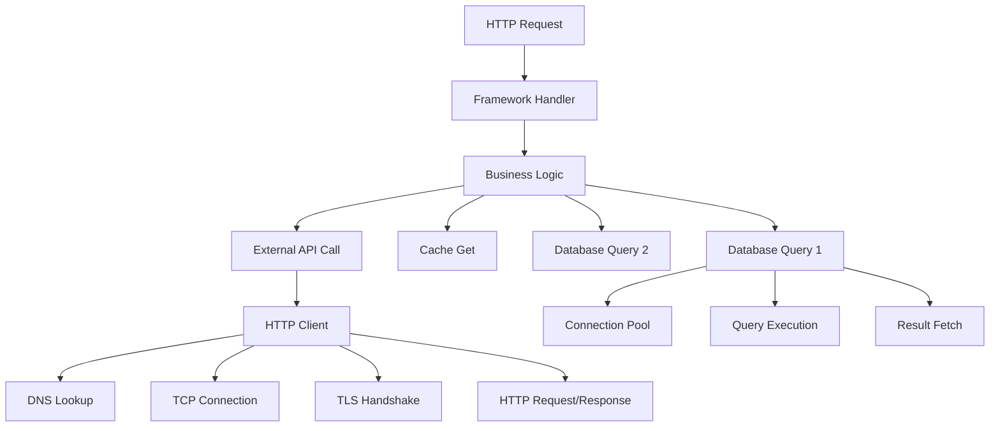

# How to Reduce Telemetry Data Volume with Span Suppression Strategies

Author: [nawazdhandala](https://www.github.com/nawazdhandala)

Tags: OpenTelemetry, Tracing, Performance, Cost Optimization, Span Suppression

Description: Master span suppression techniques in OpenTelemetry to reduce trace volume by 50-70%. Learn how to eliminate noisy spans while preserving critical debugging information.

Distributed traces can quickly become overwhelming. A single user request might generate hundreds of spans as it traverses microservices, databases, caches, and external APIs. Many of these spans provide minimal value while consuming significant storage and processing resources.

Span suppression is the practice of intelligently preventing certain spans from being created or exported. Unlike sampling, which drops entire traces, span suppression removes individual spans within a trace, keeping the critical path visible while eliminating noise.

This guide demonstrates practical span suppression strategies that can reduce telemetry volume by 50-70% without losing debugging capability.

## Understanding Span Proliferation

A typical microservice request generates spans at multiple levels:


```mermaid
graph TD
    A[HTTP Request] --> B[Framework Handler]
    B --> C[Business Logic]
    C --> D[Database Query 1]
    C --> E[Cache Get]
    C --> F[Database Query 2]
    C --> G[External API Call]
    G --> H[HTTP Client]
    H --> I[DNS Lookup]
    H --> J[TCP Connection]
    H --> K[TLS Handshake]
    H --> L[HTTP Request/Response]
    D --> M[Connection Pool]
    D --> N[Query Execution]
    D --> O[Result Fetch]
```

This single request created 15 spans, but only 5-6 are useful for debugging. The rest add noise and cost.

## Strategy 1: Suppress Infrastructure Spans

Low-level infrastructure spans (DNS lookups, connection pooling, TLS handshakes) rarely help with debugging. Suppress them at the SDK level:

```python
# Python SDK configuration to suppress infrastructure spans

from opentelemetry import trace
from opentelemetry.sdk.trace import TracerProvider
from opentelemetry.sdk.trace.export import BatchSpanProcessor, SpanExporter, SpanExportResult
from opentelemetry.exporter.otlp.proto.grpc.trace_exporter import OTLPSpanExporter

class FilteringSpanExporter(SpanExporter):
    """
    Span exporter wrapper that suppresses low-value infrastructure spans.
    """

    # Define span names to suppress
    SUPPRESSED_SPAN_PATTERNS = [
        'dns',
        'connection.pool',
        'tls.handshake',
        'socket.connect',
        'tcp.connect',
        'ssl.handshake',
        'thread.pool',
    ]

    def __init__(self, exporter):
        self.exporter = exporter

    def _should_export(self, span):
        span_name = span.name.lower()
        for pattern in self.SUPPRESSED_SPAN_PATTERNS:
            if pattern in span_name:
                return False
        return True

    def export(self, spans):
        filtered_spans = [span for span in spans if self._should_export(span)]
        if not filtered_spans:
            return SpanExportResult.SUCCESS
        return self.exporter.export(filtered_spans)

    def shutdown(self):
        """Called on shutdown."""
        return self.exporter.shutdown()

    def force_flush(self, timeout_millis=30000):
        """Called on force flush."""
        return self.exporter.force_flush(timeout_millis)

# Initialize tracer provider with suppressor
provider = TracerProvider()

# Wrap the OTLP exporter so suppressed spans never leave the SDK
provider.add_span_processor(
    BatchSpanProcessor(FilteringSpanExporter(OTLPSpanExporter()))
)

trace.set_tracer_provider(provider)
```

This exporter wrapper filters spans before they are exported.

## Strategy 2: Suppress by Span Duration

Very short spans (under 1ms) often represent trivial operations. Suppress them to reduce noise:

```go
// Go SDK span suppressor based on duration
package main

import (
    "context"
    "time"

    "go.opentelemetry.io/otel/exporters/otlp/otlptrace/otlptracegrpc"
    sdktrace "go.opentelemetry.io/otel/sdk/trace"
)

// DurationBasedSuppressor drops spans shorter than threshold
type DurationBasedSuppressor struct {
    minDuration time.Duration
    next        sdktrace.SpanProcessor
}

func NewDurationBasedSuppressor(minDuration time.Duration, next sdktrace.SpanProcessor) *DurationBasedSuppressor {
    return &DurationBasedSuppressor{
        minDuration: minDuration,
        next:        next,
    }
}

func (d *DurationBasedSuppressor) OnStart(ctx context.Context, span sdktrace.ReadWriteSpan) {
    // Pass through to next processor
    d.next.OnStart(ctx, span)
}

func (d *DurationBasedSuppressor) OnEnd(span sdktrace.ReadOnlySpan) {
    // Calculate span duration
    duration := span.EndTime().Sub(span.StartTime())

    // Only process spans longer than threshold
    if duration >= d.minDuration {
        d.next.OnEnd(span)
    }
    // Spans shorter than threshold are silently dropped
}

func (d *DurationBasedSuppressor) Shutdown(ctx context.Context) error {
    return d.next.Shutdown(ctx)
}

func (d *DurationBasedSuppressor) ForceFlush(ctx context.Context) error {
    return d.next.ForceFlush(ctx)
}

// Usage in tracer provider initialization
func initTracerProvider() *sdktrace.TracerProvider {
    exporter, _ := otlptracegrpc.New(context.Background())
    batcher := sdktrace.NewBatchSpanProcessor(exporter)

    // Wrap batcher with duration suppressor
    // Drop spans shorter than 1ms
    suppressor := NewDurationBasedSuppressor(1*time.Millisecond, batcher)

    return sdktrace.NewTracerProvider(
        sdktrace.WithSpanProcessor(suppressor),
    )
}
```

This approach eliminates fast cache hits, quick database queries, and other trivial operations from traces.

## Strategy 3: Collector-Level Span Filtering

The OpenTelemetry Collector can filter spans based on attributes, allowing centralized control:

```yaml
# Collector configuration for span-level filtering
receivers:
  otlp:
    protocols:
      grpc:
        endpoint: 0.0.0.0:4317

processors:
  # Filter processor for span suppression
  filter/suppress_spans:
    error_mode: ignore
    trace_conditions:
      # Suppress health check spans
      - 'span.attributes["http.route"] == "/health"'
      - 'span.attributes["http.route"] == "/ready"'

      # Suppress internal instrumentation scopes
      - 'IsMatch(scope.name, ".*internal.*")'

      # Suppress database connection pool operations
      - 'IsMatch(span.name, ".*connection.pool.*")'

      # Suppress very fast operations (under 1ms), but keep errors
      - '(span.end_time - span.start_time) < Duration("1ms") and span.status.code != STATUS_CODE_ERROR'

      # Suppress specific span kinds (internal only)
      - 'span.kind == SPAN_KIND_INTERNAL and span.attributes["custom.important"] == nil'

  # Transform processor to remove noisy attributes
  transform/clean_spans:
    error_mode: ignore
    trace_statements:
      # Remove verbose attributes that inflate span size
      - delete_key(span.attributes, "http.request.header.user-agent")
      - delete_key(span.attributes, "http.request.header.cookie")
      - delete_key(span.attributes, "http.response.body")

      # Truncate long string attributes
      - set(span.attributes["http.url"], Substring(span.attributes["http.url"], 0, 256)) where Len(span.attributes["http.url"]) > 256

  batch:
    timeout: 10s
    send_batch_size: 1024

exporters:
  otlp:
    endpoint: backend:4317

service:
  pipelines:
    traces:
      receivers: [otlp]
      processors: [filter/suppress_spans, transform/clean_spans, batch]
      exporters: [otlp]
```

Collector-level filtering allows you to adjust suppression rules without redeploying applications.

## Strategy 4: Intelligent Child Span Suppression

Suppress child spans that duplicate parent span information:

```java
// Java SDK span suppressor for redundant child spans
import io.opentelemetry.api.common.AttributeKey;
import io.opentelemetry.context.Context;
import io.opentelemetry.sdk.common.CompletableResultCode;
import io.opentelemetry.sdk.trace.ReadableSpan;
import io.opentelemetry.sdk.trace.ReadWriteSpan;
import io.opentelemetry.sdk.trace.SpanProcessor;

import java.util.Set;
import java.util.concurrent.ConcurrentHashMap;
import java.util.concurrent.ConcurrentMap;

public class RedundantChildSpanSuppressor implements SpanProcessor {
    private static final AttributeKey<String> OPERATION =
        AttributeKey.stringKey("operation");

    private final SpanProcessor next;
    private final ConcurrentMap<String, String> activeSpanNames =
        new ConcurrentHashMap<>();
    private final ConcurrentMap<String, String> activeOperations =
        new ConcurrentHashMap<>();
    private final Set<String> suppressedSpanIds =
        ConcurrentHashMap.newKeySet();

    public RedundantChildSpanSuppressor(SpanProcessor next) {
        this.next = next;
    }

    @Override
    public void onStart(Context parentContext, ReadWriteSpan span) {
        String spanId = span.getSpanContext().getSpanId();
        String parentSpanId = span.getParentSpanContext().getSpanId();
        String spanName = span.getName();
        String parentName = activeSpanNames.get(parentSpanId);

        activeSpanNames.put(spanId, spanName);

        String operation = span.getAttribute(OPERATION);
        if (operation != null) {
            activeOperations.put(spanId, operation);
        }

        if (parentName != null) {
            // Suppress if child span name is very similar to parent
            // e.g., parent: "HTTP GET /api/users", child: "GET /api/users"
            if (isRedundantChild(spanName, parentName)) {
                suppressedSpanIds.add(spanId);
            }

            // Suppress if child span has same operation as parent
            String parentOperation = activeOperations.get(parentSpanId);
            if (operation != null && operation.equals(parentOperation)) {
                suppressedSpanIds.add(spanId);
            }
        }

        next.onStart(parentContext, span);
    }

    @Override
    public boolean isStartRequired() {
        return true;
    }

    @Override
    public void onEnd(ReadableSpan span) {
        String spanId = span.getSpanContext().getSpanId();
        activeSpanNames.remove(spanId);
        activeOperations.remove(spanId);

        if (suppressedSpanIds.remove(spanId)) {
            // Do not forward this span to the wrapped processor.
            return;
        }

        next.onEnd(span);
    }

    @Override
    public boolean isEndRequired() {
        return true;
    }

    @Override
    public CompletableResultCode shutdown() {
        return next.shutdown();
    }

    @Override
    public CompletableResultCode forceFlush() {
        return next.forceFlush();
    }

    private boolean isRedundantChild(String childName, String parentName) {
        // Implement similarity logic
        return childName.contains(parentName) || parentName.contains(childName);
    }
}
```

This eliminates redundant child spans that don't add new information.

## Strategy 5: Suppress by Service Tier

Not all services need the same level of instrumentation. Suppress more aggressively for lower-tier services:

```yaml
# Collector configuration with tier-based suppression
receivers:
  otlp:
    protocols:
      grpc:
        endpoint: 0.0.0.0:4317

processors:
  # Critical tier: minimal suppression (keep most spans)
  filter/critical:
    error_mode: ignore
    trace_conditions:
      # Drop spans from other tiers
      - 'resource.attributes["service.tier"] != "critical"'
      # Only drop health checks
      - 'IsMatch(span.attributes["http.route"], "^/(health|ready)$")'

  # Standard tier: moderate suppression
  filter/standard:
    error_mode: ignore
    trace_conditions:
      # Drop spans from other tiers
      - 'resource.attributes["service.tier"] != "standard"'
      # Drop health checks and internal operations
      - 'IsMatch(span.attributes["http.route"], "^/(health|ready)$")'
      - 'span.kind == SPAN_KIND_INTERNAL and (span.end_time - span.start_time) < Duration("5ms")'

  # Background tier: aggressive suppression (keep only errors and slow ops)
  filter/background:
    error_mode: ignore
    trace_conditions:
      # Drop spans from other tiers
      - 'resource.attributes["service.tier"] != "background"'
      # Only keep errors and slow operations
      - 'span.status.code != STATUS_CODE_ERROR and (span.end_time - span.start_time) < Duration("100ms")'

  batch:
    timeout: 10s
    send_batch_size: 1024

exporters:
  otlp/critical:
    endpoint: backend:4317
  otlp/standard:
    endpoint: backend:4317
  otlp/background:
    endpoint: backend:4317

service:
  pipelines:
    traces/critical:
      receivers: [otlp]
      processors: [filter/critical, batch]
      exporters: [otlp/critical]

    traces/standard:
      receivers: [otlp]
      processors: [filter/standard, batch]
      exporters: [otlp/standard]

    traces/background:
      receivers: [otlp]
      processors: [filter/background, batch]
      exporters: [otlp/background]
```

This tiered approach ensures critical services maintain full instrumentation while background jobs are minimally instrumented.

## Strategy 6: Dynamic Span Suppression

Adjust suppression dynamically based on system load or cost budgets:

```python
# Python implementation of dynamic span suppression
import os
import time
from opentelemetry.sdk.trace.export import SpanExporter, SpanExportResult

class DynamicSpanSuppressor(SpanExporter):
    """
    Adjusts suppression aggressiveness based on current metrics.
    """

    def __init__(self, exporter, base_suppression_rate=0.1):
        self.exporter = exporter
        self.base_suppression_rate = base_suppression_rate
        self.current_rate = base_suppression_rate
        self.last_adjustment = time.time()
        self.adjustment_interval = 60  # Adjust every 60 seconds

    def update_suppression_rate(self):
        """
        Adjust suppression based on external factors.
        Could integrate with cost monitoring, system load, etc.
        """
        # Check if it's time to adjust
        if time.time() - self.last_adjustment < self.adjustment_interval:
            return

        # Get current span rate from environment or metrics
        current_span_rate = float(os.getenv('CURRENT_SPAN_RATE', '1000'))
        target_span_rate = float(os.getenv('TARGET_SPAN_RATE', '500'))

        # Calculate required suppression
        if current_span_rate > target_span_rate:
            # Increase suppression
            self.current_rate = min(0.9, self.current_rate + 0.1)
        elif current_span_rate < target_span_rate * 0.8:
            # Decrease suppression
            self.current_rate = max(0.0, self.current_rate - 0.1)

        self.last_adjustment = time.time()

    def _should_export(self, span):
        """Check if span should be suppressed."""
        self.update_suppression_rate()

        # Use hash of span ID for deterministic suppression
        suppress = (span.context.span_id % 100) < (self.current_rate * 100)
        return not suppress

    def export(self, spans):
        """Export only spans that pass the current suppression rate."""
        filtered_spans = [span for span in spans if self._should_export(span)]
        if not filtered_spans:
            return SpanExportResult.SUCCESS
        return self.exporter.export(filtered_spans)

    def shutdown(self):
        """Called on shutdown."""
        return self.exporter.shutdown()

    def force_flush(self, timeout_millis=30000):
        """Called on force flush."""
        return self.exporter.force_flush(timeout_millis)
```

This allows suppression to adapt to changing conditions without redeployment.

## Strategy 7: Suppress Repeated Spans

Suppress spans that represent repeated operations, keeping only a sample:

```yaml
# Collector configuration for repeated span suppression
receivers:
  otlp:
    protocols:
      grpc:
        endpoint: 0.0.0.0:4317

processors:
  # Group repeated spans and keep only samples
  groupbytrace:
    # Wait for complete traces
    wait_duration: 10s
    num_traces: 100000

  # Custom processor logic using transform processor
  transform/suppress_repeated:
    error_mode: ignore
    trace_statements:
      # Create a deduplication key from span attributes
      - set(span.attributes["dedup_key"], Concat([
          span.name,
          span.attributes["http.method"],
          span.attributes["http.route"],
          span.attributes["db.operation"]
        ], "|"))

      # Hash the key and keep 10% of repeated spans
      - set(span.attributes["keep"], XXH3(span.attributes["dedup_key"]) % 10 == 0)

  filter/drop_marked:
    error_mode: ignore
    trace_conditions:
      - 'span.attributes["keep"] == false'

  batch:
    timeout: 10s
    send_batch_size: 1024

exporters:
  otlp:
    endpoint: backend:4317

service:
  pipelines:
    traces:
      receivers: [otlp]
      processors: [groupbytrace, transform/suppress_repeated, filter/drop_marked, batch]
      exporters: [otlp]
```

This is particularly useful for loops or batch operations that create many identical spans.

## Real-World Case Study: Payment Processing Platform

A payment processing platform reduced span volume by 68% using span suppression:

**Before Suppression**:
- 500M spans/day
- Average 45 spans per transaction
- 80% of spans were infrastructure operations
- $18,000/month tracing costs

**After Suppression**:
- 160M spans/day (68% reduction)
- Average 14 spans per transaction
- Preserved all critical business logic spans
- $5,800/month tracing costs (68% savings)

Their configuration:

```yaml
# Production span suppression configuration
receivers:
  otlp:
    protocols:
      grpc:
        endpoint: 0.0.0.0:4317

processors:
  # Step 1: Remove infrastructure spans
  filter/infrastructure:
    error_mode: ignore
    trace_conditions:
      - 'IsMatch(span.name, ".*(dns|socket|pool|ssl|tls).*")'
      - 'span.kind == SPAN_KIND_INTERNAL and (span.end_time - span.start_time) < Duration("1ms")'

  # Step 2: Remove redundant HTTP client spans
  filter/http_redundant:
    error_mode: ignore
    trace_conditions:
      # Keep only the parent HTTP span, drop child socket/DNS spans
      - 'IsMatch(span.name, ".*http.client.*") and span.attributes["http.url"] == nil'

  # Step 3: Suppress repeated database queries
  transform/dedup_db:
    error_mode: ignore
    trace_statements:
      # Create query fingerprint (remove parameters)
      - set(span.attributes["query.fingerprint"], span.attributes["db.statement"]) where span.attributes["db.system"] != nil
      - replace_pattern(span.attributes["query.fingerprint"], "[0-9]+", "?") where span.attributes["db.system"] != nil

      # Keep 10% of identical queries
      - set(span.attributes["keep"], XXH3(span.attributes["query.fingerprint"]) % 10 == 0) where span.attributes["db.system"] != nil

  filter/drop_deduped:
    error_mode: ignore
    trace_conditions:
      - 'span.attributes["keep"] == false and span.attributes["db.system"] != nil'

  # Step 4: Remove overly detailed spans
  transform/simplify:
    error_mode: ignore
    trace_statements:
      # Remove verbose attributes
      - delete_key(span.attributes, "http.request.body")
      - delete_key(span.attributes, "http.response.body")
      - delete_key(span.attributes, "thread.id")
      - delete_key(span.attributes, "thread.name")

  batch:
    timeout: 10s
    send_batch_size: 2048

exporters:
  otlp:
    endpoint: backend:4317

service:
  pipelines:
    traces:
      receivers: [otlp]
      processors: [
        filter/infrastructure,
        filter/http_redundant,
        transform/dedup_db,
        filter/drop_deduped,
        transform/simplify,
        batch
      ]
      exporters: [otlp]
```

## Monitoring Span Suppression

Track your suppression effectiveness:

```yaml
# Add metrics to monitor suppression
receivers:
  otlp:
    protocols:
      grpc:

connectors:
  # Count spans before suppression
  span_metrics/before: {}

  # Count spans after suppression
  span_metrics/after: {}

processors:
  # Your suppression processors here
  filter/suppress:
    error_mode: ignore
    trace_conditions:
      - 'span.kind == SPAN_KIND_INTERNAL and (span.end_time - span.start_time) < Duration("1ms")'

  batch:

exporters:
  otlp:
    endpoint: backend:4317

  prometheus:
    endpoint: 0.0.0.0:8889

service:
  pipelines:
    traces/before:
      receivers: [otlp]
      exporters: [span_metrics/before]

    traces/after:
      receivers: [otlp]
      processors: [filter/suppress, batch]
      exporters: [span_metrics/after, otlp]

    metrics:
      receivers: [span_metrics/before, span_metrics/after]
      exporters: [prometheus]

# Calculate metrics
# suppression_rate = (spans_before - spans_after) / spans_before
# cost_savings = suppression_rate * cost_per_span * spans_before
```

## Best Practices

1. **Preserve trace structure** - Don't drop spans that break trace continuity
2. **Always keep error spans** - Never suppress spans with errors
3. **Test in non-production first** - Validate you're not losing critical debugging info
4. **Document suppression rules** - Explain why each rule exists
5. **Monitor suppression rates** - Track what percentage of spans are suppressed
6. **Keep parent spans** - Suppress children, not parents
7. **Use deterministic suppression** - Hash-based suppression maintains consistency

## Common Pitfalls

1. **Breaking trace continuity** - Suppressing parent spans while keeping children
2. **Over-suppressing slow operations** - These are often the most valuable
3. **Suppressing based on success** - Errors can happen in any span
4. **Not considering sampling** - Span suppression works best with tail sampling
5. **Forgetting about logs/metrics** - Suppress those too for consistency

## Related Resources

For more telemetry optimization strategies:
- https://oneuptime.com/blog/post/2026-02-06-cut-observability-costs-opentelemetry-filtering-sampling/view
- https://oneuptime.com/blog/post/2026-02-06-handle-high-cardinality-metrics-opentelemetry/view
- https://oneuptime.com/blog/post/2026-02-06-probabilistic-sampling-opentelemetry-cost-control/view

Span suppression is a powerful technique for reducing telemetry costs while maintaining observability. By intelligently removing noisy spans, you can cut trace volume by 50-70% without losing the ability to debug issues. The key is understanding which spans provide value and which are just noise.
