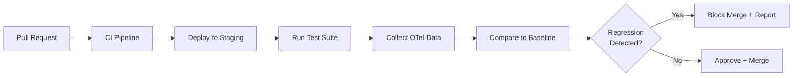

# How to Use OpenTelemetry for Regression Detection in CI/CD

Author: [nawazdhandala](https://www.github.com/nawazdhandala)

Tags: OpenTelemetry, CI/CD, Regression Detection, Performance Testing, Deployment, Tracing, Metrics, DevOps

Description: Learn how to integrate OpenTelemetry into your CI/CD pipeline to automatically detect performance regressions, latency increases, and error rate changes before they reach production.

---

Catching performance regressions after they reach production is expensive. Users complain, on-call engineers get paged, and the team scrambles to figure out which deployment caused the problem. Catching them in CI/CD is much better, but it requires performance testing with enough observability to detect subtle changes.

OpenTelemetry gives you the instrumentation layer to make this work. When your CI/CD pipeline runs tests against an instrumented staging environment, you can capture detailed traces and metrics, compare them against baselines from the previous release, and automatically flag regressions before the code ships. This guide shows you how to build that pipeline.

---

## Pipeline Architecture



The key addition to a standard CI/CD pipeline is the comparison step. After running tests, you collect OpenTelemetry data from the staging environment and compare it against the established baseline for the same tests.

---

## Instrumenting Your Test Suite

Your integration tests need to generate meaningful OpenTelemetry data. Tag test runs with metadata so you can identify and compare them.

```python
# test_instrumentation.py
import os
import time
from opentelemetry import trace, metrics
from opentelemetry.sdk.trace import TracerProvider
from opentelemetry.sdk.trace.export import BatchSpanProcessor
from opentelemetry.exporter.otlp.proto.http.trace_exporter import OTLPSpanExporter
from opentelemetry.sdk.metrics import MeterProvider
from opentelemetry.sdk.metrics.export import PeriodicExportingMetricReader
from opentelemetry.exporter.otlp.proto.http.metric_exporter import OTLPMetricExporter
from opentelemetry.sdk.resources import Resource, SERVICE_NAME

def setup_test_telemetry():
    """Configure OpenTelemetry for CI/CD test runs."""
    # Include CI metadata in the resource attributes
    resource = Resource.create({
        SERVICE_NAME: "regression-test",
        "ci.pipeline_id": os.environ.get("CI_PIPELINE_ID", "local"),
        "ci.commit_sha": os.environ.get("CI_COMMIT_SHA", "unknown"),
        "ci.branch": os.environ.get("CI_BRANCH", "unknown"),
        "ci.build_number": os.environ.get("CI_BUILD_NUMBER", "0"),
    })

    # Set up tracing
    trace_provider = TracerProvider(resource=resource)
    trace_provider.add_span_processor(
        BatchSpanProcessor(
            OTLPSpanExporter(endpoint="https://otel.oneuptime.com/v1/traces")
        )
    )
    trace.set_tracer_provider(trace_provider)

    # Set up metrics
    metric_reader = PeriodicExportingMetricReader(
        OTLPMetricExporter(endpoint="https://otel.oneuptime.com/v1/metrics"),
        export_interval_millis=5000,
    )
    metric_provider = MeterProvider(resource=resource, metric_readers=[metric_reader])
    metrics.set_meter_provider(metric_provider)

    return trace.get_tracer("regression.test"), metrics.get_meter("regression.test")

tracer, meter = setup_test_telemetry()

# Track test execution metrics
test_duration = meter.create_histogram(
    name="ci.test.duration",
    description="Duration of individual test cases",
    unit="ms",
)

test_api_latency = meter.create_histogram(
    name="ci.test.api_latency",
    description="API response latency during tests",
    unit="ms",
)

def timed_api_call(endpoint: str, method: str = "GET", **kwargs):
    """Make an API call with timing and tracing for regression detection."""
    with tracer.start_as_current_span(f"test.api.{method}.{endpoint}") as span:
        span.set_attribute("http.method", method)
        span.set_attribute("http.url", endpoint)
        span.set_attribute("ci.test_run", True)

        start = time.perf_counter()
        response = make_request(method, endpoint, **kwargs)
        elapsed_ms = (time.perf_counter() - start) * 1000

        span.set_attribute("http.status_code", response.status_code)
        span.set_attribute("http.response_time_ms", elapsed_ms)

        # Record for metric aggregation
        test_api_latency.record(elapsed_ms, {
            "http.route": endpoint,
            "http.method": method,
        })

        return response, elapsed_ms
```

The CI metadata (pipeline ID, commit SHA, branch name) in the resource attributes is essential. It lets you query telemetry data for a specific build and compare it against previous builds.

---

## Collecting Test Results as Structured Data

After your test suite runs, collect the performance data into a structured format for comparison.

```python
# test_collector.py
from dataclasses import dataclass, field
from typing import List, Dict
import numpy as np

@dataclass
class EndpointMetrics:
    """Performance metrics for a single API endpoint during a test run."""
    endpoint: str
    method: str
    latencies_ms: List[float] = field(default_factory=list)
    status_codes: List[int] = field(default_factory=list)

    @property
    def p50(self) -> float:
        return float(np.percentile(self.latencies_ms, 50)) if self.latencies_ms else 0

    @property
    def p95(self) -> float:
        return float(np.percentile(self.latencies_ms, 95)) if self.latencies_ms else 0

    @property
    def p99(self) -> float:
        return float(np.percentile(self.latencies_ms, 99)) if self.latencies_ms else 0

    @property
    def error_rate(self) -> float:
        if not self.status_codes:
            return 0.0
        errors = sum(1 for code in self.status_codes if code >= 500)
        return errors / len(self.status_codes)

@dataclass
class TestRunResults:
    """Aggregated results from a complete test run."""
    commit_sha: str
    branch: str
    build_number: str
    endpoints: Dict[str, EndpointMetrics] = field(default_factory=dict)
    total_tests: int = 0
    failed_tests: int = 0
    total_duration_ms: float = 0

    def add_measurement(self, endpoint: str, method: str, latency_ms: float, status_code: int):
        """Add a single API measurement to the results."""
        key = f"{method}:{endpoint}"
        if key not in self.endpoints:
            self.endpoints[key] = EndpointMetrics(endpoint=endpoint, method=method)
        self.endpoints[key].latencies_ms.append(latency_ms)
        self.endpoints[key].status_codes.append(status_code)
```

This data structure captures per-endpoint latency distributions and error rates, which are the primary signals for regression detection.

---

## The Regression Detector

The detector compares current test results against a baseline and flags statistically significant regressions.

```python
# regression_detector.py
from dataclasses import dataclass
from typing import List, Optional

@dataclass
class Regression:
    """A detected performance regression."""
    endpoint: str
    metric: str          # "p50", "p95", "p99", "error_rate"
    baseline_value: float
    current_value: float
    change_percent: float
    severity: str        # "warning" or "critical"

class RegressionDetector:
    """
    Compares test run results against a baseline to detect
    performance regressions.
    """

    def __init__(
        self,
        p50_warning_threshold: float = 20.0,    # 20% increase triggers warning
        p95_warning_threshold: float = 30.0,     # 30% increase triggers warning
        p95_critical_threshold: float = 50.0,    # 50% increase triggers critical
        error_rate_threshold: float = 0.5,       # 0.5% absolute increase in error rate
    ):
        self.p50_warning = p50_warning_threshold
        self.p95_warning = p95_warning_threshold
        self.p95_critical = p95_critical_threshold
        self.error_rate_threshold = error_rate_threshold

    def detect(
        self,
        current: TestRunResults,
        baseline: TestRunResults,
    ) -> List[Regression]:
        """Compare current results against baseline and return regressions."""
        regressions = []

        for key, current_metrics in current.endpoints.items():
            baseline_metrics = baseline.endpoints.get(key)
            if not baseline_metrics:
                continue  # New endpoint, no baseline to compare

            # Check P50 latency
            if baseline_metrics.p50 > 0:
                p50_change = (
                    (current_metrics.p50 - baseline_metrics.p50) / baseline_metrics.p50 * 100
                )
                if p50_change > self.p50_warning:
                    regressions.append(Regression(
                        endpoint=key,
                        metric="p50",
                        baseline_value=baseline_metrics.p50,
                        current_value=current_metrics.p50,
                        change_percent=p50_change,
                        severity="warning",
                    ))

            # Check P95 latency (more sensitive to tail latency issues)
            if baseline_metrics.p95 > 0:
                p95_change = (
                    (current_metrics.p95 - baseline_metrics.p95) / baseline_metrics.p95 * 100
                )
                if p95_change > self.p95_critical:
                    regressions.append(Regression(
                        endpoint=key,
                        metric="p95",
                        baseline_value=baseline_metrics.p95,
                        current_value=current_metrics.p95,
                        change_percent=p95_change,
                        severity="critical",
                    ))
                elif p95_change > self.p95_warning:
                    regressions.append(Regression(
                        endpoint=key,
                        metric="p95",
                        baseline_value=baseline_metrics.p95,
                        current_value=current_metrics.p95,
                        change_percent=p95_change,
                        severity="warning",
                    ))

            # Check error rate
            error_rate_change = current_metrics.error_rate - baseline_metrics.error_rate
            if error_rate_change > self.error_rate_threshold / 100:
                regressions.append(Regression(
                    endpoint=key,
                    metric="error_rate",
                    baseline_value=baseline_metrics.error_rate * 100,
                    current_value=current_metrics.error_rate * 100,
                    change_percent=error_rate_change * 100,
                    severity="critical",
                ))

        return regressions
```

The thresholds are intentionally different for P50 vs P95. Median latency is more stable, so even a 20% increase is noteworthy. P95 latency is naturally more variable, so you need a wider threshold to avoid false positives.

---

## Integrating with CI/CD

Here is how to wire the regression detector into a GitHub Actions workflow.

```yaml
# .github/workflows/regression-check.yml
name: Performance Regression Check

on:
  pull_request:
    branches: [main]

jobs:
  regression-check:
    runs-on: ubuntu-latest
    steps:
      - uses: actions/checkout@v4

      - name: Deploy to staging
        run: |
          # Deploy the PR branch to the staging environment
          ./scripts/deploy-staging.sh

      - name: Run performance tests
        env:
          CI_PIPELINE_ID: ${{ github.run_id }}
          CI_COMMIT_SHA: ${{ github.sha }}
          CI_BRANCH: ${{ github.head_ref }}
          CI_BUILD_NUMBER: ${{ github.run_number }}
          OTEL_ENDPOINT: https://otel.oneuptime.com
        run: |
          pip install -r requirements-test.txt
          python -m pytest tests/performance/ \
            --tb=short \
            -v \
            --json-report \
            --json-report-file=results.json

      - name: Check for regressions
        run: |
          # Compare current results against the baseline
          python scripts/check_regression.py \
            --current results.json \
            --baseline-commit ${{ github.base_ref }} \
            --threshold-p95-warning 30 \
            --threshold-p95-critical 50

      - name: Post regression report
        if: failure()
        uses: actions/github-script@v7
        with:
          script: |
            const fs = require('fs');
            const report = fs.readFileSync('regression-report.md', 'utf8');
            github.rest.issues.createComment({
              issue_number: context.issue.number,
              owner: context.repo.owner,
              repo: context.repo.repo,
              body: report
            });
```

The regression check step compares the current test results against the baseline from the main branch. If regressions are detected, the workflow fails and posts a detailed report as a PR comment.

---

## Generating the Regression Report

```python
# report_generator.py
def generate_regression_report(regressions: List[Regression], commit_sha: str) -> str:
    """Generate a markdown regression report for PR comments."""
    if not regressions:
        return "## Performance Check: PASSED\n\nNo regressions detected."

    lines = [
        "## Performance Check: FAILED",
        "",
        f"Commit: `{commit_sha}`",
        "",
        f"**{len(regressions)} regression(s) detected:**",
        "",
        "| Endpoint | Metric | Baseline | Current | Change | Severity |",
        "|----------|--------|----------|---------|--------|----------|",
    ]

    for r in sorted(regressions, key=lambda x: x.severity == "critical", reverse=True):
        lines.append(
            f"| `{r.endpoint}` | {r.metric} | "
            f"{r.baseline_value:.1f} | {r.current_value:.1f} | "
            f"+{r.change_percent:.1f}% | {r.severity.upper()} |"
        )

    lines.extend([
        "",
        "### What to do",
        "- Review the flagged endpoints for recent code changes",
        "- Check if the regression is expected (e.g., added validation)",
        "- If unexpected, profile the affected code paths",
        "- If intentional, update the baseline with `./scripts/update-baseline.sh`",
    ])

    return "\n".join(lines)
```

---

## Maintaining Baselines

Baselines need to be updated whenever a legitimate performance change is made. Store them alongside your test fixtures.

```python
# baseline_manager.py
import json
from pathlib import Path

class BaselineManager:
    """Manages performance baselines for regression detection."""

    def __init__(self, baseline_dir: str = "tests/baselines"):
        self.baseline_dir = Path(baseline_dir)
        self.baseline_dir.mkdir(parents=True, exist_ok=True)

    def save_baseline(self, results: TestRunResults):
        """Save current test results as the new baseline."""
        data = {
            "commit_sha": results.commit_sha,
            "endpoints": {
                key: {
                    "p50": metrics.p50,
                    "p95": metrics.p95,
                    "p99": metrics.p99,
                    "error_rate": metrics.error_rate,
                    "sample_count": len(metrics.latencies_ms),
                }
                for key, metrics in results.endpoints.items()
            },
        }

        path = self.baseline_dir / "performance_baseline.json"
        with open(path, "w") as f:
            json.dump(data, f, indent=2)

    def load_baseline(self) -> dict:
        """Load the current performance baseline."""
        path = self.baseline_dir / "performance_baseline.json"
        if not path.exists():
            return {}
        with open(path) as f:
            return json.load(f)
```

---

## Summary

Integrating OpenTelemetry into your CI/CD pipeline for regression detection catches performance problems before they reach production. The approach is straightforward: instrument your test suite to generate OpenTelemetry data, collect structured results, compare against baselines, and fail the build when regressions are detected. The hardest part is setting appropriate thresholds. Start conservative (larger thresholds, fewer false positives) and tighten them as you gain confidence. Over time, this becomes one of the most valuable quality gates in your deployment pipeline.
