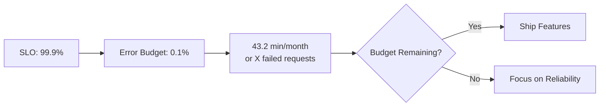

# How to Track Reliability Debt and Prioritize Fixes Using OpenTelemetry Error Budget Consumption

Author: [nawazdhandala](https://www.github.com/nawazdhandala)

Tags: OpenTelemetry, Error Budgets, SRE, Reliability

Description: Use OpenTelemetry metrics to track error budget consumption, quantify reliability debt, and make data-driven decisions about fix prioritization.

Error budgets are one of the most practical tools in the SRE toolkit. They quantify how much unreliability your service can tolerate before it violates its SLO. But many teams track error budgets as a single percentage without connecting the consumption to specific causes. When your error budget is 40% spent halfway through the month, you need to know which components are responsible and which fixes will recover the most budget.

OpenTelemetry gives you the instrumentation layer to attribute error budget consumption to specific services, endpoints, and failure modes. This post shows how to build that attribution system.

## Error Budget Fundamentals

If your SLO is 99.9% availability over a 30-day window, your error budget is 0.1% of total requests (or total minutes, depending on your SLI type). That translates to roughly 43 minutes of downtime or a specific number of failed requests.



## Instrumenting SLI Metrics with OpenTelemetry

The foundation is accurate SLI measurement. For a request-based SLO, you need total requests and good requests. For a time-based SLO, you need uptime probes.

```python
# sli_metrics.py - Track SLI data for error budget computation
from opentelemetry import metrics
from opentelemetry.sdk.metrics import MeterProvider
from opentelemetry.sdk.metrics.export import PeriodicExportingMetricReader
from opentelemetry.exporter.otlp.proto.grpc.metric_exporter import OTLPMetricExporter

exporter = OTLPMetricExporter(endpoint="http://otel-collector:4317", insecure=True)
reader = PeriodicExportingMetricReader(exporter, export_interval_millis=15000)
provider = MeterProvider(metric_readers=[reader])
metrics.set_meter_provider(provider)

meter = metrics.get_meter("error.budget.tracker", version="1.0.0")

# Total requests counter - the denominator of your SLI
total_requests = meter.create_counter(
    name="sli.requests.total",
    description="Total number of requests received",
    unit="1",
)

# Good requests counter - the numerator of your SLI
good_requests = meter.create_counter(
    name="sli.requests.good",
    description="Requests that met the SLO criteria",
    unit="1",
)

# Budget consumption tracker - records how much budget each bad event costs
budget_consumed = meter.create_counter(
    name="error_budget.consumed",
    description="Error budget consumed by bad events",
    unit="1",
)
```

## Attributing Budget Consumption to Root Causes

The critical step is tagging each bad event with attributes that identify the cause. This lets you aggregate consumption by service, endpoint, error type, and failure category.

```python
# budget_attribution.py - Tag budget consumption with root cause attributes
from enum import Enum

class FailureCategory(Enum):
    TIMEOUT = "timeout"
    SERVER_ERROR = "server_error"
    DEPENDENCY_FAILURE = "dependency_failure"
    RATE_LIMITED = "rate_limited"
    DATA_CORRUPTION = "data_corruption"

def record_request(service: str, endpoint: str, status_code: int,
                   latency_ms: float, slo_latency_threshold_ms: float):
    """Record a request and attribute any budget consumption."""
    attributes = {
        "service.name": service,
        "http.route": endpoint,
        "http.status_code": status_code,
    }

    total_requests.add(1, attributes=attributes)

    # Determine if this request was "good" per SLO criteria
    is_good = (200 <= status_code < 500) and (latency_ms <= slo_latency_threshold_ms)

    if is_good:
        good_requests.add(1, attributes=attributes)
    else:
        # Classify the failure
        if latency_ms > slo_latency_threshold_ms:
            category = FailureCategory.TIMEOUT.value
        elif 500 <= status_code < 600:
            category = FailureCategory.SERVER_ERROR.value
        else:
            category = FailureCategory.DEPENDENCY_FAILURE.value

        # Record budget consumption with cause attribution
        budget_consumed.add(1, attributes={
            **attributes,
            "failure.category": category,
            "failure.detail": f"status_{status_code}",
        })
```

## Computing Budget Consumption Rates

A snapshot of remaining budget is useful, but the consumption rate tells you whether you will exhaust the budget before the window ends. This is the burn rate concept from Google's SRE workbook.

```python
# burn_rate.py - Calculate error budget burn rates
from dataclasses import dataclass
from datetime import datetime, timedelta

@dataclass
class BurnRateResult:
    current_consumption_pct: float  # How much budget is used so far
    projected_consumption_pct: float  # Where you will be at window end
    burn_rate_multiplier: float  # 1.0 = on track, 2.0 = burning 2x too fast
    budget_exhaustion_time: datetime  # When budget hits zero at current rate
    top_consumers: list  # Ranked list of budget-consuming components

def compute_burn_rate(metrics_store, slo_target: float,
                      window_days: int = 30) -> BurnRateResult:
    """Compute burn rate from SLI metrics."""
    now = datetime.utcnow()
    window_start = now - timedelta(days=window_days)
    elapsed_fraction = min(1.0, (now - window_start).total_seconds()
                          / timedelta(days=window_days).total_seconds())

    # Query totals from the metrics store
    total = metrics_store.sum("sli.requests.total", window_start, now)
    good = metrics_store.sum("sli.requests.good", window_start, now)

    if total == 0:
        return None

    error_budget_total = (1 - slo_target) * total
    budget_consumed_count = total - good
    consumption_pct = (budget_consumed_count / error_budget_total) * 100

    # Burn rate: consumption rate vs expected rate
    expected_consumption_pct = elapsed_fraction * 100
    burn_rate = consumption_pct / expected_consumption_pct if expected_consumption_pct > 0 else 0

    # Project when budget exhausts
    if burn_rate > 0:
        remaining_pct = 100 - consumption_pct
        hours_to_exhaust = (remaining_pct / consumption_pct) * (elapsed_fraction * window_days * 24)
        exhaustion_time = now + timedelta(hours=hours_to_exhaust)
    else:
        exhaustion_time = None

    # Get top consumers by querying budget_consumed with group-by
    top_consumers = metrics_store.top_k(
        "error_budget.consumed", window_start, now,
        group_by=["service.name", "failure.category"],
        k=10
    )

    return BurnRateResult(
        current_consumption_pct=round(consumption_pct, 2),
        projected_consumption_pct=round(consumption_pct / elapsed_fraction, 2),
        burn_rate_multiplier=round(burn_rate, 2),
        budget_exhaustion_time=exhaustion_time,
        top_consumers=top_consumers,
    )
```

## Collector Configuration for Budget Metrics

Route SLI and budget metrics through the collector with resource detection to automatically enrich with deployment metadata.

```yaml
# otel-collector-config.yaml
receivers:
  otlp:
    protocols:
      grpc:
        endpoint: 0.0.0.0:4317

processors:
  batch:
    send_batch_size: 500
    timeout: 10s

  # Enrich with deployment info for better attribution
  resource:
    attributes:
      - key: deployment.environment
        from_attribute: DEPLOYMENT_ENV
        action: upsert
      - key: service.version
        from_attribute: SERVICE_VERSION
        action: upsert

exporters:
  otlp/backend:
    endpoint: "https://otel.oneuptime.com:4317"

service:
  pipelines:
    metrics:
      receivers: [otlp]
      processors: [resource, batch]
      exporters: [otlp/backend]
```

## Prioritizing Reliability Fixes

With attributed budget consumption data, prioritization becomes straightforward. Rank fixes by the amount of error budget they would recover.

For example, if your top consumers are:

| Failure Category | Service | Budget Consumed |
|---|---|---|
| timeout | payment-api | 35% |
| server_error | user-service | 22% |
| dependency_failure | search-api | 18% |

Then optimizing payment-api timeouts recovers the most budget. This replaces guesswork with data.

## Reliability Debt Register

Maintain a reliability debt register that maps known issues to their budget impact. Each entry should include the estimated budget recovery if fixed, the effort to fix, and the resulting priority score (recovery divided by effort).

This register, powered by real consumption data from OpenTelemetry, becomes the bridge between SRE concerns and product prioritization discussions. When a product manager asks why reliability work should take precedence, you can point to the burn rate and projected exhaustion date.

## Summary

Error budget tracking with OpenTelemetry boils down to three things: measuring SLIs accurately, attributing bad events to specific causes, and computing consumption rates that project future state. The attribution step is what most teams miss, and it is what transforms error budgets from a reporting metric into a prioritization tool.
