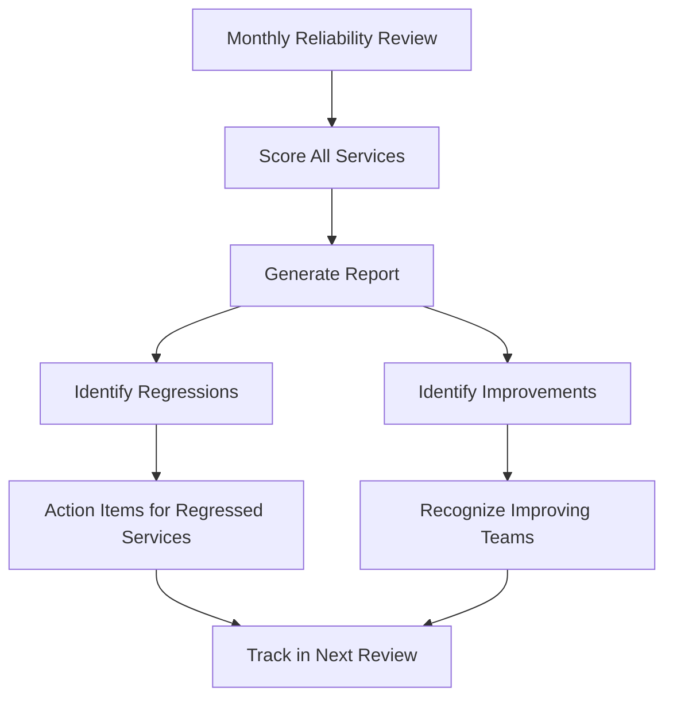

# How to Use OpenTelemetry Data to Drive Reliability Reviews and Service Maturity Assessments

Author: [nawazdhandala](https://www.github.com/nawazdhandala)

Tags: OpenTelemetry, Reliability Reviews, Service Maturity, SRE

Description: Build data-driven reliability reviews and service maturity scorecards powered by OpenTelemetry metrics, traces, and logs.

Reliability reviews are periodic assessments where engineering teams evaluate the health and operational maturity of their services. Without data, these reviews devolve into subjective discussions based on recency bias - whoever remembers the last outage dominates the conversation. OpenTelemetry provides the observability data needed to make these reviews objective, consistent, and actionable.

## Defining a Service Maturity Model

A maturity model defines levels that services progress through as they become more reliable. Each level has measurable criteria that can be evaluated using OpenTelemetry data.

```yaml
# service-maturity-model.yaml
levels:
  level_1_basic:
    name: "Basic"
    description: "Service exists with minimal observability"
    criteria:
      - metric: "otel.instrumentation.coverage"
        threshold: "> 0"
        description: "At least one OTel signal type is configured"
      - metric: "slo.defined"
        threshold: "true"
        description: "At least one SLO is defined"

  level_2_observable:
    name: "Observable"
    description: "Service has comprehensive instrumentation"
    criteria:
      - metric: "otel.trace.coverage_pct"
        threshold: "> 80"
        description: "More than 80% of endpoints have trace instrumentation"
      - metric: "otel.log.structured_pct"
        threshold: "> 90"
        description: "More than 90% of logs are structured with trace context"
      - metric: "otel.metric.custom_count"
        threshold: "> 5"
        description: "At least 5 custom business metrics defined"

  level_3_reliable:
    name: "Reliable"
    description: "Service consistently meets SLOs"
    criteria:
      - metric: "slo.compliance_30d"
        threshold: "> 0.99"
        description: "SLO met for 99%+ of the last 30 days"
      - metric: "incident.mttr_p50_minutes"
        threshold: "< 30"
        description: "Median MTTR under 30 minutes"
      - metric: "oncall.pages_per_week"
        threshold: "< 5"
        description: "Fewer than 5 pages per week"

  level_4_optimized:
    name: "Optimized"
    description: "Service has mature reliability practices"
    criteria:
      - metric: "error_budget.remaining_pct"
        threshold: "> 50"
        description: "More than 50% error budget remaining"
      - metric: "dora.change_failure_rate"
        threshold: "< 0.05"
        description: "Change failure rate under 5%"
      - metric: "runbook.automation_pct"
        threshold: "> 50"
        description: "More than 50% of common alerts have automated runbooks"
```

## Automated Maturity Scoring

Build an automated scorer that evaluates each service against the maturity model using OpenTelemetry data.

```python
# Automated service maturity scorer
import yaml
import requests
from opentelemetry import metrics

meter = metrics.get_meter("service.maturity")

maturity_score = meter.create_gauge(
    "service.maturity.score",
    description="Current maturity level of a service (1-4)",
    unit="level"
)

maturity_criteria_met = meter.create_counter(
    "service.maturity.criteria.evaluated",
    description="Criteria evaluation results",
    unit="1"
)

class MaturityScorer:
    def __init__(self, model_path, prometheus_url):
        with open(model_path) as f:
            self.model = yaml.safe_load(f)
        self.prometheus_url = prometheus_url

    def score_service(self, service_name):
        """Evaluate a service against the maturity model and return its level."""
        results = {"service": service_name, "levels": {}}
        highest_passed = 0

        for level_key, level_def in self.model["levels"].items():
            level_num = int(level_key.split("_")[1])
            criteria_results = []

            for criterion in level_def["criteria"]:
                value = self._get_metric_value(criterion["metric"], service_name)
                passed = self._evaluate_threshold(value, criterion["threshold"])

                criteria_results.append({
                    "metric": criterion["metric"],
                    "description": criterion["description"],
                    "threshold": criterion["threshold"],
                    "actual_value": value,
                    "passed": passed,
                })

                maturity_criteria_met.add(1, attributes={
                    "service.name": service_name,
                    "level": level_def["name"],
                    "criterion": criterion["metric"],
                    "passed": str(passed),
                })

            all_passed = all(c["passed"] for c in criteria_results)
            results["levels"][level_def["name"]] = {
                "passed": all_passed,
                "criteria": criteria_results,
            }

            if all_passed:
                highest_passed = level_num

        results["current_level"] = highest_passed

        # Record as an OTel metric for trending
        maturity_score.set(highest_passed, attributes={
            "service.name": service_name,
        })

        return results

    def _get_metric_value(self, metric_name, service):
        """Fetch metric value from Prometheus using OTel-generated metrics."""
        query_map = {
            "otel.trace.coverage_pct": (
                f'count(sum by (http_route) (rate(http_server_duration_count'
                f'{{service_name="{service}"}}[7d])) > 0) / '
                f'count(sum by (http_route) (rate(http_server_request_count_total'
                f'{{service_name="{service}"}}[7d])) > 0) * 100'
            ),
            "slo.compliance_30d": (
                f'avg_over_time((sum(rate(sli_requests_successful_total'
                f'{{service_name="{service}"}}[1h])) / '
                f'sum(rate(sli_requests_total{{service_name="{service}"}}[1h])))[30d:1h])'
            ),
            "incident.mttr_p50_minutes": (
                f'histogram_quantile(0.50, rate(incident_mttr_seconds_bucket'
                f'{{service_name="{service}"}}[30d])) / 60'
            ),
            "oncall.pages_per_week": (
                f'sum(increase(alerts_fired_total{{service_name="{service}",'
                f'alert_severity=~"critical|warning"}}[7d]))'
            ),
            "dora.change_failure_rate": (
                f'sum(increase(dora_deployments_failed_total'
                f'{{service_name="{service}"}}[30d])) / '
                f'sum(increase(dora_deployments_total'
                f'{{service_name="{service}"}}[30d]))'
            ),
        }

        query = query_map.get(metric_name)
        if not query:
            return None

        response = requests.get(
            f"{self.prometheus_url}/api/v1/query",
            params={"query": query}
        )
        result = response.json()["data"]["result"]
        if result:
            return float(result[0]["value"][1])
        return None
```

## Generating the Review Report

Produce a structured report for each reliability review session. This gives reviewers concrete data instead of opinions.

```python
# Generate a reliability review report
def generate_review_report(scorer, services, output_format="markdown"):
    """
    Score all services and generate a review report.
    This runs before each reliability review meeting.
    """
    report = {
        "review_date": datetime.utcnow().isoformat(),
        "services": [],
        "summary": {"level_1": 0, "level_2": 0, "level_3": 0, "level_4": 0}
    }

    for service in services:
        result = scorer.score_service(service)
        report["services"].append(result)
        level_key = f"level_{result['current_level']}"
        report["summary"][level_key] = report["summary"].get(level_key, 0) + 1

    # Identify services that regressed since last review
    previous_scores = load_previous_review()
    regressions = []
    for service_result in report["services"]:
        name = service_result["service"]
        prev = previous_scores.get(name, {}).get("current_level", 0)
        curr = service_result["current_level"]
        if curr < prev:
            regressions.append({
                "service": name,
                "previous_level": prev,
                "current_level": curr,
            })

    report["regressions"] = regressions
    return report
```

## Tracking Maturity Trends



## Collector Configuration for Maturity Metrics

The maturity scorer writes its results back as OpenTelemetry metrics, which can be tracked over time.

```yaml
# otel-collector-maturity.yaml
receivers:
  otlp:
    protocols:
      grpc:
        endpoint: 0.0.0.0:4317

processors:
  resource:
    attributes:
      - key: assessment.type
        value: "service-maturity"
        action: upsert

  batch:
    send_batch_size: 256
    timeout: 5s

exporters:
  prometheusremotewrite:
    endpoint: "http://prometheus:9090/api/v1/write"

service:
  pipelines:
    metrics:
      receivers: [otlp]
      processors: [resource, batch]
      exporters: [prometheusremotewrite]
```

## PromQL Queries for Review Dashboards

Use these queries to build dashboards that support reliability reviews.

```promql
# Distribution of services across maturity levels
count by (service_name) (service_maturity_score == 1)  # Level 1 services
count by (service_name) (service_maturity_score == 2)  # Level 2 services
count by (service_name) (service_maturity_score == 3)  # Level 3 services
count by (service_name) (service_maturity_score == 4)  # Level 4 services

# Average maturity score across the organization
avg(service_maturity_score)

# Services that dropped a level in the last 30 days
service_maturity_score - service_maturity_score offset 30d < 0
```

## Making Reviews Actionable

The data from OpenTelemetry turns reliability reviews from status meetings into working sessions. For each service that has not reached the next maturity level, the review should produce specific action items:

- **Level 1 to 2**: Add trace instrumentation to the top 10 endpoints. Convert unstructured logs to structured format with trace context.
- **Level 2 to 3**: Define SLOs with the product team. Set up error budget burn rate alerts. Write runbooks for the top 5 alert types.
- **Level 3 to 4**: Automate runbooks for common alerts. Implement canary deployments. Reduce change failure rate through better testing.

Each action item is measurable through the same OpenTelemetry metrics that produced the maturity score, creating a closed feedback loop. Teams can track their progress between reviews by watching their maturity criteria metrics improve incrementally. This transforms reliability from a vague goal into an engineering discipline with clear milestones and measurable progress.
