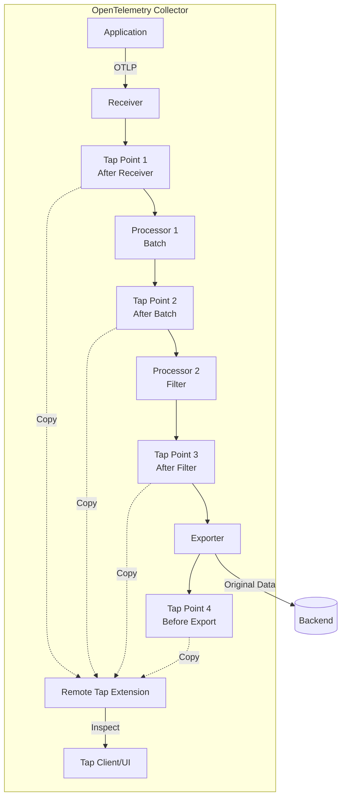

# How to Configure the Remote Tap Extension in the OpenTelemetry Collector

Author: [nawazdhandala](https://www.github.com/nawazdhandala)

Tags: OpenTelemetry, Collector, Extensions, Debugging, Observability, Real-time Monitoring

Description: Learn how to configure the Remote Tap Extension in OpenTelemetry Collector to inspect telemetry data in real-time, debug pipeline issues, and troubleshoot data transformation problems without disrupting production traffic.

---

The Remote Tap Extension in the OpenTelemetry Collector provides powerful real-time inspection capabilities for telemetry data flowing through the pipeline. This extension enables you to capture and examine traces, metrics, and logs as they traverse the Collector, making it an essential tool for debugging, troubleshooting, and understanding data transformation behavior in production environments.

## What is the Remote Tap Extension?

The Remote Tap Extension is an OpenTelemetry Collector component that creates inspection points within the telemetry pipeline, allowing operators to observe data in real-time without modifying the pipeline configuration or disrupting data flow. It operates as a passive observer, capturing telemetry copies for examination while allowing the original data to continue through the pipeline unchanged.

The extension provides:

- Real-time telemetry inspection at any pipeline stage (receivers, processors, exporters)
- Non-intrusive data capture that doesn't affect production traffic
- Filtering capabilities to focus on specific telemetry patterns
- Multiple output formats for different debugging scenarios
- Remote access for distributed troubleshooting
- Sampling controls to limit inspection overhead
- Session management for time-bounded debugging

This extension is particularly valuable for understanding complex data transformations, debugging processor configurations, and verifying that telemetry reaches specific pipeline stages with expected attributes.

## Why Use the Remote Tap Extension?

Production telemetry pipelines are complex, involving multiple receivers, processors, and exporters. Understanding what happens to data as it flows through these components is critical for troubleshooting, but traditional debugging approaches have significant limitations:

**Production Debugging Challenges**: Traditional debugging requires modifying configurations, adding logging exporters, or redeploying the Collector. These approaches disrupt service, require configuration changes, and generate excessive log volume that obscures the actual issue.

**Data Transformation Verification**: Processors transform telemetry data in sophisticated ways - sampling, filtering, attribute manipulation, aggregation. Verifying these transformations work correctly requires examining data before and after each processor, which is difficult without inspection capabilities.

**Intermittent Issues**: Transient problems like occasional data drops, unexpected attribute values, or sampling anomalies are nearly impossible to diagnose without real-time inspection. By the time logs are examined, the problematic data has already passed through the system.

**Performance Analysis**: Understanding which pipeline stages consume the most resources or introduce latency requires examining data flow characteristics. The Remote Tap Extension enables real-time performance analysis without deploying separate profiling infrastructure.

**Compliance Verification**: Regulatory requirements may mandate verifying that sensitive data is properly redacted before export. The extension allows spot-checking redaction processors to ensure compliance without compromising security.

## Architecture and Pipeline Integration

The Remote Tap Extension integrates at multiple pipeline stages to provide comprehensive visibility:



The extension creates zero or more tap points in the pipeline. Each tap point copies telemetry data and sends it to the tap extension for inspection, while the original data continues unmodified to the next pipeline stage. This passive observation ensures production traffic remains unaffected.

## Basic Configuration

Here's a foundational configuration enabling basic telemetry inspection:

```yaml
# extensions section configures remote tap
extensions:
  # Remote tap extension for pipeline inspection
  remote_tap:
    # Network endpoint for tap clients
    endpoint: 0.0.0.0:7777

    # Authentication for tap access
    auth:
      # Require authentication for tap sessions
      enabled: true
      # Bearer token authentication
      type: bearer
      # Token from environment variable
      token: ${TAP_AUTH_TOKEN}

    # Sampling to reduce overhead
    sampling:
      # Sample 10% of telemetry for inspection
      rate: 0.1

# receivers accept telemetry
receivers:
  otlp:
    protocols:
      grpc:
        endpoint: 0.0.0.0:4317
      http:
        endpoint: 0.0.0.0:4318

# processors transform data
processors:
  batch:
    timeout: 10s
    send_batch_size: 1024

  # Attribute processor for demonstration
  attributes:
    actions:
      - key: environment
        value: production
        action: insert

# exporters send data to backend
exporters:
  otlphttp:
    endpoint: https://oneuptime.com/otlp
    headers:
      x-oneuptime-token: ${ONEUPTIME_TOKEN}

service:
  # Enable remote tap extension
  extensions: [remote_tap]

  pipelines:
    traces:
      receivers: [otlp]
      processors: [batch, attributes]
      exporters: [otlphttp]

    metrics:
      receivers: [otlp]
      processors: [batch]
      exporters: [otlphttp]

    logs:
      receivers: [otlp]
      processors: [batch]
      exporters: [otlphttp]
```

With this configuration, you can connect a tap client to port 7777 to inspect telemetry flowing through the pipeline. The extension samples 10% of data to minimize performance impact.

## Advanced Tap Point Configuration

Configure specific tap points at different pipeline stages:

```yaml
extensions:
  remote_tap:
    endpoint: 0.0.0.0:7777

    auth:
      enabled: true
      type: bearer
      token: ${TAP_AUTH_TOKEN}

    # Define explicit tap points
    tap_points:
      # Tap point after receiver
      - name: after_receiver
        location: receiver
        # Which pipelines to tap
        pipelines: [traces, metrics, logs]
        # No filtering - capture everything
        filter: {}

      # Tap point after batch processor
      - name: after_batch
        location: processor
        processor_name: batch
        pipelines: [traces]
        # Filter for specific conditions
        filter:
          # Only capture high-priority traces
          resource_attributes:
            priority: high

      # Tap point after attribute processor
      - name: after_attributes
        location: processor
        processor_name: attributes
        pipelines: [traces]

      # Tap point before exporter
      - name: before_export
        location: exporter
        pipelines: [traces, metrics, logs]
        # Sample at different rate for pre-export inspection
        sampling_rate: 0.05

receivers:
  otlp:
    protocols:
      grpc:
        endpoint: 0.0.0.0:4317

processors:
  batch:
    timeout: 10s
    send_batch_size: 1024

  attributes:
    actions:
      - key: environment
        value: production
        action: insert
      - key: processed_by
        value: otel-collector
        action: insert

exporters:
  otlphttp:
    endpoint: https://oneuptime.com/otlp
    headers:
      x-oneuptime-token: ${ONEUPTIME_TOKEN}

service:
  extensions: [remote_tap]

  pipelines:
    traces:
      receivers: [otlp]
      processors: [batch, attributes]
      exporters: [otlphttp]
```

This configuration creates four tap points at strategic pipeline locations, allowing you to observe how data changes as it progresses through processing stages.

## Filtering and Selection

Focus inspection on specific telemetry patterns:

```yaml
extensions:
  remote_tap:
    endpoint: 0.0.0.0:7777

    auth:
      enabled: true
      type: bearer
      token: ${TAP_AUTH_TOKEN}

    tap_points:
      # Tap for error traces only
      - name: error_traces
        location: receiver
        pipelines: [traces]
        filter:
          # Only capture traces with errors
          span_status:
            code: ERROR

      # Tap for slow requests
      - name: slow_requests
        location: processor
        processor_name: batch
        pipelines: [traces]
        filter:
          # Capture spans with duration > 1 second
          span_duration:
            min: 1000ms

      # Tap for specific service
      - name: api_service
        location: receiver
        pipelines: [traces, logs]
        filter:
          resource_attributes:
            service.name: api-service

      # Tap for high-cardinality metrics
      - name: high_cardinality_metrics
        location: receiver
        pipelines: [metrics]
        filter:
          # Capture metrics with many labels
          metric_attributes:
            cardinality:
              min: 10

      # Tap for specific log levels
      - name: warning_logs
        location: receiver
        pipelines: [logs]
        filter:
          log_record:
            severity:
              - WARN
              - ERROR
              - FATAL

receivers:
  otlp:
    protocols:
      grpc:
        endpoint: 0.0.0.0:4317

processors:
  batch:
    timeout: 10s

exporters:
  otlphttp:
    endpoint: https://oneuptime.com/otlp
    headers:
      x-oneuptime-token: ${ONEUPTIME_TOKEN}

service:
  extensions: [remote_tap]

  pipelines:
    traces:
      receivers: [otlp]
      processors: [batch]
      exporters: [otlphttp]

    metrics:
      receivers: [otlp]
      processors: [batch]
      exporters: [otlphttp]

    logs:
      receivers: [otlp]
      processors: [batch]
      exporters: [otlphttp]
```

Filtering reduces inspection overhead by capturing only relevant telemetry, making debugging more efficient.

## Output Formats and Destinations

Configure different output formats for various debugging scenarios:

```yaml
extensions:
  remote_tap:
    endpoint: 0.0.0.0:7777

    auth:
      enabled: true
      type: bearer
      token: ${TAP_AUTH_TOKEN}

    # Output configuration
    outputs:
      # Real-time streaming to connected clients
      - type: stream
        format: json
        # Pretty-print JSON for readability
        pretty: true

      # Write to local file for offline analysis
      - type: file
        path: /var/log/otel-tap/traces.jsonl
        format: jsonl                    # JSON Lines format
        # Rotate files to prevent disk exhaustion
        rotation:
          max_size_mb: 100
          max_files: 10

      # Send to debugging backend
      - type: otlp
        endpoint: http://debug.oneuptime.com:4317
        headers:
          x-debug-session: ${DEBUG_SESSION_ID}

      # Write to stdout for container logs
      - type: stdout
        format: text
        # Include detailed metadata
        verbose: true

    tap_points:
      - name: all_data
        location: receiver
        pipelines: [traces, metrics, logs]

receivers:
  otlp:
    protocols:
      grpc:
        endpoint: 0.0.0.0:4317

processors:
  batch:
    timeout: 10s

exporters:
  otlphttp:
    endpoint: https://oneuptime.com/otlp
    headers:
      x-oneuptime-token: ${ONEUPTIME_TOKEN}

service:
  extensions: [remote_tap]

  pipelines:
    traces:
      receivers: [otlp]
      processors: [batch]
      exporters: [otlphttp]
```

Multiple output destinations enable different debugging workflows - real-time inspection, offline analysis, or integration with debugging infrastructure.

## Session Management and Access Control

Implement secure, time-bounded tap sessions:

```yaml
extensions:
  remote_tap:
    endpoint: 0.0.0.0:7777

    # Authentication configuration
    auth:
      enabled: true
      type: bearer
      token: ${TAP_AUTH_TOKEN}

      # Rotate token periodically
      token_rotation:
        enabled: true
        interval: 1h

      # IP allowlist for tap access
      allowed_ips:
        - 10.0.0.0/8              # Internal network
        - 172.16.0.0/12           # VPC range

    # Session management
    sessions:
      # Maximum concurrent tap sessions
      max_concurrent: 5

      # Automatic session timeout
      timeout: 30m

      # Maximum session duration
      max_duration: 2h

      # Session logging for audit
      audit_log:
        enabled: true
        path: /var/log/otel-tap/audit.log

    # Rate limiting per session
    rate_limit:
      # Max telemetry items per second per session
      items_per_second: 1000
      # Burst capacity
      burst: 2000

    tap_points:
      - name: debug_traces
        location: receiver
        pipelines: [traces]

receivers:
  otlp:
    protocols:
      grpc:
        endpoint: 0.0.0.0:4317

processors:
  batch:
    timeout: 10s

exporters:
  otlphttp:
    endpoint: https://oneuptime.com/otlp
    headers:
      x-oneuptime-token: ${ONEUPTIME_TOKEN}

service:
  extensions: [remote_tap]

  pipelines:
    traces:
      receivers: [otlp]
      processors: [batch]
      exporters: [otlphttp]
```

Session management prevents unauthorized access, limits resource consumption, and provides audit trails for compliance.

## Performance Optimization

Minimize tap overhead in high-throughput environments:

```yaml
extensions:
  remote_tap:
    endpoint: 0.0.0.0:7777

    auth:
      enabled: true
      type: bearer
      token: ${TAP_AUTH_TOKEN}

    # Performance configuration
    performance:
      # Asynchronous tap processing
      async: true

      # Buffer size for async processing
      buffer_size: 10000

      # Number of worker threads
      workers: 4

      # Drop telemetry if buffer is full
      drop_on_full: true

    # Aggressive sampling
    sampling:
      # Sample only 1% of telemetry
      rate: 0.01

      # Adaptive sampling based on load
      adaptive:
        enabled: true
        # Target CPU usage for tap operations
        target_cpu_percent: 5
        # Adjust sampling rate dynamically
        min_rate: 0.001
        max_rate: 0.1

    # Memory limits
    memory:
      # Maximum memory for tap buffers
      max_memory_mb: 512
      # Eviction policy when limit reached
      eviction: oldest

    tap_points:
      - name: sampled_traces
        location: receiver
        pipelines: [traces]
        # Additional per-tap-point sampling
        sampling_rate: 0.1

receivers:
  otlp:
    protocols:
      grpc:
        endpoint: 0.0.0.0:4317

processors:
  batch:
    timeout: 10s

exporters:
  otlphttp:
    endpoint: https://oneuptime.com/otlp
    headers:
      x-oneuptime-token: ${ONEUPTIME_TOKEN}

service:
  extensions: [remote_tap]

  pipelines:
    traces:
      receivers: [otlp]
      processors: [batch]
      exporters: [otlphttp]
```

Performance optimizations ensure tap operations don't impact production telemetry processing.

## Using the Tap Client

Connect to the remote tap for interactive debugging:

```bash
# Connect to remote tap extension
otelcol-tap connect \
  --endpoint collector.production.internal:7777 \
  --token "${TAP_AUTH_TOKEN}" \
  --format json

# Filter output for specific service
otelcol-tap connect \
  --endpoint collector.production.internal:7777 \
  --token "${TAP_AUTH_TOKEN}" \
  --filter 'resource.service.name == "api-service"'

# Capture to file for offline analysis
otelcol-tap connect \
  --endpoint collector.production.internal:7777 \
  --token "${TAP_AUTH_TOKEN}" \
  --output traces-$(date +%Y%m%d-%H%M%S).jsonl

# Stream specific tap point
otelcol-tap connect \
  --endpoint collector.production.internal:7777 \
  --token "${TAP_AUTH_TOKEN}" \
  --tap-point after_batch

# Limit capture duration
otelcol-tap connect \
  --endpoint collector.production.internal:7777 \
  --token "${TAP_AUTH_TOKEN}" \
  --duration 5m

# Pretty-print output for human inspection
otelcol-tap connect \
  --endpoint collector.production.internal:7777 \
  --token "${TAP_AUTH_TOKEN}" \
  --format json \
  --pretty
```

The tap client provides flexible command-line access to telemetry inspection.

## Debugging Common Issues

### Verifying Processor Behavior

Confirm processors transform data correctly:

```yaml
extensions:
  remote_tap:
    endpoint: 0.0.0.0:7777
    auth:
      enabled: true
      type: bearer
      token: ${TAP_AUTH_TOKEN}

    tap_points:
      # Before attribute processor
      - name: before_redaction
        location: processor
        processor_name: batch
        pipelines: [traces]

      # After attribute processor
      - name: after_redaction
        location: processor
        processor_name: attributes/redact
        pipelines: [traces]

    outputs:
      - type: file
        path: /var/log/otel-tap/before-redaction.jsonl
        filter:
          tap_point: before_redaction

      - type: file
        path: /var/log/otel-tap/after-redaction.jsonl
        filter:
          tap_point: after_redaction

receivers:
  otlp:
    protocols:
      grpc:
        endpoint: 0.0.0.0:4317

processors:
  batch:
    timeout: 10s

  # Processor under test
  attributes/redact:
    actions:
      - key: user.email
        action: delete
      - key: credit_card
        action: delete
      - key: ssn
        action: delete

exporters:
  otlphttp:
    endpoint: https://oneuptime.com/otlp
    headers:
      x-oneuptime-token: ${ONEUPTIME_TOKEN}

service:
  extensions: [remote_tap]

  pipelines:
    traces:
      receivers: [otlp]
      processors: [batch, attributes/redact]
      exporters: [otlphttp]
```

Compare before and after files to verify the redaction processor removes sensitive attributes correctly.

### Investigating Data Loss

Determine where telemetry is dropped:

```yaml
extensions:
  remote_tap:
    endpoint: 0.0.0.0:7777
    auth:
      enabled: true
      type: bearer
      token: ${TAP_AUTH_TOKEN}

    tap_points:
      # After receiver (data entering pipeline)
      - name: received
        location: receiver
        pipelines: [traces]
        filter:
          resource_attributes:
            service.name: problematic-service

      # After filter processor (potential drop point)
      - name: after_filter
        location: processor
        processor_name: filter
        pipelines: [traces]
        filter:
          resource_attributes:
            service.name: problematic-service

      # Before export (data leaving pipeline)
      - name: exported
        location: exporter
        pipelines: [traces]
        filter:
          resource_attributes:
            service.name: problematic-service

    outputs:
      - type: stdout
        format: text
        verbose: true

receivers:
  otlp:
    protocols:
      grpc:
        endpoint: 0.0.0.0:4317

processors:
  batch:
    timeout: 10s

  # Potential drop point
  filter:
    traces:
      span:
        - attributes["http.status_code"] > 400

exporters:
  otlphttp:
    endpoint: https://oneuptime.com/otlp
    headers:
      x-oneuptime-token: ${ONEUPTIME_TOKEN}

service:
  extensions: [remote_tap]

  pipelines:
    traces:
      receivers: [otlp]
      processors: [batch, filter]
      exporters: [otlphttp]
```

Count telemetry items at each tap point to identify where data is dropped.

### Analyzing Performance Bottlenecks

Identify slow pipeline stages:

```yaml
extensions:
  remote_tap:
    endpoint: 0.0.0.0:7777
    auth:
      enabled: true
      type: bearer
      token: ${TAP_AUTH_TOKEN}

    tap_points:
      - name: stage1
        location: receiver
        pipelines: [traces]
        # Record timestamp for latency calculation
        add_timestamp: true

      - name: stage2
        location: processor
        processor_name: batch
        pipelines: [traces]
        add_timestamp: true

      - name: stage3
        location: processor
        processor_name: tail_sampling
        pipelines: [traces]
        add_timestamp: true

      - name: stage4
        location: exporter
        pipelines: [traces]
        add_timestamp: true

    # Enable performance metrics
    metrics:
      enabled: true
      # Calculate latency between tap points
      latency_calculation: true

receivers:
  otlp:
    protocols:
      grpc:
        endpoint: 0.0.0.0:4317

processors:
  batch:
    timeout: 10s

  # Potentially slow processor
  tail_sampling:
    decision_wait: 10s
    num_traces: 10000
    policies:
      - name: errors
        type: status_code
        status_code:
          status_codes: [ERROR]

exporters:
  otlphttp:
    endpoint: https://oneuptime.com/otlp
    headers:
      x-oneuptime-token: ${ONEUPTIME_TOKEN}

service:
  extensions: [remote_tap]

  # Export tap metrics for analysis
  telemetry:
    metrics:
      level: detailed
      readers:
        - periodic:
            exporter:
              otlp:
                protocol: http/protobuf
                endpoint: https://oneuptime.com/otlp
                headers:
                  x-oneuptime-token: ${ONEUPTIME_TOKEN}

  pipelines:
    traces:
      receivers: [otlp]
      processors: [batch, tail_sampling]
      exporters: [otlphttp]
```

Timestamp differences between tap points reveal processing latency for each pipeline stage.

## Monitoring Tap Operations

Track tap extension performance and usage:

```yaml
extensions:
  remote_tap:
    endpoint: 0.0.0.0:7777
    auth:
      enabled: true
      type: bearer
      token: ${TAP_AUTH_TOKEN}

    # Enable detailed metrics
    metrics:
      enabled: true
      detailed: true

    tap_points:
      - name: traces
        location: receiver
        pipelines: [traces]

receivers:
  otlp:
    protocols:
      grpc:
        endpoint: 0.0.0.0:4317

processors:
  batch:
    timeout: 10s

exporters:
  otlphttp:
    endpoint: https://oneuptime.com/otlp
    headers:
      x-oneuptime-token: ${ONEUPTIME_TOKEN}

service:
  extensions: [remote_tap]

  # Configure Collector self-monitoring
  telemetry:
    metrics:
      level: detailed
      readers:
        - periodic:
            exporter:
              otlp:
                protocol: http/protobuf
                endpoint: https://oneuptime.com/otlp
                headers:
                  x-oneuptime-token: ${ONEUPTIME_TOKEN}

  pipelines:
    traces:
      receivers: [otlp]
      processors: [batch]
      exporters: [otlphttp]
```

**Key Metrics**:

- **otelcol_remote_tap_sessions_active**: Number of active tap sessions
- **otelcol_remote_tap_items_captured**: Total telemetry items captured
- **otelcol_remote_tap_items_dropped**: Items dropped due to buffer overflow
- **otelcol_remote_tap_processing_duration_milliseconds**: Time spent processing tap operations
- **otelcol_remote_tap_memory_usage_bytes**: Memory consumed by tap buffers

These metrics help identify excessive tap overhead and resource consumption.

## Security Considerations

### Sensitive Data Protection

Prevent sensitive data exposure through tap operations:

```yaml
extensions:
  remote_tap:
    endpoint: 0.0.0.0:7777

    auth:
      enabled: true
      type: bearer
      token: ${TAP_AUTH_TOKEN}

    # Redaction configuration
    redaction:
      enabled: true

      # Redact sensitive attributes
      attributes:
        - user.email
        - credit_card
        - ssn
        - password
        - api_key

      # Redact attribute patterns
      attribute_patterns:
        - ".*password.*"
        - ".*secret.*"
        - ".*token.*"
        - ".*key.*"

      # Replace with placeholder
      replacement: "[REDACTED]"

    # Audit logging
    audit:
      enabled: true
      path: /var/log/otel-tap/audit.log
      # Log all tap operations
      log_captures: true
      # Log session creation/termination
      log_sessions: true

    tap_points:
      - name: traces
        location: receiver
        pipelines: [traces]

receivers:
  otlp:
    protocols:
      grpc:
        endpoint: 0.0.0.0:4317

processors:
  batch:
    timeout: 10s

exporters:
  otlphttp:
    endpoint: https://oneuptime.com/otlp
    headers:
      x-oneuptime-token: ${ONEUPTIME_TOKEN}

service:
  extensions: [remote_tap]

  pipelines:
    traces:
      receivers: [otlp]
      processors: [batch]
      exporters: [otlphttp]
```

Redaction ensures sensitive data isn't exposed through tap sessions, maintaining security and compliance.

## Production Best Practices

### Conditional Tap Activation

Enable tap only when needed to minimize overhead:

```yaml
extensions:
  remote_tap:
    endpoint: 0.0.0.0:7777

    auth:
      enabled: true
      type: bearer
      token: ${TAP_AUTH_TOKEN}

    # Activation configuration
    activation:
      # Default: disabled until activated
      enabled: ${ENABLE_TAP:-false}

      # Auto-disable after period of inactivity
      auto_disable:
        enabled: true
        idle_timeout: 30m

      # Activation via signal
      signal:
        # Enable tap by sending SIGUSR1 to Collector
        enable_signal: SIGUSR1
        # Disable tap by sending SIGUSR2
        disable_signal: SIGUSR2

    tap_points:
      - name: traces
        location: receiver
        pipelines: [traces]

receivers:
  otlp:
    protocols:
      grpc:
        endpoint: 0.0.0.0:4317

processors:
  batch:
    timeout: 10s

exporters:
  otlphttp:
    endpoint: https://oneuptime.com/otlp
    headers:
      x-oneuptime-token: ${ONEUPTIME_TOKEN}

service:
  extensions: [remote_tap]

  pipelines:
    traces:
      receivers: [otlp]
      processors: [batch]
      exporters: [otlphttp]
```

Conditional activation ensures tap operations only consume resources when actively debugging.

### Complete Production Configuration

Full configuration with all production considerations:

```yaml
extensions:
  remote_tap:
    # Bind to internal network only
    endpoint: 10.0.0.100:7777

    # Strong authentication
    auth:
      enabled: true
      type: bearer
      token: ${TAP_AUTH_TOKEN}
      token_rotation:
        enabled: true
        interval: 1h
      allowed_ips:
        - 10.0.0.0/8

    # Disabled by default
    activation:
      enabled: false
      auto_disable:
        enabled: true
        idle_timeout: 30m

    # Minimal sampling
    sampling:
      rate: 0.01
      adaptive:
        enabled: true
        target_cpu_percent: 2

    # Session limits
    sessions:
      max_concurrent: 2
      timeout: 15m
      max_duration: 1h
      audit_log:
        enabled: true
        path: /var/log/otel-tap/audit.log

    # Performance limits
    performance:
      async: true
      buffer_size: 5000
      workers: 2
      drop_on_full: true

    memory:
      max_memory_mb: 256

    # Security
    redaction:
      enabled: true
      attributes:
        - user.email
        - password
        - api_key
      attribute_patterns:
        - ".*secret.*"
        - ".*token.*"

    # Metrics
    metrics:
      enabled: true

    tap_points:
      - name: receiver_traces
        location: receiver
        pipelines: [traces]
        sampling_rate: 0.1

receivers:
  otlp:
    protocols:
      grpc:
        endpoint: 0.0.0.0:4317

processors:
  memory_limiter:
    check_interval: 1s
    limit_mib: 2048

  batch:
    timeout: 10s

exporters:
  otlphttp:
    endpoint: https://oneuptime.com/otlp
    headers:
      x-oneuptime-token: ${ONEUPTIME_TOKEN}

service:
  extensions: [remote_tap]

  telemetry:
    logs:
      level: info
    metrics:
      level: detailed

  pipelines:
    traces:
      receivers: [otlp]
      processors: [memory_limiter, batch]
      exporters: [otlphttp]
```

This production configuration balances debugging capability with security, performance, and resource constraints.

## Related Resources

For comprehensive OpenTelemetry Collector debugging and troubleshooting, explore these related topics:

- [OpenTelemetry Collector: What It Is, When You Need It, and When You Don't](https://oneuptime.com/blog/post/2025-09-18-what-is-opentelemetry-collector-and-why-use-one/view)
- [How to collect internal metrics from OpenTelemetry Collector](https://oneuptime.com/blog/post/2025-01-22-how-to-collect-opentelemetry-collector-internal-metrics/view)
- [How to reduce noise in OpenTelemetry](https://oneuptime.com/blog/post/2025-08-25-how-to-reduce-noise-in-opentelemetry/view)

## Summary

The Remote Tap Extension provides essential real-time inspection capabilities for debugging and troubleshooting OpenTelemetry Collector pipelines. By creating non-intrusive observation points throughout the pipeline, it enables operators to understand data transformations, verify processor behavior, and diagnose issues without disrupting production traffic.

Start with basic tap configuration for occasional debugging needs. As requirements grow, implement filtering, multiple tap points, and specialized output formats for sophisticated debugging workflows. Always enable authentication and implement sampling to protect security and minimize performance impact.

Monitor tap operations through internal metrics to ensure debugging activities don't consume excessive resources. Use conditional activation to enable tap only when needed, and implement automatic session timeouts to prevent resource leaks. Redaction ensures sensitive data isn't exposed during debugging, maintaining compliance with security policies.

The extension's flexibility enables powerful debugging workflows - from quick spot-checks to comprehensive pipeline analysis - while maintaining the production stability and security required in enterprise environments.

Need a production-grade observability platform with built-in debugging tools? OneUptime provides native support for OpenTelemetry with integrated telemetry inspection, pipeline visualization, and comprehensive troubleshooting capabilities without vendor lock-in.
