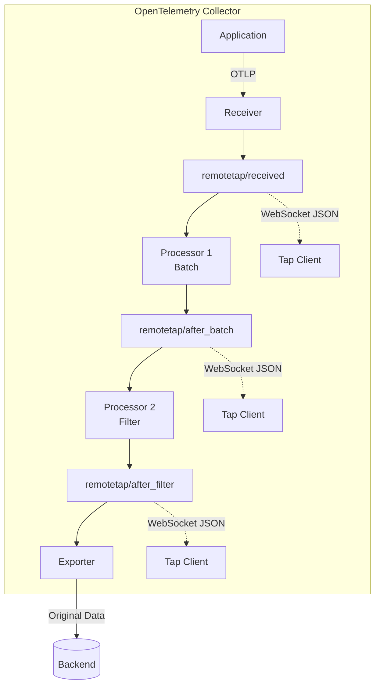

# How to Configure the Remote Tap Extension in the OpenTelemetry Collector

Author: [nawazdhandala](https://www.github.com/nawazdhandala)

Tags: OpenTelemetry, Collector, Extension, Debugging, Observability, Real-Time Monitoring

Description: Learn how to configure the Remote Tap Extension in OpenTelemetry Collector to inspect telemetry data in real-time, debug pipeline issues.

---

The Remote Tap components in the OpenTelemetry Collector provide real-time inspection capabilities for telemetry data flowing through the pipeline. In current Collector releases, the component that taps pipeline data is the Remote Tap processor. It can be placed in a pipeline like any other processor, passes telemetry through unchanged, and makes a rate-limited portion of that telemetry available to WebSocket clients.

The Remote Tap extension is separate: it runs a web server for the remote tap viewer. The data capture itself is done by the `remotetap` processor.

## What is the Remote Tap Extension?

The Remote Tap Extension is an OpenTelemetry Collector extension that runs as a web server for visualizing remote tap data. To create inspection points inside telemetry pipelines, use the Remote Tap processor.

The processor provides:

- Real-time telemetry inspection at the exact point where you place the processor in a pipeline
- Pass-through behavior that allows the original telemetry to continue to the next component
- WebSocket access to JSON-serialized traces, metrics, or logs
- A configurable rate limit to reduce the volume sent to connected clients
- Support for multiple tap points by defining multiple `remotetap` processor instances

This is particularly valuable for understanding complex data transformations, debugging processor configurations, and verifying that telemetry reaches specific pipeline stages with expected attributes.

## Why Use the Remote Tap Extension?

Production telemetry pipelines are complex, involving multiple receivers, processors, and exporters. Understanding what happens to data as it flows through these components is critical for troubleshooting, but traditional debugging approaches have significant limitations:

**Production Debugging Challenges**: Traditional debugging often requires modifying configurations, adding debug exporters, or redeploying the Collector. These approaches can generate high log volume that obscures the actual issue.

**Data Transformation Verification**: Processors transform telemetry data in sophisticated ways - sampling, filtering, attribute manipulation, aggregation. Verifying these transformations work correctly requires examining data before and after each processor, which is easier when you place `remotetap` processors around the component under test.

**Intermittent Issues**: Transient problems like occasional data drops, unexpected attribute values, or sampling anomalies are difficult to diagnose without real-time inspection. By the time logs are examined, the problematic data may already have passed through the system.

**Performance Analysis**: Understanding which pipeline stages introduce latency often requires Collector internal telemetry, profiling, and backend analysis. Remote Tap can help inspect payloads at chosen pipeline points, but it does not calculate stage latency by itself.

**Compliance Verification**: Regulatory requirements may mandate verifying that sensitive data is properly redacted before export. A tap point after a redaction processor can help spot-check redaction behavior, but access to tap endpoints must be tightly controlled because telemetry can contain sensitive data.

## Architecture and Pipeline Integration

Remote Tap is integrated by placing `remotetap` processors at the pipeline stages you want to inspect:


```mermaid
graph TB
    subgraph OpenTelemetry Collector
        A[Application] -->|OTLP| R[Receiver]

        R --> T1[remotetap/received]

        T1 --> P1[Processor 1
        Batch]

        P1 --> T2[remotetap/after_batch]

        T2 --> P2[Processor 2
        Filter]

        P2 --> T3[remotetap/after_filter]

        T3 --> E[Exporter]

        T1 -.->|WebSocket JSON| C1[Tap Client]
        T2 -.->|WebSocket JSON| C2[Tap Client]
        T3 -.->|WebSocket JSON| C3[Tap Client]
    end

    E -->|Original Data| B[(Backend)]
```

Each `remotetap` processor passes telemetry to the next component and, subject to its configured rate limit, writes a JSON copy to connected WebSocket clients. To inspect multiple stages, define multiple named processor instances such as `remotetap/received` and `remotetap/after_batch`.

## Basic Configuration

Here's a foundational configuration enabling basic telemetry inspection:

```yaml
receivers:
  otlp:
    protocols:
      grpc:
        endpoint: 0.0.0.0:4317
      http:
        endpoint: 0.0.0.0:4318

processors:
  # Remote tap processor for pipeline inspection.
  # WebSocket clients connect to this endpoint.
  remotetap/traces:
    endpoint: 0.0.0.0:12001
    limit: 1

  remotetap/metrics:
    endpoint: 0.0.0.0:12002
    limit: 1

  remotetap/logs:
    endpoint: 0.0.0.0:12003
    limit: 1

  batch:
    timeout: 10s
    send_batch_size: 1024

  attributes:
    actions:
      - key: environment
        value: production
        action: insert

exporters:
  otlphttp:
    endpoint: https://oneuptime.com/otlp
    headers:
      x-oneuptime-token: ${ONEUPTIME_TOKEN}

service:
  pipelines:
    traces:
      receivers: [otlp]
      processors: [remotetap/traces, batch, attributes]
      exporters: [otlphttp]

    metrics:
      receivers: [otlp]
      processors: [remotetap/metrics, batch]
      exporters: [otlphttp]

    logs:
      receivers: [otlp]
      processors: [remotetap/logs, batch]
      exporters: [otlphttp]
```

With this configuration, a WebSocket client can connect to port 12001 for traces, 12002 for metrics, or 12003 for logs. The `limit` setting rate limits duplicated telemetry sent over open WebSocket connections, in messages per second.

## Advanced Tap Point Configuration

Configure specific tap points at different pipeline stages by creating multiple named `remotetap` processors:

```yaml
receivers:
  otlp:
    protocols:
      grpc:
        endpoint: 0.0.0.0:4317

processors:
  # Tap point immediately after the receiver
  remotetap/received:
    endpoint: 0.0.0.0:12001
    limit: 1

  batch:
    timeout: 10s
    send_batch_size: 1024

  # Tap point after the batch processor
  remotetap/after_batch:
    endpoint: 0.0.0.0:12002
    limit: 1

  attributes:
    actions:
      - key: environment
        value: production
        action: insert
      - key: processed_by
        value: otel-collector
        action: insert

  # Tap point after the attributes processor
  remotetap/after_attributes:
    endpoint: 0.0.0.0:12003
    limit: 1

exporters:
  otlphttp:
    endpoint: https://oneuptime.com/otlp
    headers:
      x-oneuptime-token: ${ONEUPTIME_TOKEN}

service:
  pipelines:
    traces:
      receivers: [otlp]
      processors: [remotetap/received, batch, remotetap/after_batch, attributes, remotetap/after_attributes]
      exporters: [otlphttp]
```

This configuration creates three tap points at strategic pipeline locations, allowing you to observe how data changes as it progresses through processing stages.

## Filtering and Selection

The Remote Tap processor does not provide its own filtering language. It duplicates telemetry at the point where it is placed in the pipeline and rate limits what it sends to WebSocket clients.

To focus inspection on specific telemetry patterns, use normal Collector processors before the tap point in a dedicated debugging pipeline, or place the tap after a processor that already narrows the stream:

```yaml
receivers:
  otlp:
    protocols:
      grpc:
        endpoint: 0.0.0.0:4317

processors:
  filter/api_service:
    error_mode: ignore
    traces:
      span:
        - 'resource.attributes["service.name"] != "api-service"'

  remotetap/api_service:
    endpoint: 0.0.0.0:12001
    limit: 1

  batch:
    timeout: 10s

exporters:
  otlphttp:
    endpoint: https://oneuptime.com/otlp
    headers:
      x-oneuptime-token: ${ONEUPTIME_TOKEN}

service:
  pipelines:
    traces/debug_api_service:
      receivers: [otlp]
      processors: [filter/api_service, remotetap/api_service, batch]
      exporters: [otlphttp]
```

Filtering reduces inspection volume by limiting what reaches the tap point. Be careful when adding filters to production pipelines: a filter processor drops data from that pipeline, so use a dedicated debugging pipeline when you need non-invasive inspection.

## Output Formats and Destinations

The Remote Tap processor writes JSON-serialized telemetry to connected WebSocket clients. It does not support Collector configuration fields for file output, stdout output, OTLP forwarding, output rotation, or per-output formatting.

For offline analysis, capture the WebSocket stream with your preferred WebSocket client and redirect it to a file. For normal Collector file, stdout, or OTLP destinations, use dedicated exporters such as `debug`, `file`, or `otlphttp` in a separate pipeline.

```yaml
processors:
  remotetap:
    endpoint: 0.0.0.0:12001
    limit: 1

exporters:
  debug:
    verbosity: detailed
```

Remote Tap is best used for live inspection. Exporters are the supported mechanism for routing telemetry to files, logs, or backends.

## Session Management and Access Control

The Remote Tap processor exposes a WebSocket endpoint using the Collector HTTP server configuration. It does not implement built-in bearer-token sessions, token rotation, audit logs, IP allowlists, or per-session duration controls.

```yaml
processors:
  remotetap:
    # Bind to localhost unless remote access is required.
    endpoint: 127.0.0.1:12001
    limit: 1
```

For production access control, keep the endpoint bound to localhost or a restricted network interface, and put authentication, authorization, TLS termination, IP allowlisting, and audit logging in front of the endpoint with infrastructure you already operate, such as a reverse proxy or service mesh.

## Performance Optimization

Minimize tap overhead in high-throughput environments by keeping the rate limit low and enabling tap points only where they are needed:

```yaml
processors:
  remotetap/sampled_view:
    endpoint: 127.0.0.1:12001
    # Maximum duplicated messages per second sent to WebSocket clients
    limit: 0.5

  batch:
    timeout: 10s

service:
  pipelines:
    traces:
      receivers: [otlp]
      processors: [remotetap/sampled_view, batch]
      exporters: [otlphttp]
```

The processor's supported performance control is `limit`, which rate limits duplicated messages over open WebSockets. It does not provide separate configuration for worker counts, adaptive sampling, memory limits, or buffer eviction.

## Using the Tap Client

Connect to the Remote Tap processor endpoint with a WebSocket client:

```bash
# Connect to a remote tap processor listening on localhost:12001
websocat ws://127.0.0.1:12001/

# Capture streamed JSON telemetry to a file
websocat ws://127.0.0.1:12001/ > traces.json
```

There is no official `otelcol-tap` CLI in the OpenTelemetry Collector documentation. The processor exposes a WebSocket endpoint, so any compatible WebSocket client can read the stream. If you enable the `remotetap` extension, it runs a web server for a remote tap viewer, but the extension is separate from the pipeline processor.

## Debugging Common Issues

### Verifying Processor Behavior

Confirm processors transform data correctly by placing tap processors before and after the processor under test:

```yaml
receivers:
  otlp:
    protocols:
      grpc:
        endpoint: 0.0.0.0:4317

processors:
  remotetap/before_redaction:
    endpoint: 127.0.0.1:12001
    limit: 1

  attributes/redact:
    actions:
      - key: user.email
        action: delete
      - key: credit_card
        action: delete
      - key: ssn
        action: delete

  remotetap/after_redaction:
    endpoint: 127.0.0.1:12002
    limit: 1

exporters:
  otlphttp:
    endpoint: https://oneuptime.com/otlp
    headers:
      x-oneuptime-token: ${ONEUPTIME_TOKEN}

service:
  pipelines:
    traces:
      receivers: [otlp]
      processors: [remotetap/before_redaction, attributes/redact, remotetap/after_redaction]
      exporters: [otlphttp]
```

Compare the WebSocket output from ports 12001 and 12002 to verify the redaction processor removes sensitive attributes correctly.

### Investigating Data Loss

Determine where telemetry is dropped by placing tap processors around potential drop points:

```yaml
receivers:
  otlp:
    protocols:
      grpc:
        endpoint: 0.0.0.0:4317

processors:
  remotetap/received:
    endpoint: 127.0.0.1:12001
    limit: 1

  filter/drop_service1:
    error_mode: ignore
    traces:
      span:
        - 'resource.attributes["service.name"] == "service1"'

  remotetap/after_filter:
    endpoint: 127.0.0.1:12002
    limit: 1

  batch:
    timeout: 10s

exporters:
  otlphttp:
    endpoint: https://oneuptime.com/otlp
    headers:
      x-oneuptime-token: ${ONEUPTIME_TOKEN}

service:
  pipelines:
    traces:
      receivers: [otlp]
      processors: [remotetap/received, filter/drop_service1, remotetap/after_filter, batch]
      exporters: [otlphttp]
```

Compare telemetry at each tap point to identify whether data disappears after a filtering or sampling processor.

### Analyzing Performance Bottlenecks

Remote Tap can show the telemetry payloads that pass through each chosen point, but it does not add timestamps to telemetry or calculate latency between tap points. For pipeline performance analysis, use Collector internal telemetry, the `pprof` extension, and backend metrics.

```yaml
extensions:
  pprof:
    endpoint: 127.0.0.1:1777

processors:
  remotetap/before_tail_sampling:
    endpoint: 127.0.0.1:12001
    limit: 1

  tail_sampling:
    decision_wait: 10s
    num_traces: 10000
    policies:
      - name: errors
        type: status_code
        status_code:
          status_codes: [ERROR]

  remotetap/after_tail_sampling:
    endpoint: 127.0.0.1:12002
    limit: 1

service:
  extensions: [pprof]
```

Use the tap points to inspect what enters and exits expensive processors, and use profiling and internal metrics to measure performance impact.

## Monitoring Tap Operations

Track Collector performance and tap usage with Collector self-telemetry and operational monitoring around the WebSocket endpoint:

```yaml
processors:
  remotetap:
    endpoint: 127.0.0.1:12001
    limit: 1

service:
  telemetry:
    logs:
      level: info
    metrics:
      level: detailed
```

The Remote Tap processor does not document dedicated metrics such as active sessions, captured items, dropped items, or tap buffer memory. Monitor Collector CPU, memory, process metrics, logs, and network access to the tap endpoint to understand operational impact.

## Security Considerations

### Sensitive Data Protection

Prevent sensitive data exposure through tap operations by redacting before the tap point, binding tap endpoints to localhost, and restricting access:

```yaml
processors:
  attributes/redact:
    actions:
      - key: user.email
        action: delete
      - key: credit_card
        action: delete
      - key: ssn
        action: delete
      - key: password
        action: delete
      - key: api_key
        action: delete

  remotetap/after_redaction:
    endpoint: 127.0.0.1:12001
    limit: 1
```

The Remote Tap processor does not provide its own redaction configuration. Use Collector processors to redact or transform sensitive fields before telemetry reaches the tap point.

## Production Best Practices

### Conditional Tap Activation

Enable tap processors only when needed to minimize overhead. In practice, this usually means using a separate Collector configuration for debugging or using your deployment system to include or exclude the tap processor.

```yaml
processors:
  remotetap/debug:
    endpoint: 127.0.0.1:12001
    limit: 1
```

The Remote Tap processor does not support built-in activation flags, auto-disable timers, or signal-based enable and disable controls.

### Complete Production Configuration

Full configuration with production-oriented constraints:

```yaml
receivers:
  otlp:
    protocols:
      grpc:
        endpoint: 0.0.0.0:4317
      http:
        endpoint: 0.0.0.0:4318

processors:
  memory_limiter:
    check_interval: 1s
    limit_mib: 2048

  attributes/redact:
    actions:
      - key: user.email
        action: delete
      - key: password
        action: delete
      - key: api_key
        action: delete

  remotetap/after_redaction_traces:
    # Keep tap access local by default and tunnel or proxy it securely when needed.
    endpoint: 127.0.0.1:12001
    limit: 1

  remotetap/after_redaction_logs:
    # Use a different endpoint for each tap processor instance.
    endpoint: 127.0.0.1:12002
    limit: 1

  batch:
    timeout: 10s

exporters:
  otlphttp:
    endpoint: https://oneuptime.com/otlp
    headers:
      x-oneuptime-token: ${ONEUPTIME_TOKEN}

service:
  telemetry:
    logs:
      level: info
    metrics:
      level: detailed

  pipelines:
    traces:
      receivers: [otlp]
      processors: [memory_limiter, attributes/redact, remotetap/after_redaction_traces, batch]
      exporters: [otlphttp]

    metrics:
      receivers: [otlp]
      processors: [memory_limiter, batch]
      exporters: [otlphttp]

    logs:
      receivers: [otlp]
      processors: [memory_limiter, attributes/redact, remotetap/after_redaction_logs, batch]
      exporters: [otlphttp]
```

This production configuration keeps the tap endpoint local, rate limits the duplicated WebSocket stream, and redacts sensitive attributes before the tap point.

## Related Resources

For comprehensive OpenTelemetry Collector debugging and troubleshooting, explore these related topics:

- [OpenTelemetry Collector: What It Is, When You Need It, and When You Don't](https://oneuptime.com/blog/post/2025-09-18-what-is-opentelemetry-collector-and-why-use-one/view)
- [How to collect internal metrics from OpenTelemetry Collector](https://oneuptime.com/blog/post/2025-01-22-how-to-collect-opentelemetry-collector-internal-metrics/view)
- [How to reduce noise in OpenTelemetry](https://oneuptime.com/blog/post/2025-08-25-how-to-reduce-noise-in-opentelemetry/view)

## Summary

The Remote Tap processor provides real-time inspection capabilities for debugging and troubleshooting OpenTelemetry Collector pipelines. By placing `remotetap` processors at chosen points in a pipeline, operators can understand data transformations, verify processor behavior, and diagnose issues while telemetry continues through the pipeline.

Start with a single tap processor for occasional debugging needs. As requirements grow, add multiple named `remotetap` processor instances before and after processors you want to inspect. Always keep tap endpoints restricted, redact sensitive data before it reaches a tap point, and use the `limit` setting to reduce the amount of duplicated telemetry sent to WebSocket clients.

Monitor Collector CPU, memory, logs, and network exposure to ensure debugging activities don't consume excessive resources or expose sensitive telemetry. Use Collector processors for filtering and redaction, exporters for durable output, and Collector internal telemetry or profiling tools for performance analysis.

Need a production-grade observability platform with built-in debugging tools? OneUptime provides native support for OpenTelemetry with integrated telemetry inspection, pipeline visualization, and comprehensive troubleshooting capabilities without vendor lock-in.
