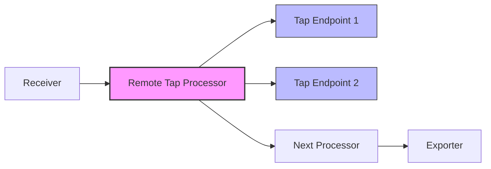

# How to Configure the Remote Tap Processor in the OpenTelemetry Collector

Author: [nawazdhandala](https://www.github.com/nawazdhandala)

Tags: OpenTelemetry, Collector, Processors, Remote Tap, Debugging, Telemetry

Description: Learn how to configure the Remote Tap processor in the OpenTelemetry Collector to duplicate and forward telemetry data to additional endpoints for debugging and monitoring purposes.

The Remote Tap processor is a powerful debugging and monitoring tool in the OpenTelemetry Collector that allows you to duplicate telemetry data and send it to additional endpoints without disrupting your primary data pipeline. This capability proves invaluable when troubleshooting production issues, validating data transformations, or implementing parallel processing workflows.

## Understanding the Remote Tap Processor

The Remote Tap processor operates by creating a copy of incoming telemetry data and forwarding it to specified endpoints while allowing the original data to continue through the standard processing pipeline. This non-intrusive approach enables real-time observation and analysis without impacting production data flow.

The processor supports all three telemetry signals: traces, metrics, and logs. It uses the OpenTelemetry Protocol (OTLP) to transmit duplicated data to remote endpoints, ensuring compatibility with any OTLP-compatible backend.

## Core Architecture

The Remote Tap processor sits within the collector's processing pipeline and implements a fan-out pattern. When telemetry data arrives, the processor duplicates it and sends copies to configured tap endpoints while the original data proceeds to the next processor or exporter.



## Basic Configuration

The Remote Tap processor requires minimal configuration to get started. At its simplest, you specify one or more endpoints to receive the duplicated telemetry data.

Here is a basic configuration example:

```yaml
# Basic Remote Tap processor configuration
processors:
  remotetap:
    # Specify the endpoint to receive duplicated telemetry
    endpoint: localhost:4317
    # Enable insecure connection for development
    insecure: true
```

This configuration duplicates all telemetry data passing through the processor and sends it to a collector or backend running on `localhost:4317`.

## Advanced Configuration Options

For production environments, you'll need more sophisticated configuration including security settings, timeout controls, and error handling.

```yaml
# Advanced Remote Tap processor configuration
processors:
  remotetap:
    # Primary tap endpoint
    endpoint: tap-collector.example.com:4317

    # Security configuration
    insecure: false
    tls:
      # Path to CA certificate for verifying the tap endpoint
      ca_file: /etc/ssl/certs/ca-bundle.crt
      # Client certificate for mutual TLS authentication
      cert_file: /etc/ssl/certs/client-cert.pem
      key_file: /etc/ssl/private/client-key.pem
      # Verify server certificate
      insecure_skip_verify: false

    # Timeout settings
    timeout: 5s

    # Retry configuration
    retry_on_failure:
      enabled: true
      initial_interval: 1s
      max_interval: 30s
      max_elapsed_time: 5m

    # Resource limits
    sending_queue:
      enabled: true
      num_consumers: 10
      queue_size: 1000
```

In this advanced configuration:
- TLS encryption secures data transmission to the tap endpoint
- Timeouts prevent the processor from blocking on slow endpoints
- Retry logic handles temporary network issues
- Queue settings buffer data during endpoint unavailability

## Multiple Tap Endpoints

You can configure multiple Remote Tap processors to send duplicated data to different endpoints, useful for sending data to various debugging tools or monitoring systems simultaneously.

```yaml
# Configuration with multiple tap endpoints
processors:
  # Primary debugging tap
  remotetap/debug:
    endpoint: debug-collector.example.com:4317
    insecure: false
    timeout: 3s

  # Analytics tap
  remotetap/analytics:
    endpoint: analytics-backend.example.com:4317
    insecure: false
    timeout: 5s

  # Local development tap
  remotetap/local:
    endpoint: localhost:4318
    insecure: true
    timeout: 2s

# Apply processors in pipeline
service:
  pipelines:
    traces:
      receivers: [otlp]
      processors: [remotetap/debug, remotetap/analytics, batch]
      exporters: [otlp]
```

Each tap processor operates independently, so if one endpoint becomes unavailable, others continue functioning normally.

## Signal-Specific Configuration

You can configure Remote Tap processors for specific telemetry signals, allowing fine-grained control over what data gets duplicated.

```yaml
# Signal-specific Remote Tap configuration
processors:
  # Tap for traces only
  remotetap/traces:
    endpoint: trace-analyzer.example.com:4317
    insecure: false

  # Tap for metrics only
  remotetap/metrics:
    endpoint: metrics-debugger.example.com:4317
    insecure: false

  # Tap for logs only
  remotetap/logs:
    endpoint: log-inspector.example.com:4317
    insecure: false

service:
  pipelines:
    # Traces pipeline with dedicated tap
    traces:
      receivers: [otlp]
      processors: [remotetap/traces, batch]
      exporters: [otlp/backend]

    # Metrics pipeline with dedicated tap
    metrics:
      receivers: [prometheus]
      processors: [remotetap/metrics, batch]
      exporters: [otlp/backend]

    # Logs pipeline with dedicated tap
    logs:
      receivers: [filelog]
      processors: [remotetap/logs, batch]
      exporters: [otlp/backend]
```

This separation enables routing different signal types to specialized analysis tools.

## Performance Considerations

The Remote Tap processor duplicates data, which impacts memory usage and network bandwidth. Consider these factors when deploying:

1. **Memory Overhead**: Each tap creates a copy of telemetry data in memory. Monitor collector memory usage when adding taps.

2. **Network Bandwidth**: Duplicated data doubles network traffic. For high-volume environments, consider sampling or filtering before tapping.

3. **Endpoint Availability**: Configure appropriate timeouts and queues to prevent tap endpoint issues from affecting primary pipeline performance.

Here is a performance-optimized configuration:

```yaml
# Performance-optimized Remote Tap configuration
processors:
  # Apply sampling before tapping to reduce volume
  probabilistic_sampler:
    sampling_percentage: 10

  # Remote tap with aggressive timeout
  remotetap/perf:
    endpoint: tap-endpoint.example.com:4317
    insecure: false
    # Short timeout prevents blocking
    timeout: 1s
    # Limited queue size
    sending_queue:
      enabled: true
      num_consumers: 5
      queue_size: 500
    # Retry disabled for performance
    retry_on_failure:
      enabled: false

service:
  pipelines:
    traces:
      receivers: [otlp]
      # Sample first, then tap
      processors: [probabilistic_sampler, remotetap/perf, batch]
      exporters: [otlp]
```

## Practical Use Cases

### Debugging Production Issues

When investigating production problems, configure a temporary tap to send data to a local debugging instance:

```yaml
processors:
  remotetap/debug:
    endpoint: localhost:4317
    insecure: true
    timeout: 2s

service:
  pipelines:
    traces:
      receivers: [otlp]
      processors: [remotetap/debug, batch]
      exporters: [otlp/production]
```

This allows real-time inspection without modifying production exporters.

### Validating Data Transformations

Use Remote Tap to compare data before and after transformations:

```yaml
processors:
  # Tap before transformation
  remotetap/before:
    endpoint: validator.example.com:4317

  # Apply transformations
  transform:
    trace_statements:
      - context: span
        statements:
          - set(attributes["environment"], "production")

  # Tap after transformation
  remotetap/after:
    endpoint: validator.example.com:4318

service:
  pipelines:
    traces:
      receivers: [otlp]
      processors: [remotetap/before, transform, remotetap/after, batch]
      exporters: [otlp]
```

## Security Best Practices

Always secure tap endpoints in production environments:

1. **Use TLS**: Never transmit telemetry data over unencrypted connections in production
2. **Authenticate Endpoints**: Implement mutual TLS or API key authentication
3. **Network Segmentation**: Restrict tap endpoint access through firewall rules
4. **Audit Logging**: Monitor which endpoints receive duplicated data

## Troubleshooting

Common issues and solutions:

**Tap endpoint connection failures**: Verify network connectivity and endpoint availability. Check firewall rules and DNS resolution.

**High memory usage**: Reduce queue sizes or implement sampling before tapping.

**Timeout errors**: Increase timeout values or improve tap endpoint performance.

**Data not appearing at tap endpoint**: Confirm the tap endpoint supports OTLP and verify the protocol version matches.

## Related Resources

For more information on OpenTelemetry Collector processors and data processing, check out these related posts:

- [How to Write OTTL Statements for the Transform Processor](https://oneuptime.com/blog/post/2026-02-06-ottl-statements-transform-processor-opentelemetry-collector/view)
- [How to Filter Spans Using OTTL](https://oneuptime.com/blog/post/2026-02-06-filter-spans-ottl-opentelemetry-collector/view)

The Remote Tap processor provides a non-intrusive way to observe and analyze telemetry data flowing through your OpenTelemetry Collector. By duplicating data to additional endpoints, you can debug issues, validate transformations, and implement parallel processing workflows without disrupting production data pipelines. Configure taps carefully considering performance impacts, and always secure tap endpoints in production environments.
