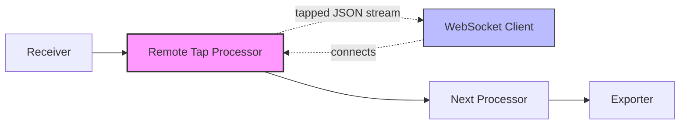

# How to Configure the Remote Tap Processor in the OpenTelemetry Collector

Author: [nawazdhandala](https://www.github.com/nawazdhandala)

Tags: OpenTelemetry, Collector, Processor, Remote Tap, Debugging, Telemetry

Description: Learn how to configure the Remote Tap processor in the OpenTelemetry Collector to duplicate and forward telemetry data to additional endpoints for debugging and monitoring purposes.

The Remote Tap processor is a debugging and monitoring tool in the OpenTelemetry Collector that allows connected WebSocket clients to inspect a rate-limited copy of telemetry data without disrupting your primary data pipeline. This capability proves invaluable when troubleshooting production issues, validating data transformations, or observing data flowing through a Collector pipeline.

## Understanding the Remote Tap Processor

The Remote Tap processor operates by allowing telemetry data to pass through the standard processing pipeline while making a portion of that data available to WebSocket clients connected to its configured endpoint. This non-intrusive approach enables real-time observation and analysis without changing the normal production data flow.

The processor supports all three telemetry signals: traces, metrics, and logs. It serializes tapped telemetry as OpenTelemetry Collector pdata JSON over WebSocket connections, so clients connect to the processor endpoint to receive the sampled stream.

## Core Architecture

The Remote Tap processor sits within the collector's processing pipeline and implements a tee-like pattern. When telemetry data arrives, the processor writes a rate-limited copy to connected WebSocket clients while the original data proceeds to the next processor or exporter.


```mermaid
graph LR
    A[Receiver] --> B[Remote Tap Processor]
    G[WebSocket Client] -. connects .-> B
    B -. tapped JSON stream .-> G
    B --> E[Next Processor]
    E --> F[Exporter]

    style B fill:#f9f,stroke:#333,stroke-width:2px
    style G fill:#bbf,stroke:#333,stroke-width:1px
```

## Basic Configuration

The Remote Tap processor requires minimal configuration to get started. At its simplest, you specify the endpoint on which the processor listens for WebSocket clients and the rate limit for tapped messages.

Here is a basic configuration example:

```yaml
# Basic Remote Tap processor configuration

processors:
  remotetap:
    # Endpoint where WebSocket clients connect
    endpoint: localhost:12001
    # Rate limit in messages per second
    limit: 1
```

This configuration allows WebSocket clients on the local host to connect to `localhost:12001` and receive a rate-limited copy of telemetry passing through the processor.

## Advanced Configuration Options

For production environments, you'll need more sophisticated configuration including secure listener settings, rate limiting, and careful network exposure.

```yaml
# Advanced Remote Tap processor configuration
processors:
  remotetap:
    # Listen only where authorized debugging clients can reach it
    endpoint: 0.0.0.0:12001

    # Rate limit tapped telemetry to avoid overwhelming clients
    limit: 5

    # Server-side TLS configuration for the WebSocket endpoint
    tls:
      cert_file: /etc/ssl/certs/remotetap-cert.pem
      key_file: /etc/ssl/private/remotetap-key.pem
      client_ca_file: /etc/ssl/certs/client-ca.pem
```

In this advanced configuration:
- TLS encryption secures connections to the tap endpoint
- The listener endpoint controls where WebSocket clients can connect
- The rate limit controls how many telemetry messages per second are copied to connected clients
- Mutual TLS can restrict access to clients with certificates signed by the configured CA

## Multiple Tap Endpoints

You can configure multiple Remote Tap processors with different listening endpoints, useful for exposing separate taps for different debugging workflows.

```yaml
# Configuration with multiple tap endpoints
processors:
  # Primary debugging tap
  remotetap/debug:
    endpoint: localhost:12001
    limit: 1

  # Analytics inspection tap
  remotetap/analytics:
    endpoint: localhost:12002
    limit: 2

  # Local development tap
  remotetap/local:
    endpoint: localhost:12003
    limit: 5

# Apply processors in pipeline
service:
  pipelines:
    traces:
      receivers: [otlp]
      processors: [remotetap/debug, remotetap/analytics, batch]
      exporters: [otlp]
```

Each tap processor exposes its own WebSocket endpoint. If no client is connected to one endpoint, the processor still passes telemetry through the pipeline normally.

## Signal-Specific Configuration

You can configure Remote Tap processors for specific telemetry signals by placing them only in the pipelines for those signals, allowing fine-grained control over what data can be inspected.

```yaml
# Signal-specific Remote Tap configuration
processors:
  # Tap for traces only
  remotetap/traces:
    endpoint: localhost:12001
    limit: 1

  # Tap for metrics only
  remotetap/metrics:
    endpoint: localhost:12002
    limit: 1

  # Tap for logs only
  remotetap/logs:
    endpoint: localhost:12003
    limit: 1

service:
  pipelines:
    # Traces pipeline with dedicated tap
    traces:
      receivers: [otlp]
      processors: [remotetap/traces, batch]
      exporters: [otlp/backend]

    # Metrics pipeline with dedicated tap
    metrics:
      receivers: [prometheus]
      processors: [remotetap/metrics, batch]
      exporters: [otlp/backend]

    # Logs pipeline with dedicated tap
    logs:
      receivers: [filelog]
      processors: [remotetap/logs, batch]
      exporters: [otlp/backend]
```

This separation enables connecting debugging clients to the specific signal stream they need to inspect.

## Performance Considerations

The Remote Tap processor duplicates a rate-limited portion of data to connected WebSocket clients, which impacts CPU usage, memory usage, and network bandwidth while clients are connected. Consider these factors when deploying:

1. **Memory Overhead**: Connected WebSocket clients require buffering while tapped data is written. Monitor collector memory usage when clients are connected.

2. **Network Bandwidth**: Tapped data adds network traffic to each connected client. For high-volume environments, keep the `limit` low and consider sampling or filtering before tapping.

3. **Endpoint Availability**: Bind the tap endpoint carefully and restrict access so debugging clients do not expose the Collector to unnecessary load.

Here is a performance-optimized configuration:

```yaml
# Performance-optimized Remote Tap configuration
processors:
  # Apply sampling before tapping to reduce volume
  probabilistic_sampler:
    sampling_percentage: 10

  # Remote tap with a conservative message rate
  remotetap/perf:
    endpoint: localhost:12001
    # Limit copied data to 1 message per second
    limit: 1

service:
  pipelines:
    traces:
      receivers: [otlp]
      # Sample first, then tap
      processors: [probabilistic_sampler, remotetap/perf, batch]
      exporters: [otlp]
```

## Practical Use Cases

### Debugging Production Issues

When investigating production problems, configure a tap endpoint that authorized debugging clients can connect to:

```yaml
processors:
  remotetap/debug:
    endpoint: localhost:12001
    limit: 1

service:
  pipelines:
    traces:
      receivers: [otlp]
      processors: [remotetap/debug, batch]
      exporters: [otlp/production]
```

This allows real-time inspection without modifying production exporters.

### Validating Data Transformations

Use Remote Tap to compare data before and after transformations:

```yaml
processors:
  # Tap before transformation
  remotetap/before:
    endpoint: localhost:12001
    limit: 1

  # Apply transformations
  transform:
    trace_statements:
      - context: span
        statements:
          - set(attributes["environment"], "production")

  # Tap after transformation
  remotetap/after:
    endpoint: localhost:12002
    limit: 1

service:
  pipelines:
    traces:
      receivers: [otlp]
      processors: [remotetap/before, transform, remotetap/after, batch]
      exporters: [otlp]
```

## Security Best Practices

Always secure tap endpoints in production environments:

1. **Use TLS**: Never expose telemetry data over unencrypted WebSocket connections in production
2. **Authenticate Clients**: Use mutual TLS or another supported server authenticator to control access
3. **Network Segmentation**: Restrict tap endpoint access through firewall rules
4. **Audit Logging**: Monitor which clients connect to the remote tap endpoint

## Troubleshooting

Common issues and solutions:

**Tap endpoint connection failures**: Verify network connectivity and endpoint availability. Check firewall rules and DNS resolution.

**High memory usage**: Lower the `limit`, reduce connected clients, or implement sampling before tapping.

**No data received by clients**: Confirm the Remote Tap processor is included in the relevant pipeline and that telemetry is flowing through that pipeline.

**Data not appearing at tap endpoint**: Confirm the client connects over WebSocket to the configured endpoint and can parse the JSON payloads produced by the Collector pdata marshaler.

## Related Resources

For more information on OpenTelemetry Collector processors and data processing, check out these related posts:

- [How to Write OTTL Statements for the Transform Processor](https://oneuptime.com/blog/post/2026-02-06-ottl-statements-transform-processor-opentelemetry-collector/view)
- [How to Filter Spans Using OTTL](https://oneuptime.com/blog/post/2026-02-06-filter-spans-ottl-opentelemetry-collector/view)

The Remote Tap processor provides a non-intrusive way to observe and analyze telemetry data flowing through your OpenTelemetry Collector. By exposing a WebSocket endpoint for a rate-limited copy of telemetry data, you can debug issues and validate transformations without disrupting production data pipelines. Configure taps carefully considering performance impacts, and always secure tap endpoints in production environments.
