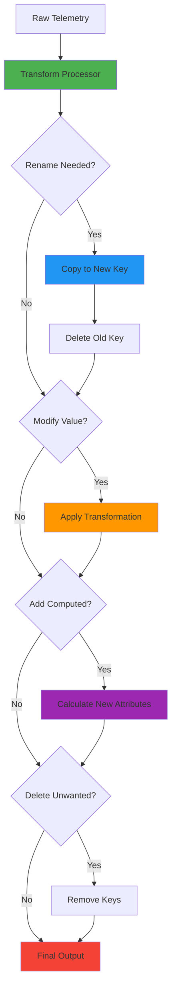

# How to Rename and Modify Attributes Using OTTL in the OpenTelemetry Collector

Author: [nawazdhandala](https://www.github.com/nawazdhandala)

Tags: OpenTelemetry, Collector, OTTL, Attributes, Transform Processor, Metadata

Description: Learn how to rename and modify attributes in the OpenTelemetry Collector using OTTL with practical examples for organizing and enriching your telemetry data.

Attributes are key-value pairs that provide context and metadata for your telemetry data. Whether you're standardizing attribute names across different services, enriching data with computed values, or cleaning up inconsistent metadata, the OpenTelemetry Transformation Language (OTTL) provides powerful tools for attribute manipulation.

## Understanding Attributes in OpenTelemetry

Attributes in OpenTelemetry can exist at different levels:

- **Resource Attributes**: Describe the entity producing the telemetry (service name, host, container)
- **Span Attributes**: Metadata specific to individual spans in traces
- **Log Attributes**: Context information for log records
- **Metric Attributes**: Dimensions for metrics

OTTL allows you to manipulate all these attribute types through the transform processor.

## Basic Attribute Operations

### Renaming Attributes

The most common operation is renaming attributes to follow a consistent naming convention:

```yaml
# Rename attributes to follow OpenTelemetry semantic conventions
processors:
  transform:
    log_statements:
      - context: log
        statements:
          # Rename a single attribute
          - set(attributes["service.name"], attributes["serviceName"])
          - delete_key(attributes, "serviceName")

          # Rename HTTP status code to semantic convention format
          - set(attributes["http.status_code"], attributes["status"])
          - delete_key(attributes, "status")

          # Rename user identifier
          - set(attributes["user.id"], attributes["userId"])
          - delete_key(attributes, "userId")
```

The pattern is straightforward: copy the value to a new attribute name, then delete the old attribute.

### Modifying Attribute Values

You can transform attribute values in various ways:

```yaml
# Modify attribute values
processors:
  transform:
    log_statements:
      - context: log
        statements:
          # Convert to uppercase
          - set(attributes["environment"], Upper(attributes["environment"]))

          # Convert to lowercase for consistency
          - set(attributes["http.method"], Lower(attributes["http.method"]))

          # Trim whitespace
          - set(attributes["user.name"], Trim(attributes["user.name"]))

          # Concatenate values
          - set(attributes["full_identifier"], Concat([attributes["namespace"], ".", attributes["pod_name"]], ""))

          # Replace parts of values
          - replace_pattern(attributes["url"], "https://", "")
```

### Setting Default Values

Ensure attributes have default values when they're missing:

```yaml
# Set default values for missing attributes
processors:
  transform:
    log_statements:
      - context: log
        statements:
          # Set default environment if not present
          - set(attributes["environment"], "production") where attributes["environment"] == nil

          # Set default region
          - set(attributes["region"], "us-east-1") where attributes["region"] == nil

          # Set default log level
          - set(attributes["level"], "info") where attributes["level"] == nil
```

## Renaming Resource Attributes

Resource attributes require accessing the `resource.attributes` context:

```yaml
# Rename resource attributes
processors:
  transform:
    log_statements:
      - context: log
        statements:
          # Rename service name at resource level
          - set(resource.attributes["service.name"], resource.attributes["app_name"])
          - delete_key(resource.attributes, "app_name")

          # Rename deployment environment
          - set(resource.attributes["deployment.environment"], resource.attributes["env"])
          - delete_key(resource.attributes, "env")

          # Rename host identifier
          - set(resource.attributes["host.name"], resource.attributes["hostname"])
          - delete_key(resource.attributes, "hostname")
```

## Complex Attribute Transformations

### Extracting Values from Attributes

You can extract parts of attribute values into new attributes:

```yaml
# Extract information from existing attributes
processors:
  transform:
    log_statements:
      - context: log
        statements:
          # Extract domain from email
          - set(attributes["user.domain"], ExtractPatterns(attributes["user.email"], "@(.+)$"))

          # Extract status class from status code (e.g., 404 -> "4xx")
          - set(attributes["http.status_class"], Concat([Substring(attributes["http.status_code"], 0, 1), "xx"], ""))

          # Extract error code from error message
          - set(attributes["error.code"], ExtractPatterns(attributes["error.message"], "\\[([A-Z0-9_]+)\\]"))

          # Extract version number from user agent
          - set(attributes["browser.version"], ExtractPatterns(attributes["user.agent"], "Version/([0-9.]+)"))
```

### Combining Multiple Attributes

Create new attributes by combining existing ones:

```yaml
# Combine attributes to create new ones
processors:
  transform:
    log_statements:
      - context: log
        statements:
          # Create a composite identifier
          - set(attributes["resource.identifier"], Concat([resource.attributes["service.name"], "-", resource.attributes["deployment.environment"]], ""))

          # Create full URL from parts
          - set(attributes["http.full_url"], Concat(["https://", attributes["http.host"], attributes["http.path"]], ""))

          # Create geographic location string
          - set(attributes["geo.location"], Concat([attributes["geo.city"], ", ", attributes["geo.country"]], ""))

          # Create time range identifier
          - set(attributes["time_bucket"], Concat([String(attributes["year"]), "-", String(attributes["month"])], ""))
```

### Conditional Attribute Modification

Modify attributes based on conditions:

```yaml
# Conditionally modify attributes
processors:
  transform:
    log_statements:
      - context: log
        statements:
          # Normalize environment names
          - set(attributes["environment"], "production") where attributes["environment"] == "prod"
          - set(attributes["environment"], "production") where attributes["environment"] == "prd"
          - set(attributes["environment"], "development") where attributes["environment"] == "dev"
          - set(attributes["environment"], "staging") where attributes["environment"] == "stage"

          # Set priority based on severity
          - set(attributes["priority"], "high") where severity_number >= 17
          - set(attributes["priority"], "medium") where severity_number >= 9 and severity_number < 17
          - set(attributes["priority"], "low") where severity_number < 9

          # Classify HTTP status codes
          - set(attributes["http.status_type"], "success") where Int(attributes["http.status_code"]) >= 200 and Int(attributes["http.status_code"]) < 300
          - set(attributes["http.status_type"], "redirect") where Int(attributes["http.status_code"]) >= 300 and Int(attributes["http.status_code"]) < 400
          - set(attributes["http.status_type"], "client_error") where Int(attributes["http.status_code"]) >= 400 and Int(attributes["http.status_code"]) < 500
          - set(attributes["http.status_type"], "server_error") where Int(attributes["http.status_code"]) >= 500
```

## Bulk Attribute Renaming

When migrating from one naming convention to another, you need to rename many attributes:

```yaml
# Bulk rename attributes to OpenTelemetry semantic conventions
processors:
  transform:
    log_statements:
      - context: log
        statements:
          # HTTP attributes
          - set(attributes["http.method"], attributes["request.method"])
          - delete_key(attributes, "request.method")

          - set(attributes["http.url"], attributes["request.url"])
          - delete_key(attributes, "request.url")

          - set(attributes["http.status_code"], attributes["response.status"])
          - delete_key(attributes, "response.status")

          - set(attributes["http.request.body.size"], attributes["request.size"])
          - delete_key(attributes, "request.size")

          - set(attributes["http.response.body.size"], attributes["response.size"])
          - delete_key(attributes, "response.size")

          # User attributes
          - set(attributes["enduser.id"], attributes["user_id"])
          - delete_key(attributes, "user_id")

          - set(attributes["enduser.role"], attributes["user_role"])
          - delete_key(attributes, "user_role")

          # Database attributes
          - set(attributes["db.system"], attributes["database.type"])
          - delete_key(attributes, "database.type")

          - set(attributes["db.name"], attributes["database.name"])
          - delete_key(attributes, "database.name")

          - set(attributes["db.operation"], attributes["query.type"])
          - delete_key(attributes, "query.type")
```

## Attribute Enrichment

Add computed or derived attributes to enrich your telemetry:

```yaml
# Enrich telemetry with computed attributes
processors:
  transform:
    log_statements:
      - context: log
        statements:
          # Add timestamp-based attributes
          - set(attributes["hour_of_day"], Hour(time_now()))
          - set(attributes["day_of_week"], DayOfWeek(time_now()))

          # Add processing timestamp
          - set(attributes["processed_at"], UnixMicro(time_now()))

          # Add data classification
          - set(attributes["contains_pii"], IsMatch(body, "\\b[A-Za-z0-9._%+-]+@[A-Za-z0-9.-]+\\.[A-Z|a-z]{2,}\\b"))

          # Add size metrics
          - set(attributes["body_length"], Len(body))

          # Add flags based on content
          - set(attributes["is_error"], severity_number >= 17)
          - set(attributes["has_trace"], trace_id != nil)

          # Add service tier based on service name
          - set(attributes["service.tier"], "frontend") where IsMatch(resource.attributes["service.name"], "(?i)web|frontend|ui")
          - set(attributes["service.tier"], "backend") where IsMatch(resource.attributes["service.name"], "(?i)api|service|backend")
          - set(attributes["service.tier"], "data") where IsMatch(resource.attributes["service.name"], "(?i)database|cache|storage")
```

## Complete Attribute Management Pipeline

Here's a comprehensive example showing attribute management in a real-world scenario:

```yaml
# Complete collector configuration for attribute management
receivers:
  otlp:
    protocols:
      grpc:
        endpoint: 0.0.0.0:4317
      http:
        endpoint: 0.0.0.0:4318

  # Receive logs from Kubernetes
  k8scluster:
    auth_type: serviceAccount

processors:
  # Memory limiter
  memory_limiter:
    check_interval: 1s
    limit_mib: 512

  # Resource detection
  resourcedetection:
    detectors: [env, system, docker]
    timeout: 5s

  # Transform processor for attribute management
  transform:
    log_statements:
      - context: log
        statements:
          # Step 1: Rename legacy attributes to semantic conventions
          - set(attributes["http.method"], attributes["request_method"])
          - delete_key(attributes, "request_method")

          - set(attributes["http.status_code"], attributes["status"])
          - delete_key(attributes, "status")

          - set(attributes["http.url"], attributes["request_url"])
          - delete_key(attributes, "request_url")

          # Step 2: Normalize attribute values
          - set(attributes["http.method"], Upper(attributes["http.method"]))
          - set(attributes["environment"], Lower(attributes["environment"]))

          # Step 3: Set defaults for missing attributes
          - set(attributes["environment"], "production") where attributes["environment"] == nil
          - set(attributes["region"], "us-east-1") where attributes["region"] == nil

          # Step 4: Create computed attributes
          - set(attributes["http.status_class"], Concat([Substring(String(attributes["http.status_code"]), 0, 1), "xx"], "")) where attributes["http.status_code"] != nil

          - set(attributes["is_error"], Int(attributes["http.status_code"]) >= 400) where attributes["http.status_code"] != nil

          - set(attributes["response_time_bucket"], "fast") where Int(attributes["duration_ms"]) < 100
          - set(attributes["response_time_bucket"], "medium") where Int(attributes["duration_ms"]) >= 100 and Int(attributes["duration_ms"]) < 1000
          - set(attributes["response_time_bucket"], "slow") where Int(attributes["duration_ms"]) >= 1000

          # Step 5: Enrich with resource context
          - set(attributes["service.instance"], Concat([resource.attributes["service.name"], "-", resource.attributes["host.name"]], ""))

          # Step 6: Clean up unwanted attributes
          - delete_key(attributes, "internal_id")
          - delete_key(attributes, "debug_info")
          - delete_key(attributes, "temp_data")

  # Kubernetes attributes processor
  k8sattributes:
    auth_type: serviceAccount
    passthrough: false
    extract:
      metadata:
        - k8s.pod.name
        - k8s.pod.uid
        - k8s.deployment.name
        - k8s.namespace.name
      labels:
        - tag_name: app.label.component
          key: app.kubernetes.io/component
          from: pod

  # Resource processor for additional modifications
  resource:
    attributes:
      # Rename Kubernetes attributes
      - key: k8s.cluster.name
        from_attribute: cluster_name
        action: insert
      - key: cluster_name
        action: delete

  # Batch processor
  batch:
    timeout: 10s
    send_batch_size: 1024

exporters:
  otlp:
    endpoint: https://your-backend:4317
    tls:
      insecure: false

  debug:
    verbosity: detailed

service:
  pipelines:
    logs:
      receivers: [otlp]
      processors: [memory_limiter, resourcedetection, transform, k8sattributes, resource, batch]
      exporters: [otlp, debug]
```

## Attribute Transformation Flow

Here's how attribute modifications flow through the collector:



## Advanced Attribute Patterns

### Namespace-based Organization

Organize attributes using prefixes or namespaces:

```yaml
# Organize attributes with namespaces
processors:
  transform:
    log_statements:
      - context: log
        statements:
          # Move all HTTP-related attributes to http namespace
          - set(attributes["http.request.method"], attributes["method"])
          - delete_key(attributes, "method")

          - set(attributes["http.request.path"], attributes["path"])
          - delete_key(attributes, "path")

          # Move user attributes to user namespace
          - set(attributes["user.id"], attributes["uid"])
          - delete_key(attributes, "uid")

          - set(attributes["user.email"], attributes["email"])
          - delete_key(attributes, "email")
```

### Dynamic Attribute Names

Create attribute names dynamically based on values:

```yaml
# Create dynamic attribute names
processors:
  transform:
    log_statements:
      - context: log
        statements:
          # Create metric-style attributes for dimensions
          # Example: status=200 becomes metric.status.200 = true
          - set(attributes[Concat(["metric.status.", String(attributes["http.status_code"])], "")], true) where attributes["http.status_code"] != nil

          # Tag by environment
          - set(attributes[Concat(["env.", attributes["environment"]], "")], true) where attributes["environment"] != nil
```

### Attribute Copying and Backup

Preserve original values before transformation:

```yaml
# Backup attributes before transformation
processors:
  transform:
    log_statements:
      - context: log
        statements:
          # Backup original values
          - set(attributes["original.status"], attributes["status"])
          - set(attributes["original.method"], attributes["method"])

          # Now transform
          - set(attributes["http.status_code"], attributes["status"])
          - set(attributes["http.method"], Upper(attributes["method"]))

          # Remove old attributes but keep backup
          - delete_key(attributes, "status")
          - delete_key(attributes, "method")
```

## Best Practices for Attribute Management

1. **Follow Semantic Conventions**: Use [OpenTelemetry semantic conventions](https://opentelemetry.io/docs/specs/semconv/) for attribute names.

2. **Rename Before Delete**: Always copy the value to the new attribute name before deleting the old one to prevent data loss.

3. **Use Consistent Naming**: Establish and follow a consistent naming convention across your organization.

4. **Validate After Transformation**: Add attributes that flag successful transformations for monitoring.

5. **Document Your Mappings**: Keep a record of attribute name mappings for troubleshooting.

6. **Test Thoroughly**: Use the [OTTL Playground](https://oneuptime.com/blog/post/2026-02-06-ottl-playground-test-opentelemetry-collector/view) to test transformations before deployment.

7. **Consider Cardinality**: Be cautious when creating new attributes from high-cardinality values (like timestamps or IDs).

8. **Use Resource Attributes Wisely**: Resource attributes apply to all telemetry from that resource, so modifications affect logs, metrics, and traces.

9. **Optimize for Performance**: Minimize the number of transformations by combining operations where possible.

10. **Handle Nil Values**: Always check for nil before accessing or transforming attributes.

## Common Pitfalls to Avoid

1. **Deleting Before Copying**: Always set the new attribute before deleting the old one.

2. **Type Mismatches**: Ensure type conversions are applied when needed (string to int, etc.).

3. **Case Sensitivity**: Attribute names are case-sensitive; be consistent.

4. **Overwriting Important Attributes**: Be careful not to accidentally overwrite semantic convention attributes.

5. **Creating Too Many Attributes**: High attribute counts can impact storage and query performance.

## Conclusion

Renaming and modifying attributes with OTTL in the OpenTelemetry Collector is essential for maintaining clean, consistent telemetry data. Whether you're migrating to semantic conventions, normalizing data from multiple sources, or enriching telemetry with computed values, the transform processor provides the flexibility you need.

Combined with other OTTL capabilities like [log body transformation](https://oneuptime.com/blog/post/2026-02-06-transform-log-bodies-ottl-opentelemetry-collector/view), [JSON parsing](https://oneuptime.com/blog/post/2026-02-06-parse-json-logs-ottl-opentelemetry-collector/view), and [conditional logic](https://oneuptime.com/blog/post/2026-02-06-conditional-logic-ottl-opentelemetry-collector/view), you can build comprehensive telemetry pipelines that ensure your data is well-structured and ready for analysis.

For more information on attributes and OTTL, refer to the [OpenTelemetry Collector documentation](https://opentelemetry.io/docs/collector/transforming-telemetry/).
