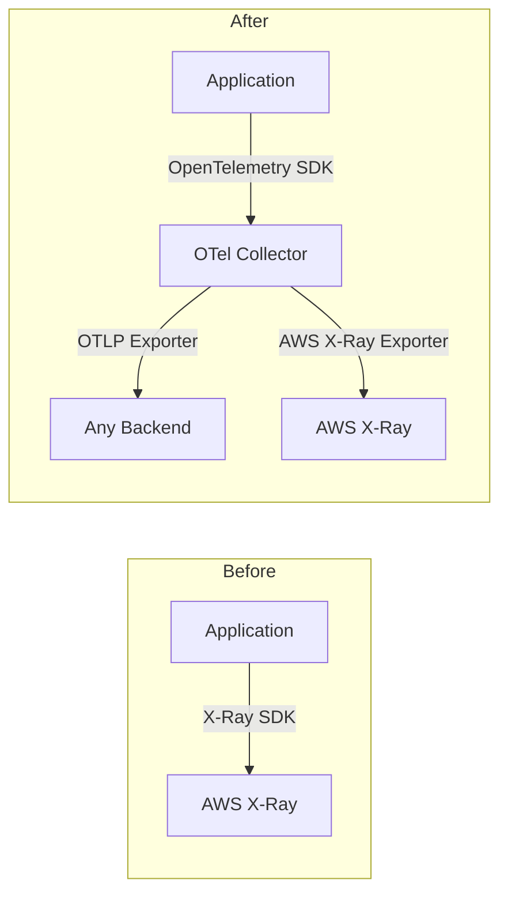
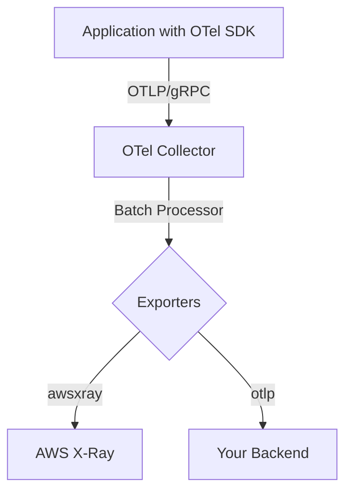

# How to Replace AWS X-Ray SDK with OpenTelemetry

Author: [nawazdhandala](https://www.github.com/nawazdhandala)

Tags: OpenTelemetry, AWS, X-Ray, Distributed Tracing, Migration, Observability, Cloud

Description: Step-by-step guide to migrating from the AWS X-Ray SDK to OpenTelemetry for distributed tracing, with practical code examples and collector configuration.

---

AWS X-Ray has been the default distributed tracing solution for applications running on AWS. It works well within the AWS ecosystem, but it locks you into a single vendor. If you want to trace requests across multiple cloud providers, send data to different backends, or simply adopt an industry standard, OpenTelemetry is the way forward. The good news is that AWS themselves now recommend OpenTelemetry as the preferred instrumentation path for X-Ray.

This guide walks you through removing the X-Ray SDK from your application and replacing it with OpenTelemetry instrumentation. We will cover Node.js and Python examples since those are the most common languages used with X-Ray.

## Why Move Away from X-Ray SDK

The X-Ray SDK has several limitations that OpenTelemetry addresses directly. X-Ray only sends data to AWS X-Ray, so you cannot fan out traces to other backends without building custom plumbing. The SDK uses its own trace context format (the `X-Amzn-Trace-Id` header), which can cause interoperability problems when your services talk to non-AWS systems. OpenTelemetry uses the W3C Trace Context standard, which is supported across all major observability platforms.

AWS has also slowed development on the X-Ray SDK in favor of the AWS Distro for OpenTelemetry (ADOT). ADOT is essentially OpenTelemetry with AWS-specific exporters and resource detectors pre-packaged. This means you get all the benefits of the OpenTelemetry ecosystem while still being able to send data to X-Ray if you want to.



## Step 1: Remove the X-Ray SDK

Start by removing the X-Ray SDK from your project. In a Node.js project, that means uninstalling the package and removing all the initialization code.

Here is what typical X-Ray SDK setup looks like in Node.js. You will want to find and remove all of this.

```javascript
// REMOVE: Old X-Ray SDK initialization code
const AWSXRay = require('aws-xray-sdk');
const AWS = AWSXRay.captureAWS(require('aws-sdk'));

// REMOVE: X-Ray Express middleware
app.use(AWSXRay.express.openSegment('my-app'));
// ... routes ...
app.use(AWSXRay.express.closeSegment());

// REMOVE: Manual segment creation
const segment = AWSXRay.getSegment();
const subsegment = segment.addNewSubsegment('my-operation');
subsegment.close();
```

For Python, remove the X-Ray SDK similarly.

```python
# REMOVE: Old X-Ray SDK initialization code
from aws_xray_sdk.core import xray_recorder
from aws_xray_sdk.ext.flask.middleware import XRayMiddleware

# REMOVE: Flask middleware setup
xray_recorder.configure(service='my-app')
XRayMiddleware(app, xray_recorder)

# REMOVE: Manual subsegment creation
with xray_recorder.in_subsegment('my-operation') as subsegment:
    subsegment.put_annotation('key', 'value')
```

Uninstall the packages after removing the code.

```bash
# Node.js: remove the X-Ray SDK package
npm uninstall aws-xray-sdk

# Python: remove the X-Ray SDK package
pip uninstall aws-xray-sdk
```

## Step 2: Install OpenTelemetry Packages

Install the OpenTelemetry SDK and the auto-instrumentation libraries you need. The exact packages depend on what your application does (HTTP, database calls, AWS SDK calls, etc.).

For Node.js, install the core packages plus any instrumentation libraries for the frameworks you use.

```bash
# Install OpenTelemetry core packages for Node.js
npm install @opentelemetry/sdk-node \
  @opentelemetry/api \
  @opentelemetry/exporter-trace-otlp-grpc \
  @opentelemetry/auto-instrumentations-node \
  @opentelemetry/resource-detector-aws
```

For Python, the installation is similar.

```bash
# Install OpenTelemetry core packages for Python
pip install opentelemetry-sdk \
  opentelemetry-api \
  opentelemetry-exporter-otlp \
  opentelemetry-instrumentation-flask \
  opentelemetry-instrumentation-boto3 \
  opentelemetry-resource-detector-aws
```

## Step 3: Initialize OpenTelemetry in Your Application

Replace the X-Ray initialization code with OpenTelemetry setup. The key components are a tracer provider, an exporter, and a resource that describes your service.

This Node.js example sets up OpenTelemetry with OTLP export and automatic instrumentation for common libraries.

```javascript
// tracing.js - OpenTelemetry initialization (replaces X-Ray SDK setup)
const { NodeSDK } = require('@opentelemetry/sdk-node');
const { OTLPTraceExporter } = require('@opentelemetry/exporter-trace-otlp-grpc');
const { getNodeAutoInstrumentations } = require('@opentelemetry/auto-instrumentations-node');
const { AwsEcsDetector, AwsEc2Detector } = require('@opentelemetry/resource-detector-aws');
const { Resource } = require('@opentelemetry/resources');

// Create the SDK with auto-instrumentation enabled
const sdk = new NodeSDK({
  // Define service name and other resource attributes
  resource: new Resource({
    'service.name': 'my-app',
    'service.version': '1.0.0',
    'deployment.environment': process.env.NODE_ENV || 'development',
  }),

  // Send traces to the OTel Collector via OTLP/gRPC
  traceExporter: new OTLPTraceExporter({
    url: process.env.OTEL_EXPORTER_OTLP_ENDPOINT || 'http://localhost:4317',
  }),

  // Automatically instrument HTTP, Express, AWS SDK, and more
  instrumentations: [getNodeAutoInstrumentations()],

  // Detect AWS resource attributes (ECS task ID, EC2 instance ID, etc.)
  resourceDetectors: [new AwsEcsDetector(), new AwsEc2Detector()],
});

// Start the SDK before your application code runs
sdk.start();

// Gracefully shut down on process exit
process.on('SIGTERM', () => {
  sdk.shutdown().then(() => process.exit(0));
});
```

For Python with Flask, the setup looks like this.

```python
# tracing.py - OpenTelemetry initialization (replaces X-Ray SDK setup)
from opentelemetry import trace
from opentelemetry.sdk.trace import TracerProvider
from opentelemetry.sdk.trace.export import BatchSpanProcessor
from opentelemetry.exporter.otlp.proto.grpc.trace_exporter import OTLPSpanExporter
from opentelemetry.sdk.resources import Resource
from opentelemetry.instrumentation.flask import FlaskInstrumentor
from opentelemetry.instrumentation.boto3 import Boto3Instrumentor

# Define the service resource with identifying attributes
resource = Resource.create({
    "service.name": "my-app",
    "service.version": "1.0.0",
    "deployment.environment": "production",
})

# Create and register the tracer provider
provider = TracerProvider(resource=resource)

# Export spans to the OTel Collector via OTLP/gRPC
otlp_exporter = OTLPSpanExporter(endpoint="http://localhost:4317")
provider.add_span_processor(BatchSpanProcessor(otlp_exporter))

# Set this provider as the global default
trace.set_tracer_provider(provider)

# Auto-instrument Flask and boto3 (AWS SDK for Python)
FlaskInstrumentor().instrument()
Boto3Instrumentor().instrument()
```

## Step 4: Map X-Ray Concepts to OpenTelemetry

If you had manual instrumentation with X-Ray segments and subsegments, you need to translate those to OpenTelemetry spans. The mapping is straightforward.

| X-Ray Concept | OpenTelemetry Equivalent |
|---|---|
| Segment | Root Span |
| Subsegment | Child Span |
| Annotation | Span Attribute (indexed) |
| Metadata | Span Attribute (non-indexed) |
| Error/Fault | Span Status + Exception Event |

Here is how manual X-Ray instrumentation translates to OpenTelemetry in Node.js.

```javascript
// Get a tracer instance (equivalent to getting an X-Ray segment)
const { trace } = require('@opentelemetry/api');
const tracer = trace.getTracer('my-app');

// Create a span (replaces X-Ray subsegments)
tracer.startActiveSpan('process-payment', (span) => {
  // Set attributes (replaces X-Ray annotations and metadata)
  span.setAttribute('payment.method', 'credit_card');
  span.setAttribute('payment.amount', 99.99);
  span.setAttribute('customer.id', 'cust-12345');

  try {
    // Your business logic here
    processPayment();
    span.setStatus({ code: trace.SpanStatusCode.OK });
  } catch (error) {
    // Record errors (replaces X-Ray fault/error flags)
    span.setStatus({ code: trace.SpanStatusCode.ERROR, message: error.message });
    span.recordException(error);
    throw error;
  } finally {
    // Always end the span (replaces subsegment.close())
    span.end();
  }
});
```

## Step 5: Deploy the OpenTelemetry Collector

You need something to receive the OTLP data from your application and forward it to your chosen backend. The OpenTelemetry Collector handles this. If you still want to send data to X-Ray during the migration, you can configure the Collector with the AWS X-Ray exporter alongside any other exporter.

This Collector configuration receives OTLP data and sends it to both X-Ray and a generic OTLP endpoint.

```yaml
# otel-collector-config.yaml
receivers:
  otlp:
    protocols:
      grpc:
        # Listen for OTLP/gRPC on the standard port
        endpoint: 0.0.0.0:4317
      http:
        # Listen for OTLP/HTTP on the standard port
        endpoint: 0.0.0.0:4318

processors:
  batch:
    # Batch spans before exporting to reduce network overhead
    send_batch_size: 1024
    timeout: 5s

  resource:
    attributes:
      - key: cloud.provider
        value: aws
        action: upsert

exporters:
  # Send traces to AWS X-Ray (keeps backward compatibility)
  awsxray:
    region: us-east-1

  # Also send traces to your preferred OTLP-compatible backend
  otlp:
    endpoint: https://your-observability-platform.com:4317
    headers:
      authorization: "Bearer ${BACKEND_API_KEY}"

service:
  pipelines:
    traces:
      receivers: [otlp]
      processors: [batch, resource]
      # Fan out to both X-Ray and your other backend
      exporters: [awsxray, otlp]
```



## Step 6: Handle Lambda Functions

If you are running on AWS Lambda, the migration is even simpler. AWS provides an OpenTelemetry Lambda layer that handles most of the setup automatically.

```bash
# Add the AWS OpenTelemetry Lambda layer to your function
aws lambda update-function-configuration \
  --function-name my-function \
  --layers arn:aws:lambda:us-east-1:901920570463:layer:aws-otel-nodejs-amd64-ver-1-18-1:1 \
  --environment "Variables={
    AWS_LAMBDA_EXEC_WRAPPER=/opt/otel-handler,
    OTEL_SERVICE_NAME=my-lambda-function,
    OTEL_EXPORTER_OTLP_ENDPOINT=http://collector.example.com:4317
  }"
```

The Lambda layer wraps your function handler and automatically instruments incoming requests, AWS SDK calls, and outgoing HTTP requests. You do not need to change any application code if you were relying purely on auto-instrumentation.

## Verifying the Migration

After deploying the changes, verify that traces are flowing correctly. Check your backend for traces and confirm that they contain the expected spans, attributes, and parent-child relationships. A few things to look for:

- Service name appears correctly in your trace viewer
- HTTP spans have the right method, URL, and status code attributes
- AWS SDK calls (DynamoDB, S3, SQS, etc.) show up as child spans
- Trace context propagates correctly between services
- Error spans include exception details

If you kept the X-Ray exporter in your Collector config, you can compare traces in X-Ray with your new backend to make sure nothing is missing.

## Summary

Replacing the AWS X-Ray SDK with OpenTelemetry gives you vendor-neutral instrumentation, W3C Trace Context compatibility, and the flexibility to send data wherever you need it. The migration path is clear: remove the X-Ray SDK, install OpenTelemetry packages, translate any manual instrumentation, and deploy a Collector to route your data. You can keep sending data to X-Ray during the transition, so there is no need for a risky cutover.
