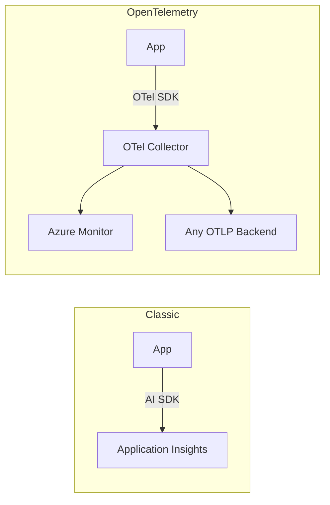
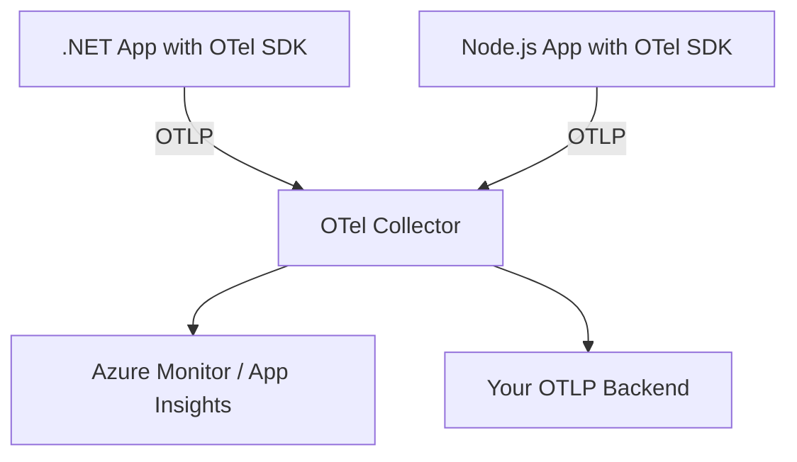

# How to Replace Azure Application Insights SDK with OpenTelemetry

Author: [nawazdhandala](https://www.github.com/nawazdhandala)

Tags: OpenTelemetry, Azure, Application Insights, Distributed Tracing, Migration, Observability, .NET, Cloud

Description: A practical guide to migrating from the Azure Application Insights SDK to OpenTelemetry, covering .NET, Node.js, and Python with real configuration examples.

---

Azure Application Insights has been the go-to observability solution for applications running on Azure. It provides tracing, metrics, and logging out of the box, with deep integration into the Azure portal. But like all proprietary SDKs, it ties your instrumentation to a single vendor and a single backend. Microsoft recognized this and now officially recommends OpenTelemetry-based instrumentation for Application Insights. In fact, the Azure Monitor OpenTelemetry Distro is their preferred path forward.

This guide shows you how to remove the classic Application Insights SDK and replace it with OpenTelemetry. We will focus on .NET (the most common language for App Insights users), but also cover Node.js and Python.

## Why Migrate from Application Insights SDK

The classic Application Insights SDK (also called the "classic API") is now in maintenance mode for most languages. Microsoft has shifted their investment to OpenTelemetry-based instrumentation. Here is what you gain by switching:

- **Vendor neutrality**: Send your telemetry to any OTLP-compatible backend, not just Azure Monitor
- **Standard APIs**: Use the same instrumentation code regardless of where your app runs
- **Broader ecosystem**: Tap into hundreds of OpenTelemetry instrumentation libraries
- **W3C Trace Context**: Get interoperable distributed tracing across cloud boundaries
- **Future-proof**: Microsoft is building new features on top of OpenTelemetry, not the classic SDK



## Step 1: Audit Your Current Application Insights Usage

Before ripping anything out, understand what the Application Insights SDK is doing in your codebase. Look for these common patterns.

In .NET applications, check your `Startup.cs` or `Program.cs` for the telemetry setup.

```csharp
// IDENTIFY: Classic Application Insights setup in .NET
// Look for these patterns in your Startup.cs or Program.cs

// Auto-collection of requests, dependencies, exceptions
services.AddApplicationInsightsTelemetry();

// Custom telemetry client usage
private readonly TelemetryClient _telemetryClient;

// Manual tracking calls
_telemetryClient.TrackEvent("OrderPlaced", properties);
_telemetryClient.TrackDependency("SQL", "SELECT ...", startTime, duration, success);
_telemetryClient.TrackException(exception);
_telemetryClient.TrackMetric("OrderValue", 99.99);
```

In Node.js, the setup pattern looks different.

```javascript
// IDENTIFY: Classic Application Insights setup in Node.js
const appInsights = require('applicationinsights');

// SDK initialization with connection string
appInsights.setup(process.env.APPLICATIONINSIGHTS_CONNECTION_STRING)
  .setAutoCollectRequests(true)
  .setAutoCollectDependencies(true)
  .setAutoCollectExceptions(true)
  .start();

// Custom telemetry
const client = appInsights.defaultClient;
client.trackEvent({ name: 'OrderPlaced', properties: { orderId: '123' } });
client.trackDependency({ target: 'my-api', name: 'GET /users', duration: 150 });
```

## Step 2: Install OpenTelemetry Packages

For .NET, Microsoft provides the Azure Monitor OpenTelemetry Distro, which bundles OpenTelemetry with the Azure Monitor exporter. This is the easiest migration path if you want to keep sending data to Application Insights.

```bash
# .NET: Install Azure Monitor OpenTelemetry distro
dotnet add package Azure.Monitor.OpenTelemetry.AspNetCore

# Or install OpenTelemetry components individually for more control
dotnet add package OpenTelemetry.Extensions.Hosting
dotnet add package OpenTelemetry.Instrumentation.AspNetCore
dotnet add package OpenTelemetry.Instrumentation.Http
dotnet add package OpenTelemetry.Instrumentation.SqlClient
dotnet add package OpenTelemetry.Exporter.OpenTelemetryProtocol
dotnet add package Azure.Monitor.OpenTelemetry.Exporter
```

For Node.js, install the standard OpenTelemetry packages plus the Azure Monitor exporter.

```bash
# Node.js: Install OpenTelemetry packages with Azure Monitor exporter
npm install @opentelemetry/sdk-node \
  @opentelemetry/api \
  @opentelemetry/auto-instrumentations-node \
  @opentelemetry/exporter-trace-otlp-grpc \
  @azure/monitor-opentelemetry-exporter
```

For Python, the process is similar.

```bash
# Python: Install OpenTelemetry packages with Azure Monitor exporter
pip install opentelemetry-sdk \
  opentelemetry-api \
  opentelemetry-instrumentation-flask \
  opentelemetry-instrumentation-django \
  opentelemetry-exporter-otlp \
  azure-monitor-opentelemetry-exporter
```

## Step 3: Replace the SDK Initialization

Now swap out the Application Insights initialization with OpenTelemetry. The .NET example below uses the Azure Monitor distro, which gives you the closest feature parity with the classic SDK.

This .NET setup replaces `AddApplicationInsightsTelemetry()` with OpenTelemetry configuration.

```csharp
// Program.cs - Replace Application Insights with OpenTelemetry
using Azure.Monitor.OpenTelemetry.AspNetCore;
using OpenTelemetry.Resources;
using OpenTelemetry.Trace;
using OpenTelemetry.Metrics;
using OpenTelemetry.Logs;

var builder = WebApplication.CreateBuilder(args);

// Option A: Use the Azure Monitor distro (simplest migration path)
// This auto-configures traces, metrics, and logs for Azure Monitor
builder.Services.AddOpenTelemetry().UseAzureMonitor(options =>
{
    options.ConnectionString = builder.Configuration["APPLICATIONINSIGHTS_CONNECTION_STRING"];
});

// Option B: Full control with individual OpenTelemetry configuration
builder.Services.AddOpenTelemetry()
    .ConfigureResource(resource => resource.AddService(
        serviceName: "my-app",
        serviceVersion: "1.0.0"))
    .WithTracing(tracing => tracing
        // Instrument incoming ASP.NET Core requests
        .AddAspNetCoreInstrumentation()
        // Instrument outgoing HTTP calls
        .AddHttpClientInstrumentation()
        // Instrument SQL Server queries
        .AddSqlClientInstrumentation(options =>
            options.SetDbStatementForText = true)
        // Export to Azure Monitor
        .AddAzureMonitorTraceExporter(options =>
            options.ConnectionString = builder.Configuration["APPLICATIONINSIGHTS_CONNECTION_STRING"])
        // Also export to a generic OTLP endpoint
        .AddOtlpExporter(options =>
            options.Endpoint = new Uri("http://otel-collector:4317")))
    .WithMetrics(metrics => metrics
        .AddAspNetCoreInstrumentation()
        .AddHttpClientInstrumentation()
        .AddAzureMonitorMetricExporter(options =>
            options.ConnectionString = builder.Configuration["APPLICATIONINSIGHTS_CONNECTION_STRING"]));

var app = builder.Build();
```

For Node.js, replace the `applicationinsights` module with OpenTelemetry.

```javascript
// tracing.js - Replace Application Insights SDK with OpenTelemetry
const { NodeSDK } = require('@opentelemetry/sdk-node');
const { getNodeAutoInstrumentations } = require('@opentelemetry/auto-instrumentations-node');
const { OTLPTraceExporter } = require('@opentelemetry/exporter-trace-otlp-grpc');
const { AzureMonitorTraceExporter } = require('@azure/monitor-opentelemetry-exporter');
const { Resource } = require('@opentelemetry/resources');
const { BatchSpanProcessor } = require('@opentelemetry/sdk-trace-base');

// Create Azure Monitor exporter using the connection string
const azureExporter = new AzureMonitorTraceExporter({
  connectionString: process.env.APPLICATIONINSIGHTS_CONNECTION_STRING,
});

// Create OTLP exporter for your other backend
const otlpExporter = new OTLPTraceExporter({
  url: process.env.OTEL_EXPORTER_OTLP_ENDPOINT || 'http://localhost:4317',
});

const sdk = new NodeSDK({
  resource: new Resource({
    'service.name': 'my-app',
    'service.version': '1.0.0',
  }),

  // Use multiple span processors to send data to multiple backends
  spanProcessors: [
    new BatchSpanProcessor(azureExporter),
    new BatchSpanProcessor(otlpExporter),
  ],

  // Auto-instrument HTTP, Express, database clients, etc.
  instrumentations: [getNodeAutoInstrumentations()],
});

sdk.start();
```

## Step 4: Translate Custom Telemetry Calls

The classic Application Insights SDK has specific methods like `TrackEvent`, `TrackDependency`, and `TrackMetric`. You need to map these to their OpenTelemetry equivalents.

| Application Insights | OpenTelemetry Equivalent |
|---|---|
| `TrackRequest` | Automatic via HTTP instrumentation |
| `TrackDependency` | Automatic via client instrumentation, or create a span |
| `TrackException` | `span.RecordException()` + set error status |
| `TrackEvent` | Span with `span.AddEvent()` or a Log record |
| `TrackMetric` | Meter API with Counter/Histogram |
| `TrackTrace` | Log record via ILogger or OTel Logs API |

Here is how to translate common custom telemetry calls in .NET.

```csharp
// Before: Application Insights TelemetryClient
// _telemetryClient.TrackEvent("OrderPlaced",
//     new Dictionary<string, string> { { "orderId", "123" } },
//     new Dictionary<string, double> { { "orderValue", 99.99 } });

// After: OpenTelemetry span with event
using var activity = ActivitySource.StartActivity("ProcessOrder");
activity?.SetTag("order.id", "123");
activity?.SetTag("order.value", 99.99);
// AddEvent is the closest equivalent to TrackEvent
activity?.AddEvent(new ActivityEvent("OrderPlaced",
    tags: new ActivityTagsCollection
    {
        { "order.id", "123" },
        { "order.value", 99.99 }
    }));

// Before: _telemetryClient.TrackException(ex);
// After: Record the exception on the current span
activity?.SetStatus(ActivityStatusCode.Error, ex.Message);
activity?.RecordException(ex);

// Before: _telemetryClient.TrackMetric("OrderValue", 99.99);
// After: Use the Meter API
var meter = new Meter("MyApp.Orders");
var orderValueHistogram = meter.CreateHistogram<double>("order.value", "USD");
orderValueHistogram.Record(99.99, new KeyValuePair<string, object>("region", "us-east"));
```

## Step 5: Configure the OpenTelemetry Collector

If you want to decouple your application from any specific backend, deploy the OpenTelemetry Collector as an intermediary. This lets you route data to Azure Monitor and any other backend without changing application code.

```yaml
# otel-collector-config.yaml
receivers:
  otlp:
    protocols:
      grpc:
        # Standard OTLP/gRPC port
        endpoint: 0.0.0.0:4317
      http:
        # Standard OTLP/HTTP port
        endpoint: 0.0.0.0:4318

processors:
  batch:
    # Buffer spans before sending to reduce API calls
    send_batch_size: 512
    timeout: 5s

  resource:
    attributes:
      - key: cloud.provider
        value: azure
        action: upsert
      - key: cloud.region
        value: eastus
        action: upsert

exporters:
  # Send to Azure Monitor using the connection string
  azuremonitor:
    connection_string: ${APPLICATIONINSIGHTS_CONNECTION_STRING}

  # Also send to a generic OTLP backend
  otlp:
    endpoint: https://your-backend.com:4317
    headers:
      authorization: "Bearer ${API_KEY}"

service:
  pipelines:
    traces:
      receivers: [otlp]
      processors: [batch, resource]
      exporters: [azuremonitor, otlp]
    metrics:
      receivers: [otlp]
      processors: [batch, resource]
      exporters: [azuremonitor, otlp]
    logs:
      receivers: [otlp]
      processors: [batch]
      exporters: [azuremonitor, otlp]
```



## Step 6: Remove the Classic SDK Packages

Once you have verified that telemetry is flowing correctly through OpenTelemetry, remove the old Application Insights packages.

```bash
# .NET: Remove classic Application Insights packages
dotnet remove package Microsoft.ApplicationInsights.AspNetCore
dotnet remove package Microsoft.ApplicationInsights.WorkerService

# Node.js: Remove classic Application Insights package
npm uninstall applicationinsights

# Python: Remove classic Application Insights package
pip uninstall applicationinsights
pip uninstall opencensus-ext-azure
```

## Validating the Migration

After the switch, verify your telemetry by checking these areas:

- **Live Metrics**: If you are using Azure Monitor, check the Live Metrics stream in the Azure portal to see real-time data flowing in.
- **Transaction Search**: Look for requests and dependencies in the Application Insights transaction search. The data shape will be slightly different but should contain the same essential information.
- **Application Map**: Verify that the application map still shows correct service dependencies. OpenTelemetry's auto-instrumentation captures HTTP and database dependencies automatically.
- **Custom Events**: If you translated `TrackEvent` calls to span events, check that they appear in your trace details.

One thing to watch for: the classic SDK automatically collected certain Azure-specific telemetry (like Azure role name) that you may need to configure explicitly with OpenTelemetry using resource detectors or resource attributes.

## Summary

Migrating from Application Insights SDK to OpenTelemetry is a well-supported path that Microsoft actively encourages. The Azure Monitor OpenTelemetry Distro makes it particularly smooth for .NET applications. For other languages, the standard OpenTelemetry SDKs combined with the Azure Monitor exporter give you full compatibility. The biggest win is flexibility: once your instrumentation uses OpenTelemetry, you can send data anywhere without touching application code again.
