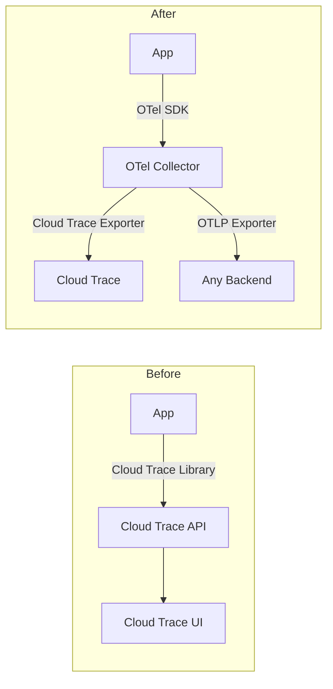
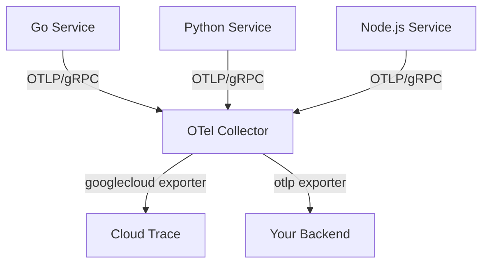

# How to Replace Google Cloud Trace Client Libraries with OpenTelemetry

Author: [nawazdhandala](https://www.github.com/nawazdhandala)

Tags: OpenTelemetry, Google Cloud, Cloud Trace, Distributed Tracing, Migration, Observability, GCP

Description: Learn how to migrate from Google Cloud Trace client libraries to OpenTelemetry with practical examples in Go, Python, and Node.js.

---

Google Cloud Trace is the managed distributed tracing service on GCP. For years, developers used the Cloud Trace client libraries (or the older Stackdriver Trace SDK) to instrument their applications. Google has since shifted their recommendation toward OpenTelemetry. The Cloud Trace backend now natively accepts OTLP data, and Google contributes actively to the OpenTelemetry project. If you are still using the Cloud Trace client libraries, now is a good time to switch.

This guide covers the migration from Google Cloud Trace client libraries to OpenTelemetry for Go, Python, and Node.js. We will show you how to remove the old libraries, set up OpenTelemetry, and configure the export pipeline.

## Why Replace Cloud Trace Client Libraries

Google Cloud Trace client libraries work, but they come with limitations that OpenTelemetry solves.

The client libraries only export to Cloud Trace. If you want to send traces to another backend for analysis, you need separate instrumentation. OpenTelemetry lets you export to Cloud Trace and any other OTLP-compatible backend simultaneously.

The Cloud Trace libraries also use a proprietary context propagation format. This can break distributed traces when your services communicate with systems outside GCP. OpenTelemetry defaults to W3C Trace Context, which is the industry standard.

Google themselves recommend OpenTelemetry. The Cloud Trace documentation now points users to OpenTelemetry as the primary instrumentation approach, and the Cloud Trace client libraries receive only maintenance updates.



## Step 1: Identify Your Current Cloud Trace Setup

Cloud Trace integration takes different forms depending on your language and framework. Let us look at what you might find in your codebase.

In Go, the old approach uses the `contrib.go.opencensus.io/exporter/stackdriver` package or the newer `cloud.google.com/go/trace` client library.

```go
// IDENTIFY: Old Cloud Trace / OpenCensus setup in Go
import (
    "contrib.go.opencensus.io/exporter/stackdriver"
    "go.opencensus.io/trace"
)

func initTracing() {
    // Old Stackdriver/Cloud Trace exporter via OpenCensus
    exporter, err := stackdriver.NewExporter(stackdriver.Options{
        ProjectID: "my-gcp-project",
    })
    if err != nil {
        log.Fatal(err)
    }
    trace.RegisterExporter(exporter)
    trace.ApplyConfig(trace.Config{DefaultSampler: trace.AlwaysSample()})
}
```

In Python, the setup typically uses the `google-cloud-trace` package or OpenCensus with the Stackdriver exporter.

```python
# IDENTIFY: Old Cloud Trace setup in Python
from opencensus.ext.stackdriver import trace_exporter as stackdriver_exporter
from opencensus.trace import tracer as tracer_module

# OpenCensus with Stackdriver exporter
exporter = stackdriver_exporter.StackdriverExporter(project_id='my-gcp-project')
tracer = tracer_module.Tracer(exporter=exporter)
```

In Node.js, you might find the `@google-cloud/trace-agent` package.

```javascript
// IDENTIFY: Old Cloud Trace agent setup in Node.js
// This must be the first import in your application
require('@google-cloud/trace-agent').start({
  projectId: 'my-gcp-project',
  samplingRate: 10,  // Sample 10 traces per second
});
```

## Step 2: Remove Old Dependencies

Remove the Cloud Trace and OpenCensus packages from your project.

```bash
# Go: Remove OpenCensus and Stackdriver packages
go get -u contrib.go.opencensus.io/exporter/stackdriver@none
go get -u go.opencensus.io@none

# Python: Remove Cloud Trace and OpenCensus packages
pip uninstall google-cloud-trace opencensus opencensus-ext-stackdriver

# Node.js: Remove the Cloud Trace agent
npm uninstall @google-cloud/trace-agent
```

## Step 3: Install OpenTelemetry Packages

Install the OpenTelemetry SDK and the Google Cloud Trace exporter for your language.

For Go, install the OpenTelemetry SDK and the GCP exporter.

```bash
# Go: Install OpenTelemetry with GCP exporter
go get go.opentelemetry.io/otel
go get go.opentelemetry.io/otel/sdk
go get go.opentelemetry.io/otel/exporters/otlp/otlptrace/otlptracegrpc
go get github.com/GoogleCloudPlatform/opentelemetry-operations-go/exporter/trace
go get go.opentelemetry.io/contrib/detectors/gcp
```

For Python, install the standard packages plus the GCP exporter.

```bash
# Python: Install OpenTelemetry with GCP exporter
pip install opentelemetry-sdk \
  opentelemetry-api \
  opentelemetry-exporter-gcp-trace \
  opentelemetry-instrumentation-flask \
  opentelemetry-instrumentation-requests \
  opentelemetry-resourcedetector-gcp
```

For Node.js, install the core packages.

```bash
# Node.js: Install OpenTelemetry with GCP exporter
npm install @opentelemetry/sdk-node \
  @opentelemetry/api \
  @opentelemetry/auto-instrumentations-node \
  @opentelemetry/exporter-trace-otlp-grpc \
  @google-cloud/opentelemetry-cloud-trace-exporter \
  @opentelemetry/resource-detector-gcp
```

## Step 4: Set Up OpenTelemetry Initialization

Replace the old Cloud Trace initialization with OpenTelemetry. Each language has its own idioms, but the structure is the same: create a resource, configure an exporter, and register the tracer provider.

Here is the Go setup. This replaces the OpenCensus/Stackdriver initialization entirely.

```go
// tracing.go - OpenTelemetry initialization (replaces Cloud Trace / OpenCensus)
package main

import (
    "context"
    "log"

    gcpexporter "github.com/GoogleCloudPlatform/opentelemetry-operations-go/exporter/trace"
    gcpdetector "go.opentelemetry.io/contrib/detectors/gcp"
    "go.opentelemetry.io/otel"
    "go.opentelemetry.io/otel/sdk/resource"
    sdktrace "go.opentelemetry.io/otel/sdk/trace"
    semconv "go.opentelemetry.io/otel/semconv/v1.21.0"
)

func initTracing(ctx context.Context) (*sdktrace.TracerProvider, error) {
    // Create the Google Cloud Trace exporter
    exporter, err := gcpexporter.New(gcpexporter.WithProjectID("my-gcp-project"))
    if err != nil {
        return nil, err
    }

    // Detect GCP resource attributes automatically (project ID, zone, instance ID)
    gcpResource, err := resource.New(ctx,
        resource.WithDetectors(gcpdetector.NewDetector()),
        resource.WithAttributes(
            semconv.ServiceName("my-app"),
            semconv.ServiceVersion("1.0.0"),
        ),
    )
    if err != nil {
        return nil, err
    }

    // Create the tracer provider with batch export
    tp := sdktrace.NewTracerProvider(
        sdktrace.WithBatcher(exporter),
        sdktrace.WithResource(gcpResource),
        // Sample all traces in development, adjust for production
        sdktrace.WithSampler(sdktrace.AlwaysSample()),
    )

    // Register as the global tracer provider
    otel.SetTracerProvider(tp)
    return tp, nil
}

func main() {
    ctx := context.Background()
    tp, err := initTracing(ctx)
    if err != nil {
        log.Fatalf("Failed to initialize tracing: %v", err)
    }
    // Shut down the tracer provider on exit to flush pending spans
    defer tp.Shutdown(ctx)

    // Your application code here
}
```

Here is the Python setup with Flask.

```python
# tracing.py - OpenTelemetry initialization (replaces Cloud Trace client library)
from opentelemetry import trace
from opentelemetry.sdk.trace import TracerProvider
from opentelemetry.sdk.trace.export import BatchSpanProcessor
from opentelemetry.exporter.cloud_trace import CloudTraceSpanExporter
from opentelemetry.sdk.resources import Resource
from opentelemetry.resourcedetector.gcp_resource_detector import GoogleCloudResourceDetector
from opentelemetry.instrumentation.flask import FlaskInstrumentor
from opentelemetry.instrumentation.requests import RequestsInstrumentor

# Detect GCP resource attributes (project, zone, etc.)
gcp_resource = GoogleCloudResourceDetector().detect()

# Merge with service-specific attributes
resource = Resource.create({
    "service.name": "my-app",
    "service.version": "1.0.0",
}).merge(gcp_resource)

# Create and register the tracer provider
provider = TracerProvider(resource=resource)

# Export spans to Google Cloud Trace
cloud_trace_exporter = CloudTraceSpanExporter(project_id="my-gcp-project")
provider.add_span_processor(BatchSpanProcessor(cloud_trace_exporter))

trace.set_tracer_provider(provider)

# Auto-instrument Flask and requests library
FlaskInstrumentor().instrument()
RequestsInstrumentor().instrument()
```

Here is the Node.js setup.

```javascript
// tracing.js - OpenTelemetry initialization (replaces @google-cloud/trace-agent)
const { NodeSDK } = require('@opentelemetry/sdk-node');
const { getNodeAutoInstrumentations } = require('@opentelemetry/auto-instrumentations-node');
const { TraceExporter } = require('@google-cloud/opentelemetry-cloud-trace-exporter');
const { GcpDetector } = require('@opentelemetry/resource-detector-gcp');
const { Resource } = require('@opentelemetry/resources');

// Create the Google Cloud Trace exporter
const traceExporter = new TraceExporter({
  projectId: 'my-gcp-project',
});

const sdk = new NodeSDK({
  resource: new Resource({
    'service.name': 'my-app',
    'service.version': '1.0.0',
  }),

  // Export traces to Google Cloud Trace
  traceExporter: traceExporter,

  // Auto-instrument HTTP, Express, gRPC, and more
  instrumentations: [getNodeAutoInstrumentations()],

  // Detect GCP resource attributes (project, zone, instance)
  resourceDetectors: [new GcpDetector()],
});

// Start the SDK before your application imports
sdk.start();

// Flush spans on shutdown
process.on('SIGTERM', () => {
  sdk.shutdown().then(() => process.exit(0));
});
```

## Step 5: Translate Manual Instrumentation

If you had manual spans in your code using the Cloud Trace client library or OpenCensus, translate them to the OpenTelemetry API.

Here is the mapping of concepts.

| Cloud Trace / OpenCensus | OpenTelemetry |
|---|---|
| `tracer.StartSpan()` | `tracer.Start(ctx, "name")` |
| `span.Annotate()` | `span.AddEvent()` |
| `span.AddAttributes()` | `span.SetAttributes()` |
| `span.End()` | `span.End()` |
| `trace.StringAttribute()` | `attribute.String()` |

Here is a Go example showing the translation.

```go
// Before: OpenCensus manual instrumentation
// ctx, span := trace.StartSpan(ctx, "processOrder")
// span.AddAttributes(trace.StringAttribute("order.id", orderID))
// defer span.End()

// After: OpenTelemetry manual instrumentation
tracer := otel.Tracer("my-app")
ctx, span := tracer.Start(ctx, "processOrder",
    // Set attributes at span creation time
    oteltrace.WithAttributes(
        attribute.String("order.id", orderID),
        attribute.Float64("order.value", orderValue),
    ),
)
defer span.End()

// Add events to record important moments within the span
span.AddEvent("payment-processed", oteltrace.WithAttributes(
    attribute.String("payment.method", "credit_card"),
))

// Record errors properly
if err != nil {
    span.SetStatus(codes.Error, err.Error())
    span.RecordError(err)
}
```

## Step 6: Use the Collector for Flexible Routing

Instead of exporting directly from your application to Cloud Trace, you can route through the OpenTelemetry Collector. This gives you the ability to send data to multiple backends, apply processing, and decouple your application from backend-specific configuration.

```yaml
# otel-collector-config.yaml
receivers:
  otlp:
    protocols:
      grpc:
        # Receive OTLP data from applications
        endpoint: 0.0.0.0:4317

processors:
  batch:
    # Batch spans to reduce API calls to Cloud Trace
    send_batch_size: 256
    timeout: 5s

  resourcedetection:
    detectors: [gcp]
    # Override existing resource attributes from GCP metadata
    override: false

exporters:
  # Google Cloud Trace exporter
  googlecloud:
    project: my-gcp-project

  # Generic OTLP exporter for additional backends
  otlp:
    endpoint: https://your-backend.com:4317
    headers:
      authorization: "Bearer ${API_KEY}"

service:
  pipelines:
    traces:
      receivers: [otlp]
      processors: [resourcedetection, batch]
      exporters: [googlecloud, otlp]
```



## Running on Google Cloud Run or GKE

If your application runs on Cloud Run, you can use the OTLP endpoint that Cloud Run provides natively. Set the `OTEL_EXPORTER_OTLP_ENDPOINT` environment variable and Cloud Run will forward your traces to Cloud Trace without needing a separate Collector.

For GKE, deploy the Collector as a DaemonSet so every node has a local Collector instance. This minimizes network hops and provides a central place to manage your export configuration.

```yaml
# GKE DaemonSet snippet for the OTel Collector
apiVersion: apps/v1
kind: DaemonSet
metadata:
  name: otel-collector
  namespace: observability
spec:
  selector:
    matchLabels:
      app: otel-collector
  template:
    metadata:
      labels:
        app: otel-collector
    spec:
      containers:
        - name: collector
          image: otel/opentelemetry-collector-contrib:latest
          ports:
            - containerPort: 4317
              # Expose OTLP/gRPC port for applications to send data
              hostPort: 4317
          volumeMounts:
            - name: config
              mountPath: /etc/otelcol
      volumes:
        - name: config
          configMap:
            name: otel-collector-config
```

## Verifying the Migration

After deploying, check these things to confirm your traces are flowing correctly:

1. Open the Cloud Trace UI in the Google Cloud Console and look for traces from your service
2. Verify that span names, attributes, and parent-child relationships match your expectations
3. Check that GCP resource attributes (project ID, zone, service name) appear on your traces
4. Test cross-service tracing by following a request through multiple services
5. If you configured multiple exporters, verify data appears in all backends

Watch out for authentication. The Google Cloud Trace exporter uses Application Default Credentials. Make sure your application has the `roles/cloudtrace.agent` IAM role, or the spans will be silently dropped.

## Summary

Replacing Google Cloud Trace client libraries with OpenTelemetry aligns your instrumentation with the industry standard and gives you the flexibility to send traces anywhere. Google actively supports this migration path through the `opentelemetry-operations-go` project and the Cloud Trace OTLP endpoint. The key steps are removing the old libraries, installing OpenTelemetry with the GCP exporter, translating any manual instrumentation, and optionally deploying a Collector for flexible routing.
