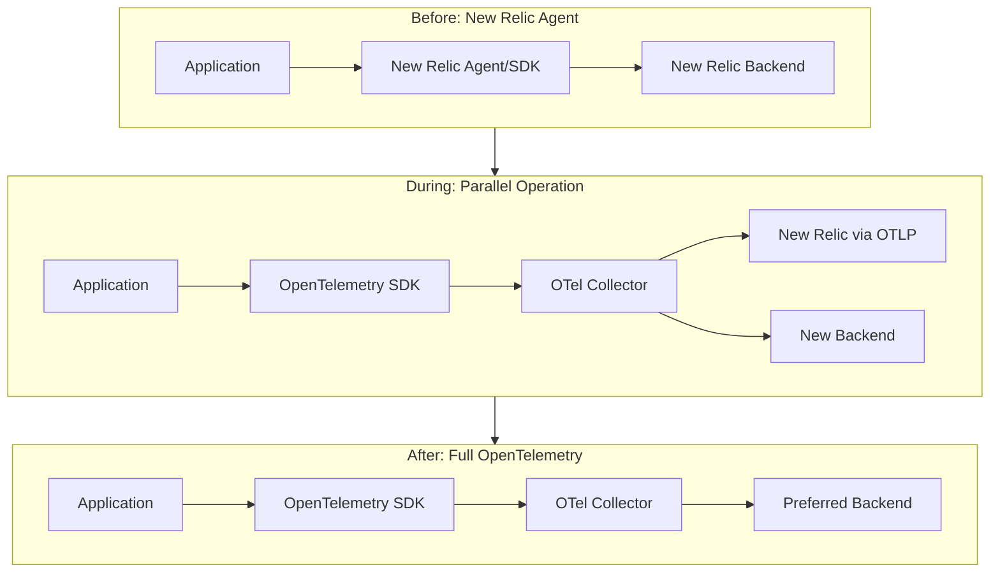

# How to Replace New Relic SDK with OpenTelemetry Instrumentation

Author: [nawazdhandala](https://www.github.com/nawazdhandala)

Tags: OpenTelemetry, New Relic, Migration, Instrumentation, APM, Observability

Description: Learn how to replace New Relic's proprietary SDK with OpenTelemetry instrumentation for vendor-neutral application monitoring.

---

New Relic has been a go-to APM tool for many engineering teams. Its agents handle tracing, error tracking, and custom metrics with tight integration into the New Relic platform. But that tight integration is also the problem. When your instrumentation is welded to one vendor, switching backends or adopting a multi-vendor strategy means rewriting code across every service. OpenTelemetry solves this by providing a single, vendor-neutral instrumentation layer that works with any backend.

This guide covers the practical steps to replace the New Relic SDK with OpenTelemetry in Java and Node.js applications, the two most common environments where New Relic agents are deployed.

## Why Replace the New Relic SDK?

Here is what teams usually run into that triggers this migration:

1. **Cost pressure**: New Relic charges based on data ingest and user seats. OpenTelemetry lets you choose cheaper or self-hosted backends.
2. **Instrumentation portability**: Once you instrument with OpenTelemetry, you can export to New Relic, Jaeger, OneUptime, or any other OTLP-compatible backend without code changes.
3. **No proprietary agents**: New Relic agents run inside your application process and sometimes introduce unexpected behavior during upgrades. OpenTelemetry SDKs are transparent and community-maintained.
4. **Unified signals**: OpenTelemetry gives you traces, metrics, and logs with correlated context from a single SDK.

## Migration Overview



The good news is that New Relic actually supports OTLP ingest, so you can migrate your instrumentation to OpenTelemetry and keep sending data to New Relic during the transition. This removes the risk of losing visibility while you validate the new setup.

## Step 1: Remove the New Relic Java Agent

For Java applications, New Relic typically runs as a javaagent attached at JVM startup. You need to remove it and replace it with the OpenTelemetry Java agent.

First, let's look at the typical New Relic startup configuration that you will be replacing.

```bash
# Old startup command with New Relic agent
# The -javaagent flag loads the New Relic agent into the JVM
# newrelic.yml contains the license key and app name
# java -javaagent:/path/to/newrelic.jar \
#   -Dnewrelic.config.file=/path/to/newrelic.yml \
#   -jar myapp.jar

# New startup command with OpenTelemetry Java agent
# The OTel agent auto-instruments common libraries (Spring, JDBC, gRPC, etc.)
# Configuration is done through environment variables instead of a YAML file
java -javaagent:/path/to/opentelemetry-javaagent.jar \
  -Dotel.service.name=my-java-service \
  -Dotel.exporter.otlp.endpoint=http://localhost:4317 \
  -Dotel.exporter.otlp.protocol=grpc \
  -jar myapp.jar
```

The OpenTelemetry Java agent automatically instruments over 100 libraries including Spring Boot, JDBC, Hibernate, gRPC, Kafka, and more. In most cases, the auto-instrumentation covers everything the New Relic agent was capturing.

Download the agent JAR from the OpenTelemetry releases page:

```bash
# Download the latest OpenTelemetry Java agent
# This single JAR provides auto-instrumentation for all supported libraries
curl -L -o opentelemetry-javaagent.jar \
  https://github.com/open-telemetry/opentelemetry-java-instrumentation/releases/latest/download/opentelemetry-javaagent.jar
```

## Step 2: Replace New Relic in Node.js Applications

Node.js is where New Relic's require-at-the-top pattern is most familiar. You typically load the New Relic module as the very first line of your application entry point. OpenTelemetry follows a similar pattern but with more explicit configuration.

Here is the transformation. The New Relic approach loads a single module that handles everything behind the scenes. The OpenTelemetry approach is more explicit about what it does.

```javascript
// Before: New Relic instrumentation
// This must be the first line in your application entry point
// It monkey-patches Node.js modules to capture traces and metrics
// require('newrelic');

// After: OpenTelemetry instrumentation
// Install these packages first:
// npm install @opentelemetry/sdk-node @opentelemetry/auto-instrumentations-node
// npm install @opentelemetry/exporter-trace-otlp-grpc @opentelemetry/exporter-metrics-otlp-grpc

const { NodeSDK } = require('@opentelemetry/sdk-node');
const { getNodeAutoInstrumentations } = require('@opentelemetry/auto-instrumentations-node');
const { OTLPTraceExporter } = require('@opentelemetry/exporter-trace-otlp-grpc');
const { OTLPMetricExporter } = require('@opentelemetry/exporter-metrics-otlp-grpc');
const { PeriodicExportingMetricReader } = require('@opentelemetry/sdk-metrics');

// Configure the OpenTelemetry SDK
// This replaces the newrelic.js config file
const sdk = new NodeSDK({
  // Service name replaces NEW_RELIC_APP_NAME
  serviceName: 'my-node-service',
  // Trace exporter sends spans to the OTel Collector
  traceExporter: new OTLPTraceExporter({
    url: 'http://localhost:4317',
  }),
  // Metric reader replaces New Relic's custom metrics
  metricReader: new PeriodicExportingMetricReader({
    exporter: new OTLPMetricExporter({
      url: 'http://localhost:4317',
    }),
    // Export metrics every 60 seconds
    exportIntervalMillis: 60000,
  }),
  // Auto-instrumentation covers Express, HTTP, pg, mysql, redis, etc.
  instrumentations: [getNodeAutoInstrumentations()],
});

// Start the SDK before your application code runs
sdk.start();
```

Save this as `tracing.js` and require it before anything else in your application, or use the `--require` flag:

```bash
# Run your Node.js app with OpenTelemetry pre-loaded
# The --require flag ensures instrumentation loads before application code
node --require ./tracing.js app.js
```

## Step 3: Migrate Custom Instrumentation

If you have added custom spans or metrics using the New Relic API, you need to convert them to OpenTelemetry equivalents. The concepts map fairly directly.

This example shows how custom transaction tracing translates between the two APIs. New Relic uses `startSegment` while OpenTelemetry uses the standard span API.

```javascript
// Before: New Relic custom instrumentation
// newrelic.startSegment creates a child span within the current transaction
// const newrelic = require('newrelic');
//
// async function processOrder(orderId) {
//   return newrelic.startSegment('process-order', true, async () => {
//     newrelic.addCustomAttribute('order.id', orderId);
//     const result = await doProcessing(orderId);
//     return result;
//   });
// }

// After: OpenTelemetry custom instrumentation
// The span API is more explicit but follows the same parent-child model
const { trace } = require('@opentelemetry/api');

// Get a tracer instance for your module
// The name helps identify where spans originate
const tracer = trace.getTracer('order-service', '1.0.0');

async function processOrder(orderId) {
  // startActiveSpan creates a span and sets it as the current active span
  // Any child spans created inside will automatically be linked
  return tracer.startActiveSpan('process-order', async (span) => {
    try {
      // setAttribute replaces addCustomAttribute
      span.setAttribute('order.id', orderId);
      const result = await doProcessing(orderId);
      return result;
    } catch (error) {
      // Record exceptions on the span for error tracking
      span.recordException(error);
      span.setStatus({ code: trace.SpanStatusCode.ERROR });
      throw error;
    } finally {
      // Always end the span when the operation completes
      span.end();
    }
  });
}
```

## Step 4: Map New Relic Custom Metrics

New Relic has `recordMetric` and `recordCustomEvent`. In OpenTelemetry, you use the metrics API with instruments like counters, histograms, and gauges.

This mapping shows the most common New Relic metric patterns and their OpenTelemetry equivalents.

```javascript
// Before: New Relic custom metrics
// newrelic.recordMetric('Custom/OrderProcessingTime', processingTimeMs);
// newrelic.incrementMetric('Custom/OrdersProcessed');

// After: OpenTelemetry metrics API
const { metrics } = require('@opentelemetry/api');

const meter = metrics.getMeter('order-service', '1.0.0');

// Histogram replaces recordMetric for timing data
// It automatically tracks count, sum, and bucket distributions
const orderProcessingTime = meter.createHistogram('order.processing.duration', {
  description: 'Time spent processing an order',
  unit: 'ms',
});

// Counter replaces incrementMetric
const ordersProcessed = meter.createCounter('orders.processed.total', {
  description: 'Total number of orders processed',
});

function trackOrderMetrics(processingTimeMs, orderType) {
  // Record the processing time with attributes for filtering
  orderProcessingTime.record(processingTimeMs, {
    'order.type': orderType,
  });
  // Increment the counter
  ordersProcessed.add(1, {
    'order.type': orderType,
  });
}
```

## Step 5: Configure the Collector for Dual Export

While you validate the migration, send data to both New Relic (via OTLP) and your new backend. This configuration shows how to set up dual export in the Collector.

```yaml
# OTel Collector config for parallel export during migration
# This lets you compare data in both platforms side by side
exporters:
  # Send to New Relic using their OTLP endpoint
  # This keeps your existing dashboards and alerts working
  otlp/newrelic:
    endpoint: https://otlp.nr-data.net:4317
    headers:
      api-key: "${NEW_RELIC_LICENSE_KEY}"
  # Also send to your new backend
  otlphttp/oneuptime:
    endpoint: https://otlp.oneuptime.com
    headers:
      x-oneuptime-token: "${ONEUPTIME_TOKEN}"

processors:
  batch:
    send_batch_size: 512
    timeout: 5s

receivers:
  otlp:
    protocols:
      grpc:
        endpoint: 0.0.0.0:4317

service:
  pipelines:
    traces:
      receivers: [otlp]
      processors: [batch]
      # Fan out to both backends
      exporters: [otlp/newrelic, otlphttp/oneuptime]
    metrics:
      receivers: [otlp]
      processors: [batch]
      exporters: [otlp/newrelic, otlphttp/oneuptime]
```

## Step 6: Clean Up New Relic Dependencies

Once you have validated that OpenTelemetry captures everything you need, remove the New Relic packages and configuration files.

```bash
# Remove New Relic packages from a Node.js project
npm uninstall newrelic

# Remove configuration files
rm newrelic.js
rm newrelic.yml 2>/dev/null

# For Java projects, remove the agent JAR and config
rm /path/to/newrelic.jar
rm /path/to/newrelic.yml
```

Also remove any New Relic-specific environment variables like `NEW_RELIC_LICENSE_KEY`, `NEW_RELIC_APP_NAME`, and `NEW_RELIC_LOG_LEVEL` from your deployment configurations.

## Mapping Cheat Sheet

| New Relic Concept | OpenTelemetry Equivalent |
|---|---|
| Transaction | Trace (root span) |
| Segment | Span |
| Custom Attribute | Span Attribute |
| Custom Event | Log Record or Span Event |
| Custom Metric | Meter Instrument (Counter, Histogram) |
| Distributed Trace | Trace with W3C Trace Context |
| Error tracking | Span exception events + status |
| newrelic.js config | Environment variables or SDK config |

## Conclusion

Replacing the New Relic SDK with OpenTelemetry is a methodical process. Start with auto-instrumentation, which covers most of what the New Relic agent captures automatically. Then migrate custom instrumentation using the mapping patterns shown above. Run both in parallel until you are confident, then cut the cord. The result is portable instrumentation that works with any backend and will never lock you into a single vendor again.
