# How to Resolve Clock Skew Issues in OpenTelemetry Distributed Traces

Author: [nawazdhandala](https://www.github.com/nawazdhandala)

Tags: OpenTelemetry, Clock Skew, Distributed Tracing, NTP, Troubleshooting, Span Timing

Description: Learn how to identify and resolve clock skew problems in OpenTelemetry distributed traces where span timestamps appear incorrect or out of order.

---

You open your tracing dashboard and see something that makes no sense: a child span that apparently started before its parent, a database query that took negative time, or a trace timeline where spans overlap in impossible ways. These are the telltale signs of clock skew, a problem that occurs when the clocks on different machines in your distributed system are not synchronized.

Clock skew does not break tracing functionally. Spans still get created, context still propagates, and your traces still connect. But it makes the timing data unreliable, which undermines one of the primary reasons you adopted distributed tracing in the first place. This guide covers how to identify clock skew, understand its causes, and fix it at the infrastructure level.

## What Clock Skew Looks Like in Traces

In a healthy distributed trace, the timeline makes logical sense. A parent span starts, then child spans start within the parent's time window, and the parent ends after all children complete.

```mermaid
gantt
    title Healthy Trace (No Clock Skew)
    dateFormat X
    axisFormat %s

    section Service A
    Parent Span         :a1, 0, 100

    section Service B
    Child Span          :b1, 10, 80
```



When clock skew is present, you see timelines that violate causality:

```mermaid
gantt
    title Broken Trace (Clock Skew Present)
    dateFormat X
    axisFormat %s

    section Service A
    Parent Span         :a1, 50, 150

    section Service B
    Child Span          :b1, 10, 80
```



In the skewed example, the child span appears to start 40 units before the parent span, which is physically impossible since the parent has to make the request that creates the child. This happens because Service B's clock is running ahead of Service A's clock by roughly 40 units.

## Understanding the Root Causes

Clock skew happens because each machine in a distributed system has its own hardware clock, and these clocks drift over time at different rates. Without active synchronization, two machines that were perfectly aligned at boot time can drift apart by seconds or even minutes over days.

Common causes of significant clock skew include:

- NTP (Network Time Protocol) not running or misconfigured
- Virtual machines where the hypervisor's clock synchronization is unreliable
- Containers inheriting a skewed clock from their host
- Network partitions that prevent NTP from syncing
- Hardware clock issues on older machines

The magnitude of the problem matters. A few milliseconds of skew is often acceptable and hard to avoid entirely. But once the skew reaches tens of milliseconds or more, it starts visibly distorting your trace timelines.

## Step 1: Measure the Actual Skew

Before fixing anything, quantify the problem. You can measure clock skew between two machines using a simple approach.

```bash
# Check the current NTP offset on a Linux machine
# This shows how far the local clock is from the NTP reference
timedatectl timesync-status

# Alternative: use ntpq to query the NTP daemon
# The "offset" column shows the difference in milliseconds
ntpq -p

# For a quick check, compare timestamps from two machines
# Run this on Machine A
date +%s%N

# Run this on Machine B at the same moment
date +%s%N

# The difference (minus network latency) is roughly your clock skew
```

You can also detect clock skew directly from your trace data by looking for spans where the child start time is earlier than the parent start time:

```python
# Python script to detect clock skew from exported trace data
# This reads spans from a JSON export and flags parent-child pairs with negative gaps

import json
from datetime import datetime

def detect_clock_skew(trace_data):
    """Analyze trace spans for clock skew indicators."""
    spans_by_id = {}

    # Index all spans by their span ID
    for span in trace_data:
        spans_by_id[span['spanId']] = span

    skew_issues = []

    for span in trace_data:
        parent_id = span.get('parentSpanId')
        if not parent_id or parent_id not in spans_by_id:
            continue

        parent = spans_by_id[parent_id]

        # Convert timestamps to comparable values (nanoseconds)
        child_start = span['startTimeUnixNano']
        parent_start = parent['startTimeUnixNano']

        # A child should never start before its parent
        if child_start < parent_start:
            skew_ms = (parent_start - child_start) / 1_000_000
            skew_issues.append({
                'child_span': span['spanId'],
                'parent_span': parent_id,
                'child_service': span.get('serviceName', 'unknown'),
                'parent_service': parent.get('serviceName', 'unknown'),
                'skew_ms': round(skew_ms, 2),
            })
            print(f"Clock skew detected: {skew_ms:.2f}ms")
            print(f"  Child ({span.get('serviceName')}) started before "
                  f"parent ({parent.get('serviceName')})")

    return skew_issues
```

## Step 2: Fix NTP Synchronization

The primary fix for clock skew is ensuring all machines in your infrastructure synchronize their clocks to the same time source using NTP.

```bash
# Check if NTP is active on a systemd-based Linux system
timedatectl status

# Expected output should show:
# NTP service: active
# NTP synchronized: yes

# If NTP is not active, enable it
sudo timedatectl set-ntp true

# Install and configure chrony (recommended NTP client for modern systems)
sudo apt-get install chrony    # Debian/Ubuntu
sudo yum install chrony        # RHEL/CentOS

# Start and enable the chrony service
sudo systemctl enable chronyd
sudo systemctl start chronyd

# Verify synchronization status
chronyc tracking
```

For environments where you need tighter synchronization, configure chrony to use multiple NTP servers and poll more frequently:

```ini
# /etc/chrony.conf - Chrony configuration for tight time synchronization
# Use multiple NTP sources for reliability and accuracy

# Public NTP pools
server 0.pool.ntp.org iburst
server 1.pool.ntp.org iburst
server 2.pool.ntp.org iburst
server 3.pool.ntp.org iburst

# If running in AWS, use the Amazon Time Sync Service
# This provides sub-millisecond accuracy within AWS
server 169.254.169.123 prefer iburst minpoll 4 maxpoll 4

# If running in GCP, use Google's NTP server
# server metadata.google.internal iburst

# Allow the clock to be stepped (jumped) if the offset is larger than 1 second
# This happens at startup and prevents long convergence times
makestep 1.0 3

# Record the rate of clock drift for faster corrections after restart
driftfile /var/lib/chrony/drift

# Enable hardware timestamping for better accuracy if the NIC supports it
# hwtimestamp *
```

## Step 3: Fix Clock Sync in Containers and Kubernetes

Containers share the host's kernel clock, so fixing the host fixes all containers on that host. However, in Kubernetes environments, you might have nodes from different providers or configurations.

```yaml
# Kubernetes DaemonSet to ensure NTP synchronization on all nodes
# This runs chrony on every node in the cluster
apiVersion: apps/v1
kind: DaemonSet
metadata:
  name: ntp-sync-checker
  namespace: kube-system
spec:
  selector:
    matchLabels:
      app: ntp-sync-checker
  template:
    metadata:
      labels:
        app: ntp-sync-checker
    spec:
      # Run on the host network to access NTP services
      hostNetwork: true
      hostPID: true
      containers:
      - name: ntp-checker
        image: alpine:latest
        command:
        - /bin/sh
        - -c
        # Periodically check NTP sync status and log warnings if skew is detected
        - |
          apk add --no-cache chrony
          while true; do
            offset=$(chronyc tracking | grep "Last offset" | awk '{print $4}')
            echo "NTP offset on $(hostname): ${offset} seconds"
            sleep 300
          done
        securityContext:
          privileged: true
```

For virtual machines, make sure the VM guest tools are not fighting with NTP over clock control:

```bash
# On VMware VMs, check if VMware Tools is managing the clock
# This can conflict with NTP and cause erratic clock behavior
vmware-toolbox-cmd timesync status

# Disable VMware time sync if you are using NTP instead
vmware-toolbox-cmd timesync disable

# On Hyper-V, disable the time synchronization integration service
# if you prefer to use NTP directly
# This is done through Hyper-V Manager on the host
```

## Step 4: Handle Residual Skew in Your Tracing Backend

Even with perfect NTP synchronization, you will still see a few milliseconds of skew occasionally. Your tracing backend should be configured to handle small amounts of skew gracefully.

Most tracing backends have a clock skew correction feature that adjusts child span timestamps to fit within their parent's time window. In Jaeger, for example:

```yaml
# Jaeger query service configuration with clock skew adjustment
# This tells Jaeger to adjust span timestamps to correct for minor clock differences

# Environment variable approach
QUERY_MAX_CLOCK_SKEW_ADJUSTMENT: "5s"

# This setting tells Jaeger to adjust timestamps by up to 5 seconds
# to make parent-child relationships display correctly
# Set this based on the maximum skew you observe in your environment
```

If you are using the OpenTelemetry Collector, you can add a span processor that detects and logs clock skew issues:

```yaml
# OpenTelemetry Collector configuration with attributes processor
# to flag spans that might be affected by clock skew
processors:
  # The transform processor can add metadata about potential clock skew
  transform:
    trace_statements:
      - context: span
        statements:
          # Add a resource attribute indicating the host's time source
          # This helps correlate clock skew with specific machines
          - set(attributes["host.ntp.synced"], "true")

  batch:
    timeout: 10s

exporters:
  otlp:
    endpoint: tracing-backend:4317

service:
  pipelines:
    traces:
      receivers: [otlp]
      processors: [transform, batch]
      exporters: [otlp]
```

## Step 5: Use Monotonic Clocks for Duration Calculations

If you create manual spans in your application code, use monotonic clocks for duration calculations instead of wall clocks. Monotonic clocks are immune to NTP adjustments and clock skew because they measure elapsed time rather than absolute time.

```javascript
// Use performance.now() (monotonic) for duration measurements
// instead of Date.now() (wall clock) which can jump due to NTP corrections

const { trace } = require('@opentelemetry/api');

function instrumentedOperation() {
  const tracer = trace.getTracer('my-app');

  // The OpenTelemetry SDK uses high-resolution time internally
  // but if you need to measure durations yourself, use performance.now()
  const startTime = performance.now();

  return tracer.startActiveSpan('my-operation', (span) => {
    try {
      // Do the actual work
      const result = doExpensiveWork();

      // Calculate duration using monotonic clock
      const durationMs = performance.now() - startTime;
      span.setAttribute('operation.duration_ms', durationMs);

      span.setStatus({ code: 1 }); // OK
      return result;
    } catch (error) {
      span.setStatus({ code: 2, message: error.message }); // ERROR
      throw error;
    } finally {
      span.end();
    }
  });
}
```

```python
# Python equivalent using time.monotonic() for duration calculations
import time
from opentelemetry import trace

tracer = trace.get_tracer("my-app")

def instrumented_operation():
    # time.monotonic() is not affected by system clock adjustments
    # time.time() (wall clock) can jump forward or backward during NTP sync
    start = time.monotonic()

    with tracer.start_as_current_span("my-operation") as span:
        result = do_expensive_work()

        duration_ms = (time.monotonic() - start) * 1000
        span.set_attribute("operation.duration_ms", duration_ms)

        return result
```

The OpenTelemetry SDKs already use high-resolution monotonic time sources internally for span duration calculations. But if you are computing durations in your application code and adding them as span attributes, make sure you use the monotonic clock too.

## Monitoring for Clock Skew

Rather than waiting for clock skew to show up in broken traces, set up proactive monitoring:

```bash
# Prometheus-compatible metric exporter for NTP offset
# Add this to your node exporter configuration or a custom exporter

# The node_exporter for Prometheus already exposes NTP metrics:
# node_timex_offset_seconds - Current NTP offset
# node_timex_sync_status - Whether NTP is synchronized (1 = yes)

# Create an alert rule for excessive clock skew
# Alert if any node drifts more than 10ms from the reference
```

```yaml
# Prometheus alerting rule for clock skew detection
groups:
  - name: clock_skew_alerts
    rules:
      # Alert when NTP offset exceeds 10 milliseconds
      - alert: ExcessiveClockSkew
        expr: abs(node_timex_offset_seconds) > 0.01
        for: 5m
        labels:
          severity: warning
        annotations:
          summary: "Clock skew detected on {{ $labels.instance }}"
          description: "NTP offset is {{ $value }}s which may affect trace accuracy"
```

## Summary

Clock skew in distributed traces is an infrastructure problem, not an application problem. The fix is to ensure consistent time synchronization across all machines using NTP (preferably chrony), disable competing time synchronization mechanisms in virtualized environments, and configure your tracing backend to handle residual skew gracefully. Monitor NTP offset as a metric and alert when it drifts beyond your tolerance threshold. With proper time synchronization in place, your trace timelines will accurately reflect the actual sequence and duration of operations across your distributed system.
