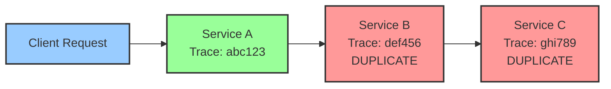
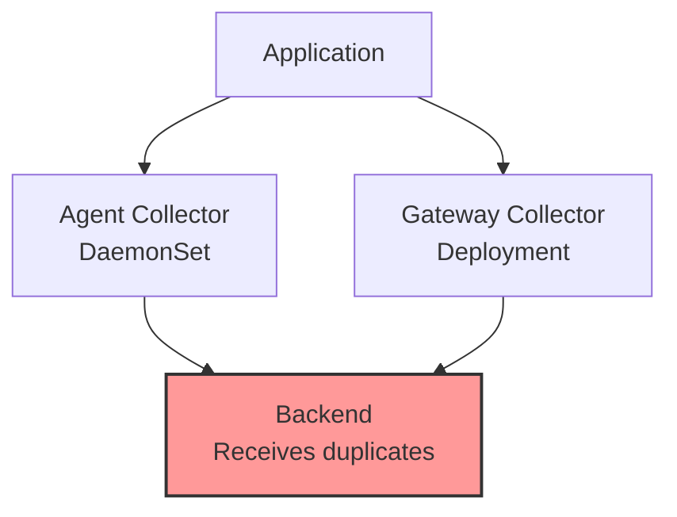

# How to Resolve Duplicate Traces Caused by Misconfigured Context Propagation

Author: [nawazdhandala](https://www.github.com/nawazdhandala)

Tags: OpenTelemetry, Tracing, Context Propagation, Duplicate Traces, Debugging, Distributed Systems

Description: Learn how to identify and fix duplicate traces in OpenTelemetry caused by misconfigured context propagation, double instrumentation, and incorrect propagator settings.

You are looking at your trace backend and something is wrong. The same request appears twice, sometimes three times, as separate traces. Your service map shows phantom connections that do not exist in your architecture. Trace counts are inflated, making it hard to trust your dashboards. Duplicate traces are one of the trickier problems to debug in distributed tracing because the symptoms show up far from the root cause.

The most common source of duplicate traces is misconfigured context propagation. When trace context fails to flow correctly between services, new trace IDs get generated where existing ones should have been reused. This guide explains how to identify, diagnose, and fix each flavor of this problem.

## How Context Propagation Creates Duplicates

In a healthy system, a single incoming request generates one trace ID that all participating services share:


When context propagation is broken, each service creates its own trace ID for the same request:



Instead of one trace with three spans, you get three separate traces with one span each. The total number of spans is the same, but they are fragmented across unrelated traces.

## Cause 1: Propagator Mismatch Between Services

The most frequent cause of duplicate traces is when services use different propagation formats. Service A injects W3C `traceparent` headers, but Service B only reads Zipkin B3 headers. Service B does not recognize the incoming context, so it starts a new trace.

To diagnose this, inspect the headers being sent between services:

```python
# Python: log outgoing headers to see what propagation format is used
import requests
from opentelemetry import trace
from opentelemetry.propagate import inject

tracer = trace.get_tracer("propagation.debug")

with tracer.start_as_current_span("outgoing-call") as span:
    headers = {}
    inject(headers)

    # Print what headers the propagator is injecting
    print("Outgoing headers:")
    for key, value in headers.items():
        print(f"  {key}: {value}")

    # W3C format will show:
    #   traceparent: 00-abc123...-def456...-01
    #
    # B3 format will show:
    #   X-B3-TraceId: abc123...
    #   X-B3-SpanId: def456...
    #   X-B3-Sampled: 1
```

Then check the receiving side to see what headers it expects:

```python
# Python (Flask): log incoming headers to check what context arrives
from flask import Flask, request
from opentelemetry.propagate import extract
from opentelemetry import trace

app = Flask(__name__)
tracer = trace.get_tracer("propagation.debug")

@app.route("/api/data")
def handle_request():
    # Log all trace-related incoming headers
    print("Incoming trace headers:")
    for key in ["traceparent", "tracestate", "x-b3-traceid",
                 "x-b3-spanid", "x-b3-sampled", "b3"]:
        value = request.headers.get(key)
        if value:
            print(f"  {key}: {value}")

    # Extract context and check what was found
    ctx = extract(request.headers)
    span_ctx = trace.get_current_span(ctx).get_span_context()
    print(f"Extracted trace_id: {span_ctx.trace_id:#034x}")
    print(f"Is valid: {span_ctx.is_valid}")
    # If is_valid is False, the propagator did not find recognized headers

    return "OK"
```

If the extracted context is invalid, the propagator did not find headers it understands. The fix is to configure all services to use the same propagation format, or to use a composite propagator that supports multiple formats:

```python
# Python: configure composite propagator supporting both W3C and B3
from opentelemetry.propagators.composite import CompositePropagator
from opentelemetry.propagators.b3 import B3MultiFormat
from opentelemetry.propagate import set_global_textmap
from opentelemetry.propagators.textmap import TraceContextTextMapPropagator

# This propagator reads and writes both W3C and B3 headers
# It handles mixed environments where some services use each format
propagator = CompositePropagator([
    TraceContextTextMapPropagator(),  # W3C traceparent/tracestate
    B3MultiFormat(),                   # Zipkin B3 multi-header
])

set_global_textmap(propagator)
```

Or set this via environment variable across all services:

```bash
# Support both W3C Trace Context and B3 propagation
export OTEL_PROPAGATORS=tracecontext,b3multi
```

Apply this setting to every service in your system. The composite propagator will read whichever format is present in incoming headers and inject both formats in outgoing headers.

## Cause 2: Double Instrumentation

Double instrumentation happens when both auto-instrumentation and manual instrumentation create spans for the same operation. The result is duplicate spans within a trace, or in some cases, duplicate traces entirely.

```python
# Problem: both auto-instrumentation and manual instrumentation
# are creating spans for the same Flask route
from flask import Flask
from opentelemetry import trace
from opentelemetry.instrumentation.flask import FlaskInstrumentor

app = Flask(__name__)

# Auto-instrumentation creates a span for every request
FlaskInstrumentor().instrument_app(app)

tracer = trace.get_tracer("my.app")

@app.route("/api/users")
def get_users():
    # Manual span ALSO wraps the same handler
    # Now there are two spans for one operation
    with tracer.start_as_current_span("get-users-handler"):
        return fetch_users()
```

The fix depends on what you need. If auto-instrumentation provides enough detail, remove the manual span:

```python
# Fix option 1: rely on auto-instrumentation and remove manual span
@app.route("/api/users")
def get_users():
    # The FlaskInstrumentor already creates a span for this route
    # Add attributes to the auto-created span instead of a new one
    span = trace.get_current_span()
    span.set_attribute("user.count", len(users))
    return fetch_users()
```

If you need more control, disable auto-instrumentation for that specific route:

```python
# Fix option 2: use manual instrumentation and skip auto for this route
from opentelemetry.instrumentation.flask import FlaskInstrumentor

# Exclude specific routes from auto-instrumentation
FlaskInstrumentor().instrument_app(
    app,
    excluded_urls="/api/users"
)

@app.route("/api/users")
def get_users():
    # Only the manual span exists now
    with tracer.start_as_current_span("get-users-handler"):
        return fetch_users()
```

## Cause 3: Middleware or Proxy Stripping Headers

Reverse proxies, API gateways, and middleware sometimes strip or modify headers, including trace context headers. If a proxy removes the `traceparent` header, the downstream service will start a new trace.

Check common proxy configurations:

```nginx
# Nginx: WRONG - using proxy_set_header without forwarding trace headers
# This replaces all headers, losing traceparent
location /api/ {
    proxy_pass http://backend:8080;
    proxy_set_header Host $host;
    # traceparent header is NOT forwarded because it was not listed
}

# Nginx: CORRECT - explicitly forward trace context headers
location /api/ {
    proxy_pass http://backend:8080;
    proxy_set_header Host $host;
    # Forward W3C trace context headers
    proxy_set_header traceparent $http_traceparent;
    proxy_set_header tracestate $http_tracestate;
    # Forward B3 headers if needed
    proxy_set_header X-B3-TraceId $http_x_b3_traceid;
    proxy_set_header X-B3-SpanId $http_x_b3_spanid;
    proxy_set_header X-B3-Sampled $http_x_b3_sampled;
}
```

For Envoy proxy:

```yaml
# Envoy: configure tracing to propagate context
static_resources:
  listeners:
  - name: listener_0
    address:
      socket_address:
        address: 0.0.0.0
        port_value: 8080
    filter_chains:
    - filters:
      - name: envoy.filters.network.http_connection_manager
        typed_config:
          "@type": type.googleapis.com/envoy.extensions.filters.network.http_connection_manager.v3.HttpConnectionManager
          # Enable tracing with OpenTelemetry provider
          tracing:
            provider:
              name: envoy.tracers.opentelemetry
              typed_config:
                "@type": type.googleapis.com/envoy.config.trace.v3.OpenTelemetryConfig
                grpc_service:
                  envoy_grpc:
                    cluster_name: otel_collector
          route_config:
            virtual_hosts:
            - name: backend
              domains: ["*"]
              routes:
              - match:
                  prefix: "/"
                route:
                  cluster: backend_service
                  # Ensure request headers are forwarded
                  request_headers_to_add: []
```

To verify headers are passing through a proxy, use a test endpoint that echoes back request headers:

```python
# Simple header echo endpoint for testing propagation through proxies
from flask import Flask, request, jsonify

app = Flask(__name__)

@app.route("/debug/headers")
def echo_headers():
    # Return all incoming headers so you can see what survived the proxy
    trace_headers = {}
    for key in request.headers.keys():
        lower_key = key.lower()
        if lower_key in ["traceparent", "tracestate", "b3",
                          "x-b3-traceid", "x-b3-spanid", "x-b3-sampled"]:
            trace_headers[key] = request.headers[key]

    return jsonify({
        "trace_headers": trace_headers,
        "all_headers": dict(request.headers)
    })
```

Send a request with trace headers through your proxy and check if they arrive:

```bash
# Send a request with a traceparent header through the proxy
curl -H "traceparent: 00-4bf92f3577b34da6a3ce929d0e0e4736-00f067aa0ba902b7-01" \
     http://proxy.example.com/debug/headers

# If trace_headers is empty in the response, the proxy is stripping them
```

## Cause 4: Multiple Tracer Providers

If your application accidentally creates multiple `TracerProvider` instances, each one generates its own trace IDs. Spans from different providers will not share trace context.

```python
# Problem: two TracerProvider instances in the same application
from opentelemetry.sdk.trace import TracerProvider
from opentelemetry import trace

# First provider (maybe in app initialization)
provider1 = TracerProvider()
trace.set_tracer_provider(provider1)

# Second provider (maybe in a library or plugin)
# This replaces the global provider, but code that already
# got a tracer from provider1 still uses the old one
provider2 = TracerProvider()
trace.set_tracer_provider(provider2)

# Tracers from different providers generate unrelated trace IDs
tracer_a = provider1.get_tracer("module-a")  # Uses provider1
tracer_b = trace.get_tracer("module-b")       # Uses provider2 (current global)
```

The fix is to ensure a single TracerProvider is created and set globally before any module requests a tracer:

```python
# Fix: single TracerProvider initialized early in application startup
from opentelemetry.sdk.trace import TracerProvider
from opentelemetry.sdk.trace.export import BatchSpanProcessor
from opentelemetry.exporter.otlp.proto.grpc.trace_exporter import OTLPSpanExporter
from opentelemetry.sdk.resources import Resource
from opentelemetry import trace

# Create one provider, configure it fully, then set it as global
resource = Resource.create({"service.name": "my-service"})
provider = TracerProvider(resource=resource)
provider.add_span_processor(BatchSpanProcessor(OTLPSpanExporter()))

# Set the global provider ONCE, before any other code runs
trace.set_tracer_provider(provider)

# All modules should use trace.get_tracer() to get the global provider
# Never create a new TracerProvider in library code
```

## Cause 5: Collector Duplicating Data

Sometimes the duplication happens not in the application but in the collector pipeline. A misconfigured collector can send the same data to the same backend through multiple paths:

```yaml
# Problem: traces sent to the same backend through two pipelines
receivers:
  otlp:
    protocols:
      grpc:
        endpoint: 0.0.0.0:4317

processors:
  batch:
    timeout: 5s

exporters:
  otlp:
    endpoint: backend.example.com:4317

service:
  pipelines:
    # Pipeline 1: sends traces to backend
    traces:
      receivers: [otlp]
      processors: [batch]
      exporters: [otlp]

    # Pipeline 2: ALSO sends traces to the same backend
    # This creates exact duplicates of every trace
    traces/backup:
      receivers: [otlp]
      processors: [batch]
      exporters: [otlp]
```

In this configuration, both pipelines receive from the same `otlp` receiver and export to the same `otlp` exporter. Every trace is exported twice. The fix is to either remove the duplicate pipeline or send each pipeline to a different exporter:

```yaml
# Fix: each pipeline exports to a different backend
exporters:
  otlp/primary:
    endpoint: primary-backend.example.com:4317
  otlp/backup:
    endpoint: backup-backend.example.com:4317

service:
  pipelines:
    traces:
      receivers: [otlp]
      processors: [batch]
      exporters: [otlp/primary]

    traces/backup:
      receivers: [otlp]
      processors: [batch]
      exporters: [otlp/backup]
```

Also check for multiple collectors in your infrastructure that might both receive the same data and export to the same backend. This commonly happens in a DaemonSet plus Deployment topology where both the agent and the gateway export directly to the backend:



The fix is to ensure the agent forwards to the gateway, and only the gateway exports to the backend:

```yaml
# Agent collector config: forward to gateway, NOT to backend
exporters:
  otlp:
    # Send to the gateway collector, not directly to the backend
    endpoint: otel-gateway.observability.svc.cluster.local:4317

# Gateway collector config: export to backend
exporters:
  otlp:
    endpoint: backend.example.com:4317
```

## Verifying the Fix

After applying fixes, verify that duplicates are gone:

```bash
# Query your backend for a specific trace ID and count spans
# If you see the expected number of spans (not 2x or 3x), duplicates are resolved

# For a backend with an API:
curl "https://backend.example.com/api/traces/abc123" | jq '.spans | length'
# Expected: N spans (one per service/operation)
# Duplicate: 2N or 3N spans
```

You can also add a unique attribute to each span and check for duplicates:

```python
# Add a unique span attribute for deduplication testing
import uuid
from opentelemetry import trace

tracer = trace.get_tracer("dedup.test")

with tracer.start_as_current_span("test-operation") as span:
    # If this UUID appears twice in the same trace, you have duplicates
    span.set_attribute("debug.instance_id", str(uuid.uuid4()))
```

## Conclusion

Duplicate traces almost always trace back to one of five causes: mismatched propagation formats between services, double instrumentation creating redundant spans, proxies or middleware stripping trace headers, multiple TracerProvider instances in the same process, or collector pipelines that send the same data to the same backend through multiple paths. For each cause, the fix is straightforward once you know where to look. Start by inspecting the headers flowing between services, check for duplicate instrumentation, verify your proxy forwards trace headers, ensure a single TracerProvider exists per process, and audit your collector pipeline topology. With these checks done, your traces will be clean and accurate.
