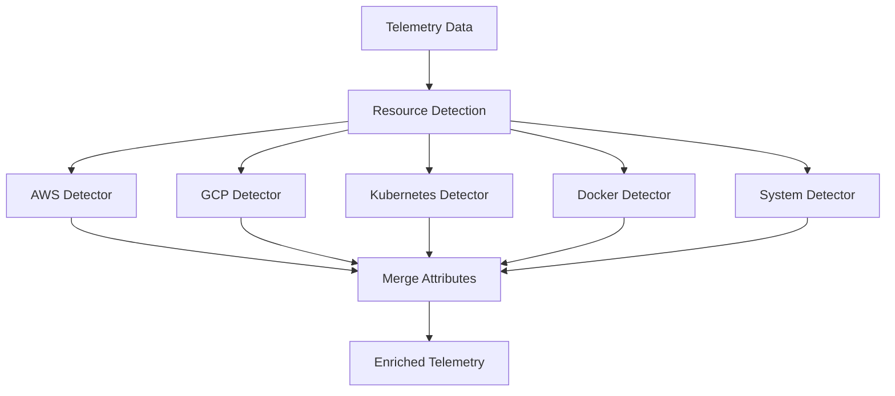

# How to Configure the Resource Detection Processor in the OpenTelemetry Collector

Author: [nawazdhandala](https://www.github.com/nawazdhandala)

Tags: OpenTelemetry, Collector, Processor, Resource Detection, Cloud Provider, Infrastructure, Observability

Description: Learn how to configure the resource detection processor in OpenTelemetry Collector to automatically discover and add cloud provider, container, and system metadata to your telemetry data.

The resource detection processor automatically discovers information about the environment where your collector is running and adds it as resource attributes to all telemetry data. Instead of manually configuring metadata about your AWS instances, GCP virtual machines, Kubernetes clusters, or Docker containers, this processor detects this information automatically from cloud provider metadata services and system APIs.

## Why Resource Detection Matters

Understanding where your telemetry originates is critical for troubleshooting and analysis. Knowing a request was slow is useful, but knowing it came from an `m5.large` instance in `us-east-1` availability zone `us-east-1a` running on Kubernetes cluster `production-eks-01` gives you the context to diagnose infrastructure-related issues.

For more on telemetry context, see our guide on [structured logging in OpenTelemetry](https://oneuptime.com/blog/post/2025-08-28-how-to-structure-logs-properly-in-opentelemetry/view).

## How Resource Detection Works

The processor runs a series of detectors that query different sources for metadata. Each detector knows how to extract information from specific environments (AWS, GCP, Azure, Kubernetes, Docker, etc.). The collected attributes are merged and added to all telemetry passing through the pipeline.


```mermaid
graph TD
    A[Telemetry Data] --> B[Resource Detection]
    B --> C[AWS Detector]
    B --> D[GCP Detector]
    B --> E[Kubernetes Detector]
    B --> F[Docker Detector]
    B --> G[System Detector]
    C --> H[Merge Attributes]
    D --> H
    E --> H
    F --> H
    G --> H
    H --> I[Enriched Telemetry]
```

## Basic Configuration

Here's a minimal configuration that detects environment variables and system information:

```yaml
# Basic resource detection configuration

# Detects system and environment information
receivers:
  otlp:
    protocols:
      grpc:
        endpoint: 0.0.0.0:4317

processors:
  # Resource detection runs detectors in order
  # For duplicate detected attributes, the first detector to insert wins
  resource_detection:
    # List of detectors to run
    # Each detector queries specific metadata sources
    detectors: [env, system]

    # Timeout for all detectors combined
    timeout: 5s

    # Whether to override existing resource attributes
    # false = keep existing, true = override with detected
    override: false

exporters:
  otlp:
    endpoint: https://oneuptime.com/otlp
    headers:
      x-oneuptime-token: YOUR_ONEUPTIME_TOKEN

service:
  pipelines:
    traces:
      receivers: [otlp]
      processors: [resource_detection]
      exporters: [otlp]
```

## Available Detectors

### Environment Variable Detector

Reads resource attributes from environment variables:

```yaml
processors:
  resource_detection:
    detectors: [env]
    timeout: 2s

    # Resource attributes from the OTEL_RESOURCE_ATTRIBUTES environment variable
    # Format: OTEL_RESOURCE_ATTRIBUTES=key1=value1,key2=value2
```

Set environment variables:

```bash
export OTEL_RESOURCE_ATTRIBUTES="service.name=payment-service,service.version=2.1.0,deployment.environment=production"
```

### System Detector

Detects host information:

```yaml
processors:
  resource_detection:
    detectors: [system]
    timeout: 2s

    # Detects system-level attributes
    system:
      # Hostname detection configuration
      hostname_sources: ["os", "dns"]
```

Attributes detected:
- `host.name` - System hostname
- `os.type` - Operating system (linux, windows, darwin)
- `host.id` - Unique host identifier (disabled by default)
- `host.arch` - CPU architecture (disabled by default)
- `os.description` - OS version details (disabled by default)

### AWS EC2 Detector

Detects AWS EC2 instance metadata:

```yaml
processors:
  resource_detection:
    detectors: [ec2]
    timeout: 5s

    # EC2 metadata service configuration
    ec2:
      # Regex patterns for EC2 tag keys to extract from the instance
      # Requires ec2:DescribeTags IAM permission
      tags:
        - ^Name$
        - ^Environment$
        - ^Team$
        - ^CostCenter$
```

Attributes detected:
- `cloud.provider` = "aws"
- `cloud.platform` = "aws_ec2"
- `cloud.region` - AWS region (us-east-1, eu-west-1)
- `cloud.availability_zone` - AZ (us-east-1a)
- `cloud.account.id` - AWS account ID
- `host.id` - EC2 instance ID
- `host.type` - Instance type (m5.large)
- `host.image.id` - AMI ID
- `host.name` - Private DNS hostname

### AWS ECS Detector

Detects AWS ECS container metadata:

```yaml
processors:
  resource_detection:
    detectors: [ecs]
    timeout: 5s

    # ECS metadata endpoint is automatically detected
    # from environment variables ECS_CONTAINER_METADATA_URI_V4
```

Attributes detected:
- `cloud.provider` = "aws"
- `cloud.platform` = "aws_ecs"
- `cloud.region` - AWS region
- `cloud.availability_zone` - AZ
- `cloud.account.id` - AWS account ID
- `aws.ecs.cluster.arn` - ECS cluster ARN
- `aws.ecs.task.arn` - Task ARN
- `aws.ecs.task.id` - Task ID
- `aws.ecs.task.family` - Task family name
- `aws.ecs.task.revision` - Task definition revision
- `aws.ecs.launchtype` - Launch type (EC2 or FARGATE)
- `aws.log.group.names` - CloudWatch log group names
- `aws.log.stream.names` - CloudWatch log stream names

### AWS EKS Detector

Detects AWS EKS cluster metadata:

```yaml
processors:
  resource_detection:
    detectors: [eks]
    timeout: 15s

    # Enable EKS cluster name detection
    # Requires EC2:DescribeInstances when detected through the EC2 API
    eks:
      resource_attributes:
        k8s.cluster.name:
          enabled: true
```

Attributes detected:
- `cloud.provider` = "aws"
- `cloud.platform` = "aws_eks"
- `cloud.region` - AWS region (disabled by default; combine with the EC2 detector or enable the attribute)
- `cloud.availability_zone` - AZ (disabled by default; combine with the EC2 detector or enable the attribute)
- `k8s.cluster.name` - EKS cluster name (disabled by default unless enabled)

### GCP Detector

Detects Google Cloud Platform metadata:

```yaml
processors:
  resource_detection:
    detectors: [gcp]
    timeout: 5s

    # GCP metadata service is queried automatically
    # Works on GCE, GKE, Cloud Run, Cloud Functions
```

Attributes detected:
- `cloud.provider` = "gcp"
- `cloud.platform` - "gcp_compute_engine", "gcp_kubernetes_engine", "gcp_cloud_run", "gcp_cloud_functions"
- `cloud.region` - GCP region (us-central1)
- `cloud.availability_zone` - Zone (us-central1-a)
- `cloud.account.id` - GCP project ID
- `host.id` - Instance ID
- `host.type` - Machine type (n1-standard-4)
- `host.name` - Instance name
- `k8s.cluster.name` - GKE cluster name (if on GKE)

### Azure Detector

Detects Microsoft Azure metadata:

```yaml
processors:
  resource_detection:
    detectors: [azure]
    timeout: 5s

    # Azure Instance Metadata Service is queried
    # Works on Azure VMs
    # Use the aks detector for Azure Kubernetes Service cluster attributes
```

Attributes detected:
- `cloud.provider` = "azure"
- `cloud.platform` = "azure_vm"
- `cloud.region` - Azure region
- `cloud.account.id` - Subscription ID
- `host.id` - VM ID
- `host.name` - VM name
- `azure.vm.name` - Virtual machine name
- `azure.vm.size` - VM size
- `azure.resourcegroup.name` - Resource group

### Docker Detector

Detects Docker container metadata:

```yaml
processors:
  resource_detection:
    detectors: [docker]
    timeout: 2s

    # Requires access to the Docker daemon socket
    # Mount /var/run/docker.sock on Linux
```

Attributes detected:
- `host.name` - Docker host name
- `os.type` - Docker host operating system
- `container.name` - Container name (disabled by default)
- `container.image.name` - Image name (disabled by default)

### Kubernetes API Detector

Detects Kubernetes node and cluster metadata:

```yaml
processors:
  resource_detection:
    detectors: [k8s_api]
    timeout: 5s

    # Reads from the Kubernetes API
    # Requires K8S_NODE_NAME to be set from the downward API
    # Requires RBAC permissions to read nodes and the kube-system namespace
    k8s_api:
      node_from_env_var: K8S_NODE_NAME
```

Configure pod to expose metadata:

```yaml
apiVersion: v1
kind: Pod
metadata:
  name: my-app
spec:
  containers:
    - name: app
      image: my-app:latest
      env:
        # Required environment variable for the k8s_api detector
        - name: K8S_NODE_NAME
          valueFrom:
            fieldRef:
              fieldPath: spec.nodeName
```

Attributes detected:
- `k8s.node.name` - Node name
- `k8s.node.uid` - Node UID
- `k8s.cluster.uid` - Cluster UID

### OpenShift Detector

Detects Red Hat OpenShift metadata:

```yaml
processors:
  resource_detection:
    detectors: [openshift]
    timeout: 5s

    # Queries the OpenShift and Kubernetes APIs
    # Requires permissions to read OpenShift infrastructure resources
```

Attributes detected:
- `cloud.provider`
- `cloud.platform`
- `cloud.region`
- `k8s.cluster.name`

## Multi-Cloud Configuration

Detect multiple cloud providers (useful for hybrid/multi-cloud):

```yaml
processors:
  resource_detection:
    # Try detectors in order
    # First detector to insert an attribute wins for conflicting attributes
    detectors: [env, eks, ecs, ec2, gcp, azure, aks, k8s_api, docker, system]

    # Increase timeout for multiple detectors
    timeout: 10s

    # Override existing attributes with detected ones
    override: false

    ec2:
      tags:
        - ^Environment$
        - ^Team$

exporters:
  otlp:
    endpoint: https://oneuptime.com/otlp
    headers:
      x-oneuptime-token: YOUR_ONEUPTIME_TOKEN

service:
  pipelines:
    traces:
      receivers: [otlp]
      processors: [resource_detection]
      exporters: [otlp]
    metrics:
      receivers: [otlp]
      processors: [resource_detection]
      exporters: [otlp]
    logs:
      receivers: [otlp]
      processors: [resource_detection]
      exporters: [otlp]
```

## Production AWS Configuration

Comprehensive AWS setup with EC2 tags and EKS support:

```yaml
receivers:
  otlp:
    protocols:
      grpc:
        endpoint: 0.0.0.0:4317
      http:
        endpoint: 0.0.0.0:4318

processors:
  # Batch telemetry before export
  batch:
    timeout: 1s
    send_batch_size: 1024

  # Resource detection with AWS focus
  resource_detection:
    # Detector order matters - more specific first
    detectors: [env, eks, ec2, docker, system]

    # Allow up to 10s for metadata service queries
    timeout: 10s

    # Don't override attributes set by applications
    override: false

    # EC2 configuration
    ec2:
      # Extract EC2 tags by regex
      # Requires IAM permission: ec2:DescribeTags
      tags:
        - ^Name$
        - ^Environment$
        - ^Application$
        - ^Team$
        - ^CostCenter$
        - ^Owner$
        - ^Project$

    eks:
      resource_attributes:
        k8s.cluster.name:
          enabled: true

    # System configuration
    system:
      hostname_sources: ["dns", "os"]

  # Add K8s attributes if on EKS
  k8sattributes:
    auth_type: "serviceAccount"
    passthrough: false
    extract:
      metadata:
        - k8s.namespace.name
        - k8s.deployment.name
        - k8s.pod.name
        - k8s.node.name

exporters:
  otlp:
    endpoint: ${OTEL_EXPORTER_OTLP_ENDPOINT}
    headers:
      x-oneuptime-token: ${OTEL_EXPORTER_OTLP_TOKEN}

    timeout: 30s
    retry_on_failure:
      enabled: true
      initial_interval: 5s
      max_interval: 30s

    compression: gzip

service:
  pipelines:
    traces:
      receivers: [otlp]
      processors: [resource_detection, k8sattributes, batch]
      exporters: [otlp]

    metrics:
      receivers: [otlp]
      processors: [resource_detection, k8sattributes, batch]
      exporters: [otlp]

    logs:
      receivers: [otlp]
      processors: [resource_detection, k8sattributes, batch]
      exporters: [otlp]

  # Monitor resource detection performance
  telemetry:
    metrics:
      level: detailed
      readers:
        - periodic:
            exporter:
              otlp:
                protocol: http/protobuf
                endpoint: ${OTEL_EXPORTER_OTLP_ENDPOINT}
                headers:
                  x-oneuptime-token: ${OTEL_EXPORTER_OTLP_TOKEN}
```

### IAM Policy for EC2 Tags

The EC2 detector needs permissions to describe tags:

```json
{
  "Version": "2012-10-17",
  "Statement": [
    {
      "Effect": "Allow",
      "Action": [
        "ec2:DescribeTags"
      ],
      "Resource": "*"
    }
  ]
}
```

Attach this policy to the EC2 instance role or ECS task role.

## Production GCP Configuration

Setup for Google Cloud Platform with GKE support:

```yaml
receivers:
  otlp:
    protocols:
      grpc:
        endpoint: 0.0.0.0:4317

processors:
  batch:
    timeout: 1s
    send_batch_size: 1024

  resource_detection:
    # GCP-focused detector order
    detectors: [env, gcp, k8s_api, system]

    timeout: 10s
    override: false

    # GCP metadata service is queried automatically
    # No additional configuration needed

  # Add K8s attributes for GKE
  k8sattributes:
    auth_type: "serviceAccount"
    passthrough: false
    extract:
      metadata:
        - k8s.namespace.name
        - k8s.deployment.name
        - k8s.pod.name
        - k8s.node.name
      labels:
        - tag_name: app
          key: app
          from: pod
        - tag_name: version
          key: version
          from: pod

exporters:
  otlp:
    endpoint: ${OTEL_EXPORTER_OTLP_ENDPOINT}
    headers:
      x-oneuptime-token: ${OTEL_EXPORTER_OTLP_TOKEN}

service:
  pipelines:
    traces:
      receivers: [otlp]
      processors: [resource_detection, k8sattributes, batch]
      exporters: [otlp]
```

## Attribute Override Strategy

Control how attributes are merged:

```yaml
processors:
  resource_detection:
    detectors: [env, system, ec2]
    timeout: 5s

    # override defaults to true; set it to false to preserve application attributes
    # Existing attributes take precedence
    # Detected attributes only added if not present
    override: false

  # Alternative: override detected attributes
  resource_detection/override:
    detectors: [env, system, ec2]
    timeout: 5s

    # override: true
    # Detected attributes replace existing ones
    # Use when detector data is more accurate
    override: true

exporters:
  otlp:
    endpoint: https://oneuptime.com/otlp
    headers:
      x-oneuptime-token: YOUR_ONEUPTIME_TOKEN

service:
  pipelines:
    traces:
      receivers: [otlp]
      processors: [resource_detection]
      exporters: [otlp]
```

## Combining with Resource Processor

Add custom attributes alongside detected ones:

```yaml
processors:
  # Detect infrastructure attributes
  resource_detection:
    detectors: [env, system, ec2, eks]
    timeout: 5s

  # Add custom business attributes
  resource:
    attributes:
      - key: service.name
        value: payment-processor
        action: insert
      - key: service.version
        from_attribute: app.version
        action: insert
      - key: business.unit
        value: payments
        action: insert
      - key: cost.center
        value: engineering
        action: insert

exporters:
  otlp:
    endpoint: https://oneuptime.com/otlp
    headers:
      x-oneuptime-token: YOUR_ONEUPTIME_TOKEN

service:
  pipelines:
    traces:
      receivers: [otlp]
      processors: [resource_detection, resource]
      exporters: [otlp]
```

## Troubleshooting

### No Attributes Detected

**Issue**: Resource detection isn't adding any attributes.

**Solutions**:
- Check collector logs for detector errors
- Verify timeout is sufficient (increase to 10s)
- Confirm metadata service is accessible (AWS IMDS, GCP metadata)
- For EC2, check IAM permissions for `ec2:DescribeTags`
- For Kubernetes, verify `K8S_NODE_NAME` and RBAC permissions are set for the `k8s_api` detector

### Wrong Cloud Provider Detected

**Issue**: Detector identifying wrong cloud provider.

**Solutions**:
- Order detectors from most specific to least specific
- Use only relevant detectors for your environment
- Check if metadata services are accessible
- Verify you're not running in nested virtualization

### High Latency

**Issue**: Resource detection adding significant latency.

**Solutions**:
- Reduce timeout (default 5s might be too high)
- Remove unnecessary detectors
- Use only the detectors needed for the environment
- Cache detected attributes (detection runs once per collector start)

### Missing EC2 Tags

**Issue**: EC2 tags not appearing in attributes.

**Solutions**:
- Verify IAM role has `ec2:DescribeTags` permission
- Check tag names are spelled correctly (case-sensitive)
- Confirm tags are actually set on EC2 instance
- Look for rate limiting errors in logs

## Performance Considerations

Resource detection runs once at collector startup or when configuration reloads. After initial detection, attributes are cached and added to all telemetry without additional overhead.

- **Initial detection time**: 1-10 seconds depending on detectors
- **Ongoing overhead**: Negligible (attributes cached)
- **Memory usage**: Minimal (small attribute map)
- **Network**: Only during initial detection

Optimize by:
- Using only necessary detectors
- Setting appropriate timeouts
- Ordering detectors from most to least likely

## Summary

| Detector | Environment | Key Attributes |
|----------|-------------|----------------|
| **env** | Any | OTEL_RESOURCE_ATTRIBUTES |
| **system** | Any | host.name, os.type |
| **ec2** | AWS EC2 | cloud.region, host.id, host.type |
| **ecs** | AWS ECS | aws.ecs.cluster.arn, aws.ecs.task.arn |
| **eks** | AWS EKS | cloud.platform=aws_eks, k8s.cluster.name |
| **gcp** | Google Cloud | cloud.platform=gcp_*, cloud.region |
| **azure** | Microsoft Azure | cloud.platform=azure_*, cloud.region |
| **aks** | Azure Kubernetes Service | cloud.platform, k8s.cluster.name |
| **docker** | Docker | host.name, os.type |
| **k8s_api** | Kubernetes | k8s.node.name, k8s.cluster.uid |

The resource detection processor automatically discovers and adds infrastructure metadata to your telemetry, providing essential context about where your applications are running. This eliminates manual configuration and ensures consistent resource attributes across all traces, metrics, and logs.

For more on enriching telemetry data, see our guides on [Kubernetes attributes processor](https://oneuptime.com/blog/post/2026-02-06-k8s-attributes-processor-opentelemetry-collector/view) and [OpenTelemetry metrics](https://oneuptime.com/blog/post/2025-08-26-what-are-metrics-in-opentelemetry/view).
