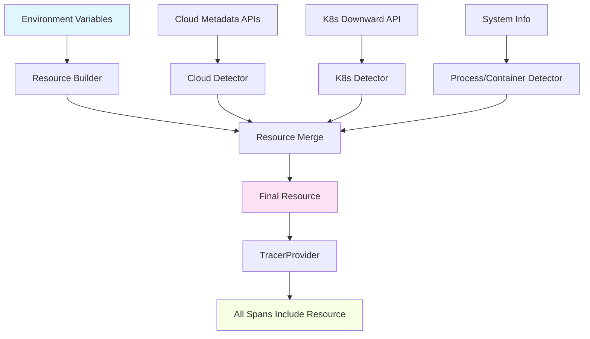

# How to Configure Resource Detection and Service Naming in OpenTelemetry C++

Author: [nawazdhandala](https://www.github.com/nawazdhandala)

Tags: OpenTelemetry, C++, Resource Detection, Service Naming, Configuration

Description: Master resource detection and service naming in OpenTelemetry C++ to properly identify your services, instances, and environments in distributed traces.

Resource attributes provide context about where your telemetry originates. They answer questions like "which service generated this span?" and "which host is this running on?" Without proper resource configuration, your telemetry becomes anonymous data points that are difficult to filter, aggregate, or correlate across a distributed system.

In C++, most resource detection requires explicit configuration. The SDK reads `OTEL_SERVICE_NAME` and `OTEL_RESOURCE_ATTRIBUTES` when you create a resource, but host, Kubernetes, and cloud metadata usually need dedicated detectors or custom code. This gives you precision but requires understanding the resource model and semantic conventions.

## Understanding the OpenTelemetry Resource Model

A Resource represents the entity producing telemetry. It's a set of attributes that remain constant for the lifetime of a process. Common attributes include service name, version, deployment environment, host information, and cloud provider metadata.

Resources are immutable once created. They get attached to all telemetry from a particular SDK instance. This is different from span attributes, which vary per operation.

```cpp
// Basic resource creation with essential service attributes
#include "opentelemetry/sdk/resource/resource.h"
#include "opentelemetry/sdk/resource/resource_detector.h"
#include "opentelemetry/semconv/service_attributes.h"

#include <iomanip>
#include <random>
#include <sstream>

namespace resource = opentelemetry::sdk::resource;
namespace nostd = opentelemetry::nostd;
namespace semconv_service = opentelemetry::semconv::service;

// Generate a unique instance ID for this process
std::string GenerateInstanceId() {
    std::random_device rd;
    std::mt19937_64 gen(rd());
    std::uniform_int_distribution<uint64_t> dist;

    std::stringstream ss;
    ss << std::hex << std::setfill('0')
       << std::setw(16) << dist(gen)
       << std::setw(16) << dist(gen);
    return ss.str();
}

// Create a resource with service identification
resource::Resource CreateServiceResource() {
    // Use semantic convention constants for attribute keys
    auto service_name = semconv_service::kServiceName;
    auto service_version = semconv_service::kServiceVersion;
    auto service_namespace = semconv_service::kServiceNamespace;
    auto service_instance_id = semconv_service::kServiceInstanceId;

    // Build resource attributes
    resource::ResourceAttributes attributes = {
        {service_name, "payment-processor"},
        {service_version, "2.1.0"},
        {service_namespace, "payments"},
        {service_instance_id, GenerateInstanceId()}
    };

    return resource::Resource::Create(attributes);
}
```

The semantic convention constants ensure you use standardized attribute names. This consistency matters when querying telemetry across different services and languages.

## Implementing Environment-Based Configuration

Hard-coding service information doesn't work for modern deployments. Services run in multiple environments with different configurations.

```cpp
// Environment-aware resource configuration
#include <cstdlib>
#include <unordered_map>
#include "opentelemetry/semconv/incubating/cloud_attributes.h"
#include "opentelemetry/semconv/incubating/deployment_attributes.h"
#include "opentelemetry/semconv/service_attributes.h"

namespace semconv_cloud = opentelemetry::semconv::cloud;
namespace semconv_deployment = opentelemetry::semconv::deployment;
namespace semconv_service = opentelemetry::semconv::service;

class EnvironmentResourceBuilder {
private:
    resource::ResourceAttributes attributes_;

    // Get environment variable with fallback
    std::string GetEnvOrDefault(const char* name, const std::string& default_value) {
        const char* value = std::getenv(name);
        return value ? std::string(value) : default_value;
    }

public:
    EnvironmentResourceBuilder() {
        // Service identification from environment
        attributes_[semconv_service::kServiceName] =
            GetEnvOrDefault("OTEL_SERVICE_NAME", "payment-processor");

        attributes_[semconv_service::kServiceVersion] =
            GetEnvOrDefault("SERVICE_VERSION", "dev");

        attributes_[semconv_service::kServiceNamespace] =
            GetEnvOrDefault("SERVICE_NAMESPACE", "payments");

        // Deployment information
        attributes_[semconv_deployment::kDeploymentEnvironmentName] =
            GetEnvOrDefault("ENVIRONMENT", "local");

        attributes_[semconv_cloud::kCloudRegion] =
            GetEnvOrDefault("AWS_REGION", "unknown");
    }

    // Add custom attributes
    EnvironmentResourceBuilder& AddAttribute(const std::string& key, const std::string& value) {
        attributes_[key] = value;
        return *this;
    }

    // Build the final resource
    resource::Resource Build() {
        return resource::Resource::Create(attributes_);
    }
};

// Usage example
resource::Resource CreateConfiguredResource() {
    return EnvironmentResourceBuilder()
        .AddAttribute("team.name", "platform-engineering")
        .AddAttribute("cost.center", "engineering-ops")
        .Build();
}
```

This pattern separates configuration from code. The same binary can run in different environments, automatically detecting the correct resource attributes from environment variables.

## Automatic Process and Container Detection

OpenTelemetry C++ provides detectors for selected runtime information. These detectors inspect the runtime environment and populate resource attributes.

```cpp
// Using built-in resource detectors
#include "opentelemetry/sdk/resource/resource_detector.h"
#include "opentelemetry/resource_detectors/container_detector.h"
#include "opentelemetry/resource_detectors/process_detector.h"

namespace resource_detector = opentelemetry::resource_detector;

resource::Resource CreateResourceWithDetection() {
    // Start with manually configured service info
    auto manual_resource = EnvironmentResourceBuilder().Build();

    // Create detectors for automatic attribute detection
    std::vector<std::unique_ptr<resource::ResourceDetector>> detectors;

    // Process information detector
    // Gathers: process.pid, process.executable.path, process.command
    detectors.push_back(
        std::make_unique<resource_detector::ProcessResourceDetector>()
    );

    // Container information detector
    // Gathers: container.id when available
    detectors.push_back(
        std::make_unique<resource_detector::ContainerResourceDetector>()
    );

    // Environment variable detector
    // Reads OTEL_RESOURCE_ATTRIBUTES and OTEL_SERVICE_NAME
    detectors.push_back(
        std::make_unique<resource::OTELResourceDetector>()
    );

    // Merge all detected resources
    resource::Resource detected_resource = resource::Resource::GetEmpty();
    for (auto& detector : detectors) {
        auto detected = detector->Detect();
        detected_resource = detected_resource.Merge(detected);
    }

    // Manual attributes take precedence over detected ones
    return detected_resource.Merge(manual_resource);
}
```

The merge operation combines resources, with the resource passed to `Merge` taking precedence for duplicate keys. This allows you to override detected values with explicitly configured ones.

## Cloud Provider Resource Detection

Running in cloud environments provides additional context. The OpenTelemetry resource model supports cloud provider attributes; in C++ you typically add this with a custom detector or by running the OpenTelemetry Collector's resource detection processor.

```cpp
// AWS-specific resource detection
#include "opentelemetry/semconv/incubating/cloud_attributes.h"
#include "opentelemetry/semconv/incubating/host_attributes.h"

namespace semconv_cloud = opentelemetry::semconv::cloud;
namespace semconv_host = opentelemetry::semconv::host;

class AWSResourceDetector : public resource::ResourceDetector {
private:
    // Query EC2 metadata service
    std::optional<std::string> QueryMetadata(const std::string& path) {
        // Use HTTP client to query http://169.254.169.254/latest/meta-data/{path}
        try {
            HTTPClient client;
            auto response = client.Get("http://169.254.169.254/latest/meta-data/" + path);
            if (response.status_code == 200) {
                return response.body;
            }
        } catch (const std::exception&) {
            // Metadata service not available
        }
        return std::nullopt;
    }

public:
    resource::Resource Detect() override {
        resource::ResourceAttributes attributes;

        // EC2 instance information
        if (auto instance_id = QueryMetadata("instance-id")) {
            attributes[semconv_cloud::kCloudProvider] =
                semconv_cloud::CloudProviderValues::kAws;
            attributes[semconv_cloud::kCloudPlatform] =
                semconv_cloud::CloudPlatformValues::kAwsEc2;
            attributes[semconv_host::kHostId] = *instance_id;
        }

        if (auto instance_type = QueryMetadata("instance-type")) {
            attributes[semconv_host::kHostType] = *instance_type;
        }

        if (auto region = QueryMetadata("placement/region")) {
            attributes[semconv_cloud::kCloudRegion] = *region;
        }

        if (auto availability_zone = QueryMetadata("placement/availability-zone")) {
            attributes[semconv_cloud::kCloudAvailabilityZone] = *availability_zone;
        }

        if (auto account_id = QueryMetadata("identity-credentials/ec2/info")) {
            // Parse JSON to extract account ID
            // attributes[semconv_cloud::kCloudAccountId] = parsed_account_id;
        }

        return resource::ResourceDetector::Create(attributes);
    }
};

// ECS/Fargate resource detection
class ECSResourceDetector : public resource::ResourceDetector {
public:
    resource::Resource Detect() override {
        resource::ResourceAttributes attributes;

        // ECS metadata available via environment variables
        const char* ecs_metadata = std::getenv("ECS_CONTAINER_METADATA_URI_V4");
        if (!ecs_metadata) {
            return resource::ResourceDetector::Create(attributes);
        }

        attributes[semconv_cloud::kCloudProvider] =
            semconv_cloud::CloudProviderValues::kAws;
        attributes[semconv_cloud::kCloudPlatform] =
            semconv_cloud::CloudPlatformValues::kAwsEcs;

        // Query ECS metadata endpoint for additional information
        try {
            HTTPClient client;
            auto response = client.Get(std::string(ecs_metadata));
            // Parse JSON response to extract task ARN, cluster, etc.
            // attributes["container.id"] = parsed_docker_id;
            // attributes["aws.ecs.task.arn"] = parsed_task_arn;
            // attributes["aws.ecs.cluster.arn"] = parsed_cluster_arn;
        } catch (const std::exception&) {
            // Metadata query failed
        }

        return resource::ResourceDetector::Create(attributes);
    }
};
```

Cloud-specific detectors provide rich context about where your service runs. This information is crucial for cost allocation, performance analysis by region, and debugging cloud-specific issues.

## Kubernetes Resource Detection

Kubernetes deployments have their own set of relevant resource attributes.

```cpp
// Kubernetes resource detection using downward API
#include "opentelemetry/semconv/incubating/k8s_attributes.h"

namespace semconv_k8s = opentelemetry::semconv::k8s;

class K8sResourceDetector : public resource::ResourceDetector {
private:
    std::string ReadFile(const std::string& path) {
        std::ifstream file(path);
        if (!file.is_open()) {
            return "";
        }
        std::stringstream buffer;
        buffer << file.rdbuf();
        return buffer.str();
    }

    std::string Trim(const std::string& str) {
        size_t first = str.find_first_not_of(" \t\n\r");
        if (first == std::string::npos) return "";
        size_t last = str.find_last_not_of(" \t\n\r");
        return str.substr(first, last - first + 1);
    }

public:
    resource::Resource Detect() override {
        resource::ResourceAttributes attributes;

        // Kubernetes mounts downward API info into containers
        // These paths assume standard Kubernetes downward API volume mounts

        // Namespace
        if (auto ns = ReadFile("/var/run/secrets/kubernetes.io/serviceaccount/namespace");
            !ns.empty()) {
            attributes[semconv_k8s::kK8sNamespaceName] = Trim(ns);
        } else if (const char* ns_env = std::getenv("K8S_NAMESPACE")) {
            attributes[semconv_k8s::kK8sNamespaceName] = ns_env;
        }

        // Pod name from environment variable (set via downward API)
        if (const char* pod_name = std::getenv("K8S_POD_NAME")) {
            attributes[semconv_k8s::kK8sPodName] = pod_name;
        }

        // Pod UID
        if (const char* pod_uid = std::getenv("K8S_POD_UID")) {
            attributes[semconv_k8s::kK8sPodUid] = pod_uid;
        }

        // Node name
        if (const char* node_name = std::getenv("K8S_NODE_NAME")) {
            attributes[semconv_k8s::kK8sNodeName] = node_name;
        }

        // Container name
        if (const char* container_name = std::getenv("K8S_CONTAINER_NAME")) {
            attributes[semconv_k8s::kK8sContainerName] = container_name;
        }

        // Deployment/StatefulSet/DaemonSet information
        if (const char* deployment = std::getenv("K8S_DEPLOYMENT_NAME")) {
            attributes[semconv_k8s::kK8sDeploymentName] = deployment;
        }

        // Cluster name (if configured)
        if (const char* cluster = std::getenv("K8S_CLUSTER_NAME")) {
            attributes[semconv_k8s::kK8sClusterName] = cluster;
        }

        return resource::ResourceDetector::Create(attributes);
    }
};
```

To populate these environment variables, configure your Kubernetes deployment manifest to use the downward API:

```yaml
env:
  - name: K8S_POD_NAME
    valueFrom:
      fieldRef:
        fieldPath: metadata.name
  - name: K8S_POD_UID
    valueFrom:
      fieldRef:
        fieldPath: metadata.uid
  - name: K8S_NODE_NAME
    valueFrom:
      fieldRef:
        fieldPath: spec.nodeName
  - name: K8S_NAMESPACE
    valueFrom:
      fieldRef:
        fieldPath: metadata.namespace
```

## Creating a Comprehensive Resource Detection Strategy

Combining multiple detectors creates a complete picture of your service's runtime environment.

```cpp
// Complete resource detection orchestrator
class ResourceManager {
private:
    std::vector<std::unique_ptr<resource::ResourceDetector>> detectors_;
    resource::Resource cached_resource_;
    bool initialized_ = false;

public:
    ResourceManager() {
        // Order matters: more specific detectors first
        // Later detectors can override earlier ones if you pass them as the
        // updating resource to Merge.

        // Environment variables from OTEL_RESOURCE_ATTRIBUTES and OTEL_SERVICE_NAME
        detectors_.push_back(std::make_unique<resource::OTELResourceDetector>());

        // Cloud-specific detection
        detectors_.push_back(std::make_unique<AWSResourceDetector>());
        detectors_.push_back(std::make_unique<ECSResourceDetector>());

        // Container orchestration
        detectors_.push_back(std::make_unique<K8sResourceDetector>());

        // Generic system information (lowest priority)
        detectors_.push_back(std::make_unique<resource_detector::ContainerResourceDetector>());
        detectors_.push_back(std::make_unique<resource_detector::ProcessResourceDetector>());
    }

    const resource::Resource& GetResource() {
        if (!initialized_) {
            Initialize();
        }
        return cached_resource_;
    }

private:
    void Initialize() {
        // Start with base service information
        auto builder = EnvironmentResourceBuilder();
        cached_resource_ = builder.Build();

        // Apply each detector and merge results
        for (auto& detector : detectors_) {
            try {
                auto detected = detector->Detect();
                cached_resource_ = detected.Merge(cached_resource_);
            } catch (const std::exception& e) {
                // Log error but continue with other detectors
                std::cerr << "Resource detection failed: " << e.what() << std::endl;
            }
        }

        initialized_ = true;

        // Log the final resource for debugging
        LogResource(cached_resource_);
    }

    void LogResource(const resource::Resource& res) {
        std::cout << "Detected resource attributes:" << std::endl;
        for (const auto& attr : res.GetAttributes()) {
            std::cout << "  " << attr.first << " = ";
            // Handle different attribute value types
            if (nostd::holds_alternative<std::string>(attr.second)) {
                std::cout << nostd::get<std::string>(attr.second);
            } else if (nostd::holds_alternative<int64_t>(attr.second)) {
                std::cout << nostd::get<int64_t>(attr.second);
            } else if (nostd::holds_alternative<bool>(attr.second)) {
                std::cout << (nostd::get<bool>(attr.second) ? "true" : "false");
            }
            std::cout << std::endl;
        }
    }
};
```

## Integrating Resources with SDK Initialization

Resources must be configured when initializing the OpenTelemetry SDK. They become immutable after initialization.

```cpp
// Complete SDK initialization with resource detection
#include "opentelemetry/sdk/trace/tracer_provider.h"
#include "opentelemetry/sdk/trace/batch_span_processor.h"
#include "opentelemetry/exporters/otlp/otlp_http_exporter.h"
#include "opentelemetry/trace/provider.h"

void InitializeOpenTelemetry() {
    // Detect and create resource
    ResourceManager resource_manager;
    auto resource = resource_manager.GetResource();

    // Create exporter
    opentelemetry::exporter::otlp::OtlpHttpExporterOptions exporter_opts;
    exporter_opts.url = "http://localhost:4318/v1/traces";
    auto exporter =
        std::unique_ptr<opentelemetry::sdk::trace::SpanExporter>(
            new opentelemetry::exporter::otlp::OtlpHttpExporter(exporter_opts));

    // Create span processor
    opentelemetry::sdk::trace::BatchSpanProcessorOptions processor_options{};
    auto processor =
        std::unique_ptr<opentelemetry::sdk::trace::SpanProcessor>(
            new opentelemetry::sdk::trace::BatchSpanProcessor(
                std::move(exporter),
                processor_options));

    // Create tracer provider with resource
    auto provider =
        opentelemetry::nostd::shared_ptr<opentelemetry::sdk::trace::TracerProvider>(
            new opentelemetry::sdk::trace::TracerProvider(
                std::move(processor),
                resource));  // Resource attached here

    // Set as global tracer provider
    opentelemetry::trace::Provider::SetTracerProvider(provider);
}
```

Every span created by this SDK instance will automatically include the resource attributes.

Resource Hierarchy Visualization

Understanding how resources flow through your telemetry pipeline helps with debugging.


```mermaid
graph TD
    A[Environment Variables] --> B[Resource Builder]
    C[Cloud Metadata APIs] --> D[Cloud Detector]
    E[K8s Downward API] --> F[K8s Detector]
    G[System Info] --> H[Process/Container Detector]

    B --> I[Resource Merge]
    D --> I
    F --> I
    H --> I

    I --> J[Final Resource]
    J --> K[TracerProvider]
    K --> L[All Spans Include Resource]

    style A fill:#e1f5ff
    style J fill:#ffe1f5
    style L fill:#f5ffe1
```

## Best Practices for Service Naming

Service names should be consistent, descriptive, and hierarchical when appropriate.

```cpp
// Service naming conventions
namespace ServiceNaming {
    // Good: Describes what the service does
    const char* PAYMENT_PROCESSOR = "payment-processor";
    const char* USER_AUTH = "user-authentication";
    const char* INVENTORY_SYNC = "inventory-synchronization";

    // For microservices with many components, use hierarchical names
    const char* API_GATEWAY = "api.gateway";
    const char* API_AUTH = "api.auth";
    const char* API_ORDERS = "api.orders";

    // Include environment in deployment.environment.name, not the service name
    // Good: service.name="payment-processor", deployment.environment.name="production"
    // Bad:  service.name="payment-processor-production"

    // Generate service name with optional component
    std::string GenerateServiceName(
        const std::string& base_name,
        const std::string& component = ""
    ) {
        if (component.empty()) {
            return base_name;
        }
        return base_name + "." + component;
    }
}
```

Consistent naming enables powerful queries across your observability platform. You can filter by service, aggregate by namespace, or analyze patterns across service families.

Resource detection transforms anonymous telemetry into rich, contextualized data. By implementing comprehensive detection strategies and following semantic conventions, you create observability data that scales with your infrastructure complexity and provides the context needed for effective debugging and analysis.
