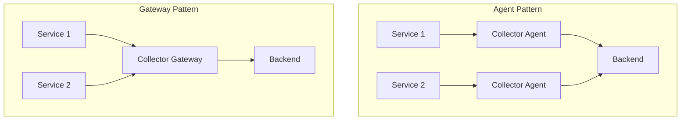

# How to Right-Size CPU and Memory for the OpenTelemetry Collector

Author: [nawazdhandala](https://www.github.com/nawazdhandala)

Tags: OpenTelemetry, Collector, Deployment, Performance, Resource Management, CPU, Memory

Description: Learn how to properly size CPU and memory resources for OpenTelemetry Collector deployments based on throughput, processing requirements, and production best practices.

Properly sizing CPU and memory resources for the OpenTelemetry Collector is critical for maintaining reliable telemetry pipelines. Under-provisioning leads to data loss and performance degradation, while over-provisioning wastes infrastructure costs. This guide walks through the factors that influence resource requirements and provides practical formulas for right-sizing your collector deployments.

## Understanding Collector Resource Usage

The OpenTelemetry Collector's resource consumption depends on several factors:

- **Throughput volume**: Number of spans, metrics, and logs processed per second
- **Pipeline complexity**: Number and type of processors in your pipeline
- **Data retention**: Whether you use persistent queues or memory queues
- **Batching configuration**: Batch sizes affect memory buffering
- **Exporter count**: Each exporter maintains its own queue

Here's a basic architecture showing where resources are consumed:


## CPU Requirements

CPU usage in the collector is primarily driven by data processing activities. Each processor consumes CPU cycles differently.

### CPU Consumption by Component

The following processors have varying CPU impacts:

- **Batch processor**: Low CPU (simple aggregation)
- **Attributes processor**: Medium CPU (string operations)
- **Resource detection processor**: Low CPU (runs once at startup)
- **Transform processor**: High CPU (complex transformations)
- **Tail sampling processor**: Very high CPU (stateful processing)

### Calculating CPU Needs

A baseline formula for CPU estimation:

```
CPU cores = (throughput_per_second × processing_time_per_item) / 1000
```

For example, processing 10,000 spans per second with an average processing time of 0.5ms:

```
CPU cores = (10,000 × 0.5) / 1000 = 5 cores
```

Here's a configuration that shows CPU-intensive processing:

```yaml
# config.yaml - CPU-intensive pipeline example
receivers:
  otlp:
    protocols:
      grpc:
        endpoint: 0.0.0.0:4317
      http:
        endpoint: 0.0.0.0:4318

processors:
  # Batch processor: minimal CPU impact
  batch:
    timeout: 1s
    send_batch_size: 1024
    send_batch_max_size: 2048

  # Transform processor: high CPU for complex transformations
  transform:
    trace_statements:
      - context: span
        statements:
          # CPU-intensive: regex matching and string manipulation
          - replace_pattern(attributes["http.url"], "token=([^&]+)", "token=***")
          - set(attributes["service.environment"], "production")

  # Memory limiter: monitors memory usage (minimal CPU)
  memory_limiter:
    check_interval: 1s
    limit_mib: 512
    spike_limit_mib: 128

exporters:
  otlp:
    endpoint: backend:4317
    tls:
      insecure: false

service:
  pipelines:
    traces:
      receivers: [otlp]
      processors: [memory_limiter, batch, transform]
      exporters: [otlp]
```

### CPU Scaling Guidelines

Use these guidelines for different throughput levels:

| Throughput (spans/sec) | Minimal Pipeline | Standard Pipeline | Complex Pipeline |
|------------------------|------------------|-------------------|------------------|
| 1,000                  | 0.5 cores        | 1 core            | 2 cores          |
| 10,000                 | 1 core           | 2 cores           | 4 cores          |
| 50,000                 | 2 cores          | 4 cores           | 8 cores          |
| 100,000                | 4 cores          | 8 cores           | 16 cores         |

## Memory Requirements

Memory usage in the collector is influenced by batching, queuing, and the number of concurrent connections.

### Memory Consumption Breakdown

Memory is allocated across several areas:

1. **Receiver buffers**: Store incoming data before processing
2. **Processor state**: Some processors maintain state (e.g., tail sampling)
3. **Export queues**: Each exporter maintains a queue of batches
4. **Go runtime overhead**: Typically 50-100 MB baseline

### Memory Queue Sizing

The memory queue is a critical component. Its size determines how much data can be buffered during export delays:

```yaml
# config.yaml - Memory queue configuration
exporters:
  otlp:
    endpoint: backend:4317
    # Sending queue configuration affects memory usage
    sending_queue:
      enabled: true
      # Number of batches to queue in memory
      # Each batch consumes memory based on batch size
      queue_size: 1000
      # Number of concurrent export workers
      num_consumers: 10

  # Failover exporter with larger queue
  otlp/backup:
    endpoint: backup:4317
    sending_queue:
      enabled: true
      queue_size: 5000
```

### Calculating Memory Needs

Memory estimation formula:

```
Memory (MB) = base_overhead + (queue_size × batch_size × avg_item_size × exporter_count) / 1024 / 1024
```

Example calculation for a typical deployment:

- Base overhead: 100 MB
- Queue size: 1000 batches
- Batch size: 1024 items per batch
- Average span size: 2 KB
- Number of exporters: 2

```
Memory = 100 + (1000 × 1024 × 2048 × 2) / 1024 / 1024
Memory = 100 + 4096 MB = 4196 MB (~4 GB)
```

Here's a memory-optimized configuration:

```yaml
# config.yaml - Memory-optimized configuration
processors:
  # Memory limiter should be first in pipeline
  # Prevents OOM by refusing data when limit is reached
  memory_limiter:
    check_interval: 1s
    # Hard limit: collector will refuse data above this
    limit_mib: 1024
    # Soft limit: triggers garbage collection
    spike_limit_mib: 256

  # Batch processor reduces memory by combining items
  batch:
    # Shorter timeout reduces memory holding time
    timeout: 200ms
    # Smaller batches reduce peak memory usage
    send_batch_size: 512
    send_batch_max_size: 1024

exporters:
  otlp:
    endpoint: backend:4317
    sending_queue:
      enabled: true
      # Smaller queue for memory-constrained environments
      queue_size: 500
      num_consumers: 5

service:
  # Enable telemetry to monitor collector's own metrics
  telemetry:
    metrics:
      level: detailed
      address: 0.0.0.0:8888

  pipelines:
    traces:
      receivers: [otlp]
      # Memory limiter MUST be first processor
      processors: [memory_limiter, batch]
      exporters: [otlp]
```

## Kubernetes Resource Specifications

When deploying in Kubernetes, translate these calculations into resource requests and limits:

```yaml
# collector-deployment.yaml
apiVersion: apps/v1
kind: Deployment
metadata:
  name: otel-collector
spec:
  replicas: 3
  template:
    spec:
      containers:
      - name: otel-collector
        image: otel/opentelemetry-collector-contrib:0.93.0
        resources:
          # Requests: guaranteed resources
          requests:
            # CPU: set based on expected throughput
            # 2 cores for ~20k spans/sec with standard pipeline
            cpu: 2000m
            # Memory: calculated based on queue sizes
            memory: 2Gi
          # Limits: maximum allowed resources
          limits:
            # CPU: 1.5-2x requests for burst capacity
            cpu: 4000m
            # Memory: should match memory_limiter setting
            # Leave 20% overhead for Go runtime
            memory: 2.5Gi
        env:
        - name: GOMEMLIMIT
          # Set Go memory limit to 80% of container limit
          # Allows headroom for non-heap memory
          value: "2048MiB"
```

## Monitoring and Adjusting Resources

The collector exposes its own metrics for resource monitoring. Use these to validate your sizing:

```yaml
# config.yaml - Enable collector self-monitoring
service:
  telemetry:
    metrics:
      # Detailed level provides CPU and memory metrics
      level: detailed
      # Expose metrics endpoint
      address: 0.0.0.0:8888

exporters:
  # Export collector's own metrics
  prometheus:
    endpoint: 0.0.0.0:8889
```

### Key Metrics to Monitor

Monitor these collector metrics to identify resource constraints:

- `otelcol_process_cpu_seconds`: CPU usage over time
- `otelcol_process_memory_rss`: Resident memory usage
- `otelcol_receiver_refused_spans`: Data refused due to memory limits
- `otelcol_exporter_queue_size`: Current queue utilization
- `otelcol_exporter_enqueue_failed_spans`: Queue overflow events

### Prometheus Queries for Sizing

Use these queries to assess resource usage:

```promql
# CPU utilization percentage
rate(otelcol_process_cpu_seconds[5m]) * 100

# Memory usage in MB
otelcol_process_memory_rss / 1024 / 1024

# Queue saturation percentage
(otelcol_exporter_queue_size / otelcol_exporter_queue_capacity) * 100

# Data loss rate (should be 0)
rate(otelcol_receiver_refused_spans[5m])
```

## Production Sizing Recommendations

Based on production deployments, here are recommended starting points:

### Small Deployment (1-10 services)
- Throughput: ~1,000 spans/sec
- CPU: 1 core
- Memory: 512 MB
- Replicas: 2 (for availability)

### Medium Deployment (10-50 services)
- Throughput: ~10,000 spans/sec
- CPU: 2 cores
- Memory: 2 GB
- Replicas: 3

### Large Deployment (50-200 services)
- Throughput: ~50,000 spans/sec
- CPU: 4 cores
- Memory: 4 GB
- Replicas: 5

### Very Large Deployment (200+ services)
- Throughput: 100,000+ spans/sec
- CPU: 8+ cores
- Memory: 8+ GB
- Replicas: 10+
- Consider gateway pattern with multiple collector tiers

## Gateway vs Agent Pattern

Resource requirements differ based on deployment pattern:



**Agent pattern**: Deploy collector as sidecar or daemonset
- Lower resource requirements per instance (0.25-0.5 cores, 256-512 MB)
- Resources scale with node count
- Minimal processing, primarily forwarding

**Gateway pattern**: Deploy collector as centralized service
- Higher resource requirements per instance (4-8+ cores, 4-8+ GB)
- Resources scale with total throughput
- Complex processing, aggregation, sampling

## Testing Your Configuration

Before deploying to production, test your resource allocation with realistic load. Use the telemetrygen tool to generate test data:

```bash
# Install telemetrygen
go install github.com/open-telemetry/opentelemetry-collector-contrib/cmd/telemetrygen@latest

# Generate 10,000 spans per second for 5 minutes
telemetrygen traces \
  --otlp-endpoint localhost:4317 \
  --otlp-insecure \
  --rate 10000 \
  --duration 5m \
  --workers 10
```

Monitor the collector during load testing and adjust resources based on observed metrics.

## Common Sizing Mistakes

Avoid these common pitfalls:

1. **Not setting memory_limiter**: Can lead to OOM kills
2. **Setting CPU limits too low**: Causes throttling and data loss
3. **Ignoring queue sizes**: Undersized queues lose data during export delays
4. **Over-provisioning memory**: Wastes resources without improving reliability
5. **Not monitoring collector metrics**: Flying blind on resource usage

## Conclusion

Right-sizing the OpenTelemetry Collector requires understanding your throughput, pipeline complexity, and deployment pattern. Start with the formulas and guidelines provided, deploy with comprehensive monitoring, and adjust based on observed metrics. Remember to set the memory_limiter processor to prevent OOM conditions, and always provision some headroom for traffic spikes.

For more information on collector performance, see the [OpenTelemetry Collector Performance documentation](https://opentelemetry.io/docs/collector/performance/) and related posts:
- https://oneuptime.com/blog/post/benchmark-collector-telemetrygen/view
- https://oneuptime.com/blog/post/persistent-queue-storage-collector-reliability/view
- https://oneuptime.com/blog/post/troubleshoot-collector-not-exporting-data/view
