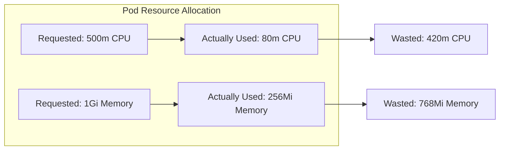

# How to Right-Size Kubernetes Pod CPU and Memory Requests Using OpenTelemetry Metrics

Author: [nawazdhandala](https://www.github.com/nawazdhandala)

Tags: OpenTelemetry, Kubernetes, Resource Optimization, CPU, Memory

Description: Use OpenTelemetry metrics to determine the correct CPU and memory requests for Kubernetes pods and stop wasting cluster resources.

Most Kubernetes clusters are badly over-provisioned. Engineers set CPU and memory requests based on guesswork, then never revisit them. The result: pods requesting 500m CPU but using 50m, wasting 90% of their allocation. Multiply that across hundreds of pods and you are paying for cluster capacity that sits idle.

Right-sizing means setting resource requests to match actual usage plus a reasonable buffer. OpenTelemetry, combined with Kubernetes resource metrics, gives you the data to do this systematically.

## The Problem with Guessing

Kubernetes uses resource requests for scheduling decisions. If a pod requests 1Gi of memory but only uses 200Mi, the scheduler treats 800Mi as unavailable even though it is sitting idle. This is why clusters report high allocation percentages but low actual utilization.



## Collecting the Right Metrics

You need two sets of metrics: what the pods request (from kube-state-metrics) and what they actually consume (from the OpenTelemetry Collector's kubeletstats receiver).

```yaml
# otel-collector-rightsizing.yaml
receivers:
  # Collect actual resource usage from the kubelet
  kubeletstats:
    collection_interval: 15s
    auth_type: serviceAccount
    endpoint: "https://${K8S_NODE_NAME}:10250"
    insecure_skip_verify: true
    metric_groups:
      - container
      - pod

  # Collect requested resources from kube-state-metrics
  prometheus:
    config:
      scrape_configs:
        - job_name: kube-state-metrics
          static_configs:
            - targets: ['kube-state-metrics:8080']
          # Only scrape the metrics we need for right-sizing
          metric_relabel_configs:
            - source_labels: [__name__]
              regex: 'kube_pod_container_resource_(requests|limits).*'
              action: keep

processors:
  batch:
    timeout: 15s

  # Add cluster context
  resource:
    attributes:
      - key: k8s.cluster.name
        value: "prod-cluster"
        action: upsert

exporters:
  prometheusremotewrite:
    endpoint: http://prometheus:9090/api/v1/write
    resource_to_telemetry_conversion:
      enabled: true

service:
  pipelines:
    metrics:
      receivers: [kubeletstats, prometheus]
      processors: [resource, batch]
      exporters: [prometheusremotewrite]
```

## Application-Level Resource Tracking

Beyond container metrics, instrument your application to report its own view of resource consumption. This helps distinguish between baseline resource usage and request-driven usage.

```python
# rightsizing_metrics.py
from opentelemetry import metrics
import resource
import gc

meter = metrics.get_meter("app.resources")

def get_process_metrics(options):
    """Report process-level resource metrics."""
    rusage = resource.getrusage(resource.RUSAGE_SELF)
    yield metrics.Observation(
        value=rusage.ru_maxrss / 1024,  # Convert to MiB
        attributes={"metric": "peak_rss_mib"},
    )

process_memory = meter.create_observable_gauge(
    name="process.memory.peak_rss",
    description="Peak resident set size of the process",
    unit="MiB",
    callbacks=[get_process_metrics],
)

# Track memory per request to understand request-driven allocation
request_memory_delta = meter.create_histogram(
    name="process.memory.per_request_delta",
    description="Memory allocated during request processing",
    unit="KiB",
)

# Track GC activity - frequent GC can indicate memory pressure
gc_collections = meter.create_counter(
    name="process.gc.collections",
    description="Number of garbage collection cycles",
)
```

## Analyzing Usage Patterns

The key to right-sizing is understanding usage patterns over time, not just averages. A pod might average 100m CPU but spike to 400m during periodic batch jobs. Setting the request to 100m would cause throttling during those spikes.

Here are the PromQL queries that reveal the full picture.

```promql
# Actual CPU usage p99 over the last 7 days per container
# This is your baseline for CPU requests
quantile_over_time(0.99,
  rate(container_cpu_usage_seconds_total{namespace="default"}[5m])[7d:5m]
) * 1000  # Convert to millicores

# Actual memory usage max over the last 7 days
# Memory requests should cover the maximum, not the average
max_over_time(
  container_memory_working_set_bytes{namespace="default"}[7d]
) / 1024 / 1024  # Convert to MiB

# Current requests vs actual usage - the waste ratio
kube_pod_container_resource_requests{resource="cpu", unit="core"}
/
rate(container_cpu_usage_seconds_total[5m])

# Memory waste per container
(
  kube_pod_container_resource_requests{resource="memory"}
  - container_memory_working_set_bytes
)
/ 1024 / 1024  # Wasted MiB
```

## Generating Right-Sizing Recommendations

This script queries Prometheus and generates concrete resource request recommendations for each container.

```python
# rightsizing_recommendations.py
import requests
import json

PROMETHEUS_URL = "http://prometheus:9090"

# CPU buffer: 20% above p99 usage
CPU_BUFFER = 1.20
# Memory buffer: 25% above peak usage
MEMORY_BUFFER = 1.25
# Minimum CPU request to avoid being deprioritized
MIN_CPU_MILLICORES = 10
# Minimum memory request
MIN_MEMORY_MIB = 32

def get_recommendations(namespace):
    """Generate right-sizing recommendations for all containers in a namespace."""
    recommendations = []

    # Query p99 CPU usage over the last 14 days
    cpu_query = f'''
    quantile_over_time(0.99,
      rate(container_cpu_usage_seconds_total{{namespace="{namespace}"}}[5m])[14d:5m]
    ) * 1000
    '''
    cpu_results = query_prometheus(cpu_query)

    # Query max memory usage over the last 14 days
    mem_query = f'''
    max_over_time(
      container_memory_working_set_bytes{{namespace="{namespace}"}}[14d]
    ) / 1024 / 1024
    '''
    mem_results = query_prometheus(mem_query)

    # Query current requests for comparison
    cpu_req_query = f'''
    kube_pod_container_resource_requests{{namespace="{namespace}", resource="cpu"}} * 1000
    '''
    cpu_req_results = query_prometheus(cpu_req_query)

    for container in cpu_results:
        container_name = container["metric"]["container"]
        pod_name = container["metric"]["pod"]
        current_cpu_p99 = float(container["value"][1])

        # Find matching memory data
        current_mem_max = find_matching_metric(mem_results, container_name)
        current_cpu_request = find_matching_metric(cpu_req_results, container_name)

        # Calculate recommended values
        recommended_cpu = max(current_cpu_p99 * CPU_BUFFER, MIN_CPU_MILLICORES)
        recommended_mem = max(current_mem_max * MEMORY_BUFFER, MIN_MEMORY_MIB)

        savings_cpu = current_cpu_request - recommended_cpu

        recommendations.append({
            "container": container_name,
            "current_cpu_request_m": round(current_cpu_request),
            "recommended_cpu_request_m": round(recommended_cpu),
            "cpu_savings_m": round(savings_cpu),
            "current_mem_max_mib": round(current_mem_max),
            "recommended_mem_request_mib": round(recommended_mem),
        })

    return recommendations

def query_prometheus(query):
    resp = requests.get(f"{PROMETHEUS_URL}/api/v1/query", params={"query": query})
    return resp.json()["data"]["result"]
```

## Dashboard Layout

The right-sizing dashboard should prioritize showing where the biggest savings are.

**Row 1 - Cluster Waste Summary**: Total CPU requested vs total CPU used across the cluster. Same for memory. Show the waste in both absolute terms (cores, GiB) and cost (dollars per month, if you know your per-core cost).

**Row 2 - Top Wasteful Containers**: A sorted table showing containers with the biggest gap between requested and actual usage. Columns: container name, namespace, CPU requested, CPU p99 used, CPU waste, memory requested, memory max used, memory waste.

**Row 3 - Usage Distributions**: Histograms showing the distribution of CPU utilization ratio (actual/requested) and memory utilization ratio across all containers. A healthy cluster should have most containers in the 60-80% range.

**Row 4 - Per-Service Detail**: Drill-down panels showing CPU and memory usage over time for a selected service, with the current request level drawn as a horizontal line. This makes it visually obvious when a service is over-provisioned or at risk of hitting its limits.

## Implementing Changes Safely

Do not apply all recommendations at once. Start with the containers that have the largest over-provisioning gap and are not on the critical path. Apply changes gradually, monitor for 48 hours after each change, and watch for OOM kills (memory set too low) or CPU throttling (CPU set too low). The OpenTelemetry metrics will show both of these conditions, closing the feedback loop between recommendation and validation.
