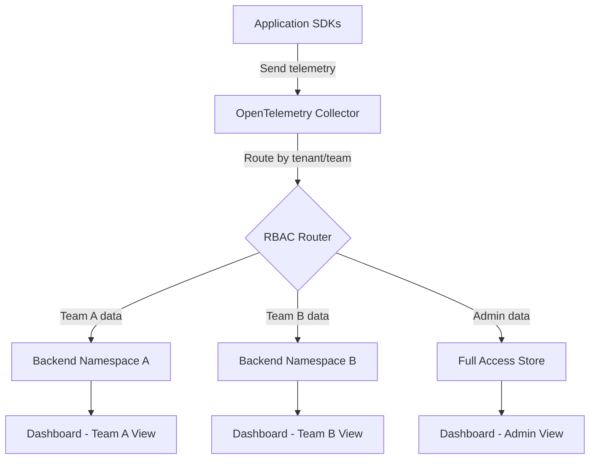
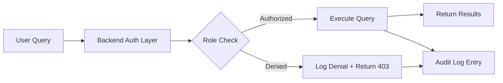

# How to Implement Role-Based Access Control for Telemetry Data

Author: [nawazdhandala](https://www.github.com/nawazdhandala)

Tags: OpenTelemetry, Security, RBAC, Observability, Access Control

Description: Learn how to implement role-based access control for your telemetry data pipelines using OpenTelemetry Collector and backend authorization strategies.

---

Telemetry data is not just operational noise. It often contains sensitive information about your infrastructure, user behavior, and application internals. If everyone in your organization has unrestricted access to all traces, metrics, and logs, you are exposing yourself to serious security and compliance risks. Role-based access control (RBAC) helps you limit who can see what, and it is essential for teams operating in regulated environments.

This guide walks through practical approaches to implementing RBAC for telemetry data across the OpenTelemetry pipeline. We will cover the Collector layer, backend configuration, and strategies for enforcing access boundaries at different stages.

## Why RBAC Matters for Telemetry

Traces can contain database queries, HTTP headers, user IDs, and even authentication tokens if your instrumentation is not carefully configured. Metrics might reveal business-critical throughput numbers. Logs frequently include stack traces with internal service details.

Without access controls, any engineer with dashboard access could potentially see:

- Customer PII embedded in span attributes
- Internal API endpoints and their parameters
- Infrastructure topology and service dependencies
- Error messages containing sensitive configuration details

RBAC lets you define who can access which telemetry signals based on their role, team, or project ownership.

## Architecture Overview

The RBAC strategy spans multiple layers of the telemetry pipeline. Here is how the components fit together.



The core idea is straightforward: tag your telemetry with ownership metadata, route it through the Collector based on those tags, and enforce access policies at the backend and dashboard layers.

## Step 1: Tag Telemetry with Ownership Attributes

The first step is making sure every piece of telemetry carries metadata about who owns it. You can do this through resource attributes set at the SDK level.

This configuration sets resource attributes that identify the team and environment for all telemetry emitted by the service.

```yaml
# otel-sdk-config.yaml
# Set resource attributes to identify the owning team and environment
resource:
  attributes:
    - key: team.name
      value: "payments"
    - key: service.namespace
      value: "fintech-platform"
    - key: environment
      value: "production"
```

You can also inject these attributes at the Collector level using the resource processor, which is useful when you cannot modify the application code directly.

This Collector configuration adds team ownership attributes to all telemetry passing through a specific pipeline.

```yaml
# collector-config.yaml
processors:
  # Add team ownership attributes to incoming telemetry
  resource/team-tagging:
    attributes:
      - key: team.name
        action: upsert
        value: "payments"
      - key: data.classification
        action: upsert
        value: "confidential"
```

## Step 2: Route Telemetry by Team Using the Routing Connector

Once your telemetry is tagged, you can use the routing connector in the OpenTelemetry Collector to send different teams' data to different backends or different namespaces within the same backend.

This configuration routes traces to different exporters based on the team.name resource attribute.

```yaml
# collector-routing.yaml
connectors:
  # Route telemetry to different pipelines based on team ownership
  routing:
    default_pipelines: [traces/default]
    error_mode: ignore
    table:
      - statement: route() where resource.attributes["team.name"] == "payments"
        pipelines: [traces/payments]
      - statement: route() where resource.attributes["team.name"] == "platform"
        pipelines: [traces/platform]

exporters:
  # Payments team data goes to a dedicated endpoint
  otlp/payments:
    endpoint: "https://telemetry-backend:4317"
    headers:
      X-Tenant-ID: "payments"

  # Platform team data goes to a separate endpoint
  otlp/platform:
    endpoint: "https://telemetry-backend:4317"
    headers:
      X-Tenant-ID: "platform"

service:
  pipelines:
    traces/payments:
      receivers: [routing]
      exporters: [otlp/payments]
    traces/platform:
      receivers: [routing]
      exporters: [otlp/platform]
    traces/default:
      receivers: [routing]
      exporters: [otlp/payments]
```

## Step 3: Enforce Access Controls at the Backend

The Collector handles routing, but the actual access enforcement happens at your observability backend. Most modern backends support multi-tenancy or namespace-based isolation.

If you are using an LGTM stack (Loki, Grafana, Tempo, Mimir), you can configure tenant isolation at both the storage and query layers.

This Grafana datasource configuration restricts a particular datasource to only query data for a specific tenant.

```yaml
# grafana-datasource.yaml
apiVersion: 1
datasources:
  # Tempo datasource scoped to payments team tenant
  - name: Tempo-Payments
    type: tempo
    access: proxy
    url: http://tempo:3200
    jsonData:
      httpHeaderName1: "X-Scope-OrgID"
    secureJsonData:
      httpHeaderValue1: "payments"
```

For Grafana's RBAC, you can create teams and assign folder-level permissions so that the payments team can only access dashboards in their folder.

```json
{
  "name": "Payments Team",
  "permissions": [
    {
      "action": "dashboards:read",
      "scope": "folders:uid:payments-folder"
    },
    {
      "action": "datasources:query",
      "scope": "datasources:name:Tempo-Payments"
    }
  ]
}
```

## Step 4: Implement Attribute-Level Redaction

Sometimes RBAC is not just about who can see which service's data. You might need to hide specific attributes from certain roles. For example, a junior developer might see trace structure but not the actual HTTP request bodies.

Use the attributes processor in the Collector to strip sensitive fields before they reach certain backends.

This configuration removes sensitive span attributes before exporting to a shared, lower-privilege telemetry store.

```yaml
# collector-redaction.yaml
processors:
  # Remove sensitive attributes for the shared/general access pipeline
  attributes/redact-sensitive:
    actions:
      - key: http.request.body
        action: delete
      - key: http.request.header.authorization
        action: delete
      - key: db.statement
        action: delete
      - key: enduser.id
        action: hash

  # Keep all attributes for the privileged pipeline
  attributes/full-access:
    actions: []
```

You can wire these processors into separate pipelines so privileged users get the full picture while others see a sanitized version.

## Step 5: Secure Collector-to-Backend Communication

RBAC is only as strong as the transport layer protecting it. Make sure all communication between Collectors and backends uses mTLS, and that Collector instances authenticate with appropriate credentials.

This exporter configuration enables mTLS and bearer token authentication for secure backend communication.

```yaml
# collector-secure-export.yaml
exporters:
  otlp/secure:
    endpoint: "https://telemetry-backend:4317"
    tls:
      # Use mutual TLS for authentication
      cert_file: /certs/collector.crt
      key_file: /certs/collector.key
      ca_file: /certs/ca.crt
    headers:
      # Include bearer token for API-level authorization
      Authorization: "Bearer ${env:COLLECTOR_AUTH_TOKEN}"
```

## Step 6: Audit Access to Telemetry Data

Implementing RBAC is not a one-time task. You need to continuously verify that access policies are working as intended. Set up audit logging for your observability backend so you can track who queried what data and when.



Most backends support audit logging natively. If yours does not, you can add an authentication proxy in front of it that handles role verification and logging.

## Common RBAC Patterns

Here are a few patterns that work well in practice:

**Team-scoped access**: Each team sees only their own services' telemetry. This is the most common pattern and works well with the routing connector approach described above.

**Environment-based access**: Production telemetry is restricted to senior engineers and SREs, while staging and development data is available to everyone.

**Signal-level access**: Some teams can see metrics and logs but not traces, which might contain more sensitive information. This is easy to implement by having separate pipelines for each signal type.

**Time-bounded access**: Incident responders get temporary elevated access during active incidents. This requires integration with your identity provider and is typically handled at the dashboard layer.

## Things to Watch Out For

A few gotchas to keep in mind when implementing telemetry RBAC:

- Resource attributes set by the SDK can be overridden if the Collector is not configured to reject unknown sources. Use authentication at the receiver level to prevent unauthorized data injection.
- Cross-service traces will span multiple teams' namespaces. Decide upfront whether to duplicate spans across tenants or restrict trace views to each team's portion.
- Over-restricting access can slow down incident response. Balance security with operational efficiency by having well-defined escalation paths.

## Wrapping Up

Role-based access control for telemetry data is not a single feature you toggle on. It is a layered strategy that spans your SDK configuration, Collector routing, backend multi-tenancy, and dashboard permissions. Start with team-level routing in the Collector, enforce tenant isolation at the backend, and add attribute-level redaction for sensitive fields. Then audit everything.

The investment pays off quickly. Teams get focused views of their own data, compliance requirements are easier to meet, and sensitive information stays in the right hands.
