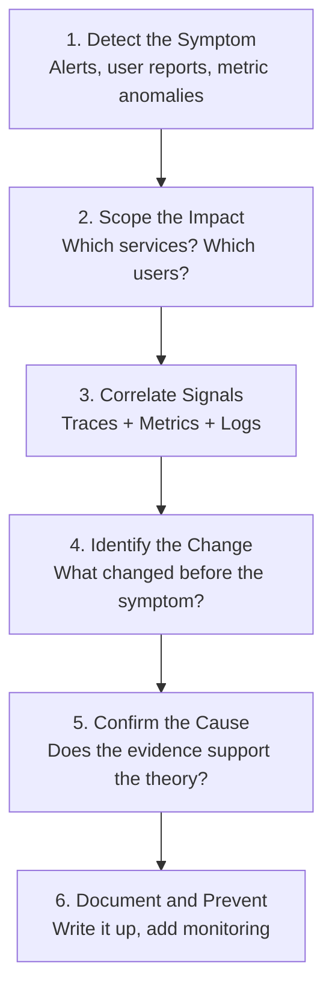

# How to Use OpenTelemetry for Root Cause Analysis in Complex Systems

Author: [nawazdhandala](https://www.github.com/nawazdhandala)

Tags: OpenTelemetry, Root Cause Analysis, Incident Response, Tracing, Metrics, Logs, Observability, Debugging

Description: Learn how to use OpenTelemetry traces, metrics, and logs together for systematic root cause analysis in complex distributed systems, reducing time to resolution.

---

When an incident happens in a complex system, finding the root cause can feel like searching for a needle in a haystack. There are dozens of services, hundreds of metrics, and thousands of log lines. Everyone on the incident call has a different theory about what went wrong, and without a systematic approach, you can spend hours chasing the wrong lead.

OpenTelemetry provides the data foundation for structured root cause analysis. When you have traces that show the flow of requests through your system, metrics that capture resource behavior over time, and logs that provide detailed context, you can work backwards from the symptom to the cause in a methodical way.

This guide presents a framework for root cause analysis using OpenTelemetry data, including practical code for automating the most common investigation steps.

---

## The RCA Framework



Each step of this framework maps to specific OpenTelemetry data and queries. Let us walk through them.

---

## Step 1: Detect and Quantify the Symptom

The first step is understanding exactly what is going wrong and how bad it is. Use your OpenTelemetry metrics to quantify the impact.

```python
# symptom_analysis.py
from opentelemetry import metrics
from datetime import datetime, timedelta

meter = metrics.get_meter("rca.analysis")

class SymptomAnalyzer:
    """
    Analyzes current metric values to quantify the severity and scope
    of an observed symptom.
    """

    def __init__(self, metrics_client):
        self.metrics_client = metrics_client

    def analyze_error_spike(self, service: str, start_time: datetime) -> dict:
        """
        Analyze an error rate spike for a specific service.
        Returns details about the nature and scope of the errors.
        """
        now = datetime.utcnow()

        # Get the current error rate
        current_errors = self.metrics_client.query_rate(
            metric="http.server.errors",
            labels={"service.name": service},
            start=start_time,
            end=now,
        )

        # Get the baseline error rate from the same period yesterday
        baseline_errors = self.metrics_client.query_rate(
            metric="http.server.errors",
            labels={"service.name": service},
            start=start_time - timedelta(days=1),
            end=now - timedelta(days=1),
        )

        # Break down errors by endpoint and type
        error_breakdown = self.metrics_client.query_grouped(
            metric="http.server.errors",
            group_by=["http.route", "error.category"],
            labels={"service.name": service},
            start=start_time,
            end=now,
        )

        # Break down by status code
        status_breakdown = self.metrics_client.query_grouped(
            metric="http.server.errors",
            group_by=["http.status_code"],
            labels={"service.name": service},
            start=start_time,
            end=now,
        )

        return {
            "service": service,
            "period": {"start": start_time.isoformat(), "end": now.isoformat()},
            "current_error_rate": current_errors,
            "baseline_error_rate": baseline_errors,
            "increase_factor": (
                current_errors / baseline_errors if baseline_errors > 0 else float('inf')
            ),
            "error_by_endpoint": error_breakdown,
            "error_by_status": status_breakdown,
        }
```

This analyzer gives you a clear picture of the symptom. Instead of "errors are up," you know "5xx errors on the /checkout endpoint increased 15x compared to yesterday, and they are all 503 Service Unavailable."

---

## Step 2: Trace the Request Path

Use OpenTelemetry traces to understand exactly where requests are failing and what the call chain looks like.

```python
# trace_analysis.py
from collections import defaultdict

class TraceAnalyzer:
    """
    Analyzes traces to identify failing service paths and
    common patterns in error traces.
    """

    def __init__(self, trace_client):
        self.trace_client = trace_client

    def find_error_patterns(self, service: str, start_time, end_time, limit=100) -> dict:
        """
        Fetch recent error traces and identify common failure patterns.
        Groups errors by the failing span's service and operation.
        """
        # Fetch traces that contain errors in the target service
        error_traces = self.trace_client.query_traces(
            attributes={
                "service.name": service,
                "otel.status_code": "ERROR",
            },
            start=start_time,
            end=end_time,
            limit=limit,
        )

        # Group error spans by service and operation
        error_patterns = defaultdict(lambda: {"count": 0, "examples": []})

        for trace_data in error_traces:
            for span in trace_data:
                if span.get("status", {}).get("code") == "ERROR":
                    svc = span.get("resource", {}).get("service.name", "unknown")
                    op = span.get("name", "unknown")
                    key = f"{svc}:{op}"

                    error_patterns[key]["count"] += 1
                    if len(error_patterns[key]["examples"]) < 3:
                        error_patterns[key]["examples"].append({
                            "trace_id": span.get("trace_id"),
                            "error_message": span.get("events", [{}])[0].get(
                                "attributes", {}
                            ).get("exception.message", ""),
                            "duration_ms": span.get("duration_ns", 0) / 1_000_000,
                        })

        # Sort by frequency
        sorted_patterns = sorted(
            error_patterns.items(),
            key=lambda x: x[1]["count"],
            reverse=True,
        )

        return {
            "total_error_traces": len(error_traces),
            "patterns": [
                {"operation": k, **v} for k, v in sorted_patterns
            ],
        }

    def find_common_ancestor(self, error_traces: list) -> dict:
        """
        Find the common upstream service/operation that appears
        in most error traces. This often points to the root cause.
        """
        span_frequency = defaultdict(int)

        for trace_data in error_traces:
            seen = set()
            for span in trace_data:
                svc = span.get("resource", {}).get("service.name", "unknown")
                op = span.get("name", "unknown")
                key = f"{svc}:{op}"
                if key not in seen:
                    span_frequency[key] += 1
                    seen.add(key)

        total = len(error_traces)
        common = {
            k: {"count": v, "percentage": v / total * 100}
            for k, v in span_frequency.items()
            if v / total > 0.5  # Appears in more than 50% of error traces
        }

        return common
```

The `find_common_ancestor` method is particularly powerful. When you have 100 error traces and 95 of them pass through the same database query span, that points you directly at the root cause.

---

## Step 3: Correlate Across Signal Types

The real power of OpenTelemetry for RCA comes from correlating traces, metrics, and logs together.

```python
# signal_correlator.py
from datetime import datetime, timedelta

class SignalCorrelator:
    """
    Correlates traces, metrics, and logs to build a complete
    picture of what happened during an incident.
    """

    def __init__(self, metrics_client, trace_client, log_client):
        self.metrics_client = metrics_client
        self.trace_client = trace_client
        self.log_client = log_client

    def build_incident_timeline(
        self, service: str, incident_start: datetime, window_minutes: int = 30
    ) -> list:
        """
        Build a chronological timeline of events around an incident.
        Looks at all three signal types to piece together the story.
        """
        # Extend the window before the incident to catch the trigger
        analysis_start = incident_start - timedelta(minutes=window_minutes)
        analysis_end = incident_start + timedelta(minutes=window_minutes)

        timeline = []

        # Look for metric changes that preceded the incident
        metric_changes = self._find_metric_changes(
            service, analysis_start, incident_start
        )
        for change in metric_changes:
            timeline.append({
                "type": "metric_change",
                "timestamp": change["timestamp"],
                "description": change["description"],
                "severity": change["severity"],
            })

        # Find deployment events from logs
        deploy_logs = self.log_client.search(
            query="deployment OR deploy OR release",
            service=service,
            start=analysis_start,
            end=analysis_end,
        )
        for log_entry in deploy_logs:
            timeline.append({
                "type": "deployment",
                "timestamp": log_entry["timestamp"],
                "description": log_entry["message"],
                "severity": "info",
            })

        # Find error log patterns
        error_logs = self.log_client.search(
            query="ERROR OR FATAL OR CRITICAL",
            service=service,
            start=analysis_start,
            end=analysis_end,
        )
        for log_entry in error_logs:
            timeline.append({
                "type": "error_log",
                "timestamp": log_entry["timestamp"],
                "description": log_entry["message"],
                "trace_id": log_entry.get("trace_id"),
                "severity": "error",
            })

        # Sort everything chronologically
        timeline.sort(key=lambda x: x["timestamp"])

        return timeline

    def _find_metric_changes(self, service, start, end) -> list:
        """Find significant metric changes in the time window."""
        changes = []
        metrics_to_check = [
            "http.server.request.duration",
            "http.server.errors",
            "db.query.duration",
            "system.cpu.utilization",
            "system.memory.utilization",
        ]

        for metric_name in metrics_to_check:
            values = self.metrics_client.query_range(
                metric=metric_name,
                labels={"service.name": service},
                start=start,
                end=end,
                step="1m",
            )

            # Detect significant jumps (more than 2x change between consecutive points)
            for i in range(1, len(values)):
                prev_val = values[i - 1][1]
                curr_val = values[i][1]
                if prev_val > 0 and curr_val / prev_val > 2.0:
                    changes.append({
                        "timestamp": datetime.fromtimestamp(values[i][0]),
                        "description": (
                            f"{metric_name} jumped from {prev_val:.2f} to {curr_val:.2f}"
                        ),
                        "severity": "warning",
                    })

        return changes
```

The timeline view is incredibly valuable during incident response. Instead of everyone looking at different dashboards, you have a single chronological narrative: "At 14:23 a deployment happened, at 14:25 database query latency doubled, at 14:26 error rate spiked."

---

## Step 4: Automated Root Cause Suggestions

With enough data, you can automate some of the RCA reasoning.

```python
# rca_suggestions.py
def suggest_root_causes(timeline: list, error_patterns: dict) -> list:
    """
    Generate root cause suggestions based on the incident timeline
    and error patterns found in traces.
    """
    suggestions = []

    # Check for deployment correlation
    deployments = [e for e in timeline if e["type"] == "deployment"]
    error_start = next(
        (e for e in timeline if e["type"] == "error_log"), None
    )

    if deployments and error_start:
        for deploy in deployments:
            # If a deployment happened within 10 minutes before errors started
            time_diff = (error_start["timestamp"] - deploy["timestamp"]).total_seconds()
            if 0 < time_diff < 600:
                suggestions.append({
                    "confidence": "high",
                    "cause": "Recent deployment",
                    "evidence": (
                        f"Deployment at {deploy['timestamp']} occurred "
                        f"{int(time_diff)}s before errors started"
                    ),
                    "action": "Consider rolling back the deployment",
                })

    # Check for database-related patterns
    db_patterns = [
        p for p in error_patterns.get("patterns", [])
        if "db" in p["operation"].lower() or "sql" in p["operation"].lower()
    ]
    if db_patterns:
        suggestions.append({
            "confidence": "medium",
            "cause": "Database issue",
            "evidence": (
                f"Database operations account for {db_patterns[0]['count']} "
                f"of the error traces"
            ),
            "action": "Check database health, connection pool, and slow query log",
        })

    # Check for resource exhaustion
    resource_changes = [
        e for e in timeline
        if e["type"] == "metric_change"
        and ("cpu" in e["description"] or "memory" in e["description"])
    ]
    if resource_changes:
        suggestions.append({
            "confidence": "medium",
            "cause": "Resource exhaustion",
            "evidence": resource_changes[0]["description"],
            "action": "Check for memory leaks or increased traffic",
        })

    return sorted(suggestions, key=lambda x: {"high": 0, "medium": 1, "low": 2}[x["confidence"]])
```

This function generates prioritized root cause suggestions based on the evidence gathered from the timeline and trace analysis. It is not magic. It applies the same heuristics that experienced engineers use: look for recent deployments, database issues, and resource exhaustion.

---

## Summary

Root cause analysis in complex systems requires a systematic approach, and OpenTelemetry provides the data to support it. Start with the symptom, quantify it with metrics, trace the request path to find where failures originate, correlate across traces, metrics, and logs to build a timeline, and then look for the change that triggered the problem. The code examples in this guide automate the most common investigation steps, but the framework is what matters most. A structured approach to RCA reduces time to resolution and ensures you do not miss important evidence while chasing hunches.
