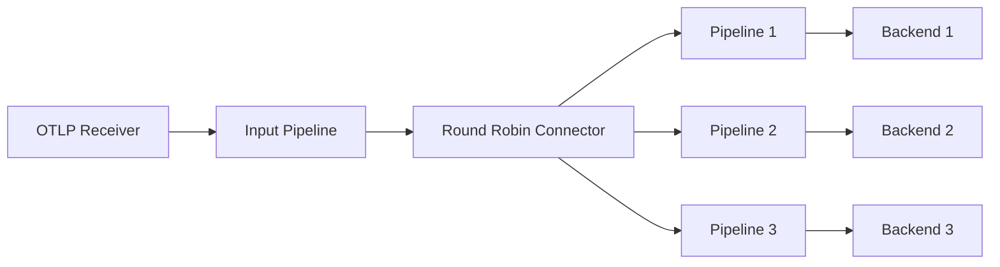

# How to Configure the Round Robin Connector in the OpenTelemetry Collector

Author: [nawazdhandala](https://www.github.com/nawazdhandala)

Tags: OpenTelemetry, Collector, Connector, Round Robin, Load Balancing, Telemetry Pipeline

Description: Learn how to configure and use the Round Robin connector in OpenTelemetry Collector to distribute telemetry data evenly across multiple pipelines for load balancing and parallel processing.

The Round Robin connector in the OpenTelemetry Collector provides a sophisticated mechanism for distributing telemetry data across multiple downstream pipelines using a round-robin algorithm. This connector is particularly useful when you need to balance load across multiple processing paths, parallelize data processing, or send telemetry to multiple backends in a distributed manner.

## Understanding the Round Robin Connector

The Round Robin connector acts as a distribution point in your telemetry pipeline. Unlike traditional exporters that send data to external systems, connectors link pipelines within the same Collector instance. The Round Robin connector takes incoming telemetry data and distributes it sequentially across configured output pipelines, ensuring even distribution over time.

This connector supports all three telemetry signals: traces, metrics, and logs. It operates by maintaining an internal counter that tracks which pipeline should receive the next batch of data, cycling through all available pipelines in order.

## Key Use Cases

The Round Robin connector excels in several scenarios:

**Load Distribution**: When processing high-volume telemetry data, you can split the workload across multiple parallel processing pipelines to prevent bottlenecks and improve throughput.

**Multi-Backend Routing**: Send telemetry data to multiple backend systems without duplicating the entire dataset to each backend. Each backend receives a subset of the data.

**Testing and Comparison**: Route portions of your telemetry to different processing configurations or backends for A/B testing, allowing you to compare performance or behavior without committing all data.

**Cost Optimization**: When using multiple observability backends with different pricing models, distribute data strategically to optimize costs while maintaining coverage.

## Basic Configuration Structure

The Round Robin connector follows the standard OpenTelemetry Collector configuration pattern. Here's the basic structure:

```yaml
receivers:
  otlp:

exporters:
  otlp/backend-1:
    endpoint: backend-1:4317
  otlp/backend-2:
    endpoint: backend-2:4317
  otlp/backend-3:
    endpoint: backend-3:4317

connectors:
  # Define the Round Robin connector
  round_robin:

service:
  pipelines:
    # Input pipeline that feeds the connector
    traces/input:
      receivers: [otlp]
      exporters: [round_robin]

    # Output pipelines that receive distributed data
    traces/backend-1:
      receivers: [round_robin]
      exporters: [otlp/backend-1]

    traces/backend-2:
      receivers: [round_robin]
      exporters: [otlp/backend-2]

    traces/backend-3:
      receivers: [round_robin]
      exporters: [otlp/backend-3]
```

In this configuration, traces arrive via the OTLP receiver and are distributed across the three backend pipelines that use the connector as their receiver. The connector cycles through the available downstream pipelines in sequence.

## Pipeline Flow Architecture

Understanding how data flows through the Round Robin connector is essential for proper configuration:


```mermaid
graph LR
    A[OTLP Receiver] --> B[Input Pipeline]
    B --> C[Round Robin Connector]
    C --> D[Pipeline 1]
    C --> E[Pipeline 2]
    C --> F[Pipeline 3]
    D --> G[Backend 1]
    E --> H[Backend 2]
    F --> I[Backend 3]
```

The connector sits between the input pipeline and multiple output pipelines, acting as an intelligent router that distributes data evenly.

## Configuring for Different Telemetry Types

The Round Robin connector can handle traces, metrics, and logs independently. Here's how to configure it for each signal type.

### Distributing Traces Across Multiple Backends

This configuration distributes traces to three different tracing backends:

```yaml
receivers:
  otlp:
    protocols:
      grpc:
        endpoint: 0.0.0.0:4317
      http:
        endpoint: 0.0.0.0:4318

connectors:
  round_robin/traces:

processors:
  batch:

exporters:
  # Configure exporters for each backend
  otlp/jaeger:
    endpoint: jaeger:4317
    tls:
      insecure: true

  otlp/tempo:
    endpoint: tempo:4317
    tls:
      insecure: true

  zipkin:
    endpoint: http://zipkin:9411/api/v2/spans

service:
  pipelines:
    # Input pipeline receives all traces
    traces/input:
      receivers: [otlp]
      exporters: [round_robin/traces]

    # Output pipelines for each backend
    traces/jaeger:
      receivers: [round_robin/traces]
      processors: [batch]
      exporters: [otlp/jaeger]

    traces/tempo:
      receivers: [round_robin/traces]
      processors: [batch]
      exporters: [otlp/tempo]

    traces/zipkin:
      receivers: [round_robin/traces]
      processors: [batch]
      exporters: [zipkin]
```

Each trace batch arriving at the OTLP receiver will be sent to one of the three downstream trace pipelines in rotation, then the cycle repeats.

### Distributing Metrics for Parallel Processing

For metrics, you can use Round Robin to distribute load across multiple processing pipelines:

```yaml
receivers:
  prometheus:
    config:
      scrape_configs:
        - job_name: 'app-metrics'
          scrape_interval: 30s
          static_configs:
            - targets: ['app:8080']

processors:
  batch:

connectors:
  round_robin/metrics:

exporters:
  prometheusremotewrite/timescale:
    endpoint: http://timescale:9090/api/v1/write

  prometheusremotewrite/victoria:
    endpoint: http://victoria:8428/api/v1/write

service:
  pipelines:
    metrics/input:
      receivers: [prometheus]
      exporters: [round_robin/metrics]

    metrics/timescale:
      receivers: [round_robin/metrics]
      processors: [batch]
      exporters: [prometheusremotewrite/timescale]

    metrics/victoria:
      receivers: [round_robin/metrics]
      processors: [batch]
      exporters: [prometheusremotewrite/victoria]
```

This configuration distributes metric batches between two parallel pipelines, each exporting a subset of the incoming data to a different backend.

## Advanced Configuration Patterns

### Even Distribution Across Pipelines

The Round Robin connector does not have configuration settings for weights or an explicit routing table. It distributes data evenly across downstream pipelines that use the connector as their receiver:

```yaml
connectors:
  round_robin:

service:
  pipelines:
    traces/input:
      receivers: [otlp]
      exporters: [round_robin]

    traces/primary:
      receivers: [round_robin]
      exporters: [otlp/primary]

    traces/secondary:
      receivers: [round_robin]
      exporters: [otlp/secondary]

    traces/archive:
      receivers: [round_robin]
      exporters: [otlp/archive]
```

This creates an even distribution across the primary, secondary, and archive pipelines. If you need weighted or condition-based routing, use a routing-capable component instead.

### Combining with Other Connectors

You can chain Round Robin connectors with other connector types for sophisticated routing:

```yaml
connectors:
  # First, extract metrics from traces
  spanmetrics:
    dimensions:
      - name: service.name
      - name: http.method

  # Then distribute those metrics
  round_robin/metrics:

service:
  pipelines:
    traces/input:
      receivers: [otlp]
      exporters: [spanmetrics]

    metrics/from-traces:
      receivers: [spanmetrics]
      exporters: [round_robin/metrics]

    metrics/prometheus:
      receivers: [round_robin/metrics]
      exporters: [prometheusremotewrite]

    metrics/influxdb:
      receivers: [round_robin/metrics]
      exporters: [influxdb]
```

This configuration generates metrics from traces and then distributes those metrics across multiple backends.

## Performance Considerations

The Round Robin connector is designed for high-throughput scenarios, but there are several factors to consider:

**Pipeline Balance**: Ensure your output pipelines can handle similar throughput rates. If one pipeline is significantly slower, it may create backpressure that affects the entire system.

**Batch Processing**: Always use batch processors in your output pipelines to optimize network usage and reduce overhead.

**Memory Usage**: Each output pipeline maintains its own buffer. More pipelines mean more memory consumption.

**State Distribution**: Remember that related telemetry data may be split across different pipelines. If your backend requires complete trace context or metric relationships, consider using sampling or filtering instead.

## Monitoring Your Round Robin Configuration

To ensure your Round Robin connector operates correctly, monitor these metrics:

```yaml
service:
  telemetry:
    logs:
      level: info
    metrics:
      level: detailed
      readers:
        - pull:
            exporter:
              prometheus:
                host: 0.0.0.0
                port: 8888
                without_type_suffix: true
                without_units: true
```

Key metrics to watch:

- `otelcol_exporter_sent_spans`: Track spans sent through each output pipeline
- `otelcol_exporter_send_failed_spans`: Monitor failures in distribution
- `otelcol_processor_batch_batch_send_size`: Verify batch sizes are consistent across pipelines

## Troubleshooting Common Issues

**Uneven Distribution**: If you notice uneven distribution, verify that all output pipelines receiving from the connector are functioning properly.

**Dropped Data**: Check for backpressure in slower pipelines. Consider adding memory limiters or adjusting batch sizes.

**Configuration Errors**: Ensure the connector is configured with the `round_robin` component type and that each downstream pipeline uses that connector as its receiver.

## Real-World Example: Multi-Region Distribution

Here's a complete example distributing telemetry across three regional backends:

```yaml
receivers:
  otlp:
    protocols:
      grpc:
        endpoint: 0.0.0.0:4317

processors:
  batch:
    timeout: 10s
    send_batch_size: 1024

  memory_limiter:
    check_interval: 1s
    limit_mib: 512

connectors:
  round_robin/regional:

exporters:
  otlp/us-east:
    endpoint: collector-us-east.example.com:4317
    compression: gzip

  otlp/eu-west:
    endpoint: collector-eu-west.example.com:4317
    compression: gzip

  otlp/ap-south:
    endpoint: collector-ap-south.example.com:4317
    compression: gzip

service:
  pipelines:
    traces/input:
      receivers: [otlp]
      processors: [memory_limiter]
      exporters: [round_robin/regional]

    traces/us-east:
      receivers: [round_robin/regional]
      processors: [batch]
      exporters: [otlp/us-east]

    traces/eu-west:
      receivers: [round_robin/regional]
      processors: [batch]
      exporters: [otlp/eu-west]

    traces/ap-south:
      receivers: [round_robin/regional]
      processors: [batch]
      exporters: [otlp/ap-south]
```

This configuration distributes traces evenly across three regional collectors, reducing the load on any single region and improving global observability coverage.

## Related Resources

For more information about OpenTelemetry connectors and pipeline configuration, check out these related posts:

- [How to Use Connectors to Link Traces and Metrics Pipelines](https://oneuptime.com/blog/post/2026-02-06-connectors-link-traces-metrics-pipelines-opentelemetry/view)
- [How to Generate Service Graph Metrics from Traces in the Collector](https://oneuptime.com/blog/post/2026-02-06-generate-service-graph-metrics-traces-collector/view)
- [How to Convert Spans to Metrics Using the Span Metrics Connector](https://oneuptime.com/blog/post/2026-02-06-convert-spans-to-metrics-span-metrics-connector/view)

The Round Robin connector provides a powerful tool for load balancing and distributing telemetry data within your OpenTelemetry Collector deployment. By understanding its configuration options and use cases, you can build more resilient and scalable observability pipelines.
