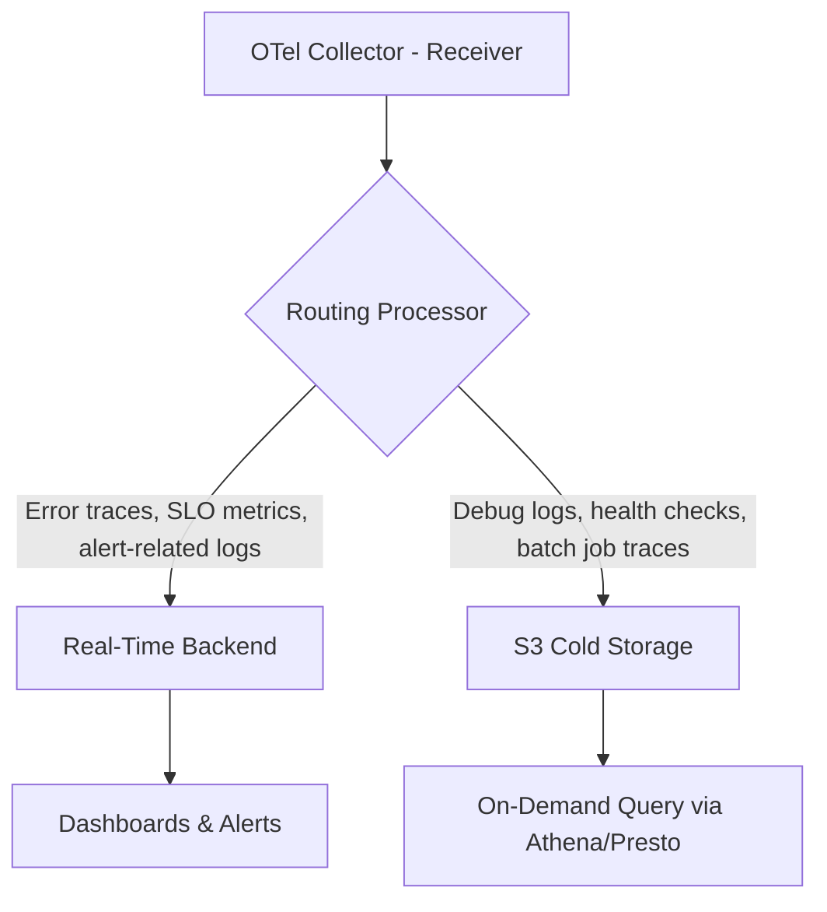

# How to Route High-Value Telemetry to Real-Time Storage and Low-Value Data to S3 Cold Storage

Author: [nawazdhandala](https://www.github.com/nawazdhandala)

Tags: OpenTelemetry, Data Routing, Cold Storage, Cost Optimization

Description: Configure the OpenTelemetry Collector to classify telemetry by value and route it to appropriate storage tiers.

Not all telemetry deserves the same treatment. An error trace from your payment service during checkout needs sub-second query latency. A debug log from a batch job that ran successfully at 3 AM does not. Routing telemetry to the right storage tier based on its operational value is one of the highest-impact cost optimizations you can make.

## The Two-Tier Storage Model

The concept is straightforward: high-value signals go to your real-time observability backend (Elasticsearch, ClickHouse, or a managed vendor). Low-value signals go to S3-compatible object storage where they cost a fraction of the price and remain available for forensic analysis when needed.



## Defining Value Classification Rules

Before configuring anything, you need clear rules for what constitutes "high value." Here is a practical classification:

**High value (real-time storage):**
- Traces with error status codes
- Traces from services on the critical user path
- Metrics used in SLO calculations or alerting rules
- Log records at WARN level and above in production

**Low value (cold storage):**
- Traces from health check endpoints
- Debug and info-level logs from batch processors
- Metrics from internal tooling with no alerting rules
- Successful traces from non-critical background jobs

## Collector Configuration with Routing

The OpenTelemetry Collector's `routing` connector handles signal classification and fan-out. Here is a complete configuration:

```yaml
# Collector config that routes telemetry to hot or cold storage
# based on signal attributes and severity.
receivers:
  otlp:
    protocols:
      grpc:
        endpoint: 0.0.0.0:4317

processors:
  batch/hot:
    send_batch_size: 4096
    timeout: 2s
  batch/cold:
    send_batch_size: 16384
    timeout: 30s

connectors:
  # The routing connector evaluates OTTL conditions to determine
  # which pipeline should receive each signal.
  routing/traces:
    default_pipelines: [traces/cold]
    error_mode: ignore
    table:
      # Route error traces to hot storage
      - condition: attributes["otel.status_code"] == "ERROR"
        pipelines: [traces/hot]
      # Route traces from critical services to hot storage
      - condition: resource.attributes["service.tier"] == "critical"
        pipelines: [traces/hot]

  routing/logs:
    default_pipelines: [logs/cold]
    error_mode: ignore
    table:
      # Route WARN and above to hot storage
      - condition: severity_number >= 13
        pipelines: [logs/hot]
      # Route logs from critical services regardless of level
      - condition: resource.attributes["service.tier"] == "critical"
        pipelines: [logs/hot]

exporters:
  # Hot path - real-time backend with low latency
  otlphttp/realtime:
    endpoint: https://otel-backend.internal:4318
    compression: zstd

  # Cold path - S3-compatible storage via the file exporter
  # paired with a lifecycle policy for cost management
  awss3/cold:
    s3uploader:
      region: us-east-1
      s3_bucket: telemetry-cold-storage
      s3_prefix: "otel"
      s3_partition: "minute"
    marshaler: otlp_json

service:
  pipelines:
    # Ingestion pipelines feed into routing connectors
    traces/ingest:
      receivers: [otlp]
      processors: []
      exporters: [routing/traces]
    logs/ingest:
      receivers: [otlp]
      processors: []
      exporters: [routing/logs]

    # Hot pipelines - small batches, low latency
    traces/hot:
      receivers: [routing/traces]
      processors: [batch/hot]
      exporters: [otlphttp/realtime]
    logs/hot:
      receivers: [routing/logs]
      processors: [batch/hot]
      exporters: [otlphttp/realtime]

    # Cold pipelines - large batches, higher latency is acceptable
    traces/cold:
      receivers: [routing/traces]
      processors: [batch/cold]
      exporters: [awss3/cold]
    logs/cold:
      receivers: [routing/logs]
      processors: [batch/cold]
      exporters: [awss3/cold]
```

## Tagging Services by Tier

The routing config above depends on a `service.tier` resource attribute. Set this in your deployment manifests so that every service self-declares its criticality:

```yaml
# Kubernetes deployment snippet that sets the service tier
# for routing decisions in the Collector.
apiVersion: apps/v1
kind: Deployment
metadata:
  name: checkout-api
spec:
  template:
    metadata:
      labels:
        app: checkout-api
    spec:
      containers:
        - name: checkout-api
          env:
            - name: OTEL_RESOURCE_ATTRIBUTES
              value: "service.name=checkout-api,service.tier=critical,team.name=payments"
```

## Querying Cold Storage

Data in S3 is not lost - it is just not indexed for real-time queries. Use AWS Athena or Presto to query it when you need it. Here is an Athena table definition for OTLP JSON traces:

```sql
-- Create an Athena table over the S3 cold storage bucket
-- so you can run ad-hoc queries against historical traces.
CREATE EXTERNAL TABLE cold_traces (
  resourceSpans array<struct<
    resource: struct<attributes: array<struct<key: string, value: struct<stringValue: string>>>>,
    scopeSpans: array<struct<
      spans: array<struct<
        traceId: string,
        spanId: string,
        name: string,
        startTimeUnixNano: string,
        endTimeUnixNano: string
      >>
    >>
  >>
)
ROW FORMAT SERDE 'org.openx.data.jsonserde.JsonSerDe'
LOCATION 's3://telemetry-cold-storage/otel/traces/'
```

## Cost Impact

The numbers are compelling. Real-time storage typically costs between $0.50 and $2.00 per GB ingested (depending on vendor). S3 Standard costs $0.023 per GB stored per month, and S3 Glacier drops to $0.004 per GB. If 60% of your telemetry is low-value, moving it to cold storage cuts your observability bill by 40-50%.

## Watch Out For

- **Missing context**: If you route a parent span to hot storage but child spans to cold, trace reconstruction breaks. Use the `groupbytrace` processor to keep entire traces together before routing.
- **Cold storage query latency**: Athena queries over large datasets can take minutes. Partition your S3 data by date and service to keep queries fast.
- **Rule drift**: Review your routing rules quarterly. A service that was non-critical six months ago might now be on the critical path.

The goal is not to discard data but to store it at a cost that matches its operational value. Cold storage keeps everything accessible while letting your real-time backend focus on the signals that matter most.
