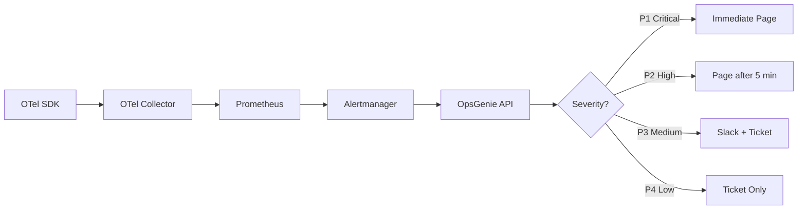

# How to Route OpenTelemetry Alerts to OpsGenie with Severity-Based Escalation Policies

Author: [nawazdhandala](https://www.github.com/nawazdhandala)

Tags: OpenTelemetry, OpsGenie, Alerting, Escalation Policies

Description: Set up severity-based alert routing from OpenTelemetry metrics through Alertmanager to OpsGenie with automatic escalation for unacknowledged incidents.

OpsGenie is a popular incident management platform with strong escalation and on-call scheduling features. Connecting it to your OpenTelemetry pipeline gives you severity-aware routing - critical alerts page the on-call engineer immediately, while warnings create low-priority tickets that can wait until business hours.

This post shows how to wire OpenTelemetry metrics through Prometheus and Alertmanager into OpsGenie, with severity-based escalation policies that automatically escalate unacknowledged alerts.

## Pipeline Overview



## Step 1: Define Severity Levels in Alert Rules

The severity label on your Prometheus alert rules drives the routing behavior in OpsGenie. Define consistent severity levels that map to OpsGenie's priority system.

```yaml
# prometheus-alerts.yaml
# Alert rules with severity levels mapped to OpsGenie priorities

groups:
  - name: service-health
    rules:
      # P1 - Critical: service is down or completely broken
      - alert: ServiceDown
        expr: up{job="api-server"} == 0
        for: 2m
        labels:
          severity: P1
          team: platform
          component: api-server
        annotations:
          summary: "API server is down"
          description: "The API server has been unreachable for more than 2 minutes."
          runbook: "https://wiki.example.com/runbooks/api-server-down"

      # P2 - High: significant degradation affecting users
      - alert: HighErrorRate
        expr: |
          sum(rate(http_server_errors_total[5m])) by (service_name)
          / sum(rate(http_server_request_duration_count[5m])) by (service_name)
          > 0.05
        for: 5m
        labels:
          severity: P2
          team: platform
        annotations:
          summary: "Error rate above 5% on {{ $labels.service_name }}"
          description: "Current error rate: {{ $value | humanizePercentage }}"

      # P3 - Medium: degradation that should be investigated soon
      - alert: HighLatency
        expr: |
          histogram_quantile(0.95,
            sum(rate(http_server_request_duration_bucket[5m])) by (le, service_name)
          ) > 1.5
        for: 15m
        labels:
          severity: P3
          team: platform
        annotations:
          summary: "P95 latency above 1.5s on {{ $labels.service_name }}"

      # P4 - Low: informational, address during working hours
      - alert: DiskSpaceWarning
        expr: node_filesystem_avail_bytes / node_filesystem_size_bytes < 0.2
        for: 30m
        labels:
          severity: P4
          team: infrastructure
        annotations:
          summary: "Disk space below 20% on {{ $labels.instance }}"
```

## Step 2: Configure Alertmanager for OpsGenie

Alertmanager has a native OpsGenie integration. You need an OpsGenie API key from your team's integration settings.

```yaml
# alertmanager.yaml
# Route alerts to OpsGenie with severity-based routing

global:
  resolve_timeout: 5m
  opsgenie_api_url: "https://api.opsgenie.com/"
  opsgenie_api_key: "YOUR_OPSGENIE_API_KEY"

# Inhibit lower-severity alerts when a higher-severity alert is already firing
# for the same service. No need to page about high latency if the service is down.
inhibit_rules:
  - source_match:
      severity: P1
    target_match_re:
      severity: "P2|P3|P4"
    equal: [service_name]

  - source_match:
      severity: P2
    target_match_re:
      severity: "P3|P4"
    equal: [service_name]

route:
  receiver: opsgenie-default
  group_by: [alertname, service_name, team]
  group_wait: 30s
  group_interval: 5m
  repeat_interval: 4h

  routes:
    # P1 Critical - immediate page with short repeat
    - match:
        severity: P1
      receiver: opsgenie-p1
      repeat_interval: 15m
      continue: false

    # P2 High - page with standard repeat
    - match:
        severity: P2
      receiver: opsgenie-p2
      repeat_interval: 1h
      continue: false

    # P3 Medium - create alert but do not page
    - match:
        severity: P3
      receiver: opsgenie-p3
      repeat_interval: 4h
      continue: false

    # P4 Low - informational
    - match:
        severity: P4
      receiver: opsgenie-p4
      repeat_interval: 12h

receivers:
  - name: opsgenie-default
    opsgenie_configs:
      - priority: P3
        message: '{{ .CommonLabels.alertname }}: {{ .CommonAnnotations.summary }}'
        description: '{{ .CommonAnnotations.description }}'
        tags: "opentelemetry,{{ .CommonLabels.team }}"

  - name: opsgenie-p1
    opsgenie_configs:
      - priority: P1
        message: 'CRITICAL: {{ .CommonAnnotations.summary }}'
        description: |
          {{ .CommonAnnotations.description }}

          Runbook: {{ .CommonAnnotations.runbook }}
          Firing since: {{ .Alerts.Firing | len }} alert(s)
        tags: "critical,opentelemetry,{{ .CommonLabels.team }}"
        # Route to the specific team's OpsGenie schedule
        responders:
          - type: team
            name: '{{ .CommonLabels.team }}'

  - name: opsgenie-p2
    opsgenie_configs:
      - priority: P2
        message: 'HIGH: {{ .CommonAnnotations.summary }}'
        description: '{{ .CommonAnnotations.description }}'
        tags: "high,opentelemetry,{{ .CommonLabels.team }}"
        responders:
          - type: team
            name: '{{ .CommonLabels.team }}'

  - name: opsgenie-p3
    opsgenie_configs:
      - priority: P3
        message: '{{ .CommonAnnotations.summary }}'
        description: '{{ .CommonAnnotations.description }}'
        tags: "medium,opentelemetry"

  - name: opsgenie-p4
    opsgenie_configs:
      - priority: P4
        message: '{{ .CommonAnnotations.summary }}'
        tags: "low,opentelemetry"
```

## Step 3: Configure OpsGenie Escalation Policies

In the OpsGenie web console (or via the API), set up escalation policies that define what happens when an alert is not acknowledged within a time window.

Here is an equivalent configuration using the OpsGenie API:

```bash
# Create an escalation policy via the OpsGenie API
# This policy escalates P1 alerts through three tiers

curl -X POST "https://api.opsgenie.com/v2/escalations" \
  -H "Authorization: GenieKey YOUR_OPSGENIE_API_KEY" \
  -H "Content-Type: application/json" \
  -d '{
    "name": "Critical Incident Escalation",
    "description": "Escalation for P1 critical alerts from OpenTelemetry pipeline",
    "rules": [
      {
        "condition": "if-not-acked",
        "notifyType": "default",
        "delay": {"timeAmount": 0, "timeUnit": "minutes"},
        "recipient": {
          "type": "schedule",
          "id": "PRIMARY_ON_CALL_SCHEDULE_ID"
        }
      },
      {
        "condition": "if-not-acked",
        "notifyType": "default",
        "delay": {"timeAmount": 5, "timeUnit": "minutes"},
        "recipient": {
          "type": "schedule",
          "id": "SECONDARY_ON_CALL_SCHEDULE_ID"
        }
      },
      {
        "condition": "if-not-acked",
        "notifyType": "default",
        "delay": {"timeAmount": 15, "timeUnit": "minutes"},
        "recipient": {
          "type": "team",
          "id": "ENGINEERING_MANAGERS_TEAM_ID"
        }
      }
    ]
  }'
```

This escalation policy:

1. Immediately notifies the primary on-call
2. After 5 minutes without acknowledgment, pages the secondary on-call
3. After 15 minutes without acknowledgment, pages the engineering managers

## Step 4: Add OpenTelemetry Context to OpsGenie Alerts

Enrich your alerts with trace and service context so responders can jump straight to debugging. Use Alertmanager's templating to include links to your tracing backend.

```yaml
# alertmanager.yaml (partial)
# Enhanced OpsGenie config with deep links to observability tools

receivers:
  - name: opsgenie-p1
    opsgenie_configs:
      - priority: P1
        message: 'CRITICAL: {{ .CommonAnnotations.summary }}'
        description: |
          {{ .CommonAnnotations.description }}

          Runbook: {{ .CommonAnnotations.runbook }}

          Quick Links:
          - Traces: https://tracing.example.com/search?service={{ .CommonLabels.service_name }}&minDuration=2s
          - Logs: https://logs.example.com/search?service={{ .CommonLabels.service_name }}&level=error
          - Dashboard: https://grafana.example.com/d/svc-overview?var-service={{ .CommonLabels.service_name }}
        details:
          service: '{{ .CommonLabels.service_name }}'
          environment: '{{ .CommonLabels.environment }}'
          team: '{{ .CommonLabels.team }}'
          component: '{{ .CommonLabels.component }}'
        tags: "critical,opentelemetry,{{ .CommonLabels.team }}"
        responders:
          - type: team
            name: '{{ .CommonLabels.team }}'
```

## Testing the Escalation Flow

Trigger a test alert and verify the full escalation chain:

```bash
# Fire a test P1 alert through Alertmanager
curl -X POST http://localhost:9093/api/v2/alerts \
  -H "Content-Type: application/json" \
  -d '[{
    "labels": {
      "alertname": "ServiceDown",
      "severity": "P1",
      "service_name": "api-server",
      "team": "platform",
      "component": "api-server"
    },
    "annotations": {
      "summary": "TEST - API server is down",
      "description": "This is a test alert. Please acknowledge and close.",
      "runbook": "https://wiki.example.com/runbooks/api-server-down"
    }
  }]'
```

Verify in OpsGenie that:

1. The alert arrives with P1 priority
2. The primary on-call is notified immediately
3. If unacknowledged, escalation triggers after 5 minutes
4. The alert details include the deep links to tracing and logging

Remember to close the test alert afterward to avoid unnecessary noise. The combination of severity-based routing in Alertmanager and escalation policies in OpsGenie ensures that critical issues never slip through the cracks, while lower-severity alerts do not wake people up at 3 AM.
