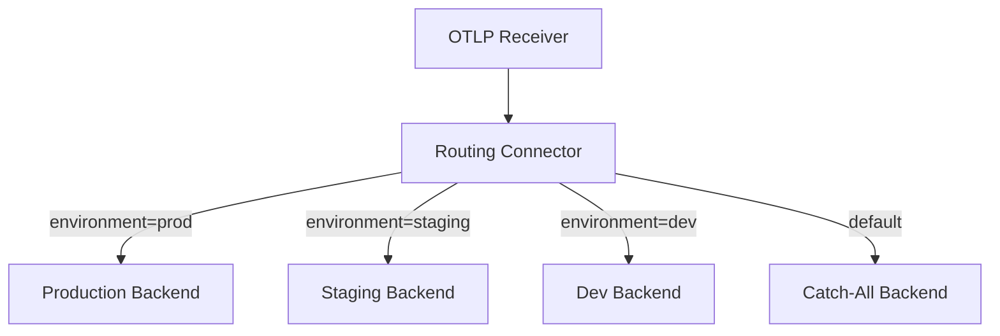

# How to Route Telemetry to Multiple Backends with the Routing Connector

Author: [nawazdhandala](https://www.github.com/nawazdhandala)

Tags: OpenTelemetry, Collector, Connectors, Routing, Multi-Backend

Description: Discover how to use the routing connector to intelligently route telemetry data to different backends based on attributes, resources, and conditions.

The routing connector in the OpenTelemetry Collector enables intelligent, attribute-based routing of telemetry data to multiple backends. Unlike simple fan-out patterns that duplicate all data to every destination, the routing connector makes decisions about where to send each piece of telemetry based on its attributes, resource labels, or other characteristics.

## Why Use the Routing Connector

The routing connector solves several common observability challenges:

- **Cost optimization**: Send high-value traces to expensive backends, while routing less important traces to cost-effective storage
- **Compliance requirements**: Route sensitive data to on-premises backends while sending general telemetry to cloud providers
- **Multi-tenancy**: Direct each tenant's data to their dedicated backend or namespace
- **Environment separation**: Route production, staging, and development telemetry to different destinations



## Basic Routing Configuration

The routing connector examines telemetry attributes and routes data to specific pipelines based on matching rules. Here's a basic example that routes traces based on the service name:

```yaml
receivers:
  otlp:
    protocols:
      grpc:
        endpoint: 0.0.0.0:4317

connectors:
  routing:
    # Define routing table for traces
    default_pipelines: [traces/catchall]
    error_mode: ignore
    table:
      - statement: route() where attributes["service.name"] == "payment-service"
        pipelines: [traces/critical]
      - statement: route() where attributes["service.name"] == "auth-service"
        pipelines: [traces/critical]
      - statement: route() where attributes["service.name"] == "frontend"
        pipelines: [traces/standard]

processors:
  batch:
    timeout: 10s

exporters:
  # Critical services backend (high retention, full features)
  otlp/critical:
    endpoint: critical-backend:4317
    tls:
      insecure: false
      cert_file: /etc/certs/critical.pem

  # Standard backend (moderate retention)
  otlp/standard:
    endpoint: standard-backend:4317
    tls:
      insecure: false
      cert_file: /etc/certs/standard.pem

  # Catch-all backend (low-cost storage)
  otlp/catchall:
    endpoint: catchall-backend:4317
    tls:
      insecure: true

service:
  pipelines:
    # Ingestion pipeline: receive and route
    traces/ingest:
      receivers: [otlp]
      exporters: [routing]

    # Routed pipelines
    traces/critical:
      receivers: [routing]
      processors: [batch]
      exporters: [otlp/critical]

    traces/standard:
      receivers: [routing]
      processors: [batch]
      exporters: [otlp/standard]

    traces/catchall:
      receivers: [routing]
      processors: [batch]
      exporters: [otlp/catchall]
```

This configuration creates an ingestion pipeline that feeds the routing connector. The connector evaluates each trace against the routing table and sends it to the appropriate downstream pipeline based on the service name.

## Environment-Based Routing

A common pattern is routing telemetry based on the deployment environment. This ensures production data goes to production observability backends with appropriate security and retention policies:

```yaml
receivers:
  otlp:
    protocols:
      grpc:
        endpoint: 0.0.0.0:4317

connectors:
  routing:
    default_pipelines: [traces/default]
    error_mode: propagate
    table:
      - statement: route() where resource.attributes["deployment.environment"] == "production"
        pipelines: [traces/production]
      - statement: route() where resource.attributes["deployment.environment"] == "staging"
        pipelines: [traces/staging]
      - statement: route() where resource.attributes["deployment.environment"] == "development"
        pipelines: [traces/development]

processors:
  batch/production:
    timeout: 5s
    send_batch_size: 2048

  batch/nonprod:
    timeout: 30s
    send_batch_size: 512

  # Add resource attributes for environment tracking
  resource:
    attributes:
      - key: collector.pipeline
        value: routed
        action: insert

exporters:
  otlp/production:
    endpoint: https://prod-observability.company.com:4317
    tls:
      insecure: false
      cert_file: /etc/certs/prod.pem
      key_file: /etc/certs/prod-key.pem

  otlp/staging:
    endpoint: https://staging-observability.company.com:4317
    tls:
      insecure: false
      cert_file: /etc/certs/staging.pem

  otlp/development:
    endpoint: http://dev-observability.company.internal:4317
    tls:
      insecure: true

  # Fallback for unclassified telemetry
  logging:
    verbosity: detailed

service:
  pipelines:
    traces/ingest:
      receivers: [otlp]
      exporters: [routing]

    traces/production:
      receivers: [routing]
      processors: [resource, batch/production]
      exporters: [otlp/production]

    traces/staging:
      receivers: [routing]
      processors: [resource, batch/nonprod]
      exporters: [otlp/staging]

    traces/development:
      receivers: [routing]
      processors: [resource, batch/nonprod]
      exporters: [otlp/development]

    traces/default:
      receivers: [routing]
      processors: [batch/nonprod]
      exporters: [logging]
```

Notice how each environment pipeline can have different batch settings, processors, and exporter configurations tailored to that environment's requirements.

## Multi-Tenant Routing

For SaaS platforms or shared infrastructure, routing connector can direct each tenant's telemetry to isolated backends or namespaces:

```yaml
receivers:
  otlp:
    protocols:
      grpc:
        endpoint: 0.0.0.0:4317

connectors:
  routing:
    default_pipelines: [traces/unidentified]
    error_mode: ignore
    table:
      # Route by tenant ID
      - statement: route() where resource.attributes["tenant.id"] == "tenant-a"
        pipelines: [traces/tenant-a]
      - statement: route() where resource.attributes["tenant.id"] == "tenant-b"
        pipelines: [traces/tenant-b]
      - statement: route() where resource.attributes["tenant.id"] == "tenant-c"
        pipelines: [traces/tenant-c]

processors:
  batch:
    timeout: 10s

  # Add tenant-specific resource attributes
  resource/tenant-a:
    attributes:
      - key: tenant.name
        value: "Tenant A Corp"
        action: insert
      - key: tenant.tier
        value: "enterprise"
        action: insert

  resource/tenant-b:
    attributes:
      - key: tenant.name
        value: "Tenant B Inc"
        action: insert
      - key: tenant.tier
        value: "professional"
        action: insert

  resource/tenant-c:
    attributes:
      - key: tenant.name
        value: "Tenant C LLC"
        action: insert
      - key: tenant.tier
        value: "standard"
        action: insert

exporters:
  # Each tenant has a dedicated OTLP endpoint
  otlp/tenant-a:
    endpoint: tenant-a.observability.internal:4317
    headers:
      X-Tenant-ID: tenant-a
      X-API-Key: ${TENANT_A_API_KEY}

  otlp/tenant-b:
    endpoint: tenant-b.observability.internal:4317
    headers:
      X-Tenant-ID: tenant-b
      X-API-Key: ${TENANT_B_API_KEY}

  otlp/tenant-c:
    endpoint: tenant-c.observability.internal:4317
    headers:
      X-Tenant-ID: tenant-c
      X-API-Key: ${TENANT_C_API_KEY}

  # Log unidentified tenant data for investigation
  logging:
    verbosity: detailed

service:
  pipelines:
    traces/ingest:
      receivers: [otlp]
      exporters: [routing]

    traces/tenant-a:
      receivers: [routing]
      processors: [resource/tenant-a, batch]
      exporters: [otlp/tenant-a]

    traces/tenant-b:
      receivers: [routing]
      processors: [resource/tenant-b, batch]
      exporters: [otlp/tenant-b]

    traces/tenant-c:
      receivers: [routing]
      processors: [resource/tenant-c, batch]
      exporters: [otlp/tenant-c]

    traces/unidentified:
      receivers: [routing]
      processors: [batch]
      exporters: [logging]
```

This configuration ensures complete tenant isolation at the collector level, with each tenant's data going to dedicated backends with tenant-specific authentication.

## Priority-Based Routing

Route telemetry based on priority or severity to ensure critical data reaches backends quickly while less important data can be batched more aggressively:

```yaml
receivers:
  otlp:
    protocols:
      grpc:
        endpoint: 0.0.0.0:4317

connectors:
  routing:
    default_pipelines: [traces/normal]
    error_mode: ignore
    table:
      # Route error traces immediately
      - statement: route() where attributes["error"] == true
        pipelines: [traces/errors]
      # Route slow traces (>1s) to performance analysis
      - statement: route() where attributes["duration_ms"] > 1000
        pipelines: [traces/slow]
      # Route sampled traces
      - statement: route() where attributes["sampled"] == true
        pipelines: [traces/sampled]

processors:
  # Minimal batching for errors - send quickly
  batch/errors:
    timeout: 1s
    send_batch_size: 100

  # Standard batching
  batch/standard:
    timeout: 10s
    send_batch_size: 1000

  # Aggressive batching for sampled data
  batch/sampled:
    timeout: 60s
    send_batch_size: 5000

  # Add severity indicators
  resource/errors:
    attributes:
      - key: priority
        value: "high"
        action: insert

exporters:
  # Real-time error tracking backend
  otlp/errors:
    endpoint: errors-backend:4317
    timeout: 5s

  # Performance analysis backend
  otlp/slow:
    endpoint: performance-backend:4317
    timeout: 10s

  # Sampled data warehouse
  otlp/sampled:
    endpoint: warehouse-backend:4317
    timeout: 30s

  # General purpose backend
  otlp/general:
    endpoint: general-backend:4317
    timeout: 10s

service:
  pipelines:
    traces/ingest:
      receivers: [otlp]
      exporters: [routing]

    traces/errors:
      receivers: [routing]
      processors: [resource/errors, batch/errors]
      exporters: [otlp/errors]

    traces/slow:
      receivers: [routing]
      processors: [batch/standard]
      exporters: [otlp/slow]

    traces/sampled:
      receivers: [routing]
      processors: [batch/sampled]
      exporters: [otlp/sampled]

    traces/normal:
      receivers: [routing]
      processors: [batch/standard]
      exporters: [otlp/general]
```

## Complex Routing Logic

The routing connector supports complex conditions using logical operators. Here's an example with multiple conditions:

```yaml
receivers:
  otlp:
    protocols:
      grpc:
        endpoint: 0.0.0.0:4317

connectors:
  routing:
    default_pipelines: [traces/default]
    error_mode: ignore
    table:
      # Route production payment service errors to high-priority pipeline
      - statement: |
          route() where resource.attributes["deployment.environment"] == "production"
          and attributes["service.name"] == "payment-service"
          and attributes["error"] == true
        pipelines: [traces/critical-errors]

      # Route any production errors to standard error pipeline
      - statement: |
          route() where resource.attributes["deployment.environment"] == "production"
          and attributes["error"] == true
        pipelines: [traces/production-errors]

      # Route high-throughput services to dedicated pipeline
      - statement: |
          route() where attributes["service.name"] == "api-gateway"
          or attributes["service.name"] == "load-balancer"
        pipelines: [traces/high-throughput]

      # Route external API calls for cost analysis
      - statement: route() where attributes["span.kind"] == "client" and attributes["http.url"] matches "^https://api\\.external\\.com"
        pipelines: [traces/external-apis]

processors:
  batch/fast:
    timeout: 2s
    send_batch_size: 500

  batch/standard:
    timeout: 10s
    send_batch_size: 1000

  batch/bulk:
    timeout: 30s
    send_batch_size: 5000

exporters:
  otlp/pagerduty:
    endpoint: pagerduty-integration:4317
    timeout: 3s

  otlp/errors:
    endpoint: error-tracking:4317
    timeout: 5s

  otlp/highvolume:
    endpoint: high-volume-backend:4317
    timeout: 15s

  otlp/analytics:
    endpoint: cost-analytics:4317
    timeout: 10s

  otlp/default:
    endpoint: default-backend:4317
    timeout: 10s

service:
  pipelines:
    traces/ingest:
      receivers: [otlp]
      exporters: [routing]

    traces/critical-errors:
      receivers: [routing]
      processors: [batch/fast]
      exporters: [otlp/pagerduty, otlp/errors]

    traces/production-errors:
      receivers: [routing]
      processors: [batch/fast]
      exporters: [otlp/errors]

    traces/high-throughput:
      receivers: [routing]
      processors: [batch/bulk]
      exporters: [otlp/highvolume]

    traces/external-apis:
      receivers: [routing]
      processors: [batch/standard]
      exporters: [otlp/analytics]

    traces/default:
      receivers: [routing]
      processors: [batch/standard]
      exporters: [otlp/default]
```

Notice how the `traces/critical-errors` pipeline exports to multiple backends (PagerDuty and error tracking), demonstrating that routing can be combined with fan-out patterns when needed.

## Routing Metrics and Logs

The routing connector works with all telemetry signals. Here's an example for metrics:

```yaml
receivers:
  prometheus:
    config:
      scrape_configs:
        - job_name: 'services'
          scrape_interval: 30s
          static_configs:
            - targets: ['service-a:8080', 'service-b:8080']

connectors:
  routing:
    default_pipelines: [metrics/default]
    error_mode: ignore
    table:
      # Route business metrics to analytics
      - statement: route() where metric.name matches "^business_.*"
        pipelines: [metrics/business]

      # Route infrastructure metrics to monitoring
      - statement: route() where metric.name matches "^(cpu|memory|disk|network)_.*"
        pipelines: [metrics/infrastructure]

      # Route custom application metrics
      - statement: route() where metric.name matches "^app_.*"
        pipelines: [metrics/application]

processors:
  batch:
    timeout: 30s

exporters:
  prometheusremotewrite/business:
    endpoint: http://business-analytics:9090/api/v1/write

  prometheusremotewrite/infra:
    endpoint: http://infrastructure-monitoring:9090/api/v1/write

  prometheusremotewrite/app:
    endpoint: http://app-monitoring:9090/api/v1/write

  prometheusremotewrite/default:
    endpoint: http://default-prometheus:9090/api/v1/write

service:
  pipelines:
    metrics/ingest:
      receivers: [prometheus]
      exporters: [routing]

    metrics/business:
      receivers: [routing]
      processors: [batch]
      exporters: [prometheusremotewrite/business]

    metrics/infrastructure:
      receivers: [routing]
      processors: [batch]
      exporters: [prometheusremotewrite/infra]

    metrics/application:
      receivers: [routing]
      processors: [batch]
      exporters: [prometheusremotewrite/app]

    metrics/default:
      receivers: [routing]
      processors: [batch]
      exporters: [prometheusremotewrite/default]
```

## Best Practices

When implementing routing connector patterns, consider these best practices:

1. **Always define default pipelines**: Use `default_pipelines` to catch any telemetry that doesn't match routing rules.

2. **Set appropriate error modes**: Use `error_mode: ignore` for production to prevent routing failures from blocking telemetry flow. Use `error_mode: propagate` in development to catch configuration issues.

3. **Order matters**: The routing connector evaluates rules in order. Place more specific rules before general ones.

4. **Monitor routing performance**: Track metrics like `otelcol_connector_routing_routed_spans` to understand routing patterns.

5. **Test routing logic**: Validate your routing statements with representative telemetry before deploying to production.

## Related Resources

For more OpenTelemetry Collector routing patterns:

- [How to Build Fan-Out Pipelines in the OpenTelemetry Collector](https://oneuptime.com/blog/post/fan-out-pipelines-opentelemetry-collector/view)
- [How to Deploy the OpenTelemetry Collector as a Gateway](https://oneuptime.com/blog/post/deploy-opentelemetry-collector-gateway/view)

The routing connector transforms the OpenTelemetry Collector into an intelligent routing engine that can make sophisticated decisions about where to send each piece of telemetry. This capability is essential for building cost-effective, compliant, and scalable observability architectures.
