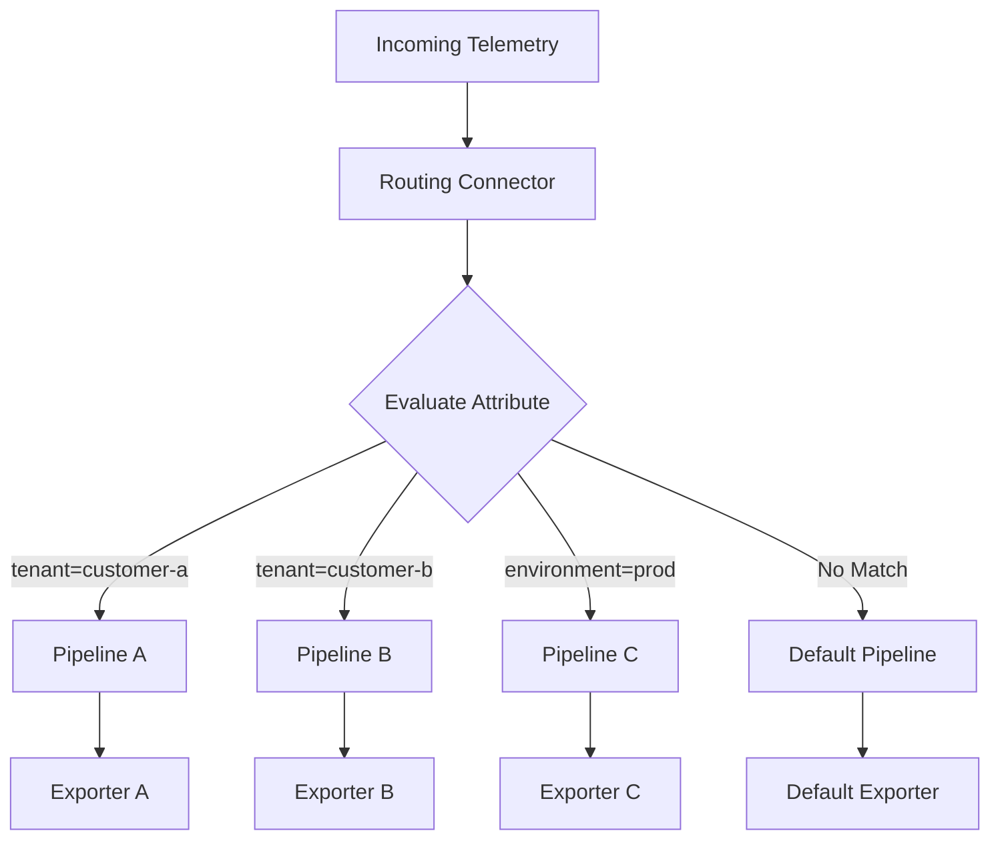

# How to Configure the Routing Connector in the OpenTelemetry Collector

Author: [nawazdhandala](https://www.github.com/nawazdhandala)

Tags: OpenTelemetry, Collector, Connector, Routing, Traffic Management, Multi-Tenancy

Description: Master the Routing Connector in OpenTelemetry Collector to intelligently route telemetry data to different backends based on attributes, enabling multi-tenancy and advanced traffic management.

The Routing Connector in the OpenTelemetry Collector enables intelligent routing of telemetry data based on resource attributes, span attributes, or other telemetry properties. This capability is essential for multi-tenant environments, cost optimization, and implementing sophisticated observability architectures.

## Why Route Telemetry Data

Modern observability platforms often need to route different types of telemetry to different destinations. Common scenarios include:

- **Multi-tenancy**: Route data from different customers or teams to separate backends
- **Cost optimization**: Send high-value data to expensive storage and low-value data to cheaper alternatives
- **Compliance**: Route sensitive data to compliant storage while sending non-sensitive data elsewhere
- **Data tiering**: Send real-time data to fast storage and historical data to long-term storage
- **Specialized backends**: Route specific telemetry types to specialized analysis tools

The Routing Connector makes these scenarios possible without changing application instrumentation.

## How the Routing Connector Works

The Routing Connector examines incoming telemetry with OpenTelemetry Transformation Language (OTTL) conditions and routes data to downstream pipelines based on matching rules:


```mermaid
graph TB
    A[Incoming Telemetry] --> B[Routing Connector]
    B --> C{Evaluate Attribute}
    C -->|tenant=customer-a| D[Pipeline A]
    C -->|tenant=customer-b| E[Pipeline B]
    C -->|environment=prod| F[Pipeline C]
    C -->|No Match| G[Default Pipeline]
    D --> H[Exporter A]
    E --> I[Exporter B]
    F --> J[Exporter C]
    G --> K[Default Exporter]
```

The connector evaluates routing rules in order. By default, matched data is moved to the target pipeline and removed from later route evaluation; use `action: copy` when the same data should continue through later routes. If no rules match, it uses a default pipeline or drops the data.

## Basic Configuration

Here's a simple routing configuration based on the service name attribute:

```yaml
receivers:
  otlp:
    protocols:
      grpc:
        endpoint: 0.0.0.0:4317

processors:
  batch:
    timeout: 10s

exporters:
  # Backend for service A
  otlp/service-a:
    endpoint: backend-a.example.com:4317

  # Backend for service B
  otlp/service-b:
    endpoint: backend-b.example.com:4317

  # Default backend for all other services
  otlp/default:
    endpoint: default-backend.example.com:4317

connectors:
  routing:
    # Default pipeline if no match is found
    default_pipelines:
      - traces/default

    # Routing table mapping OTTL conditions to pipelines
    table:
      - condition: attributes["service.name"] == "service-a"
        pipelines:
          - traces/service-a
      - condition: attributes["service.name"] == "service-b"
        pipelines:
          - traces/service-b

service:
  pipelines:
    traces/in:
      receivers: [otlp]
      processors: [batch]
      # Use routing connector instead of direct exporters
      exporters: [routing]

    traces/service-a:
      receivers: [routing]
      exporters: [otlp/service-a]

    traces/service-b:
      receivers: [routing]
      exporters: [otlp/service-b]

    traces/default:
      receivers: [routing]
      exporters: [otlp/default]
```

This configuration routes traces from "service-a" to one backend, "service-b" to another, and everything else to the default backend.

## Multi-Tenant Routing

Implement multi-tenancy by routing data based on tenant identifiers:

```yaml
processors:
  # Ensure a tenant ID exists when the application has not set one
  resource:
    attributes:
      - key: tenant.id
        value: unknown
        action: insert

exporters:
  # Tenant-specific backends
  otlp/tenant-gold:
    endpoint: gold-tier.example.com:4317
    # Gold tier gets better SLA

  otlp/tenant-silver:
    endpoint: silver-tier.example.com:4317

  otlp/tenant-bronze:
    endpoint: bronze-tier.example.com:4317

  # Catch-all for unknown tenants
  otlp/unknown:
    endpoint: unknown-tenant.example.com:4317

connectors:
  routing/traces:
    default_pipelines:
      - traces/unknown

    table:
      # Gold tier customers
      - condition: attributes["tenant.id"] == "tenant-001"
        pipelines: [traces/tenant-gold]
      - condition: attributes["tenant.id"] == "tenant-002"
        pipelines: [traces/tenant-gold]

      # Silver tier customers
      - condition: attributes["tenant.id"] == "tenant-003"
        pipelines: [traces/tenant-silver]
      - condition: attributes["tenant.id"] == "tenant-004"
        pipelines: [traces/tenant-silver]

      # Bronze tier customers
      - condition: attributes["tenant.id"] == "tenant-005"
        pipelines: [traces/tenant-bronze]
      - condition: attributes["tenant.id"] == "tenant-006"
        pipelines: [traces/tenant-bronze]

  routing/metrics:
    default_pipelines: [metrics/unknown]
    table:
      - condition: attributes["tenant.id"] == "tenant-001" or attributes["tenant.id"] == "tenant-002"
        pipelines: [metrics/tenant-gold]
      - condition: attributes["tenant.id"] == "tenant-003" or attributes["tenant.id"] == "tenant-004"
        pipelines: [metrics/tenant-silver]
      - condition: attributes["tenant.id"] == "tenant-005" or attributes["tenant.id"] == "tenant-006"
        pipelines: [metrics/tenant-bronze]

  routing/logs:
    default_pipelines: [logs/unknown]
    table:
      - condition: attributes["tenant.id"] == "tenant-001" or attributes["tenant.id"] == "tenant-002"
        pipelines: [logs/tenant-gold]
      - condition: attributes["tenant.id"] == "tenant-003" or attributes["tenant.id"] == "tenant-004"
        pipelines: [logs/tenant-silver]
      - condition: attributes["tenant.id"] == "tenant-005" or attributes["tenant.id"] == "tenant-006"
        pipelines: [logs/tenant-bronze]

receivers:
  otlp:
    protocols:
      grpc:
        endpoint: 0.0.0.0:4317

service:
  pipelines:
    traces/in:
      receivers: [otlp]
      processors: [resource, batch]
      exporters: [routing/traces]

    traces/tenant-gold:
      receivers: [routing/traces]
      exporters: [otlp/tenant-gold]

    traces/tenant-silver:
      receivers: [routing/traces]
      exporters: [otlp/tenant-silver]

    traces/tenant-bronze:
      receivers: [routing/traces]
      exporters: [otlp/tenant-bronze]

    traces/unknown:
      receivers: [routing/traces]
      exporters: [otlp/unknown]

    metrics/in:
      receivers: [otlp]
      processors: [resource, batch]
      exporters: [routing/metrics]

    metrics/tenant-gold:
      receivers: [routing/metrics]
      exporters: [otlp/tenant-gold]

    metrics/tenant-silver:
      receivers: [routing/metrics]
      exporters: [otlp/tenant-silver]

    metrics/tenant-bronze:
      receivers: [routing/metrics]
      exporters: [otlp/tenant-bronze]

    metrics/unknown:
      receivers: [routing/metrics]
      exporters: [otlp/unknown]

    logs/in:
      receivers: [otlp]
      processors: [resource, batch]
      exporters: [routing/logs]

    logs/tenant-gold:
      receivers: [routing/logs]
      exporters: [otlp/tenant-gold]

    logs/tenant-silver:
      receivers: [routing/logs]
      exporters: [otlp/tenant-silver]

    logs/tenant-bronze:
      receivers: [routing/logs]
      exporters: [otlp/tenant-bronze]

    logs/unknown:
      receivers: [routing/logs]
      exporters: [otlp/unknown]
```

## Environment-Based Routing

Route telemetry from different environments to appropriate backends:

```yaml
exporters:
  # Production backend with high availability
  otlp/production:
    endpoint: prod.observability.example.com:4317
    timeout: 5s
    compression: gzip
    retry_on_failure:
      enabled: true
      max_elapsed_time: 300s

  # Staging backend
  otlp/staging:
    endpoint: staging.observability.example.com:4317
    timeout: 10s

  # Development backend (may be less reliable)
  otlp/development:
    endpoint: dev.observability.example.com:4317
    timeout: 15s

  # Testing environment
  otlp/testing:
    endpoint: test.observability.example.com:4317
    timeout: 10s

connectors:
  routing/traces:
    default_pipelines:
      - traces/development

    table:
      - condition: attributes["deployment.environment"] == "production" or attributes["deployment.environment"] == "prod"
        pipelines: [traces/production]

      - condition: attributes["deployment.environment"] == "staging" or attributes["deployment.environment"] == "stage"
        pipelines: [traces/staging]

      - condition: attributes["deployment.environment"] == "testing" or attributes["deployment.environment"] == "test"
        pipelines: [traces/testing]

      - condition: attributes["deployment.environment"] == "development" or attributes["deployment.environment"] == "dev"
        pipelines: [traces/development]

  routing/metrics:
    default_pipelines: [metrics/development]
    table:
      - condition: attributes["deployment.environment"] == "production" or attributes["deployment.environment"] == "prod"
        pipelines: [metrics/production]
      - condition: attributes["deployment.environment"] == "staging" or attributes["deployment.environment"] == "stage"
        pipelines: [metrics/staging]
      - condition: attributes["deployment.environment"] == "testing" or attributes["deployment.environment"] == "test"
        pipelines: [metrics/testing]
      - condition: attributes["deployment.environment"] == "development" or attributes["deployment.environment"] == "dev"
        pipelines: [metrics/development]

  routing/logs:
    default_pipelines: [logs/development]
    table:
      - condition: attributes["deployment.environment"] == "production" or attributes["deployment.environment"] == "prod"
        pipelines: [logs/production]
      - condition: attributes["deployment.environment"] == "staging" or attributes["deployment.environment"] == "stage"
        pipelines: [logs/staging]
      - condition: attributes["deployment.environment"] == "testing" or attributes["deployment.environment"] == "test"
        pipelines: [logs/testing]
      - condition: attributes["deployment.environment"] == "development" or attributes["deployment.environment"] == "dev"
        pipelines: [logs/development]

processors:
  # Ensure deployment.environment attribute exists
  resource:
    attributes:
      - key: deployment.environment
        value: ${env:ENVIRONMENT:-development}
        action: insert

receivers:
  otlp:
    protocols:
      grpc:
        endpoint: 0.0.0.0:4317

service:
  pipelines:
    traces/in:
      receivers: [otlp]
      processors: [resource, batch]
      exporters: [routing/traces]

    traces/production:
      receivers: [routing/traces]
      exporters: [otlp/production]

    traces/staging:
      receivers: [routing/traces]
      exporters: [otlp/staging]

    traces/testing:
      receivers: [routing/traces]
      exporters: [otlp/testing]

    traces/development:
      receivers: [routing/traces]
      exporters: [otlp/development]

    metrics/in:
      receivers: [otlp]
      processors: [resource, batch]
      exporters: [routing/metrics]

    metrics/production:
      receivers: [routing/metrics]
      exporters: [otlp/production]

    metrics/staging:
      receivers: [routing/metrics]
      exporters: [otlp/staging]

    metrics/testing:
      receivers: [routing/metrics]
      exporters: [otlp/testing]

    metrics/development:
      receivers: [routing/metrics]
      exporters: [otlp/development]

    logs/in:
      receivers: [otlp]
      processors: [resource, batch]
      exporters: [routing/logs]

    logs/production:
      receivers: [routing/logs]
      exporters: [otlp/production]

    logs/staging:
      receivers: [routing/logs]
      exporters: [otlp/staging]

    logs/testing:
      receivers: [routing/logs]
      exporters: [otlp/testing]

    logs/development:
      receivers: [routing/logs]
      exporters: [otlp/development]
```

## Cost-Optimized Routing

Route high-value and low-value telemetry to different storage tiers:

```yaml
processors:
  # Classify telemetry by value
  transform:
    trace_statements:
      - context: span
        statements:
          # Mark production errors as high value
          - set(attributes["telemetry.tier"], "high-value") where resource.attributes["deployment.environment"] == "production" and status.code == STATUS_CODE_ERROR

          # Mark production traces as medium value
          - set(attributes["telemetry.tier"], "medium-value") where resource.attributes["deployment.environment"] == "production" and attributes["telemetry.tier"] == nil

          # Everything else is low value
          - set(attributes["telemetry.tier"], "low-value") where attributes["telemetry.tier"] == nil

exporters:
  # Premium backend for high-value data (expensive, fast)
  otlp/premium:
    endpoint: premium.example.com:4317
    timeout: 5s

  # Standard backend for medium-value data
  otlp/standard:
    endpoint: standard.example.com:4317
    timeout: 10s

  # Archive backend for low-value data (cheap, slow)
  otlp/archive:
    endpoint: archive.example.com:4317
    timeout: 30s

connectors:
  routing:
    default_pipelines:
      - traces/standard

    table:
      - context: span
        condition: attributes["telemetry.tier"] == "high-value"
        pipelines: [traces/premium]

      - context: span
        condition: attributes["telemetry.tier"] == "medium-value"
        pipelines: [traces/standard]

      - context: span
        condition: attributes["telemetry.tier"] == "low-value"
        pipelines: [traces/archive]

receivers:
  otlp:
    protocols:
      grpc:
        endpoint: 0.0.0.0:4317

service:
  pipelines:
    traces/in:
      receivers: [otlp]
      processors: [transform, batch]
      exporters: [routing]

    traces/premium:
      receivers: [routing]
      exporters: [otlp/premium]

    traces/standard:
      receivers: [routing]
      exporters: [otlp/standard]

    traces/archive:
      receivers: [routing]
      exporters: [otlp/archive]
```

## Geographic Routing

Route telemetry based on geographic location to comply with data residency requirements:

```yaml
processors:
  # Add region information if not present
  resource:
    attributes:
      - key: cloud.region
        value: ${env:CLOUD_REGION}
        action: insert

exporters:
  # Regional backends
  otlp/us-east:
    endpoint: us-east.example.com:4317
  otlp/us-west:
    endpoint: us-west.example.com:4317
  otlp/eu-west:
    endpoint: eu-west.example.com:4317
  otlp/eu-central:
    endpoint: eu-central.example.com:4317
  otlp/ap-southeast:
    endpoint: ap-southeast.example.com:4317

  # Default to nearest region
  otlp/default:
    endpoint: global.example.com:4317

connectors:
  routing/traces:
    default_pipelines:
      - traces/default

    table:
      # US regions
      - condition: attributes["cloud.region"] == "us-east-1" or attributes["cloud.region"] == "us-east-2"
        pipelines: [traces/us-east]
      - condition: attributes["cloud.region"] == "us-west-1" or attributes["cloud.region"] == "us-west-2"
        pipelines: [traces/us-west]

      # European regions
      - condition: attributes["cloud.region"] == "eu-west-1" or attributes["cloud.region"] == "eu-west-2"
        pipelines: [traces/eu-west]
      - condition: attributes["cloud.region"] == "eu-central-1"
        pipelines: [traces/eu-central]

      # Asia Pacific regions
      - condition: attributes["cloud.region"] == "ap-southeast-1" or attributes["cloud.region"] == "ap-southeast-2"
        pipelines: [traces/ap-southeast]

  routing/metrics:
    default_pipelines: [metrics/default]
    table:
      - condition: attributes["cloud.region"] == "us-east-1" or attributes["cloud.region"] == "us-east-2"
        pipelines: [metrics/us-east]
      - condition: attributes["cloud.region"] == "us-west-1" or attributes["cloud.region"] == "us-west-2"
        pipelines: [metrics/us-west]
      - condition: attributes["cloud.region"] == "eu-west-1" or attributes["cloud.region"] == "eu-west-2"
        pipelines: [metrics/eu-west]
      - condition: attributes["cloud.region"] == "eu-central-1"
        pipelines: [metrics/eu-central]
      - condition: attributes["cloud.region"] == "ap-southeast-1" or attributes["cloud.region"] == "ap-southeast-2"
        pipelines: [metrics/ap-southeast]

  routing/logs:
    default_pipelines: [logs/default]
    table:
      - condition: attributes["cloud.region"] == "us-east-1" or attributes["cloud.region"] == "us-east-2"
        pipelines: [logs/us-east]
      - condition: attributes["cloud.region"] == "us-west-1" or attributes["cloud.region"] == "us-west-2"
        pipelines: [logs/us-west]
      - condition: attributes["cloud.region"] == "eu-west-1" or attributes["cloud.region"] == "eu-west-2"
        pipelines: [logs/eu-west]
      - condition: attributes["cloud.region"] == "eu-central-1"
        pipelines: [logs/eu-central]
      - condition: attributes["cloud.region"] == "ap-southeast-1" or attributes["cloud.region"] == "ap-southeast-2"
        pipelines: [logs/ap-southeast]

receivers:
  otlp:
    protocols:
      grpc:
        endpoint: 0.0.0.0:4317

service:
  pipelines:
    traces/in:
      receivers: [otlp]
      processors: [resource, batch]
      exporters: [routing/traces]

    traces/us-east:
      receivers: [routing/traces]
      exporters: [otlp/us-east]
    traces/us-west:
      receivers: [routing/traces]
      exporters: [otlp/us-west]
    traces/eu-west:
      receivers: [routing/traces]
      exporters: [otlp/eu-west]
    traces/eu-central:
      receivers: [routing/traces]
      exporters: [otlp/eu-central]
    traces/ap-southeast:
      receivers: [routing/traces]
      exporters: [otlp/ap-southeast]
    traces/default:
      receivers: [routing/traces]
      exporters: [otlp/default]

    metrics/in:
      receivers: [otlp]
      processors: [resource, batch]
      exporters: [routing/metrics]

    metrics/us-east:
      receivers: [routing/metrics]
      exporters: [otlp/us-east]
    metrics/us-west:
      receivers: [routing/metrics]
      exporters: [otlp/us-west]
    metrics/eu-west:
      receivers: [routing/metrics]
      exporters: [otlp/eu-west]
    metrics/eu-central:
      receivers: [routing/metrics]
      exporters: [otlp/eu-central]
    metrics/ap-southeast:
      receivers: [routing/metrics]
      exporters: [otlp/ap-southeast]
    metrics/default:
      receivers: [routing/metrics]
      exporters: [otlp/default]

    logs/in:
      receivers: [otlp]
      processors: [resource, batch]
      exporters: [routing/logs]

    logs/us-east:
      receivers: [routing/logs]
      exporters: [otlp/us-east]
    logs/us-west:
      receivers: [routing/logs]
      exporters: [otlp/us-west]
    logs/eu-west:
      receivers: [routing/logs]
      exporters: [otlp/eu-west]
    logs/eu-central:
      receivers: [routing/logs]
      exporters: [otlp/eu-central]
    logs/ap-southeast:
      receivers: [routing/logs]
      exporters: [otlp/ap-southeast]
    logs/default:
      receivers: [routing/logs]
      exporters: [otlp/default]
```

## Multiple Routing Stages

Implement cascading routing decisions with multiple routing connectors:

```yaml
exporters:
  # Production backends by team
  otlp/prod-team-a:
    endpoint: prod-team-a.example.com:4317
  otlp/prod-team-b:
    endpoint: prod-team-b.example.com:4317

  # Non-production backends by team
  otlp/nonprod-team-a:
    endpoint: nonprod-team-a.example.com:4317
  otlp/nonprod-team-b:
    endpoint: nonprod-team-b.example.com:4317

  # Default backends
  otlp/prod-default:
    endpoint: prod-default.example.com:4317
  otlp/nonprod-default:
    endpoint: nonprod-default.example.com:4317

connectors:
  # First stage: Route by environment
  routing/environment:
    default_pipelines:
      - traces/nonprod-route

    table:
      - condition: attributes["deployment.environment"] == "production"
        pipelines: [traces/prod-route]
      - condition: attributes["deployment.environment"] == "staging"
        pipelines: [traces/nonprod-route]
      - condition: attributes["deployment.environment"] == "development"
        pipelines: [traces/nonprod-route]

  # Second stage: Route production by team
  routing/prod-teams:
    default_pipelines:
      - traces/prod-default

    table:
      - condition: attributes["team.name"] == "team-a"
        pipelines: [traces/prod-team-a]
      - condition: attributes["team.name"] == "team-b"
        pipelines: [traces/prod-team-b]

  # Second stage: Route non-production by team
  routing/nonprod-teams:
    default_pipelines:
      - traces/nonprod-default

    table:
      - condition: attributes["team.name"] == "team-a"
        pipelines: [traces/nonprod-team-a]
      - condition: attributes["team.name"] == "team-b"
        pipelines: [traces/nonprod-team-b]

receivers:
  otlp:
    protocols:
      grpc:
        endpoint: 0.0.0.0:4317

processors:
  batch:
    timeout: 10s

service:
  pipelines:
    traces/in:
      receivers: [otlp]
      processors: [batch]
      # Start with environment routing
      exporters: [routing/environment]

    traces/prod-route:
      receivers: [routing/environment]
      exporters: [routing/prod-teams]

    traces/nonprod-route:
      receivers: [routing/environment]
      exporters: [routing/nonprod-teams]

    traces/prod-team-a:
      receivers: [routing/prod-teams]
      exporters: [otlp/prod-team-a]

    traces/prod-team-b:
      receivers: [routing/prod-teams]
      exporters: [otlp/prod-team-b]

    traces/prod-default:
      receivers: [routing/prod-teams]
      exporters: [otlp/prod-default]

    traces/nonprod-team-a:
      receivers: [routing/nonprod-teams]
      exporters: [otlp/nonprod-team-a]

    traces/nonprod-team-b:
      receivers: [routing/nonprod-teams]
      exporters: [otlp/nonprod-team-b]

    traces/nonprod-default:
      receivers: [routing/nonprod-teams]
      exporters: [otlp/nonprod-default]
```

## Routing with Sampling

Combine routing with sampling for cost-effective observability:

```yaml
processors:
  # Sample based on environment
  probabilistic_sampler/dev:
    sampling_percentage: 5.0  # 5% of dev traffic

  probabilistic_sampler/staging:
    sampling_percentage: 25.0  # 25% of staging traffic

  # No sampling for production

exporters:
  otlp/production:
    endpoint: prod-backend.example.com:4317

  otlp/staging:
    endpoint: staging-backend.example.com:4317

  otlp/development:
    endpoint: dev-backend.example.com:4317

connectors:
  routing:
    default_pipelines:
      - traces/development

    table:
      - condition: attributes["deployment.environment"] == "production"
        pipelines: [traces/production]

      - condition: attributes["deployment.environment"] == "staging"
        pipelines: [traces/staging]

      - condition: attributes["deployment.environment"] == "development"
        pipelines: [traces/development]

receivers:
  otlp:
    protocols:
      grpc:
        endpoint: 0.0.0.0:4317

service:
  pipelines:
    traces/in:
      receivers: [otlp]
      processors: [batch]
      exporters: [routing]

    traces/production:
      receivers: [routing]
      exporters: [otlp/production]

    # Separate pipelines with sampling for non-production
    traces/staging:
      receivers: [routing]
      processors: [probabilistic_sampler/staging, batch]
      exporters: [otlp/staging]

    traces/development:
      receivers: [routing]
      processors: [probabilistic_sampler/dev, batch]
      exporters: [otlp/development]
```

## Routing to Multiple Destinations

Send telemetry to multiple backends simultaneously based on routing rules:

```yaml
exporters:
  # Primary backend
  otlp/primary:
    endpoint: primary.example.com:4317

  # Analytics backend
  otlp/analytics:
    endpoint: analytics.example.com:4317

  # Security monitoring backend
  otlp/security:
    endpoint: security.example.com:4317

  # Compliance audit backend
  otlp/audit:
    endpoint: audit.example.com:4317

connectors:
  # Route by service type
  routing/service-type:
    default_pipelines:
      - traces/primary

    table:
      # API services go to primary and analytics
      - condition: attributes["service.type"] == "api"
        pipelines:
          - traces/primary
          - traces/analytics

      # Auth services go to primary, security, and audit
      - condition: attributes["service.type"] == "authentication"
        pipelines:
          - traces/primary
          - traces/security
          - traces/audit

      # Payment services go to all backends
      - condition: attributes["service.type"] == "payment"
        pipelines:
          - traces/primary
          - traces/analytics
          - traces/security
          - traces/audit

      # Background jobs go to primary only
      - condition: attributes["service.type"] == "worker"
        pipelines:
          - traces/primary

receivers:
  otlp:
    protocols:
      grpc:
        endpoint: 0.0.0.0:4317

processors:
  batch:
    timeout: 10s

  # Tag services by type
  resource:
    attributes:
      - key: service.type
        value: ${env:SERVICE_TYPE}
        action: upsert

service:
  pipelines:
    traces/in:
      receivers: [otlp]
      processors: [resource, batch]
      exporters: [routing/service-type]

    traces/primary:
      receivers: [routing/service-type]
      exporters: [otlp/primary]

    traces/analytics:
      receivers: [routing/service-type]
      exporters: [otlp/analytics]

    traces/security:
      receivers: [routing/service-type]
      exporters: [otlp/security]

    traces/audit:
      receivers: [routing/service-type]
      exporters: [otlp/audit]
```

## Production-Ready Configuration

Here's a comprehensive production configuration with routing and monitoring:

```yaml
receivers:
  otlp:
    protocols:
      grpc:
        endpoint: 0.0.0.0:4317
        max_recv_msg_size_mib: 16
      http:
        endpoint: 0.0.0.0:4318

processors:
  memory_limiter:
    check_interval: 1s
    limit_mib: 1024

  batch:
    timeout: 10s
    send_batch_size: 1024

  resource/metadata:
    attributes:
      - key: collector.name
        value: ${env:COLLECTOR_NAME}
        action: upsert
      - key: collector.version
        value: ${env:COLLECTOR_VERSION}
        action: upsert
      - key: tenant.id
        value: unknown
        action: insert

exporters:
  # Tenant-specific backends
  otlp/tenant-premium:
    endpoint: ${env:PREMIUM_BACKEND}
    timeout: 5s
    compression: gzip

  otlp/tenant-standard:
    endpoint: ${env:STANDARD_BACKEND}
    timeout: 10s
    compression: gzip

  otlp/tenant-basic:
    endpoint: ${env:BASIC_BACKEND}
    timeout: 10s

  # Default backend
  otlp/default:
    endpoint: ${env:DEFAULT_BACKEND}
    timeout: 10s

connectors:
  routing/traces:
    default_pipelines:
      - traces/default

    table:
      # Premium tenants (SLA: 99.99%)
      - condition: attributes["tenant.id"] == "tenant-premium-001" or attributes["tenant.id"] == "tenant-premium-002"
        pipelines: [traces/tenant-premium]

      # Standard tenants (SLA: 99.9%)
      - condition: attributes["tenant.id"] == "tenant-standard-001" or attributes["tenant.id"] == "tenant-standard-002" or attributes["tenant.id"] == "tenant-standard-003"
        pipelines: [traces/tenant-standard]

      # Basic tenants (SLA: 99%)
      - condition: attributes["tenant.id"] == "tenant-basic-001" or attributes["tenant.id"] == "tenant-basic-002" or attributes["tenant.id"] == "tenant-basic-003"
        pipelines: [traces/tenant-basic]

  routing/metrics:
    default_pipelines: [metrics/default]
    table:
      - condition: attributes["tenant.id"] == "tenant-premium-001" or attributes["tenant.id"] == "tenant-premium-002"
        pipelines: [metrics/tenant-premium]
      - condition: attributes["tenant.id"] == "tenant-standard-001" or attributes["tenant.id"] == "tenant-standard-002" or attributes["tenant.id"] == "tenant-standard-003"
        pipelines: [metrics/tenant-standard]
      - condition: attributes["tenant.id"] == "tenant-basic-001" or attributes["tenant.id"] == "tenant-basic-002" or attributes["tenant.id"] == "tenant-basic-003"
        pipelines: [metrics/tenant-basic]

  routing/logs:
    default_pipelines: [logs/default]
    table:
      - condition: attributes["tenant.id"] == "tenant-premium-001" or attributes["tenant.id"] == "tenant-premium-002"
        pipelines: [logs/tenant-premium]
      - condition: attributes["tenant.id"] == "tenant-standard-001" or attributes["tenant.id"] == "tenant-standard-002" or attributes["tenant.id"] == "tenant-standard-003"
        pipelines: [logs/tenant-standard]
      - condition: attributes["tenant.id"] == "tenant-basic-001" or attributes["tenant.id"] == "tenant-basic-002" or attributes["tenant.id"] == "tenant-basic-003"
        pipelines: [logs/tenant-basic]

service:
  telemetry:
    logs:
      level: ${env:LOG_LEVEL:-info}
      encoding: json

    metrics:
      level: detailed
      readers:
        - pull:
            exporter:
              prometheus:
                host: 0.0.0.0
                port: 8888

  pipelines:
    traces/in:
      receivers: [otlp]
      processors:
        - memory_limiter
        - resource/metadata
        - batch
      exporters: [routing/traces]

    traces/tenant-premium:
      receivers: [routing/traces]
      exporters: [otlp/tenant-premium]

    traces/tenant-standard:
      receivers: [routing/traces]
      exporters: [otlp/tenant-standard]

    traces/tenant-basic:
      receivers: [routing/traces]
      exporters: [otlp/tenant-basic]

    traces/default:
      receivers: [routing/traces]
      exporters: [otlp/default]

    metrics/in:
      receivers: [otlp]
      processors:
        - memory_limiter
        - resource/metadata
        - batch
      exporters: [routing/metrics]

    metrics/tenant-premium:
      receivers: [routing/metrics]
      exporters: [otlp/tenant-premium]

    metrics/tenant-standard:
      receivers: [routing/metrics]
      exporters: [otlp/tenant-standard]

    metrics/tenant-basic:
      receivers: [routing/metrics]
      exporters: [otlp/tenant-basic]

    metrics/default:
      receivers: [routing/metrics]
      exporters: [otlp/default]

    logs/in:
      receivers: [otlp]
      processors:
        - memory_limiter
        - resource/metadata
        - batch
      exporters: [routing/logs]

    logs/tenant-premium:
      receivers: [routing/logs]
      exporters: [otlp/tenant-premium]

    logs/tenant-standard:
      receivers: [routing/logs]
      exporters: [otlp/tenant-standard]

    logs/tenant-basic:
      receivers: [routing/logs]
      exporters: [otlp/tenant-basic]

    logs/default:
      receivers: [routing/logs]
      exporters: [otlp/default]
```

## Monitoring Routing Decisions

Track routing behavior to understand traffic patterns and identify issues:

```yaml
service:
  telemetry:
    metrics:
      level: detailed
      readers:
        - pull:
            exporter:
              prometheus:
                host: 0.0.0.0
                port: 8888

    logs:
      level: info
```

Key metrics to monitor:
- `otelcol_receiver_accepted_spans`: Spans accepted by the input receiver
- `otelcol_receiver_refused_spans`: Spans refused by the input receiver
- `otelcol_exporter_sent_spans`: Spans sent to each destination exporter

## Integration with Other Connectors

The Routing Connector works well with other connectors. Combine it with the Failover Connector at https://oneuptime.com/blog/post/2026-02-06-failover-connector-opentelemetry-collector/view for resilient multi-tenant routing, or use it alongside the Count Connector at https://oneuptime.com/blog/post/2026-02-06-count-connector-opentelemetry-collector/view to track routing patterns.

## Best Practices

1. **Use Resource Attributes for Routing**: Resource attributes are more reliable than span attributes for routing decisions.

2. **Provide Default Pipelines**: Always configure default pipelines to handle unmatched telemetry gracefully.

3. **Validate Routing Attributes**: Ensure routing attributes are present before the routing connector processes data.

4. **Monitor Routing Distribution**: Track which exporters receive the most traffic to identify imbalances.

5. **Test Routing Rules**: Validate routing behavior in non-production environments before deploying.

6. **Document Routing Logic**: Maintain clear documentation of routing rules and their business justification.

7. **Minimize Routing Stages**: Excessive cascading routing can impact performance and increase complexity.

8. **Use Consistent Attribute Names**: Standardize attribute names across your organization for easier routing configuration.

## Conclusion

The Routing Connector transforms the OpenTelemetry Collector into an intelligent traffic manager, enabling sophisticated routing strategies without changing application code. Whether implementing multi-tenancy, optimizing costs, or meeting compliance requirements, the Routing Connector provides the flexibility to route telemetry exactly where it needs to go.

Start with simple routing rules based on environment or service name, then gradually build more sophisticated routing logic as your observability architecture evolves. The combination of attribute-based routing, multiple destinations, and integration with other connectors makes the Routing Connector essential for production-scale OpenTelemetry deployments.
