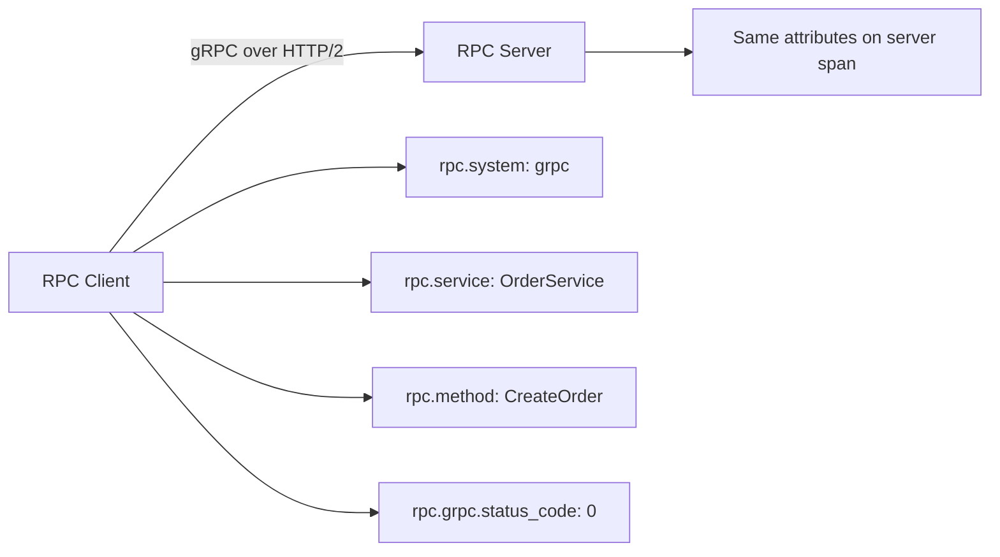

# How to Apply RPC Semantic Conventions for gRPC and Thrift Services

Author: [nawazdhandala](https://www.github.com/nawazdhandala)

Tags: OpenTelemetry, RPC, gRPC, Thrift, Semantic Conventions, Tracing, Microservices, Protobuf

Description: Learn how to apply OpenTelemetry RPC semantic conventions to gRPC and Thrift services for consistent tracing across your microservice communication layer.

---

Remote Procedure Call frameworks like gRPC and Apache Thrift are the communication backbone of many microservice architectures. They handle serialization, transport, and service discovery, but when something goes wrong with an RPC call, you need telemetry that tells you exactly which service, method, and status code was involved. OpenTelemetry's RPC semantic conventions give you a standardized way to capture this information, making it possible to debug cross-service issues without digging through logs on five different machines.

This guide covers how to apply RPC semantic conventions to both gRPC and Thrift services, with practical examples you can adapt to your own codebase.

## RPC vs HTTP Conventions

If you have already implemented HTTP semantic conventions, you might wonder why RPC needs its own set. The answer is that RPC frameworks operate at a higher level of abstraction. An HTTP span tells you about the transport layer: the method, URL, and status code. An RPC span tells you about the application layer: the service name, the method being called, and the RPC-specific status.



A gRPC call actually travels over HTTP/2 under the hood, but the RPC semantic conventions capture the meaningful abstraction: the service and method names as defined in your protobuf or Thrift IDL files.

## Core RPC Attributes

Every RPC span, regardless of the framework, should include these attributes:

```yaml
# Required for all RPC spans
rpc.system: "grpc"              # The RPC framework (grpc, thrift, etc.)
rpc.service: "OrderService"     # The full service name from the IDL
rpc.method: "CreateOrder"       # The method being called

# Connection details
server.address: "order-service.internal"
server.port: 50051

# System-specific status
rpc.grpc.status_code: 0        # For gRPC: the numeric status code
```

The span name for RPC operations follows the pattern `{rpc.service}/{rpc.method}`, which gives you names like `OrderService/CreateOrder` or `UserService/GetUser`. This is both descriptive and low-cardinality since the service and method names come from your IDL definitions.

## gRPC Server Instrumentation in Go

Go is one of the most popular languages for gRPC services. The OpenTelemetry gRPC interceptors handle most of the instrumentation automatically, but understanding what they do helps you extend them when needed.

```go
// server.go - gRPC server with OpenTelemetry interceptors
package main

import (
    "google.golang.org/grpc"
    "go.opentelemetry.io/contrib/instrumentation/google.golang.org/grpc/otelgrpc"
    "go.opentelemetry.io/otel"
    "go.opentelemetry.io/otel/exporters/otlp/otlptrace/otlptracegrpc"
    "go.opentelemetry.io/otel/sdk/resource"
    sdktrace "go.opentelemetry.io/otel/sdk/trace"
    semconv "go.opentelemetry.io/otel/semconv/v1.24.0"
)

func initTracer() (*sdktrace.TracerProvider, error) {
    // Create an OTLP exporter that sends traces to the collector
    exporter, err := otlptracegrpc.New(ctx,
        otlptracegrpc.WithEndpoint("otel-collector:4317"),
        otlptracegrpc.WithInsecure(),
    )
    if err != nil {
        return nil, err
    }

    // Define the service resource with semantic conventions
    res, _ := resource.New(ctx,
        resource.WithAttributes(
            semconv.ServiceName("order-service"),
            semconv.ServiceVersion("2.3.0"),
        ),
    )

    tp := sdktrace.NewTracerProvider(
        sdktrace.WithBatcher(exporter),
        sdktrace.WithResource(res),
    )
    otel.SetTracerProvider(tp)
    return tp, nil
}

func main() {
    tp, _ := initTracer()
    defer tp.Shutdown(context.Background())

    // Create gRPC server with OpenTelemetry stats handler
    // This automatically applies RPC semantic conventions to all incoming calls
    server := grpc.NewServer(
        grpc.StatsHandler(otelgrpc.NewServerHandler()),
    )

    // Register your service implementations
    pb.RegisterOrderServiceServer(server, &orderServer{})

    lis, _ := net.Listen("tcp", ":50051")
    server.Serve(lis)
}
```

The `otelgrpc.NewServerHandler()` stats handler intercepts every incoming RPC call and creates a server span with the correct semantic convention attributes. It automatically sets `rpc.system` to `"grpc"`, extracts the service and method names from the request metadata, records the gRPC status code, and propagates the trace context.

## gRPC Client Instrumentation in Go

The client side follows the same pattern. You add the OpenTelemetry stats handler when creating the gRPC client connection.

```go
// client.go - gRPC client with OpenTelemetry interceptors
package main

import (
    "google.golang.org/grpc"
    "google.golang.org/grpc/credentials/insecure"
    "go.opentelemetry.io/contrib/instrumentation/google.golang.org/grpc/otelgrpc"
)

func createOrderClient() (pb.OrderServiceClient, error) {
    // Dial with the OpenTelemetry stats handler for automatic tracing
    conn, err := grpc.Dial(
        "order-service.internal:50051",
        grpc.WithTransportCredentials(insecure.NewCredentials()),
        grpc.WithStatsHandler(otelgrpc.NewClientHandler()),
    )
    if err != nil {
        return nil, err
    }
    return pb.NewOrderServiceClient(conn), nil
}
```

Every call made through this client connection will automatically generate a CLIENT span with `rpc.system`, `rpc.service`, `rpc.method`, `server.address`, `server.port`, and `rpc.grpc.status_code`. The trace context is propagated through gRPC metadata headers so that the server can continue the same trace.

## Adding Custom Attributes to gRPC Spans

Auto-instrumentation covers the standard attributes, but you often want to add business-specific context to your RPC spans. Here is how to do that in a gRPC service handler.

```go
// handler.go - gRPC handler with custom span attributes
package main

import (
    "context"
    "go.opentelemetry.io/otel/attribute"
    "go.opentelemetry.io/otel/trace"
)

type orderServer struct {
    pb.UnimplementedOrderServiceServer
}

func (s *orderServer) CreateOrder(ctx context.Context, req *pb.CreateOrderRequest) (*pb.CreateOrderResponse, error) {
    // Get the current span created by the gRPC interceptor
    span := trace.SpanFromContext(ctx)

    // Add business-specific attributes
    span.SetAttributes(
        attribute.String("app.order.customer_id", req.CustomerId),
        attribute.Int("app.order.item_count", len(req.Items)),
        attribute.String("app.order.currency", req.Currency),
    )

    order, err := s.processOrder(ctx, req)
    if err != nil {
        // The interceptor handles setting the gRPC status code on the span,
        // but we can add additional error context
        span.SetAttributes(
            attribute.String("app.order.failure_reason", categorizeError(err)),
        )
        return nil, err
    }

    span.SetAttributes(
        attribute.String("app.order.id", order.Id),
        attribute.Float64("app.order.total", order.TotalAmount),
    )

    return order, nil
}
```

The custom attributes use the `app.` prefix to distinguish them from the standard semantic convention attributes. This prevents naming collisions and makes it clear which attributes are standard and which are application-specific.

## gRPC Instrumentation in Python

Python gRPC services use a similar interceptor pattern. Here is how to set it up.

```python
# grpc_server.py - Python gRPC server with OpenTelemetry instrumentation
import grpc
from opentelemetry import trace
from opentelemetry.instrumentation.grpc import GrpcInstrumentorServer, GrpcInstrumentorClient
from opentelemetry.sdk.trace import TracerProvider
from opentelemetry.sdk.trace.export import BatchSpanProcessor
from opentelemetry.exporter.otlp.proto.grpc.trace_exporter import OTLPSpanExporter
from opentelemetry.sdk.resources import Resource

# Initialize the tracer provider
resource = Resource.create({
    "service.name": "user-service",
    "service.version": "1.5.0",
})
provider = TracerProvider(resource=resource)
provider.add_span_processor(
    BatchSpanProcessor(OTLPSpanExporter(endpoint="otel-collector:4317"))
)
trace.set_tracer_provider(provider)

# Instrument gRPC server globally - all incoming RPCs will be traced
GrpcInstrumentorServer().instrument()

# Instrument gRPC client globally - all outgoing RPCs will be traced
GrpcInstrumentorClient().instrument()
```

The `GrpcInstrumentorServer` patches the gRPC server to automatically create spans for every incoming RPC. It handles all the semantic convention attributes, trace context propagation, and error recording. The `GrpcInstrumentorClient` does the same for outbound calls.

## Thrift Service Instrumentation

Apache Thrift is less common than gRPC in new projects but still widely used in existing systems, especially in organizations that adopted it before gRPC became popular. OpenTelemetry supports Thrift through manual instrumentation since auto-instrumentation libraries are less mature.

```python
# thrift_tracing.py - Manual Thrift instrumentation with RPC semantic conventions
from opentelemetry import trace, context
from opentelemetry.propagate import inject, extract

tracer = trace.get_tracer("analytics-service")

class TracedAnalyticsHandler:
    """Thrift service handler with OpenTelemetry instrumentation."""

    def aggregate_events(self, request):
        """Handle the AggregateEvents RPC call with proper tracing."""

        # Create a SERVER span with RPC semantic conventions
        with tracer.start_as_current_span(
            name="AnalyticsService/AggregateEvents",
            kind=trace.SpanKind.SERVER,
            attributes={
                "rpc.system": "apache_thrift",
                "rpc.service": "AnalyticsService",
                "rpc.method": "AggregateEvents",
                "server.address": "analytics.internal",
                "server.port": 9090,
                # Thrift transport and protocol details
                "rpc.thrift.transport": "TFramedTransport",
                "rpc.thrift.protocol": "TBinaryProtocol",
            },
        ) as span:
            try:
                result = self._do_aggregation(request)
                span.set_attribute("app.events.count", request.event_count)
                span.set_attribute("app.aggregation.type", request.aggregation_type)
                return result
            except Exception as e:
                span.set_status(trace.Status(trace.StatusCode.ERROR, str(e)))
                span.record_exception(e)
                raise
```

For Thrift, the `rpc.system` is set to `"apache_thrift"`. You can also add Thrift-specific attributes for the transport type and protocol, which can be helpful when debugging serialization issues.

The Thrift client side follows the same pattern.

```python
# thrift_client.py - Thrift client with RPC semantic conventions
from thrift.transport import TSocket, TTransport
from thrift.protocol import TBinaryProtocol

tracer = trace.get_tracer("reporting-service")

def call_aggregate_events(event_type: str, time_range: tuple):
    """Make a traced Thrift RPC call to the analytics service."""

    with tracer.start_as_current_span(
        name="AnalyticsService/AggregateEvents",
        kind=trace.SpanKind.CLIENT,
        attributes={
            "rpc.system": "apache_thrift",
            "rpc.service": "AnalyticsService",
            "rpc.method": "AggregateEvents",
            "server.address": "analytics.internal",
            "server.port": 9090,
        },
    ) as span:
        # Set up the Thrift transport and protocol
        transport = TSocket.TSocket("analytics.internal", 9090)
        transport = TTransport.TFramedTransport(transport)
        protocol = TBinaryProtocol.TBinaryProtocol(transport)

        client = AnalyticsService.Client(protocol)
        transport.open()

        try:
            request = AggregateEventsRequest(
                event_type=event_type,
                start_time=time_range[0],
                end_time=time_range[1],
            )
            result = client.aggregate_events(request)
            return result
        except TApplicationException as e:
            span.set_status(trace.Status(trace.StatusCode.ERROR, str(e)))
            span.record_exception(e)
            raise
        finally:
            transport.close()
```

The main difference from gRPC instrumentation is that you need to manage trace context propagation manually with Thrift. gRPC has built-in metadata that OpenTelemetry uses for context propagation, but Thrift requires you to either include the context in your Thrift IDL as additional fields or use a custom transport layer that handles it.

## Handling gRPC Status Codes

gRPC has its own set of status codes that are different from HTTP status codes. The semantic conventions require mapping these to span status correctly.

```go
// status_mapping.go - gRPC status code handling
package main

// gRPC status codes and their meaning for span status:
//
// OK (0)              -> Span status UNSET (not an error)
// CANCELLED (1)       -> Span status ERROR
// UNKNOWN (2)         -> Span status ERROR
// INVALID_ARGUMENT (3)-> Span status UNSET for server, ERROR for client
// DEADLINE_EXCEEDED (4)-> Span status ERROR
// NOT_FOUND (5)       -> Span status UNSET for server, ERROR for client
// ALREADY_EXISTS (6)  -> Span status UNSET for server, ERROR for client
// PERMISSION_DENIED (7)-> Span status ERROR
// UNAUTHENTICATED (16)-> Span status ERROR
// INTERNAL (13)       -> Span status ERROR
// UNAVAILABLE (14)    -> Span status ERROR
```

The same asymmetry exists here as with HTTP status codes. A `NOT_FOUND` gRPC response from the server side means the server correctly handled the request. From the client side, it means the expected resource was missing. Auto-instrumentation libraries handle this mapping for you, but knowing the rules helps when you are reviewing traces.

## Querying RPC Telemetry

With RPC semantic conventions in place across all your services, cross-cutting queries become straightforward.

```sql
-- Slowest RPC methods across all services
SELECT
    rpc.system,
    rpc.service,
    rpc.method,
    avg(duration_ms) as avg_latency_ms,
    p99(duration_ms) as p99_latency_ms,
    count(*) as call_count
FROM spans
WHERE rpc.system IS NOT NULL
  AND span.kind = 'SERVER'
GROUP BY rpc.system, rpc.service, rpc.method
ORDER BY p99_latency_ms DESC
LIMIT 20;

-- gRPC error rates by service and method
SELECT
    rpc.service,
    rpc.method,
    rpc.grpc.status_code,
    count(*) as occurrences
FROM spans
WHERE rpc.system = 'grpc'
  AND rpc.grpc.status_code != 0
GROUP BY rpc.service, rpc.method, rpc.grpc.status_code
ORDER BY occurrences DESC;
```

These queries give you a unified view of RPC performance across both gRPC and Thrift services. Because the semantic conventions are consistent, you do not need separate dashboards for each framework.

## Wrapping Up

RPC semantic conventions capture the application-level details that matter most when debugging microservice communication: which service, which method, and what status code. For gRPC, auto-instrumentation through interceptors or stats handlers covers most use cases out of the box. For Thrift, you will likely need manual instrumentation, but the attribute patterns are the same.

Set `rpc.system`, `rpc.service`, and `rpc.method` on every RPC span. Use the framework-specific status code attributes like `rpc.grpc.status_code`. Add custom business attributes with the `app.` prefix. With these practices in place, your RPC traces become a reliable source of truth for understanding how your services communicate and where the bottlenecks are.
