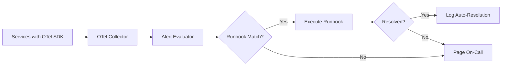

# How to Implement Runbook Automation Triggered by OpenTelemetry Alerting Pipelines

Author: [nawazdhandala](https://www.github.com/nawazdhandala)

Tags: OpenTelemetry, Runbook Automation, Alerting, Incident Response

Description: Build automated runbook execution triggered by OpenTelemetry alert conditions to reduce manual toil and speed up incident response.

Every experienced on-call engineer has a set of runbooks - step-by-step procedures for handling known issues. "If the database connection pool is exhausted, restart the connection pooler. If the disk is above 90%, clean up old logs." These procedures are predictable and repetitive, which makes them perfect candidates for automation. By connecting OpenTelemetry alerting pipelines directly to runbook execution, you can resolve known issues before a human even sees the page.

## Architecture

The system works by routing OpenTelemetry metrics through the Collector to an alert evaluator, which matches alert conditions to registered runbooks and executes them automatically.



## Defining Runbooks as Code

Runbooks should be version-controlled and structured. Define them in a format that maps alert conditions to executable actions.

```yaml
# runbooks/connection-pool-exhaustion.yaml
apiVersion: runbook/v1
kind: AutomatedRunbook
metadata:
  name: connection-pool-exhaustion
  description: Restart connection pooler when pool utilization exceeds 95%
  owner: platform-team
  last_reviewed: 2026-01-15

trigger:
  # Match against OTel metric attributes
  metric_name: "db.client.connections.usage"
  condition: "value > 0.95"
  sustained_for: "2m"
  attributes:
    db.system: "postgresql"

actions:
  - name: log-start
    type: log
    message: "Auto-remediation started for connection pool exhaustion"

  - name: restart-pooler
    type: command
    command: "kubectl rollout restart deployment/pgbouncer -n {{namespace}}"
    timeout: 60s

  - name: verify-recovery
    type: metric_check
    metric_name: "db.client.connections.usage"
    condition: "value < 0.7"
    wait_for: 120s

  - name: notify
    type: notification
    channel: "#platform-alerts"
    message: "Auto-resolved connection pool exhaustion in {{namespace}}"

rollback:
  on_failure: page_oncall
  escalation_delay: 5m
```

## Instrumenting the Alert Evaluator

The alert evaluator receives metrics from the OpenTelemetry Collector and checks them against runbook trigger conditions. Here is a Python implementation of the core matching logic.

```python
# Alert evaluator that matches OTel metrics to runbook triggers
import yaml
import time
from pathlib import Path
from opentelemetry import metrics

meter = metrics.get_meter("runbook.automation")

# Track automation metrics
runbook_executions = meter.create_counter(
    "runbook.executions.total",
    description="Number of automated runbook executions",
    unit="1"
)
runbook_success_rate = meter.create_counter(
    "runbook.outcomes.total",
    description="Outcomes of runbook executions",
    unit="1"
)

class RunbookEvaluator:
    def __init__(self, runbook_dir):
        self.runbooks = self._load_runbooks(runbook_dir)
        # Track sustained conditions: metric_key -> first_seen_timestamp
        self.active_conditions = {}

    def _load_runbooks(self, directory):
        runbooks = []
        for path in Path(directory).glob("*.yaml"):
            with open(path) as f:
                runbooks.append(yaml.safe_load(f))
        return runbooks

    def evaluate_metric(self, metric_name, value, attributes):
        """Called for each incoming OTel metric data point."""
        for runbook in self.runbooks:
            trigger = runbook["trigger"]

            # Check if metric name matches
            if trigger["metric_name"] != metric_name:
                continue

            # Check if attributes match
            if not self._attributes_match(trigger.get("attributes", {}), attributes):
                continue

            # Evaluate the condition
            if self._evaluate_condition(trigger["condition"], value):
                key = f"{runbook['metadata']['name']}:{metric_name}"
                sustained = trigger.get("sustained_for", "0s")

                if key not in self.active_conditions:
                    self.active_conditions[key] = time.time()

                elapsed = time.time() - self.active_conditions[key]
                if elapsed >= self._parse_duration(sustained):
                    self._execute_runbook(runbook, attributes)
                    del self.active_conditions[key]
            else:
                # Condition no longer met, reset tracking
                key = f"{runbook['metadata']['name']}:{metric_name}"
                self.active_conditions.pop(key, None)

    def _execute_runbook(self, runbook, context):
        name = runbook["metadata"]["name"]
        runbook_executions.add(1, attributes={"runbook.name": name})

        for action in runbook["actions"]:
            success = execute_action(action, context)
            if not success:
                # Trigger rollback
                runbook_success_rate.add(1, attributes={
                    "runbook.name": name,
                    "outcome": "failed"
                })
                handle_rollback(runbook["rollback"], context)
                return

        runbook_success_rate.add(1, attributes={
            "runbook.name": name,
            "outcome": "success"
        })
```

## Collector Configuration for Runbook Triggers

Route metrics from the OpenTelemetry Collector to both your storage backend and the runbook evaluator. The evaluator runs as a separate service that receives metrics via OTLP.

```yaml
# otel-collector-runbook.yaml
receivers:
  otlp:
    protocols:
      grpc:
        endpoint: 0.0.0.0:4317

processors:
  batch:
    send_batch_size: 256
    timeout: 2s

exporters:
  # Primary storage
  otlp/storage:
    endpoint: "metrics-backend:4317"

  # Runbook evaluator service
  otlp/runbook:
    endpoint: "runbook-evaluator:4317"
    retry_on_failure:
      enabled: true
      initial_interval: 1s
      max_interval: 10s

service:
  pipelines:
    metrics:
      receivers: [otlp]
      processors: [batch]
      exporters: [otlp/storage, otlp/runbook]
```

## Safety Guards

Automated remediation needs guardrails. Without them, a buggy runbook could make an incident worse.

```python
# Safety guards for runbook automation
class SafetyGuards:
    def __init__(self, max_executions_per_hour=3, cooldown_minutes=15):
        self.max_per_hour = max_executions_per_hour
        self.cooldown_minutes = cooldown_minutes
        self.execution_history = []  # List of (runbook_name, timestamp)

    def can_execute(self, runbook_name):
        now = time.time()

        # Check cooldown - same runbook cannot run again within cooldown period
        recent = [
            ts for name, ts in self.execution_history
            if name == runbook_name and (now - ts) < self.cooldown_minutes * 60
        ]
        if recent:
            return False, f"Cooldown active. Last ran {int(now - recent[-1])}s ago"

        # Check rate limit - total executions across all runbooks
        hour_ago = now - 3600
        hourly_count = sum(1 for _, ts in self.execution_history if ts > hour_ago)
        if hourly_count >= self.max_per_hour:
            return False, f"Rate limit reached: {hourly_count}/{self.max_per_hour} per hour"

        return True, "OK"

    def record_execution(self, runbook_name):
        self.execution_history.append((runbook_name, time.time()))
```

## Measuring Automation Effectiveness

Track the impact of runbook automation using the metrics emitted by the evaluator. Key indicators to monitor:

- **Auto-resolution rate**: What percentage of known alert types are resolved without human intervention?
- **Time to resolution**: How much faster are automated resolutions compared to manual handling?
- **Failure rate**: How often do automated runbooks fail and escalate to a human?

```promql
# Auto-resolution rate
sum(runbook_outcomes_total{outcome="success"})
/
(sum(runbook_outcomes_total{outcome="success"}) + sum(runbook_outcomes_total{outcome="failed"}))
```

The goal is not to automate everything. Start with the three or four most common, well-understood alert types. Measure the results, build confidence, and expand gradually. A single automated runbook that handles connection pool restarts might eliminate 30% of your overnight pages, and that is a significant quality-of-life improvement for the on-call team.
