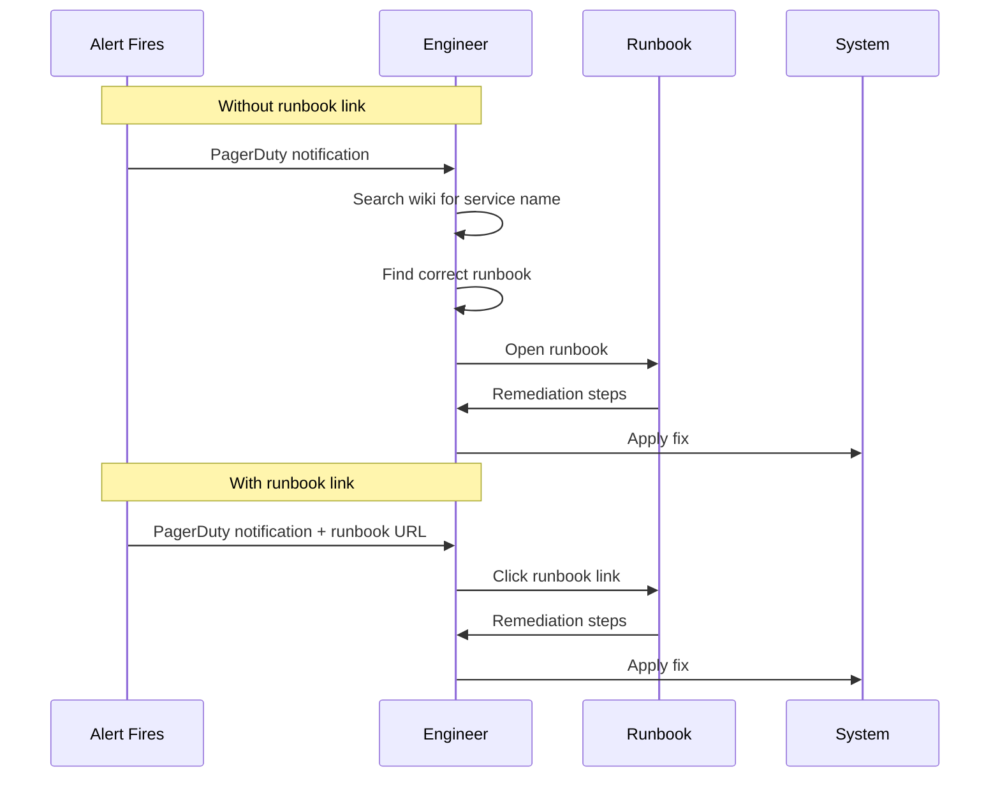

# How to Attach Runbook URLs to OpenTelemetry Pipeline Annotations for Faster Incident Response

Author: [nawazdhandala](https://www.github.com/nawazdhandala)

Tags: OpenTelemetry, Runbooks, Incident Response, Annotations

Description: Attach runbook URLs to OpenTelemetry resource attributes and alert annotations to speed up incident response workflows.

When an alert fires at 3 AM, the on-call engineer should not have to search a wiki for the relevant runbook. The runbook link should be attached directly to the alert, the dashboard, and ideally to the telemetry data itself. OpenTelemetry provides multiple integration points where you can embed runbook URLs - from resource attributes on the telemetry source to alert annotations in your monitoring backend. This post covers each approach with working configurations.

## The Runbook Problem

The gap between "alert fires" and "engineer starts meaningful troubleshooting" is often filled with context-gathering: which service is this, what does this metric mean, what are the common fixes? Runbook URLs embedded in the observability pipeline eliminate that gap by providing a direct link to structured remediation steps.



## Approach 1: Resource Attributes on Telemetry Sources

OpenTelemetry resource attributes describe the entity producing telemetry. You can add runbook URLs as resource attributes so they propagate with every metric, trace, and log from that service.

```python
from opentelemetry.sdk.resources import Resource
from opentelemetry.sdk.trace import TracerProvider
from opentelemetry.sdk.metrics import MeterProvider

# Define resource with runbook URL as an attribute
resource = Resource.create({
    "service.name": "payment-service",
    "service.version": "2.3.1",
    "service.namespace": "payments",
    # Custom attribute linking to the service runbook
    "service.runbook.url": "https://wiki.internal/runbooks/payment-service",
    # Specific runbook for different alert categories
    "service.runbook.availability": "https://wiki.internal/runbooks/payment-service/availability",
    "service.runbook.latency": "https://wiki.internal/runbooks/payment-service/latency",
})

# Both traces and metrics carry the runbook URL
tracer_provider = TracerProvider(resource=resource)
meter_provider = MeterProvider(resource=resource)
```

When these attributes are converted to Prometheus labels (via `resource_to_telemetry_conversion`), they appear on every metric from that service. Dashboard links and alert annotations can then reference them.

## Approach 2: Collector-Level Attribute Injection

If you do not want to modify application code, inject runbook URLs at the collector level using the attributes processor. This centralizes runbook management in your infrastructure configuration.

```yaml
# otel-collector-config.yaml
processors:
  # Add runbook URLs based on service name
  attributes/runbooks:
    actions:
      - key: runbook.url
        value: "https://wiki.internal/runbooks/default"
        action: insert

  # Use routing to set service-specific runbooks
  transform/runbooks:
    metric_statements:
      - context: datapoint
        statements:
          - set(attributes["runbook.url"], "https://wiki.internal/runbooks/payment-service")
            where resource.attributes["service.name"] == "payment-service"
          - set(attributes["runbook.url"], "https://wiki.internal/runbooks/checkout-service")
            where resource.attributes["service.name"] == "checkout-service"
          - set(attributes["runbook.url"], "https://wiki.internal/runbooks/order-service")
            where resource.attributes["service.name"] == "order-service"
    trace_statements:
      - context: span
        statements:
          - set(attributes["runbook.url"], "https://wiki.internal/runbooks/payment-service")
            where resource.attributes["service.name"] == "payment-service"

service:
  pipelines:
    metrics:
      receivers: [otlp]
      processors: [transform/runbooks, batch]
      exporters: [prometheus]
    traces:
      receivers: [otlp]
      processors: [transform/runbooks, batch]
      exporters: [otlp/backend]
```

## Approach 3: Prometheus Alert Annotations

The most direct way to get runbook URLs into alerts is through Prometheus alert rule annotations. This is where most on-call engineers will see them.

```yaml
# prometheus-rules/slo-alerts-with-runbooks.yaml
groups:
  - name: slo_alerts
    rules:
      - alert: PaymentServiceAvailabilitySLOBreach
        expr: |
          slo:error_rate:ratio_rate1h{service="payment-service"} > (14.4 * 0.001)
          and
          slo:error_rate:ratio_rate5m{service="payment-service"} > (14.4 * 0.001)
        for: 2m
        labels:
          severity: critical
          team: payments
        annotations:
          summary: "Payment service availability SLO burn rate critical"
          description: >
            Error rate is {{ $value | humanizePercentage }}, burning error
            budget at 14.4x the sustainable rate.
          # Direct link to the runbook for this specific alert
          runbook_url: "https://wiki.internal/runbooks/payment-service/availability-slo-breach"
          # Link to relevant dashboard
          dashboard_url: "https://grafana.internal/d/payment-slo?from=now-1h"

      - alert: PaymentServiceLatencySLOBreach
        expr: |
          (1 - slo:http_latency_good:ratio_rate1h{service="payment-service"}) > (14.4 * 0.05)
        for: 2m
        labels:
          severity: critical
          team: payments
        annotations:
          summary: "Payment service latency SLO burn rate critical"
          runbook_url: "https://wiki.internal/runbooks/payment-service/latency-slo-breach"
          dashboard_url: "https://grafana.internal/d/payment-latency?from=now-1h"
```

## Approach 4: Span Events for Operational Context

You can attach runbook references directly to span events when errors occur. This is useful for postmortem analysis, as the runbook link appears in the trace alongside the error.

```python
from opentelemetry import trace

tracer = trace.get_tracer("payment-service")

# Mapping of error types to their specific runbooks
ERROR_RUNBOOKS = {
    "ConnectionTimeout": "https://wiki.internal/runbooks/payment-service/connection-timeout",
    "RateLimitExceeded": "https://wiki.internal/runbooks/payment-service/rate-limit",
    "DatabaseDeadlock": "https://wiki.internal/runbooks/payment-service/db-deadlock",
}

def process_payment(order_id: str):
    with tracer.start_as_current_span("process-payment") as span:
        try:
            return execute_payment(order_id)
        except Exception as e:
            error_type = type(e).__name__
            runbook = ERROR_RUNBOOKS.get(error_type, "https://wiki.internal/runbooks/payment-service")

            # Record the exception with a runbook reference
            span.record_exception(e)
            span.set_status(trace.StatusCode.ERROR, str(e))

            # Add a span event with the runbook URL for easy access during investigation
            span.add_event(
                "error.runbook",
                attributes={
                    "runbook.url": runbook,
                    "error.type": error_type,
                    "error.remediation.hint": get_remediation_hint(error_type),
                },
            )
            raise
```

## Alertmanager Routing with Runbook URLs

Configure Alertmanager to include runbook URLs in notifications sent to PagerDuty, Slack, or other channels.

```yaml
# alertmanager-config.yaml
receivers:
  - name: "pagerduty-payments"
    pagerduty_configs:
      - routing_key: "<pagerduty-key>"
        description: '{{ .CommonAnnotations.summary }}'
        # Include runbook URL in the PagerDuty incident
        details:
          runbook: '{{ .CommonAnnotations.runbook_url }}'
          dashboard: '{{ .CommonAnnotations.dashboard_url }}'
          firing: '{{ .Alerts.Firing | len }}'

  - name: "slack-payments"
    slack_configs:
      - channel: "#payments-alerts"
        title: '{{ .CommonAnnotations.summary }}'
        # Runbook link appears directly in the Slack message
        text: >
          *Severity:* {{ .CommonLabels.severity }}
          *Runbook:* {{ .CommonAnnotations.runbook_url }}
          *Dashboard:* {{ .CommonAnnotations.dashboard_url }}
          {{ .CommonAnnotations.description }}
```

## Keeping Runbook URLs in Sync

Runbook URLs rot when documentation moves or is reorganized. A few strategies help:

1. Use stable URL paths that redirect to current content (e.g., `/runbooks/payment-service/latest`)
2. Include runbook URL validation in your CI pipeline - check that all URLs referenced in alert rules return HTTP 200
3. Store runbook URL mappings in a configuration file that both the collector config and the documentation system reference as a single source of truth

The cost of adding runbook URLs to your telemetry pipeline is minimal. The payoff during an incident - when every minute counts - is significant. Start with Prometheus alert annotations since those have the most immediate impact, then work backward to embed URLs in the telemetry source for richer tracing and postmortem workflows.
