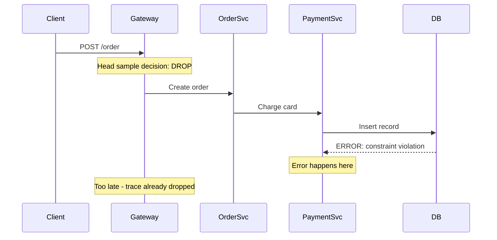
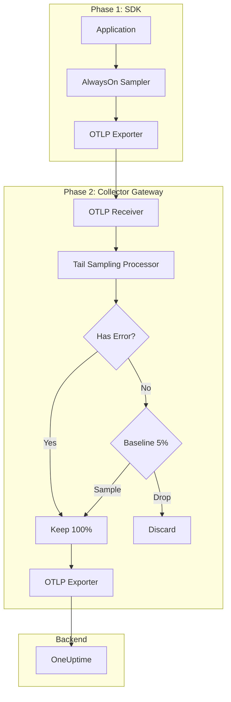

# How to Sample Errors at 100% While Reducing Normal Trace Volume

Author: [nawazdhandala](https://www.github.com/nawazdhandala)

Tags: OpenTelemetry, Sampling, Error Tracking, Tracing, Observability, Cost Optimization

Description: Configure OpenTelemetry to keep every error trace while aggressively sampling normal traffic, balancing cost and reliability.

---

When something breaks in production, you need the trace. Not a statistical sample of the trace. The actual trace, with every span, every attribute, every timing. But keeping 100% of all traces is expensive. The answer is selective sampling: keep every error at full fidelity while cutting normal traffic to a fraction of its original volume.

This guide covers how to implement this pattern at both the SDK level and the Collector level, including the tricky edge cases that trip people up.

---

## The Challenge with Error Sampling

The fundamental problem is timing. Errors often are not known when the trace starts. A request might begin successfully, pass through three services, and then fail on a database query in the fourth. By the time you know it is an error, the root span has already been created and the head sampling decision has already been made.

This means pure head sampling cannot reliably capture all errors. You need tail sampling for complete error coverage.



Tail sampling solves this because it waits for the entire trace to finish before deciding. But if you head-sample too aggressively, the error spans never reach the Collector in the first place.

---

## Strategy: SDK Sends Everything, Collector Filters

The cleanest approach is to have the SDK send all spans (or a high percentage), and let the Collector decide what to keep. This gives the tail sampler full visibility into the trace lifecycle.

### SDK Configuration: AlwaysOn or High Ratio

```typescript
// tracing.ts - Send all spans to the Collector
import { NodeSDK } from '@opentelemetry/sdk-node';
import { OTLPTraceExporter } from '@opentelemetry/exporter-trace-otlp-grpc';
import {
  ParentBasedSampler,
  AlwaysOnSampler,
} from '@opentelemetry/sdk-trace-base';
import { getNodeAutoInstrumentations } from '@opentelemetry/auto-instrumentations-node';
import { Resource } from '@opentelemetry/resources';

const sdk = new NodeSDK({
  resource: new Resource({
    'service.name': 'payment-service',
  }),
  traceExporter: new OTLPTraceExporter({
    // Send to Collector, not directly to backend
    url: 'grpc://otel-collector:4317',
  }),
  // AlwaysOn at the SDK level - let the Collector decide
  sampler: new ParentBasedSampler({
    root: new AlwaysOnSampler(),
  }),
  instrumentations: [getNodeAutoInstrumentations()],
});

sdk.start();
```

If sending 100% from the SDK is too expensive for your network, use a ratio sampler at something like 50%. You will miss roughly half of your errors, but you will still catch far more than with a low ratio.

### Collector Configuration: Tail Sampling with Error Priority

```yaml
# otel-collector-config.yaml
receivers:
  otlp:
    protocols:
      grpc:
        endpoint: 0.0.0.0:4317

processors:
  tail_sampling:
    # Wait for complete traces before deciding
    decision_wait: 30s
    num_traces: 100000
    expected_new_traces_per_sec: 2000

    policies:
      # Policy 1: Keep ALL traces that contain an error span
      - name: keep-all-errors
        type: status_code
        status_code:
          status_codes: [ERROR]

      # Policy 2: Keep traces with HTTP 5xx responses
      - name: keep-server-errors
        type: numeric_attribute
        numeric_attribute:
          key: http.status_code
          min_value: 500
          max_value: 599

      # Policy 3: Keep traces with HTTP 4xx responses
      - name: keep-client-errors
        type: numeric_attribute
        numeric_attribute:
          key: http.status_code
          min_value: 400
          max_value: 499

      # Policy 4: Keep traces with exception events
      - name: keep-exceptions
        type: string_attribute
        string_attribute:
          key: exception.type
          values: [".*"]
          enabled_regex_matching: true

      # Policy 5: Sample 5% of successful traces as baseline
      - name: baseline-success
        type: probabilistic
        probabilistic:
          sampling_percentage: 5

  batch:
    timeout: 5s
    send_batch_size: 512

exporters:
  otlp:
    endpoint: https://oneuptime.com/otlp
    headers:
      x-oneuptime-token: "${ONEUPTIME_TOKEN}"

service:
  pipelines:
    traces:
      receivers: [otlp]
      processors: [tail_sampling, batch]
      exporters: [otlp]
```

The policies are evaluated independently, and a trace is kept if any policy matches. So an error trace matches the first policy and is kept, regardless of what the baseline policy would do.

---

## Handling the "Error After Head Drop" Problem

If you do need head sampling for cost reasons, you can build a custom sampler that biases toward keeping potential errors.

```typescript
// biased-sampler.ts
import {
  Sampler,
  SamplingResult,
  SamplingDecision,
  Context,
  SpanKind,
  Attributes,
  Link,
} from '@opentelemetry/api';
import { TraceIdRatioBasedSampler } from '@opentelemetry/sdk-trace-base';

class ErrorBiasedSampler implements Sampler {
  private normalSampler: TraceIdRatioBasedSampler;

  constructor(normalRate: number) {
    // This rate applies to spans that look normal at creation
    this.normalSampler = new TraceIdRatioBasedSampler(normalRate);
  }

  shouldSample(
    context: Context,
    traceId: string,
    spanName: string,
    spanKind: SpanKind,
    attributes: Attributes,
    links: Link[]
  ): SamplingResult {
    // Check attributes available at span creation time
    const httpStatus = attributes['http.status_code'];
    const hasException = attributes['exception.type'] !== undefined;
    const hasError = attributes['error'] === true;

    // If we can already tell this is an error, always sample
    if (hasException || hasError) {
      return {
        decision: SamplingDecision.RECORD_AND_SAMPLE,
        attributes: { 'sampling.reason': 'error_detected' },
      };
    }

    // HTTP status might be known for some frameworks
    if (typeof httpStatus === 'number' && httpStatus >= 400) {
      return {
        decision: SamplingDecision.RECORD_AND_SAMPLE,
        attributes: { 'sampling.reason': 'http_error' },
      };
    }

    // For spans that look normal, apply the reduced rate
    return this.normalSampler.shouldSample(
      context, traceId, spanName, spanKind, attributes, links
    );
  }

  toString(): string {
    return `ErrorBiasedSampler{normal=${this.normalSampler}}`;
  }
}
```

This sampler catches errors that are visible at span creation, but it cannot catch errors that emerge later in the trace. That is an inherent limitation of head sampling.

---

## Two-Phase Architecture

For maximum error coverage with minimum cost, deploy a two-phase architecture.



If network bandwidth between the SDK and Collector is a concern, add a local Collector agent that does initial batching and compression.

```yaml
# Agent collector (runs as sidecar or daemonset)
receivers:
  otlp:
    protocols:
      grpc:
        endpoint: 0.0.0.0:4317

processors:
  batch:
    timeout: 2s
    send_batch_size: 256

exporters:
  otlp:
    # Forward to the gateway Collector that does tail sampling
    endpoint: otel-gateway:4317
    compression: zstd

service:
  pipelines:
    traces:
      receivers: [otlp]
      processors: [batch]
      exporters: [otlp]
```

The agent handles batching and compression. The gateway handles tail sampling decisions. This separation keeps the agent lightweight while centralizing the sampling logic.

---

## Composite Tail Sampling for Error Categories

Not all errors are equally important. You might want to treat different error categories differently.

```yaml
processors:
  tail_sampling:
    decision_wait: 30s
    num_traces: 100000
    policies:
      # Critical errors: always keep
      - name: critical-errors
        type: and
        and:
          and_sub_policy:
            - name: is-error
              type: status_code
              status_code:
                status_codes: [ERROR]
            - name: is-critical-service
              type: string_attribute
              string_attribute:
                key: service.name
                values:
                  - payment-service
                  - auth-service
                  - order-service

      # Non-critical errors: keep 50%
      - name: other-errors
        type: and
        and:
          and_sub_policy:
            - name: is-error
              type: status_code
              status_code:
                status_codes: [ERROR]
            - name: sample-half
              type: probabilistic
              probabilistic:
                sampling_percentage: 50

      # Normal traffic: keep 5%
      - name: baseline
        type: probabilistic
        probabilistic:
          sampling_percentage: 5
```

This configuration keeps 100% of errors from critical services, 50% of errors from other services, and 5% of normal traffic. The `and` policy type lets you combine conditions.

---

## Verifying Error Coverage

After deploying your sampling configuration, verify that errors are actually being captured. Run a quick test.

```bash
# Generate a test error trace
curl -X POST http://your-service/api/test-error \
  -H "Content-Type: application/json" \
  -d '{"force_error": true}'

# Check that the trace appears in your backend
# Look for the trace with error status in OneUptime
```

You should also set up a dashboard that compares error rates from your application logs against error traces in your observability backend. If the trace error count is significantly lower than the log error count, your sampling is dropping errors.

Key metrics to monitor:

- `otelcol_processor_tail_sampling_count_traces_sampled` with a filter on the error policy name
- The ratio of error traces to total traces in your backend
- The `dropped_too_early` metric, which indicates traces being evicted before all spans arrive

---

## Cost Impact

Here is a realistic example of the cost savings.

| Metric | Before | After |
|--------|--------|-------|
| Total spans/second | 10,000 | 10,000 |
| Spans exported to backend | 10,000 | 875 |
| Error trace coverage | 100% | 100% |
| Normal trace coverage | 100% | 5% |
| Backend storage cost | $3,000/month | $262/month |

The 875 spans/second comes from: errors (roughly 1.5% of traffic at 100%) = 150, plus 5% of the remaining 9,850 = 492, totaling about 642 spans/second. The actual number will vary based on your error rate and span fan-out.

---

## Key Takeaways

1. Tail sampling in the Collector is the only reliable way to capture 100% of errors, because errors often are not known when the trace starts
2. Send all spans (or a high ratio) from the SDK to the Collector to give tail sampling maximum visibility
3. Use a two-phase architecture with local agents for batching and a gateway for sampling decisions
4. Differentiate between critical and non-critical errors with composite `and` policies
5. Monitor `dropped_too_early` to ensure your Collector buffer is large enough for your trace duration
6. Verify your error coverage by comparing log error rates against trace error rates

This approach gives you the best of both worlds: complete error visibility for debugging, and aggressive volume reduction for everything else.
