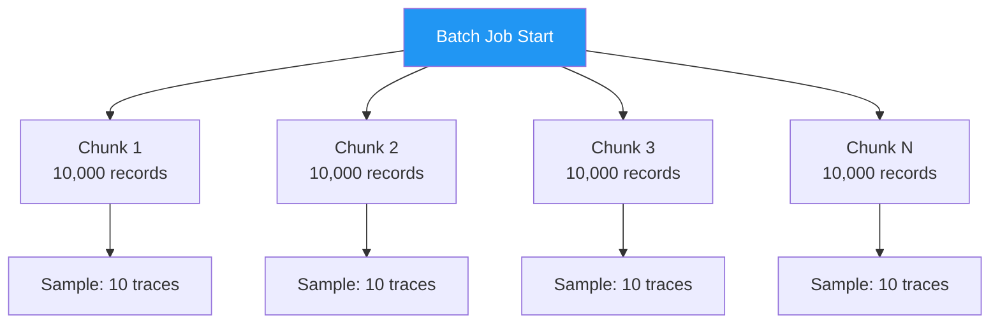

# How to Configure Sampling for High-Volume Batch Processing Jobs

Author: [nawazdhandala](https://www.github.com/nawazdhandala)

Tags: OpenTelemetry, Sampling, Batch Processing, Tracing, Performance, High Volume

Description: Learn how to configure OpenTelemetry sampling strategies for high-volume batch processing jobs to control costs without losing visibility.

---

Batch processing jobs present a unique challenge for distributed tracing. A single job might process millions of records, generating a massive number of spans. If you instrument each record with a trace and sample at your normal rate, you can easily overwhelm your tracing backend, blow through storage budgets, and create so much noise that finding meaningful patterns becomes impossible. The solution is to tailor your sampling strategy to the specific characteristics of batch workloads, which behave very differently from interactive request-response traffic.

## Why Batch Jobs Need Special Sampling

Consider a nightly data pipeline that processes 5 million customer records. If each record generates a trace with 4 spans, that is 20 million spans from a single job run. At a standard 10% sampling rate, you are still sending 2 million spans. Most of those spans will look nearly identical since batch operations tend to be repetitive by nature.

The traces you actually need from a batch job are different from what you need from an API service. You want to know if the overall job completed successfully, how long it took, whether any individual records failed, and whether there were performance outliers. You do not need millions of traces showing the same successful record processing path.



## Strategy 1: Rate-Limited Sampling

The simplest approach for batch jobs is rate-limited sampling. Instead of sampling a percentage of traces, you cap the number of traces per second. This gives you consistent data volume regardless of how fast the batch job runs.

```python
from opentelemetry import trace
from opentelemetry.sdk.trace import TracerProvider
from opentelemetry.sdk.trace.sampling import TraceIdRatioBased, ParentBased
from opentelemetry.sdk.trace.export import BatchSpanProcessor
from opentelemetry.exporter.otlp.proto.grpc.trace_exporter import OTLPSpanExporter
import threading
import time

class RateLimitedSampler:
    """Samples up to N traces per second."""

    def __init__(self, max_traces_per_second):
        self.max_traces_per_second = max_traces_per_second
        self.token_bucket = max_traces_per_second
        self.last_refill = time.monotonic()
        self.lock = threading.Lock()

    def should_sample(self, context, trace_id, name, kind,
                      attributes, links):
        with self.lock:
            now = time.monotonic()
            # Refill tokens based on elapsed time
            elapsed = now - self.last_refill
            self.token_bucket = min(
                self.max_traces_per_second,
                self.token_bucket + elapsed * self.max_traces_per_second,
            )
            self.last_refill = now

            if self.token_bucket >= 1.0:
                self.token_bucket -= 1.0
                return trace.sampling.SamplingResult(
                    trace.sampling.Decision.RECORD_AND_SAMPLE,
                    attributes,
                )
            else:
                return trace.sampling.SamplingResult(
                    trace.sampling.Decision.DROP,
                )

    def get_description(self):
        return f"RateLimitedSampler({self.max_traces_per_second}/s)"

# Allow maximum 5 traces per second from batch processing
sampler = RateLimitedSampler(max_traces_per_second=5)

provider = TracerProvider(sampler=sampler)
exporter = OTLPSpanExporter(endpoint="http://localhost:4317")
provider.add_span_processor(BatchSpanProcessor(exporter))
trace.set_tracer_provider(provider)
```

With rate-limited sampling, a batch job processing 100 records per second generates at most 5 traces per second. A batch job processing 10,000 records per second also generates at most 5 traces per second. This predictability makes capacity planning straightforward.

## Strategy 2: Two-Level Trace Architecture

A more sophisticated approach is to create two levels of tracing for batch jobs. The outer level traces the entire job lifecycle with a single long-running span. The inner level samples individual record processing at a very low rate.

```python
from opentelemetry import trace
from opentelemetry.sdk.trace import TracerProvider
from opentelemetry.sdk.trace.sampling import (
    ALWAYS_ON,
    TraceIdRatioBased,
)
from opentelemetry.sdk.trace.export import BatchSpanProcessor
from opentelemetry.exporter.otlp.proto.grpc.trace_exporter import OTLPSpanExporter

# Set up the tracer provider
provider = TracerProvider(sampler=ALWAYS_ON)
exporter = OTLPSpanExporter(endpoint="http://localhost:4317")
provider.add_span_processor(BatchSpanProcessor(exporter))
trace.set_tracer_provider(provider)

tracer = trace.get_tracer("batch-processor")

def run_batch_job(records):
    # Outer span: always traced, covers the entire job
    with tracer.start_as_current_span("batch_job") as job_span:
        job_span.set_attribute("job.type", "customer_sync")
        job_span.set_attribute("job.total_records", len(records))

        processed = 0
        errors = 0

        for i, record in enumerate(records):
            # Inner level: only trace every 1000th record
            # This gives you a representative sample without
            # creating millions of spans
            if i % 1000 == 0:
                with tracer.start_as_current_span(
                    "process_record"
                ) as record_span:
                    record_span.set_attribute(
                        "record.index", i
                    )
                    try:
                        process_single_record(record)
                        processed += 1
                    except Exception as e:
                        errors += 1
                        record_span.set_status(
                            trace.StatusCode.ERROR,
                            str(e),
                        )
                        record_span.record_exception(e)
            else:
                # Process without tracing
                try:
                    process_single_record(record)
                    processed += 1
                except Exception:
                    errors += 1

        # Record final metrics on the job span
        job_span.set_attribute("job.processed", processed)
        job_span.set_attribute("job.errors", errors)
        job_span.set_attribute(
            "job.error_rate",
            errors / len(records) if records else 0,
        )
```

This pattern gives you a guaranteed trace for the overall job, which captures duration, error counts, and completion status. The sampled inner spans provide representative performance data for individual record processing without overwhelming your backend.

## Strategy 3: Collector-Level Sampling for Batch Services

If you prefer not to modify application code, you can handle batch job sampling entirely in the OpenTelemetry Collector. Use tail sampling with policies tuned for batch workload characteristics.

```yaml
# collector-config.yaml for batch processing services

receivers:
  otlp:
    protocols:
      grpc:
        endpoint: 0.0.0.0:4317

processors:
  # Add batch job metadata as resource attributes
  resource:
    attributes:
      - key: service.category
        value: batch
        action: upsert

  tail_sampling:
    decision_wait: 60s
    num_traces: 50000
    expected_new_traces_per_sec: 500
    policies:
      # Always keep traces that contain errors
      # Batch job failures need full visibility
      - name: error-traces
        type: status_code
        status_code:
          status_codes:
            - ERROR

      # Always keep slow traces
      # If a batch record takes much longer than normal
      # something interesting is happening
      - name: slow-records
        type: latency
        latency:
          threshold_ms: 5000

      # Keep only 0.1% of normal traces
      # For a job processing 1M records, this gives
      # you roughly 1000 representative traces
      - name: baseline-sample
        type: probabilistic
        probabilistic:
          sampling_percentage: 0.1

exporters:
  otlp:
    endpoint: https://otel.oneuptime.com:4317

service:
  pipelines:
    traces:
      receivers: [otlp]
      processors: [resource, tail_sampling]
      exporters: [otlp]
```

The 60 second `decision_wait` is longer than you would use for interactive traffic because batch operations tend to have longer-running spans. The 0.1% probabilistic rate is aggressive, but for a batch job producing thousands of nearly identical traces per minute, it still gives you plenty of data points.

## Strategy 4: Attribute-Based Sampling for Mixed Workloads

When batch jobs and interactive requests run in the same service, you need to apply different sampling rates based on the type of work. You can achieve this by tagging batch operations with a specific attribute and using attribute-based policies in the collector.

```python
from opentelemetry import trace

tracer = trace.get_tracer("mixed-workload-service")

def handle_api_request(request):
    # Interactive requests get tagged as such
    with tracer.start_as_current_span(
        "api_request",
        attributes={"workload.type": "interactive"},
    ) as span:
        return process_api_request(request)

def process_batch_record(record):
    # Batch operations get their own tag
    with tracer.start_as_current_span(
        "batch_record",
        attributes={"workload.type": "batch"},
    ) as span:
        return transform_and_store(record)
```

Then in the collector, use a composite policy to apply different rates:

```yaml
processors:
  tail_sampling:
    decision_wait: 30s
    num_traces: 100000
    policies:
      # Interactive traffic: keep 10%
      - name: interactive-sampling
        type: and
        and:
          and_sub_policy:
            - name: is-interactive
              type: string_attribute
              string_attribute:
                key: workload.type
                values:
                  - interactive
            - name: sample-rate
              type: probabilistic
              probabilistic:
                sampling_percentage: 10

      # Batch traffic: keep 0.5%
      - name: batch-sampling
        type: and
        and:
          and_sub_policy:
            - name: is-batch
              type: string_attribute
              string_attribute:
                key: workload.type
                values:
                  - batch
            - name: sample-rate
              type: probabilistic
              probabilistic:
                sampling_percentage: 0.5

      # Always keep errors from any workload type
      - name: error-sampling
        type: status_code
        status_code:
          status_codes:
            - ERROR
```

This gives interactive requests a 10% sampling rate for good debugging coverage, while batch records get just 0.5%. Error traces from both workloads are always kept.

## Strategy 5: Chunk-Based Sampling

Many batch frameworks process records in chunks or pages. Instead of sampling individual records, you can sample entire chunks. This gives you coherent groups of records rather than random individuals scattered across the job.

```python
import random
from opentelemetry import trace

tracer = trace.get_tracer("chunk-sampler")

def process_batch_in_chunks(records, chunk_size=1000):
    # Sample 2% of chunks
    sample_rate = 0.02

    with tracer.start_as_current_span("batch_job") as job_span:
        job_span.set_attribute("job.total_records", len(records))
        job_span.set_attribute("job.chunk_size", chunk_size)

        chunks = [
            records[i : i + chunk_size]
            for i in range(0, len(records), chunk_size)
        ]
        job_span.set_attribute("job.total_chunks", len(chunks))

        for chunk_index, chunk in enumerate(chunks):
            # Decide whether to trace this entire chunk
            should_trace = random.random() < sample_rate

            if should_trace:
                with tracer.start_as_current_span(
                    "process_chunk"
                ) as chunk_span:
                    chunk_span.set_attribute(
                        "chunk.index", chunk_index
                    )
                    chunk_span.set_attribute(
                        "chunk.size", len(chunk)
                    )
                    # Trace every record within this chunk
                    for record in chunk:
                        with tracer.start_as_current_span(
                            "process_record"
                        ):
                            process_single_record(record)
            else:
                # Process without tracing
                for record in chunk:
                    process_single_record(record)
```

Chunk-based sampling gives you complete pictures of how groups of records are processed together, which can reveal issues like lock contention, connection pool exhaustion, or memory pressure that only appear when processing records in bulk. Individual record sampling might miss these patterns entirely.

## Monitoring Sampling Effectiveness

Whatever strategy you choose, monitor whether your sampling is actually capturing the data you need. Add metrics to track sampling behavior alongside your traces.

```python
from opentelemetry import metrics

meter = metrics.get_meter("batch-sampling-monitor")

# Track how many records were processed vs sampled
records_processed = meter.create_counter(
    "batch.records.processed",
    description="Total records processed by batch job",
)
records_sampled = meter.create_counter(
    "batch.records.sampled",
    description="Records that generated trace data",
)

def process_with_monitoring(record, is_sampled):
    records_processed.add(1, {"job.name": "customer_sync"})
    if is_sampled:
        records_sampled.add(1, {"job.name": "customer_sync"})
    process_single_record(record)
```

These counters let you verify that your effective sampling rate matches your intended rate and that you are not accidentally over-sampling or under-sampling.

## Wrapping Up

Batch processing jobs require fundamentally different sampling strategies than interactive services. The key principle is to recognize that batch traces are highly repetitive and that you need far fewer of them to understand what is happening. Rate-limited sampling provides predictable data volumes. Two-level tracing captures the job lifecycle alongside sampled individual records. Collector-level tail sampling lets you apply policies without changing application code. And chunk-based sampling gives you coherent groups rather than scattered individual records. Pick the strategy that best matches your batch framework and operational needs, and do not be afraid to use very aggressive sampling rates. For a job processing millions of records, even 0.1% sampling gives you thousands of representative traces.
