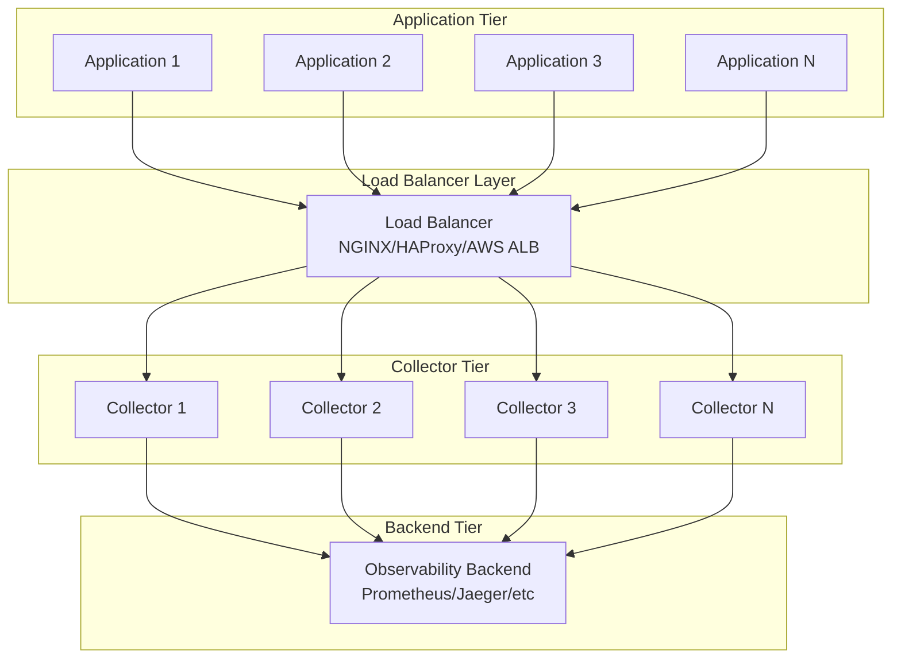

# How to Scale the OpenTelemetry Collector for High-Throughput Environments

Author: [nawazdhandala](https://www.github.com/nawazdhandala)

Tags: OpenTelemetry, Collector, Scaling, High-Throughput, Performance, Architecture

Description: Learn proven strategies for scaling OpenTelemetry Collector to handle millions of spans per second through vertical scaling, horizontal scaling, and architectural patterns.

As your application infrastructure grows, so does the volume of telemetry data it generates. A single OpenTelemetry Collector instance can process tens of thousands of spans per second, but high-scale environments require careful architecture and tuning to handle millions of spans per second reliably.

This guide explores scaling strategies, architectural patterns, and configuration techniques to build a collector infrastructure that handles high-throughput workloads while maintaining reliability and cost efficiency.

## Understanding Collector Performance Characteristics

Before scaling, it's important to understand how the OpenTelemetry Collector performs and where bottlenecks typically occur.

A single collector instance's throughput is limited by:

- **CPU**: Processing, parsing, and transforming telemetry data
- **Memory**: Buffering data in processors and sending queues
- **Network**: Receiving data from applications and sending to backends
- **I/O**: Persistent queue operations when enabled

The collector is designed to be vertically scalable (bigger machines) and horizontally scalable (more instances), giving you flexibility in how to grow your infrastructure.

## Vertical Scaling: Optimizing Single Instance Performance

Start by maximizing the performance of individual collector instances through resource allocation and configuration tuning.

### Resource Allocation

The collector benefits significantly from adequate CPU and memory resources:

```yaml
# Kubernetes deployment with generous resource allocation
apiVersion: apps/v1
kind: Deployment
metadata:
  name: otel-collector-high-throughput
spec:
  replicas: 1
  selector:
    matchLabels:
      app: otel-collector
  template:
    metadata:
      labels:
        app: otel-collector
    spec:
      containers:
      - name: otel-collector
        image: otel/opentelemetry-collector-contrib:latest
        resources:
          requests:
            # Guarantee minimum resources
            cpu: 4000m
            memory: 8Gi
          limits:
            # Allow bursting to handle spikes
            cpu: 8000m
            memory: 16Gi
        env:
        # Set Go runtime to use available CPUs
        - name: GOMAXPROCS
          value: "8"
```

**CPU Guidelines**:
- 1 CPU core can process approximately 10,000-15,000 spans/second
- Allocate at least 4 cores for production workloads
- Enable GOMAXPROCS to match allocated CPU

**Memory Guidelines**:
- Base memory: 512MB minimum
- Add 100-200MB per 10,000 spans/second throughput
- Double memory allocation if using persistent queues

### High-Throughput Collector Configuration

Optimize processor and exporter settings for maximum throughput:

```yaml
receivers:
  otlp:
    protocols:
      grpc:
        endpoint: 0.0.0.0:4317
        # Increase maximum message size for large batches
        max_recv_msg_size_mib: 32
        # Increase concurrent streams
        max_concurrent_streams: 1000
        # Tune keepalive settings
        keepalive:
          server_parameters:
            max_connection_idle: 11s
            max_connection_age: 12s
            max_connection_age_grace: 13s
            time: 30s
            timeout: 5s

processors:
  # Memory limiter prevents OOM
  memory_limiter:
    check_interval: 1s
    limit_percentage: 80
    spike_limit_percentage: 25

  # Aggressive batching for throughput
  batch:
    timeout: 10s
    send_batch_size: 16384
    send_batch_max_size: 32768

  # Resource detection adds useful context
  resourcedetection:
    detectors: [env, system]
    timeout: 5s
    override: false

exporters:
  otlp/backend:
    endpoint: backend.example.com:4317
    compression: gzip

    # Large sending queue for burst absorption
    sending_queue:
      enabled: true
      num_consumers: 20
      queue_size: 50000
      storage: file_storage

    # Retry configuration
    retry_on_failure:
      enabled: true
      initial_interval: 1s
      max_interval: 30s
      max_elapsed_time: 300s

extensions:
  file_storage:
    directory: /var/lib/otel-collector/storage
    timeout: 10s
    # Limit storage size
    compaction:
      directory: /var/lib/otel-collector/storage
      on_start: true
      max_transaction_size: 65536

  health_check:
    endpoint: :13133

service:
  extensions: [file_storage, health_check]

  telemetry:
    metrics:
      level: detailed
      address: :8888

  pipelines:
    traces:
      receivers: [otlp]
      processors: [memory_limiter, batch, resourcedetection]
      exporters: [otlp/backend]
```

This configuration can handle 50,000+ spans per second on a well-provisioned instance.

## Horizontal Scaling: Multi-Instance Architecture

For workloads exceeding single-instance capacity, deploy multiple collector instances behind a load balancer.

### Load Balancer Configuration

Use a load balancer to distribute incoming telemetry across collector instances:



### Kubernetes Load Balancing with Service

The simplest approach in Kubernetes is using a Service with multiple collector replicas:

```yaml
apiVersion: v1
kind: Service
metadata:
  name: otel-collector
  namespace: observability
spec:
  selector:
    app: otel-collector
  ports:
  - name: otlp-grpc
    port: 4317
    targetPort: 4317
    protocol: TCP
  - name: otlp-http
    port: 4318
    targetPort: 4318
    protocol: TCP
  # Use cluster IP for internal load balancing
  type: ClusterIP
  # Session affinity can improve batching efficiency
  sessionAffinity: ClientIP
  sessionAffinityConfig:
    clientIP:
      timeoutSeconds: 10800  # 3 hours
---
apiVersion: apps/v1
kind: Deployment
metadata:
  name: otel-collector
  namespace: observability
spec:
  # Scale based on load
  replicas: 5
  selector:
    matchLabels:
      app: otel-collector
  template:
    metadata:
      labels:
        app: otel-collector
    spec:
      containers:
      - name: otel-collector
        image: otel/opentelemetry-collector-contrib:latest
        resources:
          requests:
            cpu: 2000m
            memory: 4Gi
          limits:
            cpu: 4000m
            memory: 8Gi
        volumeMounts:
        - name: config
          mountPath: /etc/otel
        - name: storage
          mountPath: /var/lib/otel-collector/storage
      volumes:
      - name: config
        configMap:
          name: otel-collector-config
      # Persistent storage for queues
      - name: storage
        persistentVolumeClaim:
          claimName: otel-collector-storage
```

### NGINX Load Balancer for External Deployments

For non-Kubernetes environments, use NGINX as a load balancer:

```nginx
# /etc/nginx/nginx.conf

upstream otel_collectors_grpc {
    # Least connections algorithm works well for long-lived gRPC connections
    least_conn;

    # Collector instances
    server collector1.internal:4317 max_fails=3 fail_timeout=30s;
    server collector2.internal:4317 max_fails=3 fail_timeout=30s;
    server collector3.internal:4317 max_fails=3 fail_timeout=30s;
    server collector4.internal:4317 max_fails=3 fail_timeout=30s;
    server collector5.internal:4317 max_fails=3 fail_timeout=30s;

    # Keepalive connections improve performance
    keepalive 100;
}

upstream otel_collectors_http {
    least_conn;

    server collector1.internal:4318 max_fails=3 fail_timeout=30s;
    server collector2.internal:4318 max_fails=3 fail_timeout=30s;
    server collector3.internal:4318 max_fails=3 fail_timeout=30s;
    server collector4.internal:4318 max_fails=3 fail_timeout=30s;
    server collector5.internal:4318 max_fails=3 fail_timeout=30s;

    keepalive 100;
}

server {
    listen 4317 http2;
    server_name _;

    # gRPC specific settings
    grpc_pass grpc://otel_collectors_grpc;
    grpc_next_upstream error timeout http_500 http_502 http_503 http_504;
    grpc_next_upstream_tries 2;

    # Health check
    location /health {
        grpc_pass grpc://otel_collectors_grpc;
    }
}

server {
    listen 4318;
    server_name _;

    location / {
        proxy_pass http://otel_collectors_http;
        proxy_http_version 1.1;
        proxy_set_header Connection "";
        proxy_next_upstream error timeout http_500 http_502 http_503 http_504;
        proxy_next_upstream_tries 2;
    }
}
```

## Collector Autoscaling

Automatically scale collector instances based on resource utilization or queue depth.

### Horizontal Pod Autoscaler (HPA)

Scale based on CPU and memory metrics:

```yaml
apiVersion: autoscaling/v2
kind: HorizontalPodAutoscaler
metadata:
  name: otel-collector-hpa
  namespace: observability
spec:
  scaleTargetRef:
    apiVersion: apps/v1
    kind: Deployment
    name: otel-collector
  minReplicas: 3
  maxReplicas: 20
  metrics:
  # Scale based on CPU utilization
  - type: Resource
    resource:
      name: cpu
      target:
        type: Utilization
        averageUtilization: 70
  # Scale based on memory utilization
  - type: Resource
    resource:
      name: memory
      target:
        type: Utilization
        averageUtilization: 80
  behavior:
    scaleUp:
      stabilizationWindowSeconds: 60
      policies:
      - type: Percent
        value: 50
        periodSeconds: 60
      - type: Pods
        value: 2
        periodSeconds: 60
      selectPolicy: Max
    scaleDown:
      stabilizationWindowSeconds: 300
      policies:
      - type: Percent
        value: 25
        periodSeconds: 60
```

### Custom Metrics Autoscaling

Scale based on collector-specific metrics like queue depth or batch size:

```yaml
apiVersion: autoscaling/v2
kind: HorizontalPodAutoscaler
metadata:
  name: otel-collector-custom-hpa
  namespace: observability
spec:
  scaleTargetRef:
    apiVersion: apps/v1
    kind: Deployment
    name: otel-collector
  minReplicas: 3
  maxReplicas: 20
  metrics:
  # Scale based on collector queue depth
  - type: Pods
    pods:
      metric:
        name: otelcol_exporter_queue_size
      target:
        type: AverageValue
        averageValue: "5000"
  # Scale based on incoming spans rate
  - type: Pods
    pods:
      metric:
        name: otelcol_receiver_accepted_spans
      target:
        type: AverageValue
        averageValue: "10000"
```

## Gateway Deployment Pattern

For large-scale deployments, use a two-tier architecture with agent collectors and gateway collectors:

```mermaid
graph TB
    subgraph "Application Nodes"
        App1[App] --> Agent1[Agent Collector]
        App2[App] --> Agent2[Agent Collector]
        App3[App] --> Agent3[Agent Collector]
    end

    subgraph "Gateway Layer"
        Agent1 & Agent2 & Agent3 --> LB[Load Balancer]
        LB --> GW1[Gateway Collector 1]
        LB --> GW2[Gateway Collector 2]
        LB --> GW3[Gateway Collector 3]
    end

    subgraph "Backend"
        GW1 & GW2 & GW3 --> Backend[Observability Backend]
    end
```

### Agent Collector Configuration

Agents run on each application node, performing minimal processing:

```yaml
# agent-collector-config.yaml
receivers:
  otlp:
    protocols:
      grpc:
        endpoint: localhost:4317

processors:
  # Minimal processing on agents
  memory_limiter:
    check_interval: 1s
    limit_percentage: 75

  batch:
    # Small batches for low latency
    timeout: 5s
    send_batch_size: 2048

  # Add node-specific attributes
  resourcedetection:
    detectors: [env, system, docker]

exporters:
  # Forward to gateway layer
  otlp/gateway:
    endpoint: otel-gateway.internal:4317
    compression: gzip
    sending_queue:
      queue_size: 10000

service:
  pipelines:
    traces:
      receivers: [otlp]
      processors: [memory_limiter, resourcedetection, batch]
      exporters: [otlp/gateway]
```

### Gateway Collector Configuration

Gateways handle heavy processing and backend communication:

```yaml
# gateway-collector-config.yaml
receivers:
  otlp:
    protocols:
      grpc:
        endpoint: 0.0.0.0:4317
        max_recv_msg_size_mib: 32
        max_concurrent_streams: 1000

processors:
  memory_limiter:
    check_interval: 1s
    limit_percentage: 80

  # Aggressive batching for efficiency
  batch:
    timeout: 30s
    send_batch_size: 16384
    send_batch_max_size: 32768

  # Expensive processors run only on gateways
  attributes:
    actions:
      - key: environment
        value: production
        action: insert

  # Sampling for cost control
  probabilistic_sampler:
    sampling_percentage: 10

exporters:
  otlp/backend:
    endpoint: backend.example.com:4317
    compression: gzip
    sending_queue:
      enabled: true
      num_consumers: 20
      queue_size: 100000
      storage: file_storage

extensions:
  file_storage:
    directory: /var/lib/otel-collector/storage

service:
  extensions: [file_storage]
  pipelines:
    traces:
      receivers: [otlp]
      processors: [memory_limiter, batch, attributes, probabilistic_sampler]
      exporters: [otlp/backend]
```

## Sharding for Tail-Based Sampling

When implementing tail-based sampling, traces must be routed consistently to the same collector instance:

```yaml
# Load balancing collector that shards by trace ID
receivers:
  otlp:
    protocols:
      grpc:
        endpoint: 0.0.0.0:4317

processors:
  batch:
    timeout: 5s
    send_batch_size: 4096

exporters:
  loadbalancing:
    protocol:
      otlp:
        # Gateway endpoints
        endpoint: http://gateway-service.observability.svc.cluster.local:4317
        tls:
          insecure: true

    resolver:
      # Use Kubernetes service discovery
      dns:
        hostname: gateway-service.observability.svc.cluster.local
        port: 4317

    routing_key: "traceID"

service:
  pipelines:
    traces:
      receivers: [otlp]
      processors: [batch]
      exporters: [loadbalancing]
```

Gateway collectors process complete traces for tail-based sampling:

```yaml
# Gateway with tail-based sampling
receivers:
  otlp:
    protocols:
      grpc:
        endpoint: 0.0.0.0:4317

processors:
  batch:
    timeout: 10s
    send_batch_size: 8192

  # Tail-based sampling requires complete traces
  tail_sampling:
    decision_wait: 30s
    num_traces: 100000
    expected_new_traces_per_sec: 1000
    policies:
      # Always sample errors
      - name: error-policy
        type: status_code
        status_code:
          status_codes: [ERROR]

      # Sample slow requests
      - name: latency-policy
        type: latency
        latency:
          threshold_ms: 1000

      # Sample 1% of everything else
      - name: probabilistic-policy
        type: probabilistic
        probabilistic:
          sampling_percentage: 1

exporters:
  otlp/backend:
    endpoint: backend.example.com:4317

service:
  pipelines:
    traces:
      receivers: [otlp]
      processors: [tail_sampling, batch]
      exporters: [otlp/backend]
```

## Performance Benchmarking

Measure your collector throughput using telemetrygen:

```bash
#!/bin/bash
# benchmark-collector.sh

ENDPOINT="otel-collector.example.com:4317"
DURATION=300  # 5 minutes
WORKERS=20

# Test different throughput levels
for RATE in 10000 50000 100000 200000; do
    echo "Testing ${RATE} spans/second..."

    docker run --rm \
      ghcr.io/open-telemetry/opentelemetry-collector-contrib/telemetrygen:latest \
      traces \
      --otlp-endpoint ${ENDPOINT} \
      --otlp-insecure \
      --duration ${DURATION}s \
      --rate ${RATE} \
      --workers ${WORKERS} \
      --span-duration 1ms

    echo "Sleeping 60s before next test..."
    sleep 60
done
```

Monitor these metrics during benchmarking:

- CPU and memory utilization
- Queue depth (`otelcol_exporter_queue_size`)
- Send failures (`otelcol_exporter_send_failed_spans`)
- Batch sizes (`otelcol_processor_batch_batch_send_size`)

## Cost Optimization for High-Throughput

High throughput can lead to high costs. Apply these strategies to optimize:

### Head-Based Sampling

Sample at the source to reduce volume:

```yaml
processors:
  # Probabilistic sampling reduces volume early
  probabilistic_sampler:
    sampling_percentage: 10
    hash_seed: 22

  batch:
    timeout: 10s
    send_batch_size: 16384
```

### Tail-Based Sampling

Intelligent sampling based on trace characteristics:

```yaml
processors:
  tail_sampling:
    decision_wait: 30s
    num_traces: 100000
    policies:
      # Keep all errors
      - name: errors
        type: status_code
        status_code: {status_codes: [ERROR]}

      # Keep P99 latency
      - name: slow-traces
        type: latency
        latency: {threshold_ms: 2000}

      # Sample 5% of normal traffic
      - name: baseline
        type: probabilistic
        probabilistic: {sampling_percentage: 5}
```

### Filtering Noisy Endpoints

Drop telemetry from health checks and other noisy sources:

```yaml
processors:
  filter:
    traces:
      span:
        # Drop health check spans
        - 'attributes["http.route"] == "/health"'
        - 'attributes["http.route"] == "/metrics"'
        - 'attributes["http.route"] == "/ready"'
```

## Monitoring High-Throughput Collectors

Track these critical metrics for high-throughput deployments:

```yaml
receivers:
  prometheus:
    config:
      scrape_configs:
        - job_name: 'otel-collector'
          scrape_interval: 10s
          static_configs:
            - targets: ['localhost:8888']

processors:
  batch:
    timeout: 30s

exporters:
  prometheusremotewrite:
    endpoint: http://prometheus:9090/api/v1/write

service:
  telemetry:
    metrics:
      level: detailed
      address: :8888

  pipelines:
    metrics/internal:
      receivers: [prometheus]
      processors: [batch]
      exporters: [prometheusremotewrite]
```

Key metrics to alert on:

- `otelcol_receiver_refused_spans > 0`: Collector rejecting data
- `otelcol_exporter_queue_size / otelcol_exporter_queue_capacity > 0.8`: Queue filling up
- `otelcol_exporter_send_failed_spans > 0`: Backend connection issues
- `otelcol_processor_batch_timeout_trigger_send / otelcol_processor_batch_batch_size_trigger_send > 10`: Inefficient batching

## Related Resources

For more information on optimizing your OpenTelemetry Collector deployment:

- [How to Set Up Load Balancing Across Multiple Collector Instances](https://oneuptime.com/blog/post/2026-02-06-load-balancing-multiple-collector-instances/view)
- [How to Tune Batch Processor Settings for Optimal Collector Performance](https://oneuptime.com/blog/post/2026-02-06-tune-batch-processor-optimal-collector-performance/view)
- [How to Monitor the Collector with Its Internal Metrics](https://oneuptime.com/blog/post/2026-02-06-monitor-collector-internal-metrics/view)
- [How to Configure Sending Queues and Retry Logic in the Collector](https://oneuptime.com/blog/post/2026-02-06-configure-sending-queues-retry-logic-collector/view)

Scaling the OpenTelemetry Collector for high-throughput environments requires a combination of vertical optimization, horizontal scaling, intelligent routing, and continuous monitoring. By implementing the architectural patterns and configurations outlined in this guide, you can build a telemetry pipeline capable of handling millions of spans per second while maintaining reliability and cost efficiency.
