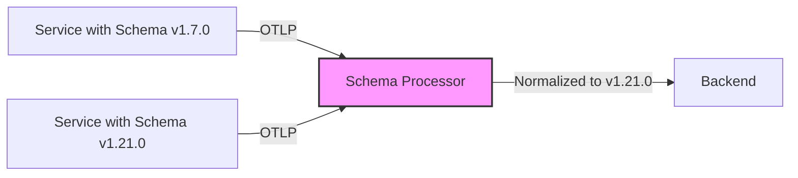

# How to Configure the Schema Processor in the OpenTelemetry Collector

Author: [nawazdhandala](https://www.github.com/nawazdhandala)

Tags: OpenTelemetry, Collector, Processors, Schema, Telemetry, Data Transformation, Observability

Description: Learn how to configure the Schema Processor in OpenTelemetry Collector to transform telemetry data between different semantic convention versions and maintain compatibility across instrumentation upgrades.

OpenTelemetry semantic conventions evolve over time. Attribute names change, span names get updated, and resource conventions are refined. When you upgrade instrumentation libraries or migrate backends, you often face mismatched telemetry schemas. The Schema Processor solves this by automatically transforming telemetry data between different semantic convention versions.

## What Is the Schema Processor?

The Schema Processor applies OpenTelemetry schema transformations to traces, metrics, and logs as they flow through the Collector. It reads a schema URL from telemetry data and applies the corresponding transformation rules to normalize attributes, resource fields, and metric names to a target schema version.

This is particularly useful when:

- You have services instrumented with different OpenTelemetry SDK versions
- Your backend expects a specific semantic convention version
- You're migrating from older to newer semantic conventions gradually
- You need to maintain compatibility during rolling deployments

## Architecture Overview

The Schema Processor sits in your telemetry pipeline and transforms data based on schema rules:



The processor reads the `schema_url` from resource attributes and applies transformations defined in OpenTelemetry schema files to bring all telemetry to a common version.

## Basic Configuration

Here's a minimal Schema Processor configuration that transforms telemetry to semantic conventions version 1.21.0:

```yaml
# Configure receivers to accept telemetry
receivers:
  otlp:
    protocols:
      grpc:
        endpoint: 0.0.0.0:4317
      http:
        endpoint: 0.0.0.0:4318

# Define the Schema Processor
processors:
  # The schema processor transforms telemetry between semantic convention versions
  schema:
    # Target schema version - all telemetry will be transformed to this version
    # This should match the semantic conventions your backend expects
    targets:
      - "https://opentelemetry.io/schemas/1.21.0"

  # Batch processor to improve export efficiency
  batch:
    timeout: 10s
    send_batch_size: 1024

# Configure export destination
exporters:
  otlphttp:
    endpoint: https://oneuptime.com/otlp
    headers:
      x-oneuptime-token: ${ONEUPTIME_TOKEN}

# Wire everything together in pipelines
service:
  pipelines:
    # Traces pipeline with schema transformation
    traces:
      receivers: [otlp]
      processors: [schema, batch]
      exporters: [otlphttp]

    # Metrics pipeline with schema transformation
    metrics:
      receivers: [otlp]
      processors: [schema, batch]
      exporters: [otlphttp]

    # Logs pipeline with schema transformation
    logs:
      receivers: [otlp]
      processors: [schema, batch]
      exporters: [otlphttp]
```

## Understanding Schema Transformations

OpenTelemetry schema files define how attributes, metrics, and spans change between versions. Common transformations include:

### Attribute Renaming

Attributes get renamed as conventions evolve:

```yaml
processors:
  schema:
    targets:
      - "https://opentelemetry.io/schemas/1.21.0"

# This configuration will automatically apply transformations like:
# - "http.method" → "http.request.method"
# - "http.status_code" → "http.response.status_code"
# - "net.peer.name" → "server.address"
# - "net.peer.port" → "server.port"
```

### Metric Renaming

Metric names and units are also transformed:

```yaml
# The schema processor handles metric transformations such as:
# - "http.server.duration" → "http.server.request.duration"
# - Units converted from ms to s where applicable
# - Histogram bucket boundaries adjusted to match new conventions
```

## Advanced Configuration

### Multiple Target Schemas

You can specify multiple target schemas for different signal types:

```yaml
processors:
  schema:
    # Transform traces to one version
    targets:
      - "https://opentelemetry.io/schemas/1.21.0"

    # Override settings for specific signal types
    traces:
      targets:
        - "https://opentelemetry.io/schemas/1.20.0"

    metrics:
      targets:
        - "https://opentelemetry.io/schemas/1.21.0"
```

### Schema-Aware Resource Transformation

The processor also transforms resource attributes:

```yaml
processors:
  schema:
    targets:
      - "https://opentelemetry.io/schemas/1.21.0"

    # Enable resource attribute transformation
    # This ensures resource conventions are also updated
    resources:
      # Transform cloud provider attributes
      # "cloud.provider" values are normalized
      # "cloud.platform" values are standardized
      # "deployment.environment" replaces older conventions
      enabled: true
```

## Production Configuration Example

Here's a complete production-ready configuration with schema processing, error handling, and monitoring:

```yaml
receivers:
  otlp:
    protocols:
      grpc:
        endpoint: 0.0.0.0:4317
        # Accept large payloads for batch processing
        max_recv_msg_size_mib: 16
      http:
        endpoint: 0.0.0.0:4318

processors:
  # Memory limiter prevents OOM issues
  memory_limiter:
    check_interval: 1s
    limit_mib: 512
    spike_limit_mib: 128

  # Schema processor transforms telemetry to target version
  schema:
    # Primary target schema version
    targets:
      - "https://opentelemetry.io/schemas/1.21.0"

    # Transform all signal types consistently
    traces:
      enabled: true
    metrics:
      enabled: true
    logs:
      enabled: true

    # Apply resource transformations
    resources:
      enabled: true

  # Resource processor adds deployment metadata after schema transformation
  resource:
    attributes:
      - key: deployment.environment
        value: ${DEPLOY_ENV}
        action: upsert
      - key: service.version
        value: ${SERVICE_VERSION}
        action: upsert

  # Batch processor optimizes network usage
  batch:
    timeout: 10s
    send_batch_size: 1024
    send_batch_max_size: 2048

  # Filter out health check endpoints after transformation
  filter:
    traces:
      span:
        - 'attributes["http.route"] == "/health"'
        - 'attributes["http.route"] == "/metrics"'

exporters:
  # Primary backend export
  otlphttp/primary:
    endpoint: https://oneuptime.com/otlp
    headers:
      x-oneuptime-token: ${ONEUPTIME_TOKEN}
    compression: gzip
    retry_on_failure:
      enabled: true
      initial_interval: 5s
      max_interval: 30s
      max_elapsed_time: 300s

  # Debug exporter for troubleshooting schema transformations
  logging:
    loglevel: debug
    sampling_initial: 10
    sampling_thereafter: 100

service:
  # Configure Collector extensions
  extensions: [health_check, pprof]

  pipelines:
    traces:
      receivers: [otlp]
      processors: [memory_limiter, schema, resource, batch, filter]
      exporters: [otlphttp/primary, logging]

    metrics:
      receivers: [otlp]
      processors: [memory_limiter, schema, resource, batch]
      exporters: [otlphttp/primary]

    logs:
      receivers: [otlp]
      processors: [memory_limiter, schema, resource, batch]
      exporters: [otlphttp/primary]

extensions:
  health_check:
    endpoint: 0.0.0.0:13133
  pprof:
    endpoint: 0.0.0.0:1777
```

## Deployment in Kubernetes

Deploy the Schema Processor in Kubernetes for centralized schema transformation:

```yaml
apiVersion: v1
kind: ConfigMap
metadata:
  name: otel-collector-config
  namespace: observability
data:
  collector.yaml: |
    receivers:
      otlp:
        protocols:
          grpc:
            endpoint: 0.0.0.0:4317
          http:
            endpoint: 0.0.0.0:4318

    processors:
      memory_limiter:
        check_interval: 1s
        limit_mib: 1024

      schema:
        targets:
          - "https://opentelemetry.io/schemas/1.21.0"

      batch:
        timeout: 10s
        send_batch_size: 1024

    exporters:
      otlphttp:
        endpoint: https://oneuptime.com/otlp
        headers:
          x-oneuptime-token: ${ONEUPTIME_TOKEN}

    service:
      pipelines:
        traces:
          receivers: [otlp]
          processors: [memory_limiter, schema, batch]
          exporters: [otlphttp]
        metrics:
          receivers: [otlp]
          processors: [memory_limiter, schema, batch]
          exporters: [otlphttp]
---
apiVersion: apps/v1
kind: Deployment
metadata:
  name: otel-collector
  namespace: observability
spec:
  replicas: 3
  selector:
    matchLabels:
      app: otel-collector
  template:
    metadata:
      labels:
        app: otel-collector
    spec:
      containers:
      - name: otel-collector
        image: otel/opentelemetry-collector-contrib:0.93.0
        args:
          - "--config=/conf/collector.yaml"
        env:
        - name: ONEUPTIME_TOKEN
          valueFrom:
            secretKeyRef:
              name: oneuptime-credentials
              key: token
        volumeMounts:
        - name: config
          mountPath: /conf
        ports:
        - containerPort: 4317
          name: otlp-grpc
          protocol: TCP
        - containerPort: 4318
          name: otlp-http
          protocol: TCP
        resources:
          requests:
            memory: "512Mi"
            cpu: "500m"
          limits:
            memory: "1Gi"
            cpu: "1000m"
      volumes:
      - name: config
        configMap:
          name: otel-collector-config
---
apiVersion: v1
kind: Service
metadata:
  name: otel-collector
  namespace: observability
spec:
  type: ClusterIP
  selector:
    app: otel-collector
  ports:
  - name: otlp-grpc
    port: 4317
    targetPort: 4317
    protocol: TCP
  - name: otlp-http
    port: 4318
    targetPort: 4318
    protocol: TCP
```

## Validating Schema Transformations

To verify that the Schema Processor is working correctly, enable debug logging and inspect the transformed telemetry:

```yaml
exporters:
  # Add logging exporter to see transformed data
  logging:
    loglevel: debug
    sampling_initial: 5
    sampling_thereafter: 20

service:
  pipelines:
    traces:
      receivers: [otlp]
      processors: [schema, batch]
      # Include logging exporter for validation
      exporters: [otlphttp, logging]
```

Check the Collector logs to see before and after attribute names:

```bash
# View Collector logs
kubectl logs -n observability deployment/otel-collector -f | grep -A 5 "schema"

# Expected output showing transformations:
# Transformed attribute: http.method -> http.request.method
# Transformed attribute: http.status_code -> http.response.status_code
# Transformed attribute: net.peer.name -> server.address
```

## Common Use Cases

### Gradual Migration Strategy

When upgrading instrumentation libraries across multiple services:

```yaml
processors:
  schema:
    # Accept telemetry from any schema version
    # Transform everything to latest version
    targets:
      - "https://opentelemetry.io/schemas/1.21.0"

    # This allows you to upgrade services one at a time
    # The Collector normalizes all telemetry to the target version
```

### Multi-Tenant Environments

Different tenants may use different SDK versions:

```yaml
processors:
  schema:
    targets:
      - "https://opentelemetry.io/schemas/1.21.0"

  # Add tenant identification after schema transformation
  resource:
    attributes:
      - key: tenant.id
        from_attribute: http.request.header.x-tenant-id
        action: insert

# This ensures consistent attribute names across all tenants
```

## Monitoring Schema Processor

Track Schema Processor metrics to ensure transformations are working:

```yaml
service:
  telemetry:
    logs:
      level: info
    metrics:
      level: detailed
      address: 0.0.0.0:8888

# Monitor these metrics:
# - otelcol_processor_schema_transformations_total
# - otelcol_processor_schema_transformation_errors_total
# - otelcol_processor_schema_processing_time_seconds
```

Query these metrics in your observability platform to track:

- Number of transformations applied per signal type
- Errors during transformation
- Processing latency introduced by schema transformations

## Troubleshooting

### Schema URL Not Found

If telemetry doesn't contain a schema URL, the processor skips transformation:

```yaml
processors:
  schema:
    targets:
      - "https://opentelemetry.io/schemas/1.21.0"

    # Set default schema for telemetry without schema_url
    default_schema:
      url: "https://opentelemetry.io/schemas/1.7.0"
```

### Incompatible Schema Versions

If the source schema is too old, some transformations may not be possible:

```yaml
processors:
  # Enable detailed logging to diagnose schema issues
  schema:
    targets:
      - "https://opentelemetry.io/schemas/1.21.0"

    # Log warnings for failed transformations
    log_unmapped: true
```

## Best Practices

1. **Deploy centrally**: Run the Schema Processor in a central Collector tier, not as sidecar agents
2. **Version gradually**: Upgrade target schema versions incrementally to minimize breaking changes
3. **Monitor transformations**: Track metrics to ensure transformations are applied correctly
4. **Test before production**: Validate schema transformations in staging with representative workloads
5. **Document your target**: Clearly communicate which schema version your organization standardizes on

## Performance Considerations

The Schema Processor adds minimal overhead:

- Transformation rules are loaded once at startup
- Attribute lookups use efficient hash maps
- Processing time typically adds less than 1ms per span/metric/log

For high-throughput environments, place the Schema Processor early in the pipeline:

```yaml
processors:
  # Memory limiter first to prevent OOM
  memory_limiter:
    limit_mib: 1024

  # Schema processor second, before expensive operations
  schema:
    targets:
      - "https://opentelemetry.io/schemas/1.21.0"

  # Batch processor last for efficiency
  batch:
    timeout: 10s
```

## Related Resources

- [What is OpenTelemetry Collector and Why Use One](https://oneuptime.com/blog/post/2025-09-18-what-is-opentelemetry-collector-and-why-use-one/view)
- [How to Reduce Noise in OpenTelemetry](https://oneuptime.com/blog/post/2025-08-25-how-to-reduce-noise-in-opentelemetry/view)
- [How to Configure the Span Processor in OpenTelemetry Collector](https://oneuptime.com/blog/post/span-processor-opentelemetry-collector/view)

## Final Thoughts

The Schema Processor is essential for maintaining telemetry consistency in environments with mixed instrumentation versions. By centralizing schema transformations in the Collector, you decouple service upgrades from backend compatibility requirements. This enables gradual migrations, reduces coordination overhead, and ensures your observability data remains queryable and comparable across your entire infrastructure.

Start with a target schema version that matches your backend requirements, enable transformations for all signal types, and monitor the processor metrics to validate that transformations are applied correctly. With the Schema Processor, you gain the flexibility to evolve your instrumentation without disrupting your observability pipeline.
