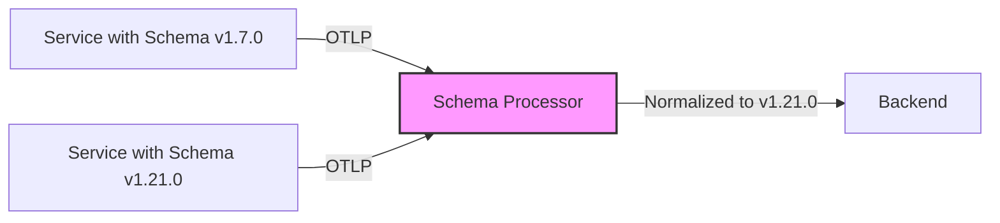

# How to Configure the Schema Processor in the OpenTelemetry Collector

Author: [nawazdhandala](https://www.github.com/nawazdhandala)

Tags: OpenTelemetry, Collector, Processor, Schema, Telemetry, Data Transformation, Observability

Description: Learn how to configure the Schema Processor in OpenTelemetry Collector to transform telemetry data between different semantic convention versions and maintain compatibility across instrumentation.

OpenTelemetry semantic conventions evolve over time. Attribute names change, metric names get updated, and resource conventions are refined. When you upgrade instrumentation libraries or migrate backends, you often face mismatched telemetry schemas. The Schema Processor solves this by automatically transforming telemetry data between different semantic convention versions.

## What Is the Schema Processor?

The Schema Processor applies OpenTelemetry schema transformations to traces, metrics, and logs as they flow through the Collector. In current Collector contrib releases, it is an alpha component. It reads the schema URL carried with OTLP resource and scope data and applies the corresponding transformation rules to normalize attributes, resource fields, and metric names to a target schema version.

This is particularly useful when:

- You have services instrumented with different OpenTelemetry SDK versions
- Your backend expects a specific semantic convention version
- You're migrating from older to newer semantic conventions gradually
- You need to maintain compatibility during rolling deployments

## Architecture Overview

The Schema Processor sits in your telemetry pipeline and transforms data based on schema rules:


```mermaid
graph LR
    A[Service with Schema v1.7.0] -->|OTLP| B[Schema Processor]
    C[Service with Schema v1.21.0] -->|OTLP| B
    B -->|Normalized to v1.21.0| D[Backend]

    style B fill:#f9f,stroke:#333,stroke-width:2px
```

The processor reads the `schema_url` field from OTLP resource and scope data and applies transformations defined in OpenTelemetry schema files to bring matching telemetry to a common version.

## Basic Configuration

Here's a minimal Schema Processor configuration that transforms telemetry to semantic conventions version 1.21.0:

```yaml
# Configure receivers to accept telemetry

receivers:
  otlp:
    protocols:
      grpc:
        endpoint: 0.0.0.0:4317
      http:
        endpoint: 0.0.0.0:4318

# Define the Schema Processor
processors:
  # The schema processor transforms telemetry between semantic convention versions
  schema:
    # Target schema version - matching telemetry will be transformed to this version
    # This should match the semantic conventions your backend expects
    targets:
      - "https://opentelemetry.io/schemas/1.21.0"

  # Batch processor to improve export efficiency
  batch:
    timeout: 10s
    send_batch_size: 1024

# Configure export destination
exporters:
  otlp_http:
    endpoint: https://oneuptime.com/otlp
    headers:
      x-oneuptime-token: ${env:ONEUPTIME_TOKEN}

# Wire everything together in pipelines
service:
  pipelines:
    # Traces pipeline with schema transformation
    traces:
      receivers: [otlp]
      processors: [schema, batch]
      exporters: [otlp_http]

    # Metrics pipeline with schema transformation
    metrics:
      receivers: [otlp]
      processors: [schema, batch]
      exporters: [otlp_http]

    # Logs pipeline with schema transformation
    logs:
      receivers: [otlp]
      processors: [schema, batch]
      exporters: [otlp_http]
```

## Understanding Schema Transformations

OpenTelemetry schema files define how attributes, metrics, span events, and logs change between versions. Common transformations include:

### Attribute Renaming

Attributes get renamed as conventions evolve:

```yaml
processors:
  schema:
    targets:
      - "https://opentelemetry.io/schemas/1.21.0"

# When translating from older matching schema versions, this can apply transformations like:
# - "http.method" → "http.request.method"
# - "http.status_code" → "http.response.status_code"
# - "net.host.name" → "server.address"
# - "net.host.port" → "server.port"
```

### Metric Renaming

Metric names and metric attributes can also be transformed:

```yaml
# The schema processor handles schema-defined metric transformations such as:
# - "process.runtime.jvm.cpu.utilization" → "process.runtime.jvm.cpu.recent_utilization"
# - Metric attribute renames
# - Schema-defined metric splits
```

## Advanced Configuration

### Multiple Schema Families

You can specify multiple target schemas when they belong to different schema families. Each schema family can have only one target:

```yaml
processors:
  schema:
    # Transform OpenTelemetry semantic conventions to one version
    targets:
      - "https://opentelemetry.io/schemas/1.21.0"
      - "https://example.com/telemetry/schemas/2.0.0"
```

### Schema-Aware Resource Transformation

The processor also transforms resource attributes when the matching schema file defines resource attribute renames:

```yaml
processors:
  schema:
    targets:
      - "https://opentelemetry.io/schemas/1.21.0"

    # Optional: fetch and cache likely source schemas at startup
    prefetch:
      - "https://opentelemetry.io/schemas/1.20.0"
```

## Production Configuration Example

Here's a complete production-style configuration with schema processing, error handling, and monitoring:

```yaml
receivers:
  otlp:
    protocols:
      grpc:
        endpoint: 0.0.0.0:4317
        # Accept large payloads for batch processing
        max_recv_msg_size_mib: 16
      http:
        endpoint: 0.0.0.0:4318

processors:
  # Memory limiter prevents OOM issues
  memory_limiter:
    check_interval: 1s
    limit_mib: 512
    spike_limit_mib: 128

  # Schema processor transforms telemetry to target version
  schema:
    # Primary target schema version
    targets:
      - "https://opentelemetry.io/schemas/1.21.0"

    # Fetch likely source schemas at startup instead of waiting for first use
    prefetch:
      - "https://opentelemetry.io/schemas/1.20.0"

  # Resource processor adds deployment metadata after schema transformation
  resource:
    attributes:
      - key: deployment.environment
        value: ${env:DEPLOY_ENV}
        action: upsert
      - key: service.version
        value: ${env:SERVICE_VERSION}
        action: upsert

  # Batch processor optimizes network usage
  batch:
    timeout: 10s
    send_batch_size: 1024
    send_batch_max_size: 2048

  # Filter out health check endpoints after transformation
  filter:
    error_mode: ignore
    trace_conditions:
      - 'span.attributes["http.route"] == "/health"'
      - 'span.attributes["http.route"] == "/metrics"'

exporters:
  # Primary backend export
  otlp_http/primary:
    endpoint: https://oneuptime.com/otlp
    headers:
      x-oneuptime-token: ${env:ONEUPTIME_TOKEN}
    compression: gzip
    retry_on_failure:
      enabled: true
      initial_interval: 5s
      max_interval: 30s
      max_elapsed_time: 300s

  # Debug exporter for troubleshooting schema transformations
  debug:
    verbosity: detailed
    sampling_initial: 10
    sampling_thereafter: 100

service:
  # Configure Collector extensions
  extensions: [health_check, pprof]

  pipelines:
    traces:
      receivers: [otlp]
      processors: [memory_limiter, schema, resource, batch, filter]
      exporters: [otlp_http/primary, debug]

    metrics:
      receivers: [otlp]
      processors: [memory_limiter, schema, resource, batch]
      exporters: [otlp_http/primary]

    logs:
      receivers: [otlp]
      processors: [memory_limiter, schema, resource, batch]
      exporters: [otlp_http/primary]

extensions:
  health_check:
    endpoint: 0.0.0.0:13133
  pprof:
    endpoint: 0.0.0.0:1777
```

## Deployment in Kubernetes

Deploy the Schema Processor in Kubernetes for centralized schema transformation:

```yaml
apiVersion: v1
kind: ConfigMap
metadata:
  name: otel-collector-config
  namespace: observability
data:
  collector.yaml: |
    receivers:
      otlp:
        protocols:
          grpc:
            endpoint: 0.0.0.0:4317
          http:
            endpoint: 0.0.0.0:4318

    processors:
      memory_limiter:
        check_interval: 1s
        limit_mib: 1024

      schema:
        targets:
          - "https://opentelemetry.io/schemas/1.21.0"

      batch:
        timeout: 10s
        send_batch_size: 1024

    exporters:
      otlp_http:
        endpoint: https://oneuptime.com/otlp
        headers:
          x-oneuptime-token: ${env:ONEUPTIME_TOKEN}

    service:
      pipelines:
        traces:
          receivers: [otlp]
          processors: [memory_limiter, schema, batch]
          exporters: [otlp_http]
        metrics:
          receivers: [otlp]
          processors: [memory_limiter, schema, batch]
          exporters: [otlp_http]
---
apiVersion: apps/v1
kind: Deployment
metadata:
  name: otel-collector
  namespace: observability
spec:
  replicas: 3
  selector:
    matchLabels:
      app: otel-collector
  template:
    metadata:
      labels:
        app: otel-collector
    spec:
      containers:
      - name: otel-collector
        image: otel/opentelemetry-collector-contrib:0.153.0
        args:
          - "--config=/conf/collector.yaml"
        env:
        - name: ONEUPTIME_TOKEN
          valueFrom:
            secretKeyRef:
              name: oneuptime-credentials
              key: token
        volumeMounts:
        - name: config
          mountPath: /conf
        ports:
        - containerPort: 4317
          name: otlp-grpc
          protocol: TCP
        - containerPort: 4318
          name: otlp-http
          protocol: TCP
        resources:
          requests:
            memory: "512Mi"
            cpu: "500m"
          limits:
            memory: "1Gi"
            cpu: "1000m"
      volumes:
      - name: config
        configMap:
          name: otel-collector-config
---
apiVersion: v1
kind: Service
metadata:
  name: otel-collector
  namespace: observability
spec:
  type: ClusterIP
  selector:
    app: otel-collector
  ports:
  - name: otlp-grpc
    port: 4317
    targetPort: 4317
    protocol: TCP
  - name: otlp-http
    port: 4318
    targetPort: 4318
    protocol: TCP
```

## Validating Schema Transformations

To verify that the Schema Processor is working correctly, add the debug exporter and inspect the transformed telemetry:

```yaml
exporters:
  # Add debug exporter to see transformed data
  debug:
    verbosity: detailed
    sampling_initial: 5
    sampling_thereafter: 20

service:
  pipelines:
    traces:
      receivers: [otlp]
      processors: [schema, batch]
      # Include debug exporter for validation
      exporters: [otlp_http, debug]
```

Check the Collector logs to inspect the output written by the debug exporter:

```bash
# View Collector logs
kubectl logs -n observability deployment/otel-collector -f | grep -A 20 "ResourceSpans"

# Look for the target SchemaURL and transformed attribute names:
# Resource SchemaURL: https://opentelemetry.io/schemas/1.21.0
# -> http.request.method: Str(GET)
# -> http.response.status_code: Int(200)
# -> server.address: Str(example.com)
```

## Common Use Cases

### Gradual Migration Strategy

When upgrading instrumentation libraries across multiple services:

```yaml
processors:
  schema:
    # Accept telemetry from any schema version
    # Transform matching OpenTelemetry schemas to the selected version
    targets:
      - "https://opentelemetry.io/schemas/1.21.0"

    # This allows you to upgrade services one at a time
    # The Collector normalizes all telemetry to the target version
```

### Multi-Tenant Environments

Different tenants may use different SDK versions:

```yaml
processors:
  schema:
    targets:
      - "https://opentelemetry.io/schemas/1.21.0"

  # Add tenant identification from an existing resource attribute after schema transformation
  resource:
    attributes:
      - key: tenant.id
        from_attribute: service.namespace
        action: insert

# This ensures consistent attribute names across all tenants
```

## Monitoring Schema Processor

Track Schema Processor metrics to ensure transformations are working:

```yaml
service:
  telemetry:
    logs:
      level: info
    metrics:
      level: detailed
      readers:
        - pull:
            exporter:
              prometheus:
                host: 0.0.0.0
                port: 8888

# Monitor these metrics:
# - otelcol_processor_schema.translated
# - otelcol_processor_schema_cache.hits
# - otelcol_processor_schema_cache.misses
# - otelcol_processor_schema_traces.failed
# - otelcol_processor_schema_metrics.failed
# - otelcol_processor_schema_logs.failed
```

Query these metrics in your observability platform to track:

- Number of transformations applied per signal type
- Errors during transformation
- Failed, skipped, and cached schema translation activity

## Troubleshooting

### Schema URL Not Found

If telemetry doesn't contain a schema URL, the processor skips transformation. Fix the instrumentation or upstream Collector so the source schema URL is present; you can also prefetch known schemas to reduce startup-time fetches:

```yaml
processors:
  schema:
    targets:
      - "https://opentelemetry.io/schemas/1.21.0"

    # Fetch likely source schemas at startup
    prefetch:
      - "https://opentelemetry.io/schemas/1.7.0"
```

### Incompatible Schema Versions

If the source schema is too old, some transformations may not be possible:

```yaml
processors:
  schema:
    targets:
      - "https://opentelemetry.io/schemas/1.21.0"

    # Preserve both old and new attribute names for a migration window
    migration:
      - target: "https://opentelemetry.io/schemas/1.21.0"
        from: "https://opentelemetry.io/schemas/1.20.0"
```

## Best Practices

1. **Deploy centrally**: Run the Schema Processor in a central Collector tier, not as sidecar agents
2. **Version gradually**: Upgrade target schema versions incrementally to minimize breaking changes
3. **Monitor transformations**: Track metrics to ensure transformations are applied correctly
4. **Test before production**: Validate schema transformations in staging with representative workloads
5. **Document your target**: Clearly communicate which schema version your organization standardizes on

## Performance Considerations

The Schema Processor is designed to be used early in the pipeline:

- Schema files are fetched on demand and cached
- The `prefetch` option can download likely schemas at startup
- Internal metrics report translations, cache hits, cache misses, skipped signals, and failed translations

For high-throughput environments, place the Schema Processor early in the pipeline:

```yaml
processors:
  # Memory limiter first to prevent OOM
  memory_limiter:
    limit_mib: 1024

  # Schema processor second, before expensive operations
  schema:
    targets:
      - "https://opentelemetry.io/schemas/1.21.0"

  # Batch processor last for efficiency
  batch:
    timeout: 10s
```

## Related Resources

- [What is OpenTelemetry Collector and Why Use One](https://oneuptime.com/blog/post/2025-09-18-what-is-opentelemetry-collector-and-why-use-one/view)
- [How to Reduce Noise in OpenTelemetry](https://oneuptime.com/blog/post/2025-08-25-how-to-reduce-noise-in-opentelemetry/view)
- [How to Configure the Span Processor in OpenTelemetry Collector](https://oneuptime.com/blog/post/2026-02-06-span-processor-opentelemetry-collector/view)

## Final Thoughts

The Schema Processor is essential for maintaining telemetry consistency in environments with mixed instrumentation versions. By centralizing schema transformations in the Collector, you decouple service upgrades from backend compatibility requirements. This enables gradual migrations, reduces coordination overhead, and ensures your observability data remains queryable and comparable across your entire infrastructure.

Start with a target schema version that matches your backend requirements, confirm your telemetry carries schema URLs, and monitor the processor metrics to validate that transformations are applied correctly. With the Schema Processor, you gain the flexibility to evolve your instrumentation without disrupting your observability pipeline.
