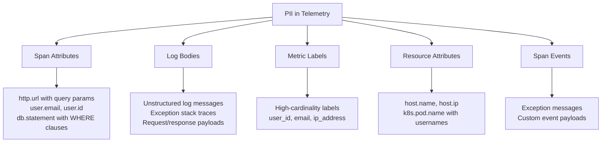
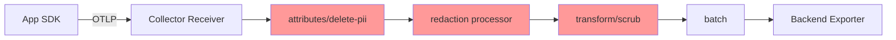

# How to Scrub PII from OpenTelemetry Logs, Traces, and Metrics Before Export

Author: [nawazdhandala](https://www.github.com/nawazdhandala)

Tags: OpenTelemetry, PII, Data Privacy, Security, Observability, Collector

Description: A practical guide to identifying and removing personally identifiable information from OpenTelemetry telemetry data before it leaves your infrastructure.

---

Telemetry data is supposed to help you debug problems. But if you are not careful, it will also carry personally identifiable information (PII) straight into your observability backend. Email addresses in log messages, user IDs in span attributes, credit card numbers in HTTP request bodies, IP addresses in metric labels. All of it gets swept up by your instrumentation and shipped downstream.

This is a problem for two reasons. First, it creates compliance risk under regulations like GDPR, CCPA, and HIPAA. Second, it expands the blast radius of any data breach. If your tracing backend gets compromised and it contains millions of customer email addresses, you have a much bigger incident on your hands.

The good news is that OpenTelemetry gives you several places to scrub PII before data ever leaves your infrastructure. This guide covers the practical techniques for each signal type: logs, traces, and metrics.

## Where PII Hides in Telemetry Data

Before you can remove PII, you need to know where it shows up. Here are the most common locations.



**Span attributes** are the most common culprit. The semantic conventions for HTTP instrumentation capture `http.url`, which often includes query parameters like `?email=user@example.com`. Database instrumentation captures `db.statement`, which can include `WHERE user_email = 'john@example.com'` in the query text.

**Log bodies** are even worse because they are free-form text. Developers write `logger.info(f"Processing order for {user.email}")` without thinking about where that log line ends up.

**Metric labels** should rarely contain PII, but it happens when teams add high-cardinality labels like `user_id` or `customer_email` to custom metrics.

## Strategy 1: Scrub at the SDK Level

The earliest place to catch PII is in your application code, before telemetry even reaches the Collector. OpenTelemetry SDKs support custom span processors and log processors that can modify or redact data inline.

This Python example shows a custom span processor that redacts email addresses from all span attributes before they are exported.

```python
# pii_span_processor.py
# Custom SpanProcessor that scrubs email addresses from span attributes
import re
from opentelemetry.sdk.trace import SpanProcessor

# Regex pattern to match email addresses
EMAIL_PATTERN = re.compile(r'[a-zA-Z0-9._%+-]+@[a-zA-Z0-9.-]+\.[a-zA-Z]{2,}')

class PIIScrubber(SpanProcessor):
    def on_end(self, span):
        """Called when a span ends. Redact PII from all string attributes."""
        for key, value in span.attributes.items():
            if isinstance(value, str):
                # Replace any email address with a redacted placeholder
                scrubbed = EMAIL_PATTERN.sub('[REDACTED_EMAIL]', value)
                if scrubbed != value:
                    span.attributes[key] = scrubbed

    def on_start(self, span, parent_context=None):
        pass

    def shutdown(self):
        pass

    def force_flush(self, timeout_millis=None):
        pass
```

Register this processor when you configure the SDK.

```python
# configure_tracing.py
# Register the PII scrubber as part of the trace provider setup
from opentelemetry.sdk.trace import TracerProvider
from opentelemetry.sdk.trace.export import BatchSpanProcessor
from opentelemetry.exporter.otlp.proto.grpc.trace_exporter import OTLPSpanExporter

provider = TracerProvider()

# Add the PII scrubber first, then the batch exporter
provider.add_span_processor(PIIScrubber())
provider.add_span_processor(BatchSpanProcessor(OTLPSpanExporter()))
```

The downside of SDK-level scrubbing is that every application team has to implement it. If you have 50 microservices owned by different teams, you cannot guarantee consistent coverage. That is why most organizations also scrub at the Collector level.

## Strategy 2: Scrub in the OpenTelemetry Collector

The Collector is the centralized chokepoint where all telemetry flows through. This makes it the ideal place to enforce PII scrubbing policies across your entire organization. Several processors can help.

### Using the Attributes Processor

The `attributes` processor can delete specific attributes by name, which is the simplest form of PII removal.

This configuration removes known PII attributes from both traces and logs.

```yaml
# collector-config.yaml
# Remove known PII-containing attributes from all telemetry
processors:
  attributes/remove-pii:
    actions:
      # Delete attributes that commonly contain PII
      - key: user.email
        action: delete
      - key: user.phone
        action: delete
      - key: user.full_name
        action: delete
      - key: enduser.id
        action: delete
      - key: http.client_ip
        action: delete

      # Hash user.id so it remains useful for correlation
      # without exposing the raw value
      - key: user.id
        action: hash

service:
  pipelines:
    traces:
      receivers: [otlp]
      processors: [attributes/remove-pii, batch]
      exporters: [otlp]
    logs:
      receivers: [otlp]
      processors: [attributes/remove-pii, batch]
      exporters: [otlp]
```

### Using the Redaction Processor

The `redaction` processor from the Collector Contrib distribution is built specifically for this use case. It works as an allowlist: you define which attributes are permitted, and everything else gets removed or redacted.

This configuration blocks all attributes except the ones explicitly allowed, and redacts credit card patterns from the values of allowed attributes.

```yaml
# collector-config-redaction.yaml
# Use the redaction processor to enforce a strict allowlist
processors:
  redaction:
    # Only these attribute keys are allowed through
    allowed_keys:
      - http.method
      - http.status_code
      - http.route
      - service.name
      - span.kind
      - db.system
      - rpc.method

    # Block patterns in attribute values (even for allowed keys)
    blocked_values:
      # Credit card numbers (basic pattern)
      - "\\b[0-9]{4}[- ]?[0-9]{4}[- ]?[0-9]{4}[- ]?[0-9]{4}\\b"
      # Social security numbers
      - "\\b[0-9]{3}-[0-9]{2}-[0-9]{4}\\b"
      # Email addresses
      - "[a-zA-Z0-9._%+-]+@[a-zA-Z0-9.-]+\\.[a-zA-Z]{2,}"

    # Summary attribute records how many attributes were redacted
    summary: debug
```

### Using the Transform Processor

For more complex scrubbing logic, the `transform` processor lets you write OTTL (OpenTelemetry Transformation Language) statements to modify telemetry data.

This configuration uses OTTL to truncate URLs at the query string boundary and replace IP addresses in log bodies.

```yaml
# collector-config-transform.yaml
# Use OTTL statements to scrub PII from specific fields
processors:
  transform/scrub-urls:
    trace_statements:
      - context: span
        statements:
          # Remove query parameters from http.url to strip PII
          # "replace_pattern" applies a regex replacement to the attribute value
          - replace_pattern(attributes["url.full"], "\\?.*", "?[REDACTED]")
          - replace_pattern(attributes["http.url"], "\\?.*", "?[REDACTED]")

    log_statements:
      - context: log
        statements:
          # Redact email addresses in log message bodies
          - replace_pattern(body, "[a-zA-Z0-9._%+-]+@[a-zA-Z0-9.-]+\\.[a-zA-Z]{2,}", "[REDACTED_EMAIL]")
          # Redact IPv4 addresses in log bodies
          - replace_pattern(body, "\\b[0-9]{1,3}\\.[0-9]{1,3}\\.[0-9]{1,3}\\.[0-9]{1,3}\\b", "[REDACTED_IP]")
```

## Strategy 3: Scrub PII from Metrics

Metrics are trickier because removing a label changes the metric's identity. You cannot just delete a label without potentially breaking dashboards and alerts. The `metricstransform` processor helps here.

This configuration aggregates away the PII-containing label while preserving the metric's usefulness.

```yaml
# collector-config-metrics.yaml
# Remove PII labels from metrics by aggregating them away
processors:
  metricstransform:
    transforms:
      # For any metric that has a user_email label, remove it
      # and aggregate the values using sum
      - include: http_requests_total
        action: update
        operations:
          - action: aggregate_labels
            aggregation_type: sum
            # Only keep these labels, dropping everything else
            label_set:
              - method
              - status_code
              - route
```

## Building a Complete PII Scrubbing Pipeline

In practice, you want multiple layers of defense. Scrub at the SDK where you can. Scrub at the Collector for everything else. And validate that scrubbing is working with automated tests.

Here is a complete Collector configuration that combines multiple strategies.

```yaml
# full-pii-scrubbing-pipeline.yaml
receivers:
  otlp:
    protocols:
      grpc:
        endpoint: "0.0.0.0:4317"
      http:
        endpoint: "0.0.0.0:4318"

processors:
  # Layer 1: Delete known PII attributes by name
  attributes/delete-pii:
    actions:
      - key: user.email
        action: delete
      - key: user.phone
        action: delete
      - key: user.full_name
        action: delete
      - key: http.client_ip
        action: delete
      - key: user.id
        action: hash

  # Layer 2: Redact PII patterns in attribute values
  redaction:
    allowed_keys:
      - http.method
      - http.status_code
      - http.route
      - url.path
      - service.name
      - service.version
      - db.system
      - db.operation
      - rpc.system
      - rpc.method
    blocked_values:
      - "\\b[0-9]{4}[- ]?[0-9]{4}[- ]?[0-9]{4}[- ]?[0-9]{4}\\b"
      - "\\b[0-9]{3}-[0-9]{2}-[0-9]{4}\\b"
      - "[a-zA-Z0-9._%+-]+@[a-zA-Z0-9.-]+\\.[a-zA-Z]{2,}"

  # Layer 3: Scrub URLs and log bodies with OTTL
  transform/scrub:
    trace_statements:
      - context: span
        statements:
          - replace_pattern(attributes["url.full"], "\\?.*", "?[REDACTED]")
    log_statements:
      - context: log
        statements:
          - replace_pattern(body, "[a-zA-Z0-9._%+-]+@[a-zA-Z0-9.-]+\\.[a-zA-Z]{2,}", "[REDACTED_EMAIL]")

  batch:
    send_batch_size: 8192
    timeout: 5s

exporters:
  otlp:
    endpoint: "backend.observability:4317"
    tls:
      insecure: false

service:
  pipelines:
    traces:
      receivers: [otlp]
      # Processors run in order: delete, then redact, then transform, then batch
      processors: [attributes/delete-pii, redaction, transform/scrub, batch]
      exporters: [otlp]
    logs:
      receivers: [otlp]
      processors: [attributes/delete-pii, transform/scrub, batch]
      exporters: [otlp]
    metrics:
      receivers: [otlp]
      processors: [attributes/delete-pii, batch]
      exporters: [otlp]
```



## Testing Your PII Scrubbing

Deploy a scrubbing pipeline without testing it and you will either miss PII or accidentally drop legitimate data. Use the Collector's debug exporter to verify what comes out the other end.

Send test telemetry containing known PII patterns and confirm they are scrubbed in the debug output.

```yaml
# test-config.yaml
# Use the debug exporter to verify PII scrubbing works correctly
exporters:
  debug:
    verbosity: detailed  # Print full span/log content to stdout

service:
  pipelines:
    traces:
      receivers: [otlp]
      processors: [attributes/delete-pii, redaction, transform/scrub]
      exporters: [debug]  # Output to stdout for visual inspection
```

Send a test span with PII attributes, then check the Collector's stdout. The `user.email` attribute should be gone. The `http.url` query string should say `[REDACTED]`. Any credit card pattern in attribute values should be replaced.

## Wrapping Up

PII scrubbing is not optional. If you are collecting telemetry from applications that handle user data, some of that user data will end up in your spans, logs, and metrics. The question is whether you catch it before it reaches your backend or after a compliance audit catches it for you.

Start by inventorying where PII appears in your telemetry. Use SDK-level processors for application-specific scrubbing. Use the Collector's attributes, redaction, and transform processors for organization-wide enforcement. Test with the debug exporter. And revisit your rules regularly, because new services and new developers will introduce new PII patterns that your existing rules do not cover.
