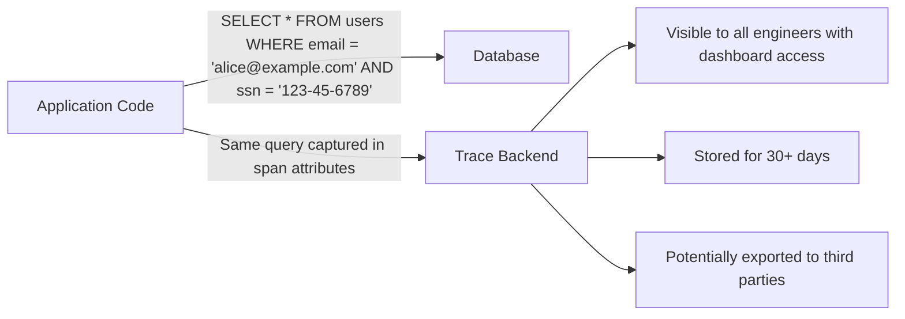
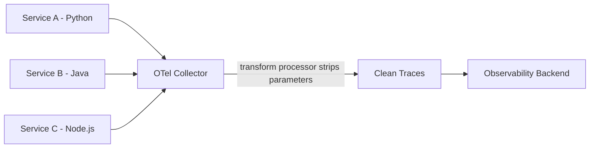

# How to Secure Database Query Parameters from Appearing in Traces

Author: [nawazdhandala](https://www.github.com/nawazdhandala)

Tags: OpenTelemetry, Security, Database, Tracing, Privacy, Observability

Description: Practical techniques to prevent sensitive database query parameters from leaking into OpenTelemetry traces while keeping traces useful for debugging.

---

OpenTelemetry database instrumentation is incredibly useful for debugging. It captures the SQL queries your application runs, how long they take, and where they fit in the request lifecycle. But there is a problem. By default, many database instrumentation libraries capture the full SQL statement, including query parameters. That means your traces might contain user emails, passwords, credit card numbers, social security numbers, API keys, and anything else that passes through a WHERE clause or INSERT statement.

This is not a theoretical risk. Traces get stored in observability backends, shipped to third-party SaaS platforms, accessed by multiple team members, and sometimes retained for months. If sensitive data lands in your traces, you have a compliance violation (GDPR, HIPAA, PCI-DSS) and a security incident waiting to happen.

This post covers practical techniques to strip sensitive parameters from your traces while keeping them useful for debugging.

## The Problem in Detail

Consider a simple user lookup query. Here is what an uninstrumented query looks like versus what OpenTelemetry captures.



The `db.statement` attribute on a span might contain:

```sql
-- This is what appears in your traces by default
SELECT * FROM users WHERE email = 'alice@example.com' AND ssn = '123-45-6789'
```

Anyone with access to your tracing dashboard can see Alice's email and SSN. Let's fix that.

## Method 1: Disable Statement Capture Entirely

The simplest approach is to stop capturing SQL statements altogether. Most OpenTelemetry database instrumentations have a configuration option for this.

For the Python `opentelemetry-instrumentation-psycopg2` library:

```python
# tracing_setup.py
from opentelemetry.instrumentation.psycopg2 import Psycopg2Instrumentor

# Instrument psycopg2 but do not capture any SQL statements
# This is the safest option if you do not need query text in traces
Psycopg2Instrumentor().instrument(
    enable_commenter=False,
    # Disable capturing the db.statement attribute entirely
    capture_parameters=False,
)
```

For the Node.js `@opentelemetry/instrumentation-pg` library:

```javascript
// tracing.js
const { PgInstrumentation } = require('@opentelemetry/instrumentation-pg');

const pgInstrumentation = new PgInstrumentation({
  // Do not add the db.statement attribute to spans
  enhancedDatabaseReporting: false,
  // Use a custom hook to clear any statement data
  requestHook: (span, queryInfo) => {
    // Remove the db.statement attribute if it was set
    span.setAttribute('db.statement', '[REDACTED]');
  },
});
```

This approach is safe but reduces debugging value. You lose the ability to see which query was slow. The next methods provide a better balance.

## Method 2: Capture Parameterized Queries Only

The best middle ground is to capture the query template (with placeholders) but not the actual parameter values. This gives you the query structure for debugging without exposing sensitive data.

Most ORMs and query builders already use parameterized queries internally. The trick is making sure the instrumentation captures the template, not the rendered query.

For Python with SQLAlchemy:

```python
# tracing_setup.py
from opentelemetry.instrumentation.sqlalchemy import SQLAlchemyInstrumentor

# Instrument SQLAlchemy to capture query templates with placeholders
SQLAlchemyInstrumentor().instrument(
    # This captures "SELECT * FROM users WHERE email = ?"
    # instead of "SELECT * FROM users WHERE email = 'alice@example.com'"
    enable_commenter=True,
)
```

For Java with the OpenTelemetry Java agent, set these system properties:

```bash
# Start your Java application with parameter sanitization enabled
# The agent will replace literal values with '?' in the captured statement
java -javaagent:opentelemetry-javaagent.jar \
  -Dotel.instrumentation.jdbc.statement-sanitizer.enabled=true \
  -Dotel.exporter.otlp.endpoint=http://localhost:4318 \
  -jar myapp.jar
```

With the sanitizer enabled, a query like:

```sql
SELECT * FROM users WHERE email = 'alice@example.com' AND created_at > '2026-01-01'
```

Gets captured as:

```sql
-- Sanitized version stored in traces - safe to store and share
SELECT * FROM users WHERE email = ? AND created_at > ?
```

## Method 3: Use a SpanProcessor to Scrub Sensitive Data

If your instrumentation library does not support parameter exclusion natively, you can build a custom SpanProcessor that strips sensitive data before it leaves your application.

```python
# sanitizing_processor.py
import re
from opentelemetry.sdk.trace import SpanProcessor
from opentelemetry.sdk.trace.export import BatchSpanProcessor


class SanitizingSpanProcessor(SpanProcessor):
    """
    A span processor that removes or redacts sensitive information
    from span attributes before they are exported.
    """

    # Patterns that match common sensitive data in SQL statements
    SENSITIVE_PATTERNS = [
        # Match string literals in SQL (values between single quotes)
        (re.compile(r"'[^']*'"), "'?'"),
        # Match numeric literals that follow = or comparison operators
        (re.compile(r"(?<=[=<>!]\s)\d+"), "?"),
        # Match email patterns anywhere in the statement
        (re.compile(r"[\w.+-]+@[\w-]+\.[\w.]+"), "[REDACTED_EMAIL]"),
    ]

    # Attribute keys that should be completely removed from spans
    FORBIDDEN_ATTRIBUTES = {
        "db.query.parameter",       # Generic parameter attribute
        "db.query.text",            # Some libs use this for full query
        "db.cassandra.idempotence", # May contain query params
    }

    def __init__(self, delegate_processor):
        # Wrap another processor (typically BatchSpanProcessor)
        self._delegate = delegate_processor

    def on_start(self, span, parent_context=None):
        self._delegate.on_start(span, parent_context)

    def on_end(self, span):
        # Sanitize the span before passing it to the export processor
        self._sanitize_span(span)
        self._delegate.on_end(span)

    def _sanitize_span(self, span):
        """Remove or redact sensitive attributes from the span."""
        if not hasattr(span, 'attributes') or span.attributes is None:
            return

        # Build a new attributes dict with sanitized values
        sanitized = {}
        for key, value in span.attributes.items():
            # Skip forbidden attributes entirely
            if key in self.FORBIDDEN_ATTRIBUTES:
                continue

            # Sanitize the db.statement attribute
            if key == "db.statement" and isinstance(value, str):
                sanitized_value = value
                for pattern, replacement in self.SENSITIVE_PATTERNS:
                    sanitized_value = pattern.sub(replacement, sanitized_value)
                sanitized[key] = sanitized_value
            else:
                sanitized[key] = value

        # Replace the span's attributes with the sanitized version
        span._attributes = sanitized

    def shutdown(self):
        self._delegate.shutdown()

    def force_flush(self, timeout_millis=None):
        self._delegate.force_flush(timeout_millis)
```

Register the sanitizing processor in your tracing setup.

```python
# tracing_setup.py
from opentelemetry.sdk.trace import TracerProvider
from opentelemetry.sdk.trace.export import BatchSpanProcessor
from opentelemetry.exporter.otlp.proto.http.trace_exporter import OTLPSpanExporter
from sanitizing_processor import SanitizingSpanProcessor

provider = TracerProvider()

# Create the export pipeline: Sanitizer wraps the batch exporter
# Spans get sanitized before they reach the exporter
otlp_exporter = OTLPSpanExporter(endpoint="http://localhost:4318/v1/traces")
batch_processor = BatchSpanProcessor(otlp_exporter)
sanitizing_processor = SanitizingSpanProcessor(batch_processor)

provider.add_span_processor(sanitizing_processor)
```

## Method 4: Use the OpenTelemetry Collector for Centralized Scrubbing

If you have multiple services in different languages, applying sanitization in each service is tedious. A better approach is to centralize the scrubbing in the OpenTelemetry Collector using the attributes processor or the transform processor.

```yaml
# otel-collector-config.yaml
processors:
  # Use the transform processor to sanitize db.statement
  transform:
    trace_statements:
      - context: span
        statements:
          # Replace all single-quoted string literals with '?'
          # This catches most parameter values in SQL statements
          - replace_pattern(attributes["db.statement"], "'[^']*'", "'?'")
          # Replace numeric literals after comparison operators
          - replace_pattern(attributes["db.statement"], "= \\d+", "= ?")

  # Use the attributes processor to remove specific dangerous attributes
  attributes:
    actions:
      # Delete attributes that might contain raw parameter values
      - key: db.query.parameter.email
        action: delete
      - key: db.query.parameter.ssn
        action: delete
      - key: db.query.parameter.password
        action: delete
      # Hash user identifiers instead of deleting them
      # This preserves cardinality for grouping without exposing real values
      - key: db.query.parameter.user_id
        action: hash

exporters:
  otlphttp:
    endpoint: "https://your-oneuptime-instance.com/otlp"

service:
  pipelines:
    traces:
      receivers: [otlp]
      processors: [transform, attributes]
      exporters: [otlphttp]
```

This configuration ensures that no matter which service sends traces, all SQL parameters get stripped at the collector level.



## Method 5: Allowlist Approach for Maximum Safety

Instead of trying to strip bad data (which you might miss), flip the approach. Only allow specific attributes through and drop everything else.

```yaml
# otel-collector-config.yaml
processors:
  # Only keep explicitly allowed span attributes
  attributes:
    actions:
      # Keep these safe attributes
      - key: db.system
        action: upsert
      - key: db.name
        action: upsert
      - key: db.operation
        action: upsert
      # Replace db.statement with just the operation type
      # e.g., "SELECT", "INSERT", "UPDATE", "DELETE"
      - key: db.statement
        action: extract
        pattern: "^(?P<db_operation_type>\\w+)"
      # Now delete the full statement
      - key: db.statement
        action: delete
```

This is the most conservative approach. You lose query details entirely but gain absolute certainty that no sensitive data escapes. This is appropriate for highly regulated environments like healthcare or financial services.

## Testing Your Sanitization

Do not assume your sanitization works. Verify it.

```python
# test_sanitization.py
import unittest
from sanitizing_processor import SanitizingSpanProcessor


class TestSanitization(unittest.TestCase):
    def test_string_literals_are_replaced(self):
        """Verify that string literals in SQL are replaced with placeholders."""
        original = "SELECT * FROM users WHERE email = 'alice@example.com'"
        expected = "SELECT * FROM users WHERE email = '?'"
        result = sanitize_statement(original)
        self.assertEqual(result, expected)

    def test_numeric_values_are_replaced(self):
        """Verify that numeric parameters are replaced."""
        original = "SELECT * FROM orders WHERE user_id = 42"
        expected = "SELECT * FROM orders WHERE user_id = ?"
        result = sanitize_statement(original)
        self.assertEqual(result, expected)

    def test_insert_values_are_sanitized(self):
        """Verify that INSERT values containing sensitive data are scrubbed."""
        original = "INSERT INTO users (email, ssn) VALUES ('bob@test.com', '123-45-6789')"
        expected = "INSERT INTO users (email, ssn) VALUES ('?', '?')"
        result = sanitize_statement(original)
        self.assertEqual(result, expected)
```

## Choosing the Right Approach

The right method depends on your compliance requirements and debugging needs.

| Approach | Safety | Debugging Value | Complexity |
|---|---|---|---|
| Disable statement capture | Highest | Lowest | Trivial |
| Parameterized queries only | High | Good | Low |
| Custom SpanProcessor | High | Good | Medium |
| Collector-level scrubbing | High | Good | Medium |
| Allowlist only | Highest | Low | Low |

For most teams, the combination of parameterized query capture in the application and collector-level scrubbing as a safety net provides the best balance. You get useful debugging information in your traces, and the collector catches anything the application-level configuration misses.

Security is not about choosing one technique. Layer multiple approaches so that if one fails, another catches it. Your traces should help you debug problems, not create new ones.
