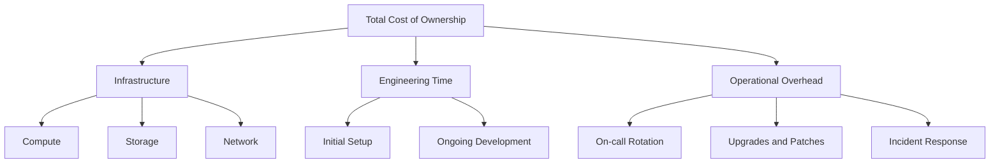

# How to Compare Self-Hosted OpenTelemetry Backend Costs vs SaaS Vendor Pricing at Scale

Author: [nawazdhandala](https://www.github.com/nawazdhandala)

Tags: OpenTelemetry, Cost Analysis, Self-Hosted, SaaS Observability

Description: A detailed cost comparison framework for evaluating self-hosted OpenTelemetry backends against SaaS vendor pricing at various telemetry scales.

The decision between running your own observability backend and paying a SaaS vendor is fundamentally a cost question at scale. At low volumes, SaaS wins on simplicity. At high volumes, the math changes dramatically. This post provides a concrete framework for comparing the two options using real numbers.

## Defining the Comparison

To make a fair comparison, you need to account for the total cost of ownership (TCO) on the self-hosted side, not just infrastructure. SaaS vendors bundle engineering effort, maintenance, upgrades, and on-call into their pricing. A self-hosted solution shifts those costs to your team.

The main cost categories:



## SaaS Vendor Pricing Models

Most observability SaaS vendors price on one or more of these axes:

| Pricing Axis | Typical Range | Example Vendors |
|---|---|---|
| Per GB ingested | $1.50 - $4.00/GB | Datadog (logs), New Relic |
| Per host/month | $15 - $35/host | Datadog (infra) |
| Per million spans | $1.50 - $5.00/M | Lightstep, Honeycomb |
| Per million metrics | $1.00 - $8.00/M | Datadog (custom metrics) |
| Per user/month | $20 - $100/user | Some enterprise tiers |

For this comparison, we will model a mid-size organization with the following telemetry profile:

```yaml
# Telemetry profile for cost modeling
daily_telemetry:
  traces:
    spans_per_day: 500_000_000       # 500M spans/day
    avg_span_size_bytes: 500         # ~250 GB/day
  logs:
    records_per_day: 1_000_000_000   # 1B log records/day
    avg_record_size_bytes: 300       # ~300 GB/day
  metrics:
    data_points_per_day: 200_000_000 # 200M data points/day
    avg_point_size_bytes: 100        # ~20 GB/day

  total_daily_volume_gb: 570
  retention_days: 30
  total_stored_tb: 17.1
  hosts: 200
  engineers_with_access: 50
```

## SaaS Cost Estimate

Using average SaaS pricing across major vendors:

```python
# saas_cost_estimate.py
# Estimate monthly SaaS observability costs for the telemetry profile above

# Daily volumes
spans_per_day = 500_000_000
log_gb_per_day = 300
metric_points_per_day = 200_000_000
hosts = 200

# Monthly multiplier
days = 30

# Pricing (representative mid-range SaaS pricing)
cost_per_million_spans = 2.00
cost_per_gb_logs = 2.50
cost_per_million_metrics = 3.00
cost_per_host = 25.00

# Calculate monthly costs
span_cost = (spans_per_day * days / 1_000_000) * cost_per_million_spans
log_cost = log_gb_per_day * days * cost_per_gb_logs
metric_cost = (metric_points_per_day * days / 1_000_000) * cost_per_million_metrics
host_cost = hosts * cost_per_host

total_monthly = span_cost + log_cost + metric_cost + host_cost

print(f"Spans:   ${span_cost:>12,.2f}")
print(f"Logs:    ${log_cost:>12,.2f}")
print(f"Metrics: ${metric_cost:>12,.2f}")
print(f"Hosts:   ${host_cost:>12,.2f}")
print(f"{'':->35}")
print(f"Total:   ${total_monthly:>12,.2f}/month")

# Output:
# Spans:   $  30,000.00
# Logs:    $  22,500.00
# Metrics: $  18,000.00
# Hosts:   $   5,000.00
# -----------------------------------
# Total:   $  75,500.00/month
```

## Self-Hosted Cost Estimate

A typical self-hosted stack uses the OpenTelemetry Collector as the ingestion layer, ClickHouse for storage and querying, and Grafana for visualization.

```python
# self_hosted_cost_estimate.py
# Estimate monthly self-hosted observability costs

# Infrastructure (AWS pricing, us-east-1)
# ClickHouse cluster: 3x r6g.2xlarge (8 vCPU, 64 GB RAM)
clickhouse_nodes = 3
clickhouse_cost_per_node = 438.00   # Monthly on-demand (reserved: ~280)

# OTel Collector fleet: 4x c6g.xlarge (4 vCPU, 8 GB RAM)
collector_nodes = 4
collector_cost_per_node = 123.00

# Grafana: 1x t3.medium
grafana_cost = 30.00

# Storage: EBS gp3 for ClickHouse (hot), S3 for cold
# ClickHouse compresses telemetry ~10x, so 17.1 TB raw = ~1.7 TB stored
ebs_storage_tb = 2.0
ebs_cost_per_gb = 0.08
ebs_cost = ebs_storage_tb * 1024 * ebs_cost_per_gb

# S3 for older data
s3_storage_tb = 5.0
s3_cost_per_gb = 0.023
s3_cost = s3_storage_tb * 1024 * s3_cost_per_gb

# Network transfer (inter-AZ, collector to ClickHouse)
network_gb_per_month = 570 * 30  # Daily volume * 30 days
network_cost_per_gb = 0.01       # Inter-AZ
network_cost = network_gb_per_month * network_cost_per_gb

# Engineering cost
# Assume 0.25 FTE dedicated to maintaining the observability stack
engineer_monthly_cost = 15000     # Fully loaded monthly cost
engineering_fraction = 0.25
engineering_cost = engineer_monthly_cost * engineering_fraction

# Total
infra_cost = (
    clickhouse_nodes * clickhouse_cost_per_node
    + collector_nodes * collector_cost_per_node
    + grafana_cost
    + ebs_cost
    + s3_cost
    + network_cost
)

total_monthly = infra_cost + engineering_cost

print(f"ClickHouse cluster: ${clickhouse_nodes * clickhouse_cost_per_node:>10,.2f}")
print(f"Collector fleet:    ${collector_nodes * collector_cost_per_node:>10,.2f}")
print(f"Grafana:            ${grafana_cost:>10,.2f}")
print(f"EBS storage:        ${ebs_cost:>10,.2f}")
print(f"S3 storage:         ${s3_cost:>10,.2f}")
print(f"Network:            ${network_cost:>10,.2f}")
print(f"Engineering (0.25): ${engineering_cost:>10,.2f}")
print(f"{'':->40}")
print(f"Total:              ${total_monthly:>10,.2f}/month")

# Output:
# ClickHouse cluster: $  1,314.00
# Collector fleet:    $    492.00
# Grafana:            $     30.00
# EBS storage:        $    163.84
# S3 storage:         $    117.76
# Network:            $    171.00
# Engineering (0.25): $  3,750.00
# ----------------------------------------
# Total:              $  6,038.60/month
```

## Side-by-Side Comparison

| Cost Category | SaaS | Self-Hosted |
|---|---|---|
| Infrastructure | Included | $2,289/mo |
| Storage | Included | $282/mo |
| Network | Included | $171/mo |
| Engineering | $0 (vendor managed) | $3,750/mo |
| License/subscription | $75,500/mo | $0 (open source) |
| **Total** | **$75,500/mo** | **$6,039/mo** |
| **Annual** | **$906,000** | **$72,468** |

The self-hosted option is roughly 12x cheaper at this scale, even after accounting for a quarter of an engineer's time.

## Where the Break-Even Point Is

At very low volumes, SaaS is cheaper because the engineering cost of self-hosting dominates. The crossover point depends on your engineering costs and telemetry volume.

```python
# Rough break-even calculation
# SaaS cost scales linearly with volume
# Self-hosted cost is mostly fixed (engineering) with small variable (infra)

# At what daily GB does self-hosted become cheaper?
# SaaS: ~$2.50/GB/day * 30 = $75/GB/month
# Self-hosted fixed: ~$4,000/month (engineering + base infra)
# Self-hosted variable: ~$0.10/GB/month (storage + network)

fixed_self_hosted = 4000
variable_self_hosted_per_gb = 0.10
saas_per_gb = 75

# Break-even: fixed + variable * X = saas * X
# 4000 = (75 - 0.10) * X
# X = 4000 / 74.90 = ~53 GB/day

breakeven_gb_per_day = fixed_self_hosted / (saas_per_gb - variable_self_hosted_per_gb)
print(f"Break-even at approximately {breakeven_gb_per_day:.0f} GB/day")
# Break-even at approximately 53 GB/day
```

If your telemetry exceeds roughly 50 GB per day, self-hosting starts to save money. Below that threshold, the SaaS convenience usually justifies the premium.

## Hidden Costs to Watch For

On the self-hosted side, watch for:

- **Upgrade cycles**: ClickHouse and the OTel Collector release frequently. Budget time for testing upgrades.
- **On-call burden**: When your observability stack goes down, you lose visibility into everything else. Someone needs to be on call for it.
- **Schema migrations**: As OpenTelemetry semantic conventions evolve, your storage schema needs to follow.
- **Scaling events**: A sudden traffic increase can overwhelm a fixed ClickHouse cluster. You need autoscaling or capacity planning.

On the SaaS side, watch for:

- **Overage charges**: Many vendors charge steep premiums for exceeding committed volumes.
- **Feature-gated pricing**: Advanced features like anomaly detection or SLO tracking often cost extra.
- **Data lock-in**: Migrating away from a SaaS vendor means losing historical data unless you planned for export.

The right choice depends on your team's size, expertise, and how much operational complexity you are willing to absorb. For teams with strong infrastructure skills and high telemetry volumes, self-hosting with OpenTelemetry is a clear financial win.
