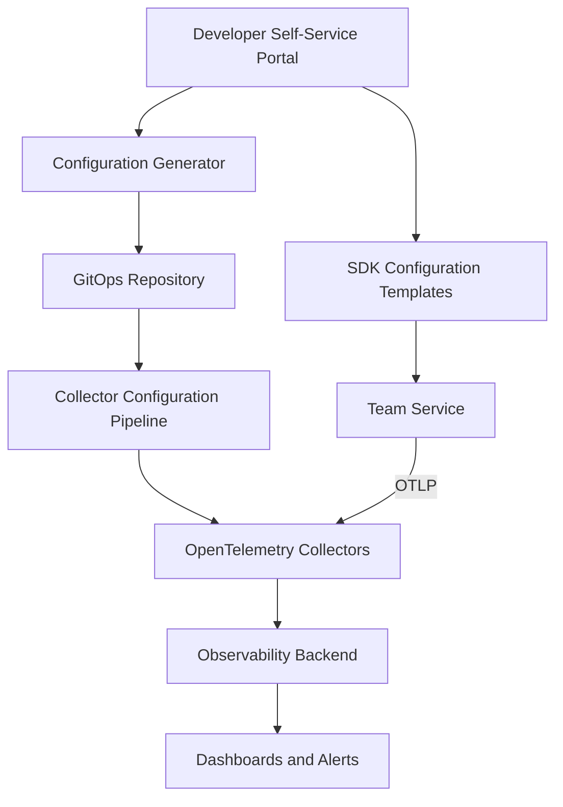

# How to Build a Self-Service Observability Platform with OpenTelemetry

Author: [nawazdhandala](https://www.github.com/nawazdhandala)

Tags: OpenTelemetry, Platform Engineering, Self-Service, Observability, Developer Experience

Description: Learn how to build a self-service observability platform using OpenTelemetry that lets development teams onboard independently without waiting on a central platform team.

---

In organizations with dozens or hundreds of development teams, observability cannot be a bottleneck. If every team needs to file a ticket and wait for the platform team to configure tracing, set up dashboards, and enable alerting, your observability program will never keep up with the pace of development. The solution is to build a self-service platform where teams can onboard their services, configure their instrumentation, and create their dashboards without requiring central team involvement.

OpenTelemetry is the ideal foundation for this because it standardizes how telemetry is collected, processed, and exported. Teams do not need to understand the underlying backend or the collector infrastructure. They just need to follow a set of conventions and use the tools you provide. This post walks through the design and implementation of a self-service observability platform built on OpenTelemetry.

## Platform Architecture

A self-service observability platform has several layers:



The platform team builds and maintains the infrastructure. Development teams interact with a self-service portal or CLI tool that generates the correct configuration for their services.

## Onboarding Workflow

The onboarding process should be as simple as possible. A new team should be able to go from zero to full observability in under an hour. Here is the workflow:

1. Team registers their service in the platform catalog
2. Platform generates SDK configuration and collector pipeline
3. Team adds the SDK to their service using the provided template
4. Telemetry starts flowing automatically

### Service Registration

Create a simple registration format that teams fill out:

```yaml
# service-catalog/order-service.yaml
# Teams fill out this template to register their service.
# The platform uses it to generate all necessary configuration.
service:
  name: order-service
  team: payments
  owner: alice@company.com
  language: python
  framework: fastapi

  # What telemetry signals does the service produce?
  signals:
    traces: true
    metrics: true
    logs: true

  # Environment-specific configuration
  environments:
    staging:
      sampling_rate: 1.0
    production:
      sampling_rate: 0.1

  # Custom attributes the team wants to add
  custom_attributes:
    - name: order.type
      type: string
    - name: order.value_usd
      type: float

  # Alerts the team wants
  alerts:
    - name: high-error-rate
      condition: "error_rate > 5%"
      duration: 5m
      notify: payments-oncall
```

### Configuration Generator

Build a CLI tool or web service that reads the registration and produces all necessary artifacts:

```python
# platform/config_generator.py
# Reads a service registration and generates SDK config,
# collector pipeline, and dashboard templates.
import yaml
import os

def generate_configs(service_file):
    with open(service_file) as f:
        service = yaml.safe_load(f)

    name = service['service']['name']
    team = service['service']['team']
    language = service['service']['language']

    # Generate SDK environment variables
    sdk_config = generate_sdk_config(service)

    # Generate collector pipeline addition
    collector_config = generate_collector_pipeline(service)

    # Generate dashboard template
    dashboard = generate_dashboard(service)

    return {
        'sdk_config': sdk_config,
        'collector_config': collector_config,
        'dashboard': dashboard,
    }

def generate_sdk_config(service):
    """Generate environment variables for the service's OTel SDK."""
    name = service['service']['name']
    team = service['service']['team']

    return {
        'OTEL_SERVICE_NAME': name,
        'OTEL_EXPORTER_OTLP_ENDPOINT': 'http://otel-agent:4318',
        'OTEL_EXPORTER_OTLP_PROTOCOL': 'http/protobuf',
        'OTEL_RESOURCE_ATTRIBUTES': f'service.team={team},service.namespace=production',
    }

def generate_collector_pipeline(service):
    """Generate the collector pipeline configuration for this service."""
    name = service['service']['name']
    sampling = service['service']['environments']['production']['sampling_rate']

    return {
        'processors': {
            f'filter/{name}': {
                'traces': {
                    'span': [
                        f'resource.attributes["service.name"] == "{name}"'
                    ]
                }
            }
        }
    }
```

## SDK Configuration Templates

Provide ready-to-use templates for each supported language. Teams copy the template and fill in their service name:

### Python Template

```python
# templates/python/otel_setup.py
# Copy this file into your service and call init_telemetry() at startup.
# No modifications needed if you set OTEL_SERVICE_NAME as an env var.
from opentelemetry import trace, metrics
from opentelemetry.sdk.trace import TracerProvider
from opentelemetry.sdk.trace.export import BatchSpanProcessor
from opentelemetry.exporter.otlp.proto.http.trace_exporter import OTLPSpanExporter
from opentelemetry.sdk.metrics import MeterProvider
from opentelemetry.sdk.metrics.export import PeriodicExportingMetricReader
from opentelemetry.exporter.otlp.proto.http.metric_exporter import OTLPMetricExporter
from opentelemetry.sdk.resources import Resource

def init_telemetry():
    """Initialize OpenTelemetry with platform-standard configuration.

    All settings are read from environment variables:
    - OTEL_SERVICE_NAME: your service name
    - OTEL_EXPORTER_OTLP_ENDPOINT: collector endpoint (provided by platform)
    - OTEL_RESOURCE_ATTRIBUTES: additional resource attributes
    """
    resource = Resource.create()  # reads from env vars

    # Traces
    trace_provider = TracerProvider(resource=resource)
    trace_provider.add_span_processor(
        BatchSpanProcessor(OTLPSpanExporter())
    )
    trace.set_tracer_provider(trace_provider)

    # Metrics
    metric_reader = PeriodicExportingMetricReader(
        OTLPMetricExporter(),
        export_interval_millis=30000,
    )
    metric_provider = MeterProvider(
        resource=resource,
        metric_readers=[metric_reader],
    )
    metrics.set_meter_provider(metric_provider)

    return trace_provider, metric_provider
```

### Node.js Template

```javascript
// templates/nodejs/tracing.js
// Require this file before your application: node --require ./tracing.js app.js
// Configuration is handled through environment variables set by the platform.
const { NodeSDK } = require('@opentelemetry/sdk-node');
const { getNodeAutoInstrumentations } = require('@opentelemetry/auto-instrumentations-node');
const { OTLPTraceExporter } = require('@opentelemetry/exporter-trace-otlp-http');
const { OTLPMetricExporter } = require('@opentelemetry/exporter-metrics-otlp-http');
const { PeriodicExportingMetricReader } = require('@opentelemetry/sdk-metrics');

const sdk = new NodeSDK({
  traceExporter: new OTLPTraceExporter(),
  metricReader: new PeriodicExportingMetricReader({
    exporter: new OTLPMetricExporter(),
    exportIntervalMillis: 30000,
  }),
  instrumentations: [getNodeAutoInstrumentations()],
});

sdk.start();
process.on('SIGTERM', () => sdk.shutdown().then(() => process.exit(0)));
```

## Collector Pipeline Management

When a new service onboards, the platform automatically generates and deploys the collector configuration. Use a GitOps approach where collector configurations are stored in a repository and deployed through a CI/CD pipeline:

```yaml
# collector-configs/team-payments.yaml
# Auto-generated collector pipeline for the payments team.
# Do not edit manually. Changes are managed through the service catalog.
processors:
  attributes/payments:
    actions:
      - key: team
        value: payments
        action: upsert

  filter/payments-high-volume:
    traces:
      span:
        # Drop health check spans to reduce volume
        - 'name == "GET /health"'
        - 'name == "GET /ready"'

service:
  pipelines:
    traces/payments:
      receivers: [otlp]
      processors: [attributes/payments, filter/payments-high-volume, batch]
      exporters: [otlphttp]
```

## Dashboard and Alert Templates

Generate default dashboards for every onboarded service. Teams start with a working dashboard and customize it from there:

```json
{
  "title": "order-service Overview",
  "description": "Auto-generated dashboard for order-service (team: payments)",
  "panels": [
    {
      "title": "Request Rate",
      "type": "timeseries",
      "query": "rate(http_server_request_duration_seconds_count{service_name='order-service'}[5m])"
    },
    {
      "title": "Error Rate",
      "type": "timeseries",
      "query": "rate(http_server_request_duration_seconds_count{service_name='order-service',http_response_status_code=~'5..'}[5m])"
    },
    {
      "title": "P99 Latency",
      "type": "timeseries",
      "query": "histogram_quantile(0.99, rate(http_server_request_duration_seconds_bucket{service_name='order-service'}[5m]))"
    },
    {
      "title": "Active Spans",
      "type": "stat",
      "query": "sum(otelcol_receiver_accepted_spans{service_name='order-service'})"
    }
  ]
}
```

## Platform CLI

Give teams a CLI tool that wraps the entire onboarding process:

```bash
# Teams use the platform CLI to onboard their services.
# The CLI generates configs, creates the PR, and provides setup instructions.

# Register a new service
$ otel-platform register \
    --name order-service \
    --team payments \
    --language python \
    --framework fastapi

# Output:
# Service registered successfully.
#
# Next steps:
# 1. Add to your requirements.txt:
#    opentelemetry-sdk==1.25.0
#    opentelemetry-exporter-otlp-proto-http==1.25.0
#    opentelemetry-instrumentation-fastapi==0.46b0
#
# 2. Copy the setup file:
#    cp ~/.otel-platform/templates/python/otel_setup.py your_service/
#
# 3. Add to your Dockerfile:
#    ENV OTEL_SERVICE_NAME=order-service
#
# 4. Your dashboard is available at:
#    https://observability.company.com/d/order-service

# Check instrumentation health
$ otel-platform check --name order-service

# Output:
# order-service health check:
#   Traces: receiving (142 spans/min)
#   Metrics: receiving (28 metrics)
#   Logs: not configured
#   Sampling rate: 10%
#   Last seen: 3 seconds ago
```

## Governance and Guardrails

Self-service does not mean no rules. Implement guardrails that prevent teams from misconfiguring their instrumentation:

```yaml
# platform/guardrails.yaml
# Rules enforced by the platform on all service configurations.
rules:
  # Every service must have a service.name
  - name: require-service-name
    check: resource_attributes_contain("service.name")
    severity: error

  # Every service must have a team owner
  - name: require-team
    check: resource_attributes_contain("service.team")
    severity: error

  # Sampling rate must be between 0.01 and 1.0
  - name: valid-sampling-rate
    check: sampling_rate >= 0.01 and sampling_rate <= 1.0
    severity: error

  # Custom attributes must use the organization prefix
  - name: custom-attribute-prefix
    check: custom_attributes_start_with("mycompany.")
    severity: warning

  # Maximum of 50 custom attributes per service
  - name: attribute-limit
    check: custom_attribute_count <= 50
    severity: error
```

## Conclusion

A self-service observability platform removes the central team from the critical path of instrumentation. Teams can onboard their services in minutes using templates, CLIs, and automated configuration generation. The platform team focuses on building and maintaining the infrastructure, not on configuring individual services. OpenTelemetry's standardized APIs and environment variable conventions make this possible because the same templates and tools work across all supported languages. The result is faster adoption, more consistent instrumentation, and a platform team that scales with the organization rather than becoming a bottleneck.
