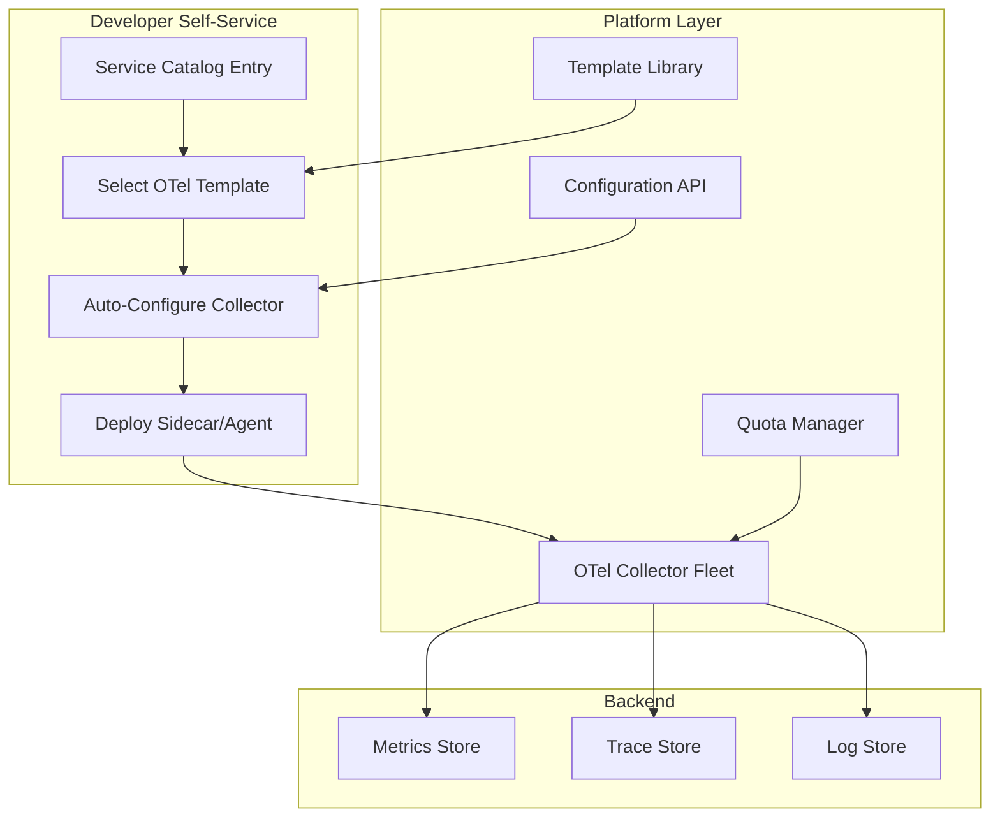

# How to Build a Self-Service Observability Platform Using OpenTelemetry and Internal Developer Portals

Author: [nawazdhandala](https://www.github.com/nawazdhandala)

Tags: OpenTelemetry, Developer Platform, Self-Service, Observability

Description: Build an internal self-service observability platform where developer teams can onboard, configure, and manage their own telemetry using OpenTelemetry.

Centralized observability teams do not scale. When a single platform team handles every instrumentation request, dashboard creation, and alert configuration for dozens of engineering teams, the bottleneck grows until developers either wait weeks for observability or skip it entirely.

A self-service model flips this. The platform team provides the infrastructure, standards, and tooling. Developer teams use those tools to instrument their services, create dashboards, and configure alerts on their own schedule. OpenTelemetry is the natural foundation because its vendor-neutral APIs and collector architecture decouple the "how to collect telemetry" from the "where to send it."

## Platform Architecture



## The Service Catalog as Entry Point

The developer portal (Backstage, Cortex, or a custom internal portal) serves as the entry point. When a team registers a service, they get observability as part of the onboarding flow.

Here is a Backstage catalog entry that includes observability configuration.

```yaml
# catalog-info.yaml - Service registration with observability config
apiVersion: backstage.io/v1alpha1
kind: Component
metadata:
  name: payment-service
  description: Handles payment processing
  annotations:
    # Link to the OTel configuration for this service
    observability/otel-config: "configs/payment-service/otel-config.yaml"
    observability/tier: "tier-1"  # Determines sampling rates, retention
    observability/team: "payments-team"
spec:
  type: service
  lifecycle: production
  owner: payments-team
  system: checkout
```

## Configuration API for Developer Teams

The platform exposes an API that developers use to configure their observability settings. The API validates inputs, enforces quotas, and generates the actual OpenTelemetry Collector configuration.

```python
# config_api.py - Self-service observability configuration API
from dataclasses import dataclass
from typing import List

@dataclass
class ObservabilityConfig:
    service_name: str
    team: str
    tier: str  # tier-1, tier-2, tier-3
    metrics_enabled: bool = True
    traces_enabled: bool = True
    logs_enabled: bool = True
    custom_metrics: List[str] = None
    # Sampling rate derived from tier
    trace_sampling_rate: float = None

    def __post_init__(self):
        # Tier determines default sampling rates and retention
        tier_sampling = {
            "tier-1": 1.0,    # 100% sampling for critical services
            "tier-2": 0.1,    # 10% sampling for standard services
            "tier-3": 0.01,   # 1% sampling for batch/background jobs
        }
        if self.trace_sampling_rate is None:
            self.trace_sampling_rate = tier_sampling.get(self.tier, 0.1)

class ObservabilityConfigService:
    def __init__(self, quota_manager, config_store, collector_deployer):
        self.quota_manager = quota_manager
        self.config_store = config_store
        self.deployer = collector_deployer

    def onboard_service(self, config: ObservabilityConfig) -> dict:
        """Onboard a service to the observability platform."""
        # Check quota - prevent runaway metric cardinality
        quota_ok = self.quota_manager.check_quota(config.team, config)
        if not quota_ok:
            raise QuotaExceededError(
                f"Team {config.team} has reached the metric series limit. "
                f"Contact platform-team to increase your quota."
            )

        # Generate the collector config
        collector_config = self._generate_collector_config(config)

        # Store and deploy
        self.config_store.save(config.service_name, collector_config)
        self.deployer.deploy_sidecar(config.service_name, collector_config)

        return {
            "status": "onboarded",
            "service": config.service_name,
            "collector_endpoint": f"http://localhost:4317",
            "dashboard_url": f"https://dashboards.internal/service/{config.service_name}",
        }

    def _generate_collector_config(self, config: ObservabilityConfig) -> dict:
        """Generate an OTel Collector config from the service config."""
        return {
            "receivers": {
                "otlp": {
                    "protocols": {
                        "grpc": {"endpoint": "0.0.0.0:4317"},
                        "http": {"endpoint": "0.0.0.0:4318"},
                    }
                }
            },
            "processors": self._build_processors(config),
            "exporters": self._build_exporters(config),
            "service": {
                "pipelines": self._build_pipelines(config),
            }
        }
```

## Generated Collector Configuration

The platform generates collector configs tailored to each service's tier and needs. Here is what a generated config looks like for a tier-1 service.

```yaml
# Generated: payment-service collector config
receivers:
  otlp:
    protocols:
      grpc:
        endpoint: 0.0.0.0:4317
      http:
        endpoint: 0.0.0.0:4318

processors:
  # Add service identity and team ownership
  resource:
    attributes:
      - key: service.name
        value: payment-service
        action: upsert
      - key: team
        value: payments-team
        action: upsert
      - key: tier
        value: tier-1
        action: upsert

  # Tier-1: no sampling, keep everything
  batch:
    send_batch_size: 512
    timeout: 5s

  # Enforce metric cardinality limits
  filter/cardinality:
    metrics:
      include:
        match_type: regexp
        metric_names:
          - "http\\..*"
          - "rpc\\..*"
          - "db\\..*"
          - "payment\\..*"  # Custom metrics for this service

  # Memory limiter to protect the collector
  memory_limiter:
    check_interval: 5s
    limit_mib: 512
    spike_limit_mib: 128

exporters:
  otlp/platform:
    endpoint: "otel-gateway.platform.svc.cluster.local:4317"
    headers:
      x-team: payments-team
      x-service: payment-service

service:
  pipelines:
    traces:
      receivers: [otlp]
      processors: [memory_limiter, resource, batch]
      exporters: [otlp/platform]
    metrics:
      receivers: [otlp]
      processors: [memory_limiter, resource, filter/cardinality, batch]
      exporters: [otlp/platform]
    logs:
      receivers: [otlp]
      processors: [memory_limiter, resource, batch]
      exporters: [otlp/platform]
```

## Quota Management

Without quotas, a single misconfigured service can generate millions of metric series and overwhelm your backend. The quota manager enforces limits per team.

```python
# quota_manager.py - Enforce telemetry quotas per team
class QuotaManager:
    # Default quotas by tier
    TIER_QUOTAS = {
        "tier-1": {"max_metric_series": 50000, "max_span_rate_per_sec": 10000},
        "tier-2": {"max_metric_series": 10000, "max_span_rate_per_sec": 1000},
        "tier-3": {"max_metric_series": 2000, "max_span_rate_per_sec": 100},
    }

    def __init__(self, usage_store):
        self.usage_store = usage_store

    def check_quota(self, team: str, config: ObservabilityConfig) -> bool:
        """Check if the team has remaining quota for this service."""
        current_usage = self.usage_store.get_team_usage(team)
        tier_quota = self.TIER_QUOTAS.get(config.tier, self.TIER_QUOTAS["tier-3"])

        estimated_new_series = self._estimate_series(config)
        total_after = current_usage.get("metric_series", 0) + estimated_new_series

        return total_after <= tier_quota["max_metric_series"]

    def _estimate_series(self, config: ObservabilityConfig) -> int:
        """Estimate metric series based on config."""
        # Base series from standard instrumentation
        base_series = 200
        # Additional series for each custom metric
        custom_series = len(config.custom_metrics or []) * 50
        return base_series + custom_series
```

## Developer Self-Service CLI

Give developers a CLI to interact with the platform.

```bash
# Onboard a new service
otel-platform onboard \
  --service payment-service \
  --team payments-team \
  --tier tier-1

# Check current quota usage
otel-platform quota --team payments-team

# Update sampling rate
otel-platform config update \
  --service payment-service \
  --trace-sampling-rate 0.5

# View collector health for your service
otel-platform status --service payment-service
```

## Gateway Collector for Centralized Control

The platform runs a gateway collector that receives telemetry from all service-level sidecars. This gateway enforces global policies, routes data, and provides a single point for cross-cutting concerns.

```yaml
# gateway-collector-config.yaml
receivers:
  otlp:
    protocols:
      grpc:
        endpoint: 0.0.0.0:4317

processors:
  # Rate limiting per team based on headers
  batch:
    send_batch_size: 2048
    timeout: 10s

  # Add platform-level metadata
  resource:
    attributes:
      - key: platform.region
        value: "us-east-1"
        action: upsert

exporters:
  otlp/metrics:
    endpoint: "metrics-backend:4317"
  otlp/traces:
    endpoint: "traces-backend:4317"
  otlp/logs:
    endpoint: "logs-backend:4317"

service:
  pipelines:
    metrics:
      receivers: [otlp]
      processors: [resource, batch]
      exporters: [otlp/metrics]
    traces:
      receivers: [otlp]
      processors: [resource, batch]
      exporters: [otlp/traces]
    logs:
      receivers: [otlp]
      processors: [resource, batch]
      exporters: [otlp/logs]
```

## What Makes This Work

The self-service model succeeds when three things are true: onboarding is fast (under 30 minutes for a new service), defaults are good (standard instrumentation works without customization), and guardrails prevent misuse (quotas and cardinality limits protect the platform). OpenTelemetry provides the standardized APIs that make "good defaults" possible, while the collector architecture gives the platform team control without requiring changes to application code.
