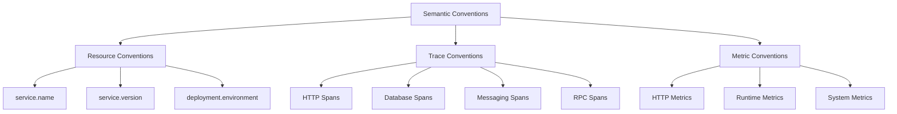

# How to Use Semantic Conventions Consistently Across Languages

Author: [nawazdhandala](https://www.github.com/nawazdhandala)

Tags: OpenTelemetry, Semantic Conventions, Multi-Language, Standardization, Observability

Description: Learn how to apply OpenTelemetry semantic conventions consistently across services written in different programming languages for unified observability.

---

OpenTelemetry semantic conventions define a shared vocabulary for telemetry data. They specify what attribute names to use, what values are expected, and how different types of operations should be described. When every service in your organization follows these conventions, your traces, metrics, and logs become queryable in a uniform way regardless of which language or framework produced them. When conventions are applied inconsistently, you end up with a fragmented observability experience where the same concept has different names in different services.

This post covers how to enforce semantic conventions across a multi-language environment so that your telemetry data tells a consistent story.

## What Are Semantic Conventions?

Semantic conventions are standardized attribute names and values published by the OpenTelemetry project. They cover common operation types like HTTP requests, database calls, messaging systems, and RPC frameworks. For example, the HTTP semantic conventions specify that the HTTP method should be stored in `http.request.method`, the URL scheme in `url.scheme`, and the response status code in `http.response.status_code`.

Without conventions, one team might use `http.method`, another `httpMethod`, and a third `request.method`. All three mean the same thing, but your backend cannot correlate them. Semantic conventions eliminate this ambiguity.

## The Convention Categories

Semantic conventions are organized into groups. The most commonly used ones include:



Resource conventions describe the entity producing the telemetry. Trace conventions describe individual operations. Metric conventions define standard metric names and units.

## Using Semantic Convention Libraries

Each language SDK provides a semantic conventions package. Always use these instead of hardcoding attribute names as strings.

### Go

```go
import (
    semconv "go.opentelemetry.io/otel/semconv/v1.21.0"
    "go.opentelemetry.io/otel/attribute"
)

// Use the semconv package for standard attribute names.
// This prevents typos and ensures you are using the correct convention version.
func addHTTPAttributes(span trace.Span, method string, statusCode int) {
    span.SetAttributes(
        semconv.HTTPRequestMethodKey.String(method),
        semconv.HTTPResponseStatusCode(statusCode),
        semconv.URLScheme("https"),
    )
}

// For resource attributes, use the same semconv package
func createResource() *resource.Resource {
    res, _ := resource.New(context.Background(),
        resource.WithAttributes(
            semconv.ServiceName("order-service"),
            semconv.ServiceVersion("2.1.0"),
            semconv.DeploymentEnvironment("production"),
        ),
    )
    return res
}
```

### Java

```java
import io.opentelemetry.semconv.SemanticAttributes;
import io.opentelemetry.api.common.Attributes;

// Java provides SemanticAttributes as typed constants.
// Using these ensures compile-time validation of attribute names.
public void addHTTPAttributes(Span span, String method, int statusCode) {
    span.setAllAttributes(Attributes.of(
        SemanticAttributes.HTTP_REQUEST_METHOD, method,
        SemanticAttributes.HTTP_RESPONSE_STATUS_CODE, (long) statusCode,
        SemanticAttributes.URL_SCHEME, "https"
    ));
}
```

### Python

```python
from opentelemetry.semconv.trace import SpanAttributes
from opentelemetry.semconv.resource import ResourceAttributes

# Python provides attribute constants through the semconv package.
# Always import from semconv rather than typing attribute names manually.
def add_http_attributes(span, method, status_code):
    span.set_attribute(SpanAttributes.HTTP_REQUEST_METHOD, method)
    span.set_attribute(SpanAttributes.HTTP_RESPONSE_STATUS_CODE, status_code)
    span.set_attribute(SpanAttributes.URL_SCHEME, "https")
```

### Node.js

```javascript
const {
  ATTR_HTTP_REQUEST_METHOD,
  ATTR_HTTP_RESPONSE_STATUS_CODE,
  ATTR_URL_SCHEME,
} = require('@opentelemetry/semantic-conventions');

// Node.js exports attribute names as constants.
// Using constants avoids the risk of typos in attribute name strings.
function addHTTPAttributes(span, method, statusCode) {
  span.setAttributes({
    [ATTR_HTTP_REQUEST_METHOD]: method,
    [ATTR_HTTP_RESPONSE_STATUS_CODE]: statusCode,
    [ATTR_URL_SCHEME]: 'https',
  });
}
```

## Creating an Internal Convention Guide

While the OpenTelemetry semantic conventions cover standard library operations, your organization will have custom attributes for business logic. Create an internal guide that extends the official conventions.

```yaml
# internal-conventions.yaml
# Organization-specific semantic conventions that extend the official ones.
# All teams must follow these when adding custom attributes.

# Business domain attributes
custom_attributes:
  tenant:
    - name: tenant.id
      type: string
      description: "The unique identifier of the tenant"
      required: true
      examples: ["tenant-abc-123"]

    - name: tenant.tier
      type: string
      description: "The pricing tier of the tenant"
      required: false
      allowed_values: ["free", "pro", "enterprise"]

  order:
    - name: order.id
      type: string
      description: "The unique order identifier"
      required: true

    - name: order.total
      type: double
      description: "The total order amount in the base currency"
      required: false

# Naming rules
rules:
  - Use lowercase with dots as separators (e.g., tenant.id not tenantId)
  - Prefix custom attributes with the domain name (e.g., order.id not id)
  - Never reuse an official semantic convention name for a different meaning
  - Always include units in metric names (e.g., order.processing.duration_ms)
```

## Span Naming Conventions

Span names are just as important as attributes. The semantic conventions specify patterns for span names based on the operation type:

```
HTTP spans:       "HTTP {method}"        -> "HTTP GET", "HTTP POST"
Database spans:   "{operation} {target}" -> "SELECT users", "INSERT orders"
Messaging spans:  "{destination} {op}"   -> "orders.queue send"
RPC spans:        "{service}/{method}"   -> "UserService/GetUser"
```

Enforce these patterns across all languages. Here is an example of a validator that checks span names at the collector level:

```yaml
# Collector processor to validate and normalize span names.
# This catches inconsistencies before they reach your backend.
processors:
  transform:
    trace_statements:
      - context: span
        statements:
          # Normalize HTTP span names to the standard format
          - replace_pattern(name, "^(GET|POST|PUT|DELETE|PATCH) (.+)", "HTTP $$1")
          # Remove query parameters from HTTP span names
          - replace_pattern(name, "\\?.*$", "")
```

## Validating Conventions in CI

Use a linting tool or custom script to validate that code follows semantic conventions:

```python
# scripts/validate_conventions.py
# CI script that checks for common semantic convention violations.
# Scans source code for hardcoded attribute names that should use constants.
import re
import sys
import os

# Known bad patterns and their correct alternatives
BAD_PATTERNS = {
    r'["\']http\.method["\']': 'Use HTTP_REQUEST_METHOD constant instead of "http.method"',
    r'["\']http\.status_code["\']': 'Use HTTP_RESPONSE_STATUS_CODE instead of "http.status_code"',
    r'["\']http\.url["\']': 'Use URL_FULL instead of "http.url"',
    r'["\']net\.peer\.name["\']': 'Use SERVER_ADDRESS instead of "net.peer.name"',
}

errors = []

for root, dirs, files in os.walk("services"):
    for filename in files:
        if not filename.endswith(('.py', '.js', '.ts', '.go', '.java')):
            continue

        filepath = os.path.join(root, filename)
        with open(filepath) as f:
            content = f.read()

        for pattern, message in BAD_PATTERNS.items():
            matches = re.finditer(pattern, content)
            for match in matches:
                line_num = content[:match.start()].count('\n') + 1
                errors.append(f"{filepath}:{line_num} - {message}")

if errors:
    for error in errors:
        print(error)
    sys.exit(1)

print("All semantic convention checks passed")
```

## Handling Convention Version Changes

Semantic conventions evolve over time. Attribute names get renamed (for example, `http.method` became `http.request.method`). The SDKs handle this through a migration period where both old and new names are emitted, but you need a strategy for managing these transitions:

1. Pin a specific semantic convention version across all services
2. Update the version in your shared configuration when you are ready
3. Update the collector's transform processor to handle both old and new names during the transition
4. Run both names in parallel until all services have been updated

```yaml
# Collector transform processor to handle convention version migration.
# During the transition period, copy old attribute names to new ones.
processors:
  transform:
    trace_statements:
      - context: span
        statements:
          # Map old attribute names to new ones for backward compatibility
          - set(attributes["http.request.method"], attributes["http.method"])
            where attributes["http.method"] != nil
          - set(attributes["http.response.status_code"], attributes["http.status_code"])
            where attributes["http.status_code"] != nil
```

## Conclusion

Semantic conventions are the glue that makes multi-language observability work. Without them, you have isolated telemetry streams that cannot be correlated or queried uniformly. By using the convention libraries provided by each SDK, creating an internal guide for custom attributes, validating conventions in CI, and managing version transitions carefully, you can maintain a consistent observability vocabulary across any number of languages and teams. The effort you put into convention compliance pays off every time someone writes a dashboard query or a trace search filter and gets results from every service in the organization.
