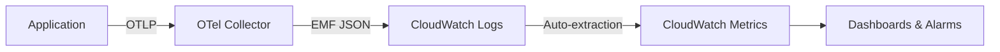

# How to Send OpenTelemetry Metrics to Amazon CloudWatch

Author: [nawazdhandala](https://www.github.com/nawazdhandala)

Tags: OpenTelemetry, Amazon CloudWatch, Metrics, AWS, Observability, EMF

Description: A hands-on guide to exporting OpenTelemetry metrics to Amazon CloudWatch using the EMF exporter in the OpenTelemetry Collector and direct SDK instrumentation.

---

Amazon CloudWatch is where most AWS teams go for metrics. It handles auto-scaling alarms, dashboards, and anomaly detection. If your infrastructure already depends on CloudWatch for operational alerts, it makes sense to route your OpenTelemetry metrics there too rather than introducing a separate metrics backend.

The trick is that CloudWatch does not natively speak OTLP. You need the CloudWatch EMF (Embedded Metric Format) exporter in the OpenTelemetry Collector to bridge the gap. This guide walks through the full setup, from collector configuration to SDK instrumentation to verifying data in CloudWatch.

## How the EMF Exporter Works

CloudWatch accepts metrics through several mechanisms. The EMF exporter takes an interesting approach: instead of calling the `PutMetricData` API directly, it writes structured JSON log entries in Embedded Metric Format to CloudWatch Logs. CloudWatch then automatically extracts the metrics from those log entries and makes them available as CloudWatch metrics.

Why this roundabout path? EMF supports high-cardinality dimensions better than `PutMetricData`, and it lets you correlate metrics with log context. You also avoid the `PutMetricData` rate limits, which can be a bottleneck for high-throughput applications.



## Step 1: Set Up the Collector

You need the contrib distribution of the collector, which includes the `awsemf` exporter. The core distribution does not include it.

```bash
# Pull the contrib collector that includes AWS exporters
docker pull otel/opentelemetry-collector-contrib:0.98.0
```

Here is the collector configuration for receiving OTLP metrics and exporting them to CloudWatch via EMF:

```yaml
# otel-collector-config.yaml
# Receives OpenTelemetry metrics and exports them to CloudWatch using EMF format
receivers:
  otlp:
    protocols:
      grpc:
        endpoint: 0.0.0.0:4317
      http:
        endpoint: 0.0.0.0:4318

processors:
  # Batch metrics to reduce the number of log writes
  batch:
    timeout: 60s
    send_batch_size: 500

  # Prevent out-of-memory crashes
  memory_limiter:
    check_interval: 5s
    limit_mib: 256

exporters:
  awsemf:
    # The CloudWatch namespace groups your custom metrics together
    namespace: MyApplication
    region: us-east-1
    # Log group where EMF entries will be written
    log_group_name: /aws/otel/metrics
    # Use the service name as the log stream to separate services
    log_stream_name: otel-metrics-{ServiceName}
    # Controls which resource attributes become CloudWatch dimensions
    dimension_rollup_option: NoDimensionRollup
    # Map OpenTelemetry metric attributes to CloudWatch dimensions
    metric_declarations:
      - dimensions:
          - [service.name, http.method, http.status_code]
          - [service.name]
        metric_name_selectors:
          - "http.server.request.duration"
          - "http.server.active_requests"
      - dimensions:
          - [service.name, db.system]
        metric_name_selectors:
          - "db.client.connections.*"

  # Debug exporter for development
  debug:
    verbosity: detailed

service:
  pipelines:
    metrics:
      receivers: [otlp]
      processors: [memory_limiter, batch]
      exporters: [awsemf, debug]
```

### Understanding metric_declarations

The `metric_declarations` section is important. CloudWatch charges per unique metric (combination of metric name and dimensions), so you want to control which attribute combinations become dimensions. Without explicit declarations, every attribute on every metric becomes a dimension, which can lead to a combinatorial explosion and a large CloudWatch bill.

Each declaration specifies:
- `dimensions`: Lists of attribute names that become CloudWatch dimensions. Each list is a separate dimension set.
- `metric_name_selectors`: Which metrics this declaration applies to. Supports wildcards.

## Step 2: Run the Collector

Start the collector with appropriate AWS credentials:

```bash
# Run the collector with an IAM instance profile or explicit credentials
# The EMF exporter writes to CloudWatch Logs, so it needs logs:* permissions
docker run -d \
  --name otel-collector \
  -p 4317:4317 \
  -p 4318:4318 \
  -e AWS_REGION=us-east-1 \
  -v $(pwd)/otel-collector-config.yaml:/etc/otelcol/config.yaml \
  otel/opentelemetry-collector-contrib:0.98.0 \
  --config /etc/otelcol/config.yaml
```

The IAM permissions needed for the EMF exporter:

```json
{
  "Version": "2012-10-17",
  "Statement": [
    {
      "Effect": "Allow",
      "Action": [
        "logs:PutLogEvents",
        "logs:CreateLogGroup",
        "logs:CreateLogStream",
        "logs:DescribeLogStreams",
        "logs:DescribeLogGroups",
        "cloudwatch:PutMetricData"
      ],
      "Resource": "*"
    }
  ]
}
```

## Step 3: Instrument Your Application

Now configure your application to send metrics to the collector. Here are examples for Python and Node.js.

### Python Metrics Instrumentation

```bash
# Install the OpenTelemetry metrics SDK and OTLP exporter
pip install opentelemetry-sdk opentelemetry-exporter-otlp-proto-grpc
```

```python
# metrics_setup.py
# Configures OpenTelemetry to send metrics to the collector every 30 seconds
from opentelemetry import metrics
from opentelemetry.sdk.metrics import MeterProvider
from opentelemetry.sdk.metrics.export import PeriodicExportingMetricReader
from opentelemetry.exporter.otlp.proto.grpc.metric_exporter import OTLPMetricExporter
from opentelemetry.sdk.resources import Resource

# Define the service resource so CloudWatch can group metrics by service
resource = Resource.create({
    "service.name": "order-service",
    "service.version": "1.2.0",
    "deployment.environment": "production"
})

# Create an OTLP exporter pointing at the collector
exporter = OTLPMetricExporter(endpoint="http://localhost:4317", insecure=True)

# The metric reader collects and exports metrics on a schedule
reader = PeriodicExportingMetricReader(exporter, export_interval_millis=30000)

# Set up the meter provider
provider = MeterProvider(resource=resource, metric_readers=[reader])
metrics.set_meter_provider(provider)
```

Use the meter to record metrics in your application:

```python
# app.py
# Records HTTP request metrics that will appear in CloudWatch
import time
from opentelemetry import metrics

meter = metrics.get_meter("order-service")

# Create a histogram for request duration
request_duration = meter.create_histogram(
    name="http.server.request.duration",
    description="Duration of HTTP requests in milliseconds",
    unit="ms"
)

# Create a counter for total requests
request_count = meter.create_counter(
    name="http.server.request.count",
    description="Total number of HTTP requests",
    unit="1"
)

# Create an up-down counter for active requests (gauge-like behavior)
active_requests = meter.create_up_down_counter(
    name="http.server.active_requests",
    description="Number of active HTTP requests",
    unit="1"
)

def handle_request(method, path, status_code):
    """Record metrics for an HTTP request."""
    # Common attributes that will become CloudWatch dimensions
    attrs = {
        "http.method": method,
        "http.route": path,
        "http.status_code": status_code
    }

    active_requests.add(1, attrs)
    start = time.time()

    try:
        # ... handle the request ...
        pass
    finally:
        duration_ms = (time.time() - start) * 1000
        request_duration.record(duration_ms, attrs)
        request_count.add(1, attrs)
        active_requests.add(-1, attrs)
```

### Node.js Metrics Instrumentation

```javascript
// metrics.js
// Sets up OpenTelemetry metrics with OTLP export for a Node.js application
const { MeterProvider, PeriodicExportingMetricReader } = require('@opentelemetry/sdk-metrics');
const { OTLPMetricExporter } = require('@opentelemetry/exporter-metrics-otlp-grpc');
const { Resource } = require('@opentelemetry/resources');

// Configure the resource to identify this service in CloudWatch
const resource = new Resource({
  'service.name': 'payment-service',
  'service.version': '2.0.1',
  'deployment.environment': 'production',
});

// Export metrics to the collector every 30 seconds
const exporter = new OTLPMetricExporter({
  url: 'http://localhost:4317',
});

const reader = new PeriodicExportingMetricReader({
  exporter,
  exportIntervalMillis: 30000,
});

const meterProvider = new MeterProvider({
  resource,
  readers: [reader],
});

const meter = meterProvider.getMeter('payment-service');

// Create metrics instruments
const paymentDuration = meter.createHistogram('payment.processing.duration', {
  description: 'Time to process a payment in milliseconds',
  unit: 'ms',
});

const paymentTotal = meter.createCounter('payment.processed.total', {
  description: 'Total number of payments processed',
  unit: '1',
});

// Record a payment processing event
function recordPayment(method, status, durationMs) {
  const attributes = {
    'payment.method': method,   // "credit_card", "bank_transfer", etc.
    'payment.status': status,   // "success", "failed", "pending"
  };
  paymentDuration.record(durationMs, attributes);
  paymentTotal.add(1, attributes);
}

module.exports = { recordPayment };
```

## Step 4: Verify Metrics in CloudWatch

After your application has been running for a few minutes and the collector has exported data, check CloudWatch.

```bash
# List custom metrics in your namespace to verify data is arriving
aws cloudwatch list-metrics \
  --namespace MyApplication \
  --region us-east-1

# Get recent metric data points for a specific metric
aws cloudwatch get-metric-data \
  --metric-data-queries '[{
    "Id": "req_duration",
    "MetricStat": {
      "Metric": {
        "Namespace": "MyApplication",
        "MetricName": "http.server.request.duration",
        "Dimensions": [
          {"Name": "service.name", "Value": "order-service"}
        ]
      },
      "Period": 60,
      "Stat": "Average"
    }
  }]' \
  --start-time "$(date -u -v-1H +%Y-%m-%dT%H:%M:%S)" \
  --end-time "$(date -u +%Y-%m-%dT%H:%M:%S)" \
  --region us-east-1
```

You can also check the EMF log entries directly in CloudWatch Logs:

```bash
# View the raw EMF log entries to debug metric export issues
aws logs filter-log-events \
  --log-group-name /aws/otel/metrics \
  --start-time $(date -d '10 minutes ago' +%s000) \
  --region us-east-1
```

## Creating CloudWatch Alarms from OTel Metrics

Once metrics are flowing, you can create alarms just like any other CloudWatch metric.

```bash
# Create an alarm that triggers when average request duration exceeds 500ms
# This works on metrics exported from OpenTelemetry through the EMF exporter
aws cloudwatch put-metric-alarm \
  --alarm-name "HighRequestDuration-OrderService" \
  --namespace MyApplication \
  --metric-name "http.server.request.duration" \
  --dimensions Name=service.name,Value=order-service \
  --statistic Average \
  --period 300 \
  --threshold 500 \
  --comparison-operator GreaterThanThreshold \
  --evaluation-periods 2 \
  --alarm-actions arn:aws:sns:us-east-1:123456789012:ops-alerts \
  --region us-east-1
```

## Cost Considerations

CloudWatch pricing for custom metrics is per metric per month. Each unique combination of metric name and dimension values counts as a separate metric. This is why the `metric_declarations` section in the collector config matters so much.

For example, if you have a request duration metric with dimensions `service.name`, `http.method`, and `http.status_code`, and you have 5 services, 4 HTTP methods, and 10 status codes, that is 5 x 4 x 10 = 200 custom metrics just for request duration. At around $0.30 per metric per month, that is $60/month for one metric name.

Keep your dimension cardinality low. Avoid putting request IDs, user IDs, or other high-cardinality values as metric attributes if those attributes will become CloudWatch dimensions.

## Wrapping Up

Sending OpenTelemetry metrics to CloudWatch works well once you understand the EMF exporter's behavior. The key decisions are choosing the right namespace, declaring your dimensions explicitly, and managing cardinality to control costs. The metrics show up in CloudWatch just like native metrics, so you can build dashboards, set alarms, and use anomaly detection without any limitations. If you are already on AWS and your team knows CloudWatch, this approach lets you adopt OpenTelemetry instrumentation without changing your monitoring workflow.
