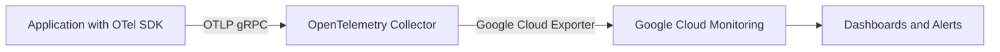

# How to Send OpenTelemetry Metrics to Google Cloud Monitoring

Author: [nawazdhandala](https://www.github.com/nawazdhandala)

Tags: OpenTelemetry, Google Cloud, Cloud Monitoring, Metrics, Observability

Description: Learn how to export OpenTelemetry metrics to Google Cloud Monitoring using the OTLP exporter and the OpenTelemetry Collector.

---

Google Cloud Monitoring (formerly Stackdriver) is the native monitoring service for workloads running on Google Cloud Platform. If you have already instrumented your applications with OpenTelemetry, you can forward those metrics directly into Cloud Monitoring without rewriting any instrumentation code. This gives you the best of both worlds: vendor-neutral instrumentation in your codebase and the powerful dashboarding and alerting capabilities built into GCP.

In this guide we will walk through two approaches. The first uses the OpenTelemetry Collector with the Google Cloud exporter. The second sends metrics directly from your application using the Google Cloud Monitoring exporter SDK. Both paths are production-ready, and the right choice depends on how much control you want over the pipeline.

## Architecture Overview

The diagram below shows how metrics flow from your application through the OpenTelemetry Collector and into Google Cloud Monitoring.



The Collector acts as a buffer and processing layer between your app and Google Cloud. It handles batching, retry logic, and metadata enrichment so your application does not need to worry about any of that.

## Prerequisites

Before you start, make sure you have the following in place:

- A Google Cloud project with the Cloud Monitoring API enabled.
- A service account with the `roles/monitoring.metricWriter` role.
- The OpenTelemetry Collector binary or Docker image (v0.90.0 or later recommended).
- Your application instrumented with the OpenTelemetry SDK for your language.

## Approach 1: Using the OpenTelemetry Collector

This is the recommended approach for production. Your application exports metrics over OTLP to the Collector, and the Collector forwards them to Google Cloud Monitoring.

### Step 1: Install the Collector

If you are running on a GCE instance or GKE cluster, the easiest method is to deploy the Collector as a sidecar or DaemonSet. For local testing, you can download the `otelcol-contrib` binary which includes the Google Cloud exporter.

```bash
# Download the contrib distribution which includes the googlecloud exporter
curl -LO https://github.com/open-telemetry/opentelemetry-collector-releases/releases/download/v0.96.0/otelcol-contrib_0.96.0_linux_amd64.tar.gz

# Extract the binary
tar -xzf otelcol-contrib_0.96.0_linux_amd64.tar.gz
```

### Step 2: Configure the Collector

Create a configuration file that receives OTLP metrics and exports them to Google Cloud Monitoring. The `googlecloud` exporter needs your GCP project ID. If you are running on GCE or GKE, it can auto-detect the project from instance metadata.

```yaml
# otel-collector-config.yaml
receivers:
  otlp:
    protocols:
      grpc:
        # Listen on the standard OTLP gRPC port
        endpoint: 0.0.0.0:4317
      http:
        # Also accept OTLP over HTTP
        endpoint: 0.0.0.0:4318

processors:
  batch:
    # Batch metrics before exporting to reduce API calls
    send_batch_size: 200
    timeout: 5s

  resourcedetection:
    # Automatically detect GCP resource metadata
    detectors: [gcp]
    timeout: 5s

exporters:
  googlecloud:
    # Specify your GCP project ID
    project: your-gcp-project-id
    metric:
      # Use the service name as a prefix for custom metrics
      prefix: custom.googleapis.com/opentelemetry

service:
  pipelines:
    metrics:
      receivers: [otlp]
      processors: [resourcedetection, batch]
      exporters: [googlecloud]
```

### Step 3: Run the Collector

Start the Collector with your configuration file. Make sure your service account credentials are available to the process.

```bash
# Set the path to your service account key file
export GOOGLE_APPLICATION_CREDENTIALS="/path/to/service-account-key.json"

# Start the collector with the config
./otelcol-contrib --config otel-collector-config.yaml
```

### Step 4: Configure Your Application

Point your application's OTLP exporter to the Collector's address. Here is an example in Python.

```python
from opentelemetry import metrics
from opentelemetry.sdk.metrics import MeterProvider
from opentelemetry.sdk.metrics.export import PeriodicExportingMetricReader
from opentelemetry.exporter.otlp.proto.grpc.metric_exporter import OTLPMetricExporter

# Create an OTLP exporter that sends metrics to the Collector
exporter = OTLPMetricExporter(
    endpoint="localhost:4317",  # Collector's gRPC endpoint
    insecure=True               # Use insecure for local dev; TLS in production
)

# Set up periodic export every 30 seconds
reader = PeriodicExportingMetricReader(exporter, export_interval_millis=30000)

# Register the meter provider globally
provider = MeterProvider(metric_readers=[reader])
metrics.set_meter_provider(provider)

# Create a meter and record some metrics
meter = metrics.get_meter("my-service")
request_counter = meter.create_counter(
    name="http.requests",
    description="Total number of HTTP requests",
    unit="1"
)

# Increment the counter whenever a request is handled
request_counter.add(1, {"http.method": "GET", "http.route": "/api/users"})
```

## Approach 2: Direct Export from the Application

If you prefer not to run a Collector, you can export metrics directly from your application to Google Cloud Monitoring. The `opentelemetry-exporter-gcp-monitoring` package handles the conversion from OpenTelemetry metric types to the Cloud Monitoring API format.

Install the required packages first.

```bash
# Install the GCP monitoring exporter and OpenTelemetry SDK
pip install opentelemetry-sdk opentelemetry-exporter-gcp-monitoring
```

Then configure the exporter in your application code.

```python
from opentelemetry import metrics
from opentelemetry.sdk.metrics import MeterProvider
from opentelemetry.sdk.metrics.export import PeriodicExportingMetricReader
from opentelemetry.exporter.cloud_monitoring import CloudMonitoringMetricsExporter

# Create the GCP Cloud Monitoring exporter
# It will auto-detect the project from GOOGLE_CLOUD_PROJECT or metadata server
exporter = CloudMonitoringMetricsExporter(project_id="your-gcp-project-id")

# Export metrics every 60 seconds (Cloud Monitoring has a minimum 10s interval)
reader = PeriodicExportingMetricReader(exporter, export_interval_millis=60000)

# Set up the meter provider with the reader
provider = MeterProvider(metric_readers=[reader])
metrics.set_meter_provider(provider)

# Now create and use meters as usual
meter = metrics.get_meter("payment-service")

# Create a histogram to track request latency
latency_histogram = meter.create_histogram(
    name="http.request.duration",
    description="Duration of HTTP requests in milliseconds",
    unit="ms"
)

# Record a latency measurement
latency_histogram.record(42.5, {"http.method": "POST", "http.route": "/api/checkout"})
```

## Metric Type Mapping

OpenTelemetry metric types map to Google Cloud Monitoring types as follows:

| OpenTelemetry Type | Cloud Monitoring Type |
|---|---|
| Counter | CUMULATIVE / INT64 or DOUBLE |
| UpDownCounter | GAUGE / INT64 or DOUBLE |
| Histogram | DISTRIBUTION |
| Observable Counter | CUMULATIVE |
| Observable Gauge | GAUGE |

Understanding this mapping matters because Cloud Monitoring treats cumulative and gauge metrics differently in queries and dashboards. Counters become cumulative time series, which means Cloud Monitoring tracks their rate of change automatically.

## Resource Detection

When running on GCP infrastructure, the `resourcedetection` processor in the Collector can automatically populate resource attributes like `cloud.provider`, `cloud.region`, `host.id`, and `cloud.availability_zone`. This metadata shows up in Cloud Monitoring as monitored resource labels, making it much easier to filter and group metrics by instance, zone, or service.

If you are running outside of GCP, you should set resource attributes manually.

```yaml
processors:
  resource:
    attributes:
      # Manually set resource attributes for non-GCP environments
      - key: cloud.provider
        value: gcp
        action: upsert
      - key: service.name
        value: my-application
        action: upsert
```

## Viewing Metrics in Cloud Monitoring

Once metrics start flowing, head to the Google Cloud Console and open Monitoring. Navigate to Metrics Explorer and search for your custom metric name. Custom metrics created through OpenTelemetry appear under the `custom.googleapis.com/opentelemetry` prefix (or whatever prefix you configured in the exporter).

You can build dashboards, set up alerting policies, and create SLOs using these metrics just like any other Cloud Monitoring metric.

## Common Pitfalls

There are a few things that trip people up when setting up this pipeline.

First, Cloud Monitoring enforces a minimum write interval of 10 seconds per time series. If you push data more frequently, the API will reject the extra points. Set your export interval to at least 10 seconds, and preferably 30 or 60 seconds.

Second, metric descriptor limits can be a problem. Each GCP project has a limit of 10,000 custom metric descriptors. If your OpenTelemetry instrumentation creates metrics with high-cardinality attributes (like user IDs in labels), you can quickly hit that limit. Keep attribute cardinality low for metrics. Use traces for high-cardinality data instead.

Third, authentication errors are the most common issue during setup. Double-check that your service account has `roles/monitoring.metricWriter` and that the key file is accessible to the Collector process.

## Summary

Sending OpenTelemetry metrics to Google Cloud Monitoring is straightforward once you understand the two main approaches. The Collector-based approach gives you a centralized processing layer with batching, retry, and resource detection built in. The direct export approach keeps things simple when you just need to get metrics flowing quickly. Either way, you keep your application code vendor-neutral through OpenTelemetry while taking full advantage of GCP's monitoring infrastructure.
