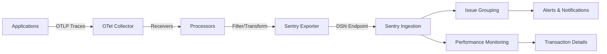

# How to Configure the Sentry Exporter in the OpenTelemetry Collector

Author: [nawazdhandala](https://www.github.com/nawazdhandala)

Tags: OpenTelemetry, Collector, Exporters, Sentry, Error Tracking, Performance Monitoring, Observability

Description: Comprehensive guide to configuring the Sentry exporter in OpenTelemetry Collector for error tracking, performance monitoring, and application health insights.

Sentry is a leading error tracking and performance monitoring platform that helps developers identify, diagnose, and resolve issues in production applications. The OpenTelemetry Collector's Sentry exporter enables you to send traces and error events to Sentry, combining OpenTelemetry's vendor-neutral instrumentation with Sentry's powerful debugging and workflow features. This integration is particularly valuable for teams who want to maintain OpenTelemetry standards while leveraging Sentry's developer-friendly interface and issue management capabilities.

## Understanding Sentry Integration

Sentry organizes data around projects, which represent individual applications or services. Each project has a unique Data Source Name (DSN) that serves as both an endpoint URL and authentication credential. The Sentry exporter converts OpenTelemetry spans into Sentry transactions and error events, mapping trace attributes to Sentry's data model for optimal display in the Sentry UI.

Unlike traditional logging platforms, Sentry focuses on exceptions, errors, and performance issues. It groups similar errors together, tracks error frequency and impact, identifies regression patterns, and provides release-based tracking to see when issues were introduced. The platform also offers breadcrumbs (contextual events leading up to errors), stack traces with source code context, and integration with issue trackers like Jira and GitHub.

## Architecture and Data Flow

Here's how telemetry flows from applications through the OpenTelemetry Collector to Sentry:



## Basic Configuration

Here's a minimal configuration to send traces to Sentry. This example focuses on error tracking and performance monitoring.

```yaml
# Receivers for collecting telemetry data
receivers:
  otlp:
    protocols:
      grpc:
        endpoint: 0.0.0.0:4317
      http:
        endpoint: 0.0.0.0:4318

# Sentry exporter configuration
exporters:
  sentry:
    # Sentry DSN (contains project ID and authentication)
    dsn: "${SENTRY_DSN}"

    # Environment name (appears in Sentry UI)
    environment: "production"

    # Timeout for API requests
    timeout: 30s

# Processors for data handling
processors:
  batch:
    timeout: 10s
    send_batch_size: 1024

# Pipeline configuration
service:
  pipelines:
    traces:
      receivers: [otlp]
      processors: [batch]
      exporters: [sentry]
```

This basic configuration sends all traces to Sentry. You can obtain your DSN from the Sentry project settings page. The DSN format is: `https://<key>@<organization>.ingest.sentry.io/<project_id>`

## Production Configuration with Error Filtering

In production, you'll want to filter traces to send only errors and slow operations to Sentry, reducing noise and costs.

```yaml
receivers:
  otlp:
    protocols:
      grpc:
        endpoint: 0.0.0.0:4317
        max_recv_msg_size_mib: 32
      http:
        endpoint: 0.0.0.0:4318

exporters:
  sentry:
    # Sentry DSN from environment variable
    dsn: "${SENTRY_DSN}"

    # Environment for filtering in Sentry UI
    environment: "production"

    # Release version for tracking regressions
    release: "${APP_VERSION}"

    # Timeout configuration
    timeout: 30s

    # Retry configuration
    retry_on_failure:
      enabled: true
      initial_interval: 5s
      max_interval: 30s
      max_elapsed_time: 300s

    # Queue settings for handling backpressure
    sending_queue:
      enabled: true
      num_consumers: 10
      queue_size: 5000

processors:
  # Memory limiter to prevent OOM
  memory_limiter:
    check_interval: 1s
    limit_mib: 512
    spike_limit_mib: 128

  # Filter to send only errors and slow traces
  filter/errors_and_slow:
    error_mode: ignore
    traces:
      span:
        # Keep spans with errors
        - 'status.code == STATUS_CODE_ERROR'
        # Keep slow spans (over 1 second)
        - 'duration_ms > 1000'
        # Keep specific operations
        - 'attributes["http.target"] == "/api/payment"'

  # Add resource attributes
  resource:
    attributes:
      - key: deployment.environment
        value: production
        action: upsert
      - key: service.version
        value: ${APP_VERSION}
        action: upsert

  # Enrich with user context
  attributes:
    actions:
      # Map user ID for Sentry
      - key: user.id
        from_attribute: enduser.id
        action: upsert
      - key: user.email
        from_attribute: enduser.email
        action: upsert
      - key: user.username
        from_attribute: enduser.username
        action: upsert

      # Remove sensitive data
      - key: http.request.header.authorization
        action: delete
      - key: http.request.header.cookie
        action: delete

  # Batch for performance
  batch:
    timeout: 10s
    send_batch_size: 2048
    send_batch_max_size: 4096

service:
  telemetry:
    logs:
      level: info
      encoding: json
    metrics:
      level: detailed
      address: 0.0.0.0:8888

  pipelines:
    traces:
      receivers: [otlp]
      processors: [memory_limiter, resource, attributes, filter/errors_and_slow, batch]
      exporters: [sentry]
```

This production configuration includes several important features:

**Error Filtering**: Only sends spans with errors or high latency to Sentry, reducing noise and focusing on actionable issues.

**User Context**: Maps user identifiers to Sentry's user model, enabling you to see which users are affected by issues.

**Release Tracking**: Associates errors with specific releases, making it easy to identify when regressions were introduced.

**Security**: Removes sensitive headers and data before sending to Sentry.

**Backpressure Handling**: Queues traces when Sentry is temporarily unavailable, preventing data loss.

## Multi-Project Configuration

Large organizations often have multiple Sentry projects for different services or teams. Here's how to route traces to appropriate projects.

```yaml
exporters:
  # Frontend service project
  sentry/frontend:
    dsn: "${SENTRY_DSN_FRONTEND}"
    environment: "production"
    release: "${FRONTEND_VERSION}"

  # Backend API project
  sentry/backend:
    dsn: "${SENTRY_DSN_BACKEND}"
    environment: "production"
    release: "${BACKEND_VERSION}"

  # Mobile app project
  sentry/mobile:
    dsn: "${SENTRY_DSN_MOBILE}"
    environment: "production"
    release: "${MOBILE_VERSION}"

  # Infrastructure project
  sentry/infrastructure:
    dsn: "${SENTRY_DSN_INFRA}"
    environment: "production"
    release: "${INFRA_VERSION}"

processors:
  # Route to appropriate project based on service name
  routing:
    from_attribute: service.name
    default_exporters: [sentry/backend]
    table:
      - value: frontend
        exporters: [sentry/frontend]
      - value: api-gateway
        exporters: [sentry/backend]
      - value: payment-service
        exporters: [sentry/backend]
      - value: mobile-app
        exporters: [sentry/mobile]
      - value: kubernetes-monitor
        exporters: [sentry/infrastructure]

  # Filter errors only
  filter/errors:
    traces:
      span:
        - 'status.code == STATUS_CODE_ERROR'

  batch:
    timeout: 10s
    send_batch_size: 1024

service:
  pipelines:
    traces:
      receivers: [otlp]
      processors: [filter/errors, routing, batch]
      exporters:
        - sentry/frontend
        - sentry/backend
        - sentry/mobile
        - sentry/infrastructure
```

The routing processor directs traces to the correct Sentry project based on service name, ensuring issues are organized properly in the Sentry UI.

## Enhanced Error Context

Sentry works best when errors have rich context. Here's how to enrich spans with additional debugging information.

```yaml
processors:
  # Add breadcrumbs for error context
  attributes/breadcrumbs:
    actions:
      # Add request details
      - key: http.method
        from_attribute: http.request.method
        action: upsert
      - key: http.url
        from_attribute: url.full
        action: upsert
      - key: http.status_code
        from_attribute: http.response.status_code
        action: upsert

      # Add database query context
      - key: db.statement
        from_attribute: db.statement
        action: upsert
      - key: db.system
        from_attribute: db.system
        action: upsert
      - key: db.name
        from_attribute: db.name
        action: upsert

      # Add message queue context
      - key: messaging.operation
        from_attribute: messaging.operation
        action: upsert
      - key: messaging.destination
        from_attribute: messaging.destination.name
        action: upsert

  # Add tags for filtering in Sentry
  attributes/tags:
    actions:
      - key: server.region
        value: us-east-1
        action: insert
      - key: server.instance
        from_attribute: host.name
        action: upsert
      - key: deployment.environment
        value: production
        action: insert

  # Transform exception information
  transform:
    trace_statements:
      - context: span
        statements:
          # Extract exception type
          - set(attributes["exception.type"], attributes["exception.type"]) where attributes["exception.type"] != nil

          # Extract exception message
          - set(attributes["exception.message"], attributes["exception.message"]) where attributes["exception.message"] != nil

          # Extract stack trace
          - set(attributes["exception.stacktrace"], attributes["exception.stacktrace"]) where attributes["exception.stacktrace"] != nil

exporters:
  sentry:
    dsn: "${SENTRY_DSN}"
    environment: "production"
    release: "${APP_VERSION}"

service:
  pipelines:
    traces:
      receivers: [otlp]
      processors: [attributes/breadcrumbs, attributes/tags, transform, batch]
      exporters: [sentry]
```

This configuration enriches errors with context about HTTP requests, database queries, message queue operations, and infrastructure details, making debugging significantly easier.

## Sampling for Cost Control

Sentry pricing is based on transaction volume. Implement sampling to control costs while maintaining visibility into critical issues.

```yaml
processors:
  # Tail sampling with intelligent policies
  tail_sampling:
    decision_wait: 10s
    num_traces: 100
    expected_new_traces_per_sec: 50
    policies:
      # Always sample errors (100%)
      - name: errors
        type: status_code
        status_code:
          status_codes: [ERROR]

      # Always sample very slow operations (over 5 seconds)
      - name: very-slow
        type: latency
        latency:
          threshold_ms: 5000

      # Sample slow operations (1-5 seconds) at 50%
      - name: slow
        type: composite
        composite:
          max_total_spans_per_second: 100
          policy_order: [slow-filter, slow-sample]
          composite_sub_policy:
            - name: slow-filter
              type: latency
              latency:
                threshold_ms: 1000
            - name: slow-sample
              type: probabilistic
              probabilistic:
                sampling_percentage: 50.0

      # Sample critical endpoints at 100%
      - name: critical-endpoints
        type: string_attribute
        string_attribute:
          key: http.target
          values:
            - /api/payment
            - /api/checkout
            - /api/login
          enabled_regex_matching: true

      # Sample by user (catch issues affecting specific users)
      - name: debug-users
        type: string_attribute
        string_attribute:
          key: user.id
          values:
            - debug-user-1
            - debug-user-2

      # Default probabilistic sampling (1%)
      - name: default
        type: probabilistic
        probabilistic:
          sampling_percentage: 1.0

exporters:
  sentry:
    dsn: "${SENTRY_DSN}"
    environment: "production"

service:
  pipelines:
    traces:
      receivers: [otlp]
      processors: [tail_sampling, batch]
      exporters: [sentry]
```

This sampling strategy ensures you capture all errors and critical operations while reducing volume for routine successful requests.

## Performance Monitoring Configuration

Sentry's performance monitoring requires specific span attributes. Here's how to optimize for performance insights.

```yaml
processors:
  # Enrich spans for Sentry performance monitoring
  attributes/performance:
    actions:
      # Transaction name (appears as operation in Sentry)
      - key: transaction
        from_attribute: http.route
        action: upsert

      # Operation type
      - key: op
        value: http.server
        action: insert

      # Add performance-related tags
      - key: http.method
        from_attribute: http.request.method
        action: upsert

      - key: http.status_code
        from_attribute: http.response.status_code
        action: upsert

      - key: browser.name
        from_attribute: browser.name
        action: upsert

      # Add user satisfaction metrics
      - key: user_satisfaction
        value: satisfactory
        action: insert

  # Calculate derived metrics
  transform:
    trace_statements:
      - context: span
        statements:
          # Mark slow transactions
          - set(attributes["performance.slow"], true) where duration_ms > 1000

          # Categorize by latency
          - set(attributes["latency.bucket"], "fast") where duration_ms < 100
          - set(attributes["latency.bucket"], "medium") where duration_ms >= 100 and duration_ms < 500
          - set(attributes["latency.bucket"], "slow") where duration_ms >= 500

exporters:
  sentry:
    dsn: "${SENTRY_DSN}"
    environment: "production"
    release: "${APP_VERSION}"

service:
  pipelines:
    traces:
      receivers: [otlp]
      processors: [attributes/performance, transform, batch]
      exporters: [sentry]
```

This configuration ensures spans are properly formatted for Sentry's performance monitoring features, including transaction names, operations, and latency categorization.

## Kubernetes Integration

Deploy the collector in Kubernetes to automatically enrich traces with cluster metadata.

```yaml
exporters:
  sentry:
    dsn: "${SENTRY_DSN}"
    environment: "production"
    release: "${APP_VERSION}"

processors:
  # Add Kubernetes metadata
  k8sattributes:
    auth_type: serviceAccount
    passthrough: false
    extract:
      metadata:
        - k8s.namespace.name
        - k8s.deployment.name
        - k8s.pod.name
        - k8s.pod.uid
        - k8s.node.name
        - k8s.cluster.name
      labels:
        - tag_name: app
          key: app
          from: pod
        - tag_name: version
          key: version
          from: pod
      annotations:
        - tag_name: team
          key: team
          from: namespace

  # Map K8s attributes to Sentry tags
  attributes/k8s:
    actions:
      - key: k8s.namespace
        from_attribute: k8s.namespace.name
        action: upsert
      - key: k8s.deployment
        from_attribute: k8s.deployment.name
        action: upsert
      - key: k8s.pod
        from_attribute: k8s.pod.name
        action: upsert
      - key: k8s.cluster
        from_attribute: k8s.cluster.name
        action: upsert

  # Filter errors only
  filter/errors:
    traces:
      span:
        - 'status.code == STATUS_CODE_ERROR'

  batch:
    timeout: 10s
    send_batch_size: 1024

service:
  pipelines:
    traces:
      receivers: [otlp]
      processors: [k8sattributes, attributes/k8s, filter/errors, batch]
      exporters: [sentry]
```

This configuration enriches errors with Kubernetes context, making it easier to identify which pods, deployments, and clusters are experiencing issues.

## Release Health Tracking

Track release adoption and health by correlating errors with specific versions.

```yaml
exporters:
  sentry:
    dsn: "${SENTRY_DSN}"
    environment: "production"

    # Release from environment variable (set in deployment)
    release: "${APP_VERSION}"

    # Enable release health tracking
    enable_release_health: true

processors:
  # Add release metadata
  resource:
    attributes:
      - key: service.version
        value: ${APP_VERSION}
        action: upsert

      # Git commit SHA for source code mapping
      - key: git.commit.sha
        value: ${GIT_COMMIT}
        action: upsert

  # Track release metrics
  attributes/release:
    actions:
      - key: release
        value: ${APP_VERSION}
        action: upsert

      # Track session information
      - key: session.id
        from_attribute: session.id
        action: upsert

      - key: session.status
        value: ok
        action: insert

  batch:
    timeout: 10s
    send_batch_size: 1024

service:
  pipelines:
    traces:
      receivers: [otlp]
      processors: [resource, attributes/release, batch]
      exporters: [sentry]
```

Sentry uses release information to track crash-free sessions, identify regressions, and show which releases have the most errors.

## Alert Integration

Configure processors to add alert context for integration with Sentry's alerting system.

```yaml
processors:
  # Add alert metadata
  attributes/alerts:
    actions:
      # Fingerprint for issue grouping
      - key: fingerprint
        value: "{{ service.name }}-{{ exception.type }}"
        action: insert

      # Alert severity
      - key: level
        value: error
        action: insert

      # Custom grouping fields
      - key: error.type
        from_attribute: exception.type
        action: upsert

      - key: error.value
        from_attribute: exception.message
        action: upsert

  # Calculate error frequency
  transform:
    trace_statements:
      - context: span
        statements:
          # Add timestamp for time-based grouping
          - set(attributes["error.timestamp"], Now())

          # Mark critical errors
          - set(attributes["critical"], true) where attributes["exception.type"] == "OutOfMemoryError"
          - set(attributes["critical"], true) where attributes["http.status_code"] == "500"

exporters:
  sentry:
    dsn: "${SENTRY_DSN}"
    environment: "production"

service:
  pipelines:
    traces:
      receivers: [otlp]
      processors: [attributes/alerts, transform, batch]
      exporters: [sentry]
```

This configuration helps Sentry group similar errors together and prioritize critical issues.

## High Availability Setup

Configure the collector for reliability with persistent queues.

```yaml
exporters:
  sentry:
    dsn: "${SENTRY_DSN}"
    environment: "production"
    timeout: 30s

    retry_on_failure:
      enabled: true
      initial_interval: 5s
      max_interval: 30s
      max_elapsed_time: 300s

    # Enable persistent queue
    sending_queue:
      enabled: true
      num_consumers: 20
      queue_size: 10000
      persistent_storage: file_storage

# File storage extension for persistent queue
extensions:
  file_storage:
    directory: /var/lib/otel/storage
    timeout: 10s
    compaction:
      directory: /var/lib/otel/storage
      on_start: true

  health_check:
    endpoint: 0.0.0.0:13133

processors:
  batch:
    timeout: 10s
    send_batch_size: 2048

service:
  extensions: [file_storage, health_check]
  pipelines:
    traces:
      receivers: [otlp]
      processors: [batch]
      exporters: [sentry]
```

The persistent queue ensures errors aren't lost during collector restarts or Sentry outages.

## Performance Optimization

Optimize for high-throughput scenarios while managing Sentry quota.

```yaml
exporters:
  sentry:
    dsn: "${SENTRY_DSN}"
    environment: "production"

    # Aggressive timeout
    timeout: 15s

    # Large queue
    sending_queue:
      enabled: true
      num_consumers: 30
      queue_size: 20000

processors:
  # Aggressive sampling to stay within quota
  probabilistic_sampler:
    sampling_percentage: 10.0

  # Large batches
  batch:
    timeout: 5s
    send_batch_size: 4096
    send_batch_max_size: 8192

  # Memory protection
  memory_limiter:
    check_interval: 1s
    limit_mib: 2048
    spike_limit_mib: 512

service:
  pipelines:
    traces:
      receivers: [otlp]
      processors: [memory_limiter, probabilistic_sampler, batch]
      exporters: [sentry]
```

These settings balance throughput with Sentry's rate limits and quota constraints.

## Monitoring and Troubleshooting

Enable telemetry to monitor the exporter's health.

```yaml
service:
  telemetry:
    logs:
      level: info
      encoding: json
      output_paths: [stdout, /var/log/otel-collector.log]

    metrics:
      level: detailed
      address: 0.0.0.0:8888
```

Key metrics to monitor:

- `otelcol_exporter_sent_spans`: Spans successfully sent to Sentry
- `otelcol_exporter_send_failed_spans`: Failed span exports
- `otelcol_exporter_queue_size`: Current queue size

Common issues:

**429 Rate Limited**: Reduce sampling rate or upgrade Sentry plan. Check quota usage in Sentry dashboard.

**Invalid DSN**: Verify DSN format and project exists. Ensure environment variable is set correctly.

**Missing Errors**: Check filter processors aren't excluding errors. Verify error status codes are set correctly in spans.

**Poor Performance**: Reduce batch size or increase timeout. Check network latency to Sentry ingestion endpoints.

**Quota Exceeded**: Implement more aggressive sampling. Focus on errors and critical operations only.

## Related Resources

For more information on OpenTelemetry exporters, check out these related posts:

- [How to Configure the Honeycomb Marker Exporter in the OpenTelemetry Collector](https://oneuptime.com/blog/post/2026-02-06-honeycomb-marker-exporter-opentelemetry-collector/view)
- [How to Configure the Zipkin Exporter in the OpenTelemetry Collector](https://oneuptime.com/blog/post/2026-02-06-zipkin-exporter-opentelemetry-collector/view)

The Sentry exporter provides a powerful integration between OpenTelemetry and Sentry's error tracking and performance monitoring capabilities. With proper configuration and sampling, it enables teams to maintain OpenTelemetry standards while leveraging Sentry's developer-friendly debugging tools and workflow features.
