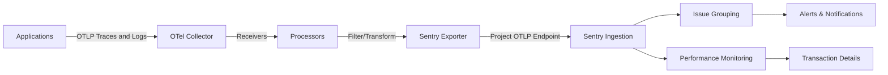

# How to Configure the Sentry Exporter in the OpenTelemetry Collector

Author: [nawazdhandala](https://www.github.com/nawazdhandala)

Tags: OpenTelemetry, Collector, Exporter, Sentry, Error Tracking, Performance Monitoring, Observability

Description: Comprehensive guide to configuring the Sentry exporter in OpenTelemetry Collector for error tracking, performance monitoring, and application health insights.

Sentry is a leading error tracking and performance monitoring platform that helps developers identify, diagnose, and resolve issues in production applications. The OpenTelemetry Collector's Sentry exporter enables you to send traces and logs to Sentry, combining OpenTelemetry's vendor-neutral instrumentation with Sentry's powerful debugging and workflow features. This integration is particularly valuable for teams who want to maintain OpenTelemetry standards while leveraging Sentry's developer-friendly interface and issue management capabilities.

## Understanding Sentry Integration

Sentry organizes data around projects, which represent individual applications or services. The OpenTelemetry Collector's Sentry exporter uses the Sentry organization URL, organization slug, and an auth token to discover each project's OTLP ingestion endpoint. The exporter groups telemetry by project, using a resource attribute such as `service.name` by default, and sends each group to the matching Sentry project.

Unlike traditional logging platforms, Sentry focuses on exceptions, errors, and performance issues. It groups similar errors together, tracks error frequency and impact, identifies regression patterns, and provides release-based tracking to see when issues were introduced. The platform also offers breadcrumbs (contextual events leading up to errors), stack traces with source code context, and integration with issue trackers like Jira and GitHub.

## Architecture and Data Flow

Here's how telemetry flows from applications through the OpenTelemetry Collector to Sentry:


```mermaid
graph LR
    A[Applications] -->|OTLP Traces and Logs| B[OTel Collector]
    B -->|Receivers| C[Processors]
    C -->|Filter/Transform| D[Sentry Exporter]
    D -->|Project OTLP Endpoint| E[Sentry Ingestion]
    E --> F[Issue Grouping]
    F --> G[Alerts & Notifications]
    E --> H[Performance Monitoring]
    H --> I[Transaction Details]
```

## Basic Configuration

Here's a minimal configuration to send traces to Sentry. This example focuses on error tracking and performance monitoring.

```yaml
# Receivers for collecting telemetry data

receivers:
  otlp:
    protocols:
      grpc:
        endpoint: 0.0.0.0:4317
      http:
        endpoint: 0.0.0.0:4318

# Sentry exporter configuration
exporters:
  sentry:
    # Base URL for Sentry SaaS or your self-hosted Sentry instance
    url: https://sentry.io

    # Organization slug in Sentry
    org_slug: "${SENTRY_ORG_SLUG}"

    # Sentry auth token with org:read and project:read scopes
    auth_token: "${SENTRY_AUTH_TOKEN}"

    # Timeout for export requests
    timeout: 30s

# Processors for data handling
processors:
  batch:
    timeout: 10s
    send_batch_size: 1024

# Pipeline configuration
service:
  pipelines:
    traces:
      receivers: [otlp]
      processors: [batch]
      exporters: [sentry]
```

This basic configuration sends traces to Sentry projects based on the `service.name` resource attribute. The project slug in Sentry must match the value of `service.name`, unless you configure an explicit mapping. The auth token is separate from a Sentry DSN and must have access to read the organization and projects.

## Production Configuration with Error Filtering

In production, you'll want to filter traces to send only errors and slow operations to Sentry, reducing noise and costs.

```yaml
receivers:
  otlp:
    protocols:
      grpc:
        endpoint: 0.0.0.0:4317
        max_recv_msg_size_mib: 32
      http:
        endpoint: 0.0.0.0:4318

exporters:
  sentry:
    # Sentry organization configuration
    url: https://sentry.io
    org_slug: "${SENTRY_ORG_SLUG}"
    auth_token: "${SENTRY_AUTH_TOKEN}"

    # Timeout configuration
    timeout: 30s

    # Queue settings for handling backpressure
    sending_queue:
      enabled: true
      num_consumers: 10
      queue_size: 5000

processors:
  # Memory limiter to prevent OOM
  memory_limiter:
    check_interval: 1s
    limit_mib: 512
    spike_limit_mib: 128

  # Drop spans that are not errors, are not slow, and are not critical operations
  filter/errors_and_slow:
    error_mode: ignore
    trace_conditions:
      - 'span.status.code != STATUS_CODE_ERROR and (span.end_time - span.start_time) <= Duration("1s") and span.attributes["http.route"] != "/api/payment"'

  # Add resource attributes
  resource:
    attributes:
      - key: deployment.environment.name
        value: production
        action: upsert
      - key: service.version
        value: ${APP_VERSION}
        action: upsert

  # Enrich with user context
  attributes:
    actions:
      # Map user ID for Sentry
      - key: user.id
        from_attribute: enduser.id
        action: upsert
      - key: user.email
        from_attribute: enduser.email
        action: upsert
      - key: user.username
        from_attribute: enduser.username
        action: upsert

      # Remove sensitive data
      - key: http.request.header.authorization
        action: delete
      - key: http.request.header.cookie
        action: delete

  # Batch for performance
  batch:
    timeout: 10s
    send_batch_size: 2048
    send_batch_max_size: 4096

service:
  telemetry:
    logs:
      level: info
      encoding: json
    metrics:
      level: detailed
      address: 0.0.0.0:8888

  pipelines:
    traces:
      receivers: [otlp]
      processors: [memory_limiter, resource, attributes, filter/errors_and_slow, batch]
      exporters: [sentry]
```

This production configuration includes several important features:

**Error Filtering**: Drops routine spans while preserving error spans, slow spans, and selected critical operations, reducing noise and focusing on actionable issues.

**User Context**: Maps user identifiers to attributes that can be used as Sentry context, enabling you to see which users are affected by issues.

**Release Tracking**: Associates telemetry with `service.version`, making it easier to correlate errors with application versions.

**Security**: Removes sensitive headers and data before sending to Sentry.

**Backpressure Handling**: Queues telemetry when Sentry is temporarily unavailable, reducing data loss during short outages.

## Multi-Project Configuration

Large organizations often have multiple Sentry projects for different services or teams. Here's how to route traces to appropriate projects.

```yaml
exporters:
  sentry:
    url: https://sentry.io
    org_slug: "${SENTRY_ORG_SLUG}"
    auth_token: "${SENTRY_AUTH_TOKEN}"
    routing:
      project_from_attribute: service.name
      attribute_to_project_mapping:
        frontend: frontend
        api-gateway: backend-api
        payment-service: backend-api
        mobile-app: mobile-app
        kubernetes-monitor: infrastructure

processors:
  # Drop non-error spans
  filter/errors:
    error_mode: ignore
    trace_conditions:
      - 'span.status.code != STATUS_CODE_ERROR'

  batch:
    timeout: 10s
    send_batch_size: 1024

service:
  pipelines:
    traces:
      receivers: [otlp]
      processors: [filter/errors, batch]
      exporters: [sentry]
```

The Sentry exporter directs traces to the correct Sentry project based on the configured resource attribute, ensuring issues are organized properly in the Sentry UI.

## Enhanced Error Context

Sentry works best when errors have rich context. Here's how to enrich spans with additional debugging information.

```yaml
processors:
  # Add breadcrumbs for error context
  attributes/breadcrumbs:
    actions:
      # Add request details
      - key: http.method
        from_attribute: http.request.method
        action: upsert
      - key: http.url
        from_attribute: url.full
        action: upsert
      - key: http.status_code
        from_attribute: http.response.status_code
        action: upsert

      # Add database query context
      - key: db.statement
        from_attribute: db.statement
        action: upsert
      - key: db.system
        from_attribute: db.system
        action: upsert
      - key: db.name
        from_attribute: db.name
        action: upsert

      # Add message queue context
      - key: messaging.operation
        from_attribute: messaging.operation.name
        action: upsert
      - key: messaging.destination
        from_attribute: messaging.destination.name
        action: upsert

  # Add tags for filtering in Sentry
  attributes/tags:
    actions:
      - key: server.region
        value: us-east-1
        action: insert
      - key: server.instance
        from_attribute: host.name
        action: upsert
      - key: deployment.environment.name
        value: production
        action: insert

exporters:
  sentry:
    url: https://sentry.io
    org_slug: "${SENTRY_ORG_SLUG}"
    auth_token: "${SENTRY_AUTH_TOKEN}"

service:
  pipelines:
    traces:
      receivers: [otlp]
      processors: [attributes/breadcrumbs, attributes/tags, batch]
      exporters: [sentry]
```

This configuration enriches errors with context about HTTP requests, database queries, message queue operations, and infrastructure details, making debugging significantly easier.

## Sampling for Cost Control

Sentry pricing is based on event and transaction volume. Implement sampling to control costs while maintaining visibility into critical issues.

```yaml
processors:
  # Tail sampling with intelligent policies
  tail_sampling:
    decision_wait: 10s
    num_traces: 10000
    expected_new_traces_per_sec: 50
    policies:
      # Always sample errors (100%)
      - name: errors
        type: status_code
        status_code:
          status_codes: [ERROR]

      # Always sample very slow operations (over 5 seconds)
      - name: very-slow
        type: latency
        latency:
          threshold_ms: 5000

      # Sample critical endpoints at 100%
      - name: critical-endpoints
        type: string_attribute
        string_attribute:
          key: http.route
          values:
            - /api/payment
            - /api/checkout
            - /api/login
          enabled_regex_matching: true

      # Sample by user (catch issues affecting specific users)
      - name: debug-users
        type: string_attribute
        string_attribute:
          key: user.id
          values:
            - debug-user-1
            - debug-user-2

      # Default probabilistic sampling (1%)
      - name: default
        type: probabilistic
        probabilistic:
          sampling_percentage: 1.0

exporters:
  sentry:
    url: https://sentry.io
    org_slug: "${SENTRY_ORG_SLUG}"
    auth_token: "${SENTRY_AUTH_TOKEN}"

service:
  pipelines:
    traces:
      receivers: [otlp]
      processors: [tail_sampling, batch]
      exporters: [sentry]
```

This sampling strategy ensures you capture all errors and critical operations while reducing volume for routine successful requests.

## Performance Monitoring Configuration

Sentry's performance monitoring works best with well-formed OpenTelemetry span names and semantic convention attributes. Here's how to optimize for performance insights.

```yaml
processors:
  # Enrich spans for Sentry performance monitoring
  attributes/performance:
    actions:
      # Add performance-related tags
      - key: http.method
        from_attribute: http.request.method
        action: upsert

      - key: http.status_code
        from_attribute: http.response.status_code
        action: upsert

      - key: browser.name
        from_attribute: browser.name
        action: upsert

  # Calculate derived attributes
  transform:
    error_mode: ignore
    trace_statements:
      - context: span
        statements:
          # Mark slow transactions
          - set(span.attributes["performance.slow"], true) where (span.end_time - span.start_time) > Duration("1s")

          # Categorize by latency
          - set(span.attributes["latency.bucket"], "fast") where (span.end_time - span.start_time) < Duration("100ms")
          - set(span.attributes["latency.bucket"], "medium") where (span.end_time - span.start_time) >= Duration("100ms") and (span.end_time - span.start_time) < Duration("500ms")
          - set(span.attributes["latency.bucket"], "slow") where (span.end_time - span.start_time) >= Duration("500ms")

exporters:
  sentry:
    url: https://sentry.io
    org_slug: "${SENTRY_ORG_SLUG}"
    auth_token: "${SENTRY_AUTH_TOKEN}"

service:
  pipelines:
    traces:
      receivers: [otlp]
      processors: [attributes/performance, transform, batch]
      exporters: [sentry]
```

This configuration preserves semantic convention attributes and adds derived latency context for Sentry's performance monitoring features.

## Kubernetes Integration

Deploy the collector in Kubernetes to automatically enrich traces with cluster metadata.

```yaml
exporters:
  sentry:
    url: https://sentry.io
    org_slug: "${SENTRY_ORG_SLUG}"
    auth_token: "${SENTRY_AUTH_TOKEN}"

processors:
  # Add Kubernetes metadata
  k8sattributes:
    auth_type: serviceAccount
    passthrough: false
    extract:
      metadata:
        - k8s.namespace.name
        - k8s.deployment.name
        - k8s.pod.name
        - k8s.pod.uid
        - k8s.node.name
      labels:
        - tag_name: app
          key: app
          from: pod
        - tag_name: version
          key: version
          from: pod
      annotations:
        - tag_name: team
          key: team
          from: namespace

  # Map K8s attributes to Sentry tags
  attributes/k8s:
    actions:
      - key: k8s.namespace
        from_attribute: k8s.namespace.name
        action: upsert
      - key: k8s.deployment
        from_attribute: k8s.deployment.name
        action: upsert
      - key: k8s.pod
        from_attribute: k8s.pod.name
        action: upsert

  # Drop non-error spans
  filter/errors:
    error_mode: ignore
    trace_conditions:
      - 'span.status.code != STATUS_CODE_ERROR'

  batch:
    timeout: 10s
    send_batch_size: 1024

service:
  pipelines:
    traces:
      receivers: [otlp]
      processors: [k8sattributes, attributes/k8s, filter/errors, batch]
      exporters: [sentry]
```

This configuration enriches errors with Kubernetes context, making it easier to identify which pods and deployments are experiencing issues.

## Release Health Tracking

Track release adoption and health by correlating errors with specific versions.

```yaml
exporters:
  sentry:
    url: https://sentry.io
    org_slug: "${SENTRY_ORG_SLUG}"
    auth_token: "${SENTRY_AUTH_TOKEN}"

processors:
  # Add release metadata
  resource:
    attributes:
      - key: service.version
        value: ${APP_VERSION}
        action: upsert

      # Git commit SHA for source code mapping
      - key: vcs.revision
        value: ${GIT_COMMIT}
        action: upsert

  # Add session-related attributes when they already exist in telemetry
  attributes/release:
    actions:
      - key: session.id
        from_attribute: session.id
        action: upsert

      - key: session.status
        from_attribute: session.status
        action: upsert

  batch:
    timeout: 10s
    send_batch_size: 1024

service:
  pipelines:
    traces:
      receivers: [otlp]
      processors: [resource, attributes/release, batch]
      exporters: [sentry]
```

Sentry uses release information from events and telemetry to help identify regressions and show which application versions have the most errors. Session and release-health data usually comes from Sentry SDKs; the collector can preserve relevant attributes but does not create Sentry sessions from traces by itself.

## Alert Integration

Configure processors to add alert context for integration with Sentry's alerting system.

```yaml
processors:
  # Add alert metadata
  attributes/alerts:
    actions:
      # Alert severity
      - key: level
        value: error
        action: insert

      # Custom grouping fields
      - key: error.type
        from_attribute: exception.type
        action: upsert

      - key: error.value
        from_attribute: exception.message
        action: upsert

  # Add derived error context
  transform:
    error_mode: ignore
    trace_statements:
      - context: span
        statements:
          # Mark critical errors
          - set(span.attributes["critical"], true) where span.attributes["exception.type"] == "OutOfMemoryError"
          - set(span.attributes["critical"], true) where span.attributes["http.status_code"] == 500

exporters:
  sentry:
    url: https://sentry.io
    org_slug: "${SENTRY_ORG_SLUG}"
    auth_token: "${SENTRY_AUTH_TOKEN}"

service:
  pipelines:
    traces:
      receivers: [otlp]
      processors: [attributes/alerts, transform, batch]
      exporters: [sentry]
```

This configuration adds attributes that can help identify and prioritize critical issues in Sentry.

## High Availability Setup

Configure the collector for reliability with persistent queues.

```yaml
exporters:
  sentry:
    url: https://sentry.io
    org_slug: "${SENTRY_ORG_SLUG}"
    auth_token: "${SENTRY_AUTH_TOKEN}"
    timeout: 30s

    # Enable persistent queue
    sending_queue:
      enabled: true
      num_consumers: 20
      queue_size: 10000
      storage: file_storage

# File storage extension for persistent queue
extensions:
  file_storage:
    directory: /var/lib/otel/storage
    timeout: 10s
    compaction:
      directory: /var/lib/otel/storage
      on_start: true

  health_check:
    endpoint: 0.0.0.0:13133

processors:
  batch:
    timeout: 10s
    send_batch_size: 2048

service:
  extensions: [file_storage, health_check]
  pipelines:
    traces:
      receivers: [otlp]
      processors: [batch]
      exporters: [sentry]
```

The persistent queue reduces data loss during collector restarts or short Sentry outages.

## Performance Optimization

Optimize for high-throughput scenarios while managing Sentry quota.

```yaml
exporters:
  sentry:
    url: https://sentry.io
    org_slug: "${SENTRY_ORG_SLUG}"
    auth_token: "${SENTRY_AUTH_TOKEN}"

    # Aggressive timeout
    timeout: 15s

    # Large queue
    sending_queue:
      enabled: true
      num_consumers: 30
      queue_size: 20000

processors:
  # Aggressive sampling to stay within quota
  probabilistic_sampler:
    sampling_percentage: 10.0

  # Large batches
  batch:
    timeout: 5s
    send_batch_size: 4096
    send_batch_max_size: 8192

  # Memory protection
  memory_limiter:
    check_interval: 1s
    limit_mib: 2048
    spike_limit_mib: 512

service:
  pipelines:
    traces:
      receivers: [otlp]
      processors: [memory_limiter, probabilistic_sampler, batch]
      exporters: [sentry]
```

These settings balance throughput with Sentry's rate limits and quota constraints.

## Monitoring and Troubleshooting

Enable telemetry to monitor the exporter's health.

```yaml
service:
  telemetry:
    logs:
      level: info
      encoding: json
      output_paths: [stdout, /var/log/otel-collector.log]

    metrics:
      level: detailed
      address: 0.0.0.0:8888
```

Key metrics to monitor:

- `otelcol_exporter_sent_spans`: Spans successfully sent to Sentry
- `otelcol_exporter_send_failed_spans`: Failed span exports
- `otelcol_exporter_queue_size`: Current queue size

Common issues:

**429 Rate Limited**: Reduce sampling rate or upgrade Sentry plan. Check quota usage in Sentry dashboard.

**Invalid Sentry Configuration**: Verify `url`, `org_slug`, and `auth_token`. Ensure the token has `org:read` and `project:read` scopes, and `project:write` if `auto_create_projects` is enabled.

**Missing Errors**: Check filter processors aren't excluding errors. Verify error status codes are set correctly in spans, and confirm `service.name` maps to an existing Sentry project.

**Poor Performance**: Reduce batch size or increase timeout. Check network latency to Sentry ingestion endpoints.

**Quota Exceeded**: Implement more aggressive sampling. Focus on errors and critical operations only.

## Related Resources

For more information on OpenTelemetry exporters, check out these related posts:

- [How to Configure the Honeycomb Marker Exporter in the OpenTelemetry Collector](https://oneuptime.com/blog/post/2026-02-06-honeycomb-marker-exporter-opentelemetry-collector/view)
- [How to Configure the Zipkin Exporter in the OpenTelemetry Collector](https://oneuptime.com/blog/post/2026-02-06-zipkin-exporter-opentelemetry-collector/view)

The Sentry exporter provides a powerful integration between OpenTelemetry and Sentry's error tracking and performance monitoring capabilities. With proper configuration and sampling, it enables teams to maintain OpenTelemetry standards while leveraging Sentry's developer-friendly debugging tools and workflow features.
